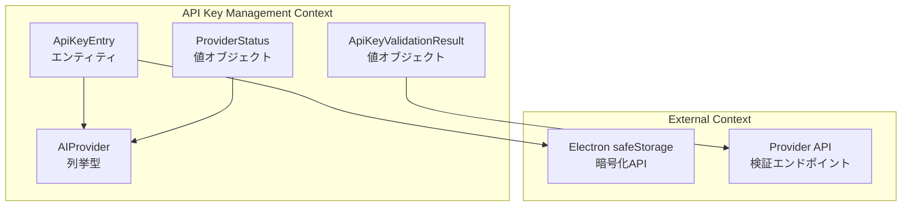

# APIプロバイダーAPIキー管理 - データモデル設計書

> **ドキュメント種別**: データモデル設計書
> **対象タスク**: T-01-1: データモデル設計
> **作成日**: 2025-12-10
> **ステータス**: ドラフト
> **参照**:
>
> - `docs/30-workflows/api-key-management/requirements.md`
> - `docs/30-workflows/api-key-management/security-requirements.md`
> - `packages/shared/types/auth.ts`（既存型パターン参照）

---

## 1. 設計概要

### 1.1 目的

APIキー管理に必要なデータモデル（型定義、Zodスキーマ）を設計し、TypeScriptの型安全性を活かした堅牢な実装基盤を提供する。

### 1.2 設計原則

| 原則               | 適用方法                                               |
| ------------------ | ------------------------------------------------------ |
| 既存パターン踏襲   | `packages/shared/types/auth.ts` の命名規則・構造を踏襲 |
| 型安全性           | Union型、Type Guard、as const パターンの活用           |
| 不変性             | readonly 属性、値オブジェクトパターン                  |
| バリデーション分離 | Zodスキーマによるランタイムバリデーション              |
| IPCレスポンス統一  | IPCResponse<T> パターンによる統一されたレスポンス形式  |

### 1.3 ファイル配置

```
packages/shared/types/
├── api-keys.ts          # 新規作成（本設計の対象）
├── auth.ts              # 既存（パターン参照元）
└── common.ts            # 既存（Result<T,E>等）
```

---

## 2. ドメインモデル設計

### 2.1 コンテキストマップ



### 2.2 ユビキタス言語

| ドメイン用語           | 英語名             | 定義                                              |
| ---------------------- | ------------------ | ------------------------------------------------- |
| AIプロバイダー         | AIProvider         | AIサービスを提供する事業者（OpenAI、Anthropic等） |
| APIキー                | ApiKey             | AIプロバイダーが発行する認証用の秘密文字列        |
| APIキーエントリ        | ApiKeyEntry        | プロバイダーとAPIキーの組み合わせ（保存単位）     |
| 登録状態               | RegistrationStatus | APIキーの登録有無を示す状態                       |
| 検証結果               | ValidationResult   | APIキーの有効性検証の結果                         |
| プロバイダーステータス | ProviderStatus     | 各プロバイダーの登録状態を表す一覧表示用データ    |

---

## 3. 型定義設計

### 3.1 AIProvider（列挙型）

```typescript
/**
 * サポートするAIプロバイダー
 *
 * @see requirements.md セクション2「対応AIプロバイダー」
 */
export type AIProvider = "openai" | "anthropic" | "google" | "xai";

/**
 * AIプロバイダーの一覧（イテレーション用）
 */
export const AI_PROVIDERS: readonly AIProvider[] = [
  "openai",
  "anthropic",
  "google",
  "xai",
] as const;

/**
 * 有効なAIプロバイダーかを検証（Type Guard）
 */
export function isValidAIProvider(value: unknown): value is AIProvider {
  return (
    typeof value === "string" && AI_PROVIDERS.includes(value as AIProvider)
  );
}
```

### 3.2 プロバイダー情報（メタデータ）

```typescript
/**
 * AIプロバイダーのメタデータ
 */
export interface AIProviderMeta {
  /** プロバイダーID */
  id: AIProvider;
  /** 表示名 */
  displayName: string;
  /** APIキーのプレフィックス（バリデーション用、任意） */
  keyPrefix?: string;
  /** 検証用エンドポイントのベースURL */
  validationEndpoint: string;
  /** 検証用HTTPメソッド */
  validationMethod: "GET" | "POST";
}

/**
 * プロバイダーメタデータの定義
 */
export const AI_PROVIDER_META: Record<AIProvider, AIProviderMeta> = {
  openai: {
    id: "openai",
    displayName: "OpenAI",
    keyPrefix: "sk-",
    validationEndpoint: "https://api.openai.com/v1/models",
    validationMethod: "GET",
  },
  anthropic: {
    id: "anthropic",
    displayName: "Anthropic",
    keyPrefix: "sk-ant-",
    validationEndpoint: "https://api.anthropic.com/v1/messages",
    validationMethod: "POST",
  },
  google: {
    id: "google",
    displayName: "Google AI",
    keyPrefix: undefined, // プレフィックスなし
    validationEndpoint: "https://generativelanguage.googleapis.com/v1/models",
    validationMethod: "GET",
  },
  xai: {
    id: "xai",
    displayName: "xAI",
    keyPrefix: "xai-",
    validationEndpoint: "https://api.x.ai/v1/models",
    validationMethod: "GET",
  },
} as const;
```

### 3.3 APIキーエントリ（エンティティ）

```typescript
/**
 * APIキーエントリ（保存用データ構造）
 *
 * @note このインターフェースは内部用。Renderer側には公開しない。
 */
export interface ApiKeyEntry {
  /** プロバイダー */
  provider: AIProvider;
  /** 暗号化されたAPIキー（Base64エンコード済み） */
  encryptedKey: string;
  /** 登録日時（ISO 8601形式） */
  createdAt: string;
  /** 更新日時（ISO 8601形式） */
  updatedAt: string;
  /** 最終検証日時（ISO 8601形式、null = 未検証） */
  lastValidatedAt: string | null;
}

/**
 * APIキー登録用入力データ
 */
export interface ApiKeySaveInput {
  /** プロバイダー */
  provider: AIProvider;
  /** APIキー（平文） */
  apiKey: string;
  /** 保存前に検証するか */
  validateBeforeSave?: boolean;
}

/**
 * APIキー削除用入力データ
 */
export interface ApiKeyDeleteInput {
  /** プロバイダー */
  provider: AIProvider;
}
```

### 3.4 検証結果（値オブジェクト）

```typescript
/**
 * APIキー検証の状態
 */
export type ApiKeyValidationStatus =
  | "valid"
  | "invalid"
  | "network_error"
  | "timeout"
  | "unknown_error";

/**
 * APIキー検証結果
 */
export interface ApiKeyValidationResult {
  /** プロバイダー */
  provider: AIProvider;
  /** 検証状態 */
  status: ApiKeyValidationStatus;
  /** 検証日時（ISO 8601形式） */
  validatedAt: string;
  /** エラーメッセージ（status が valid 以外の場合） */
  errorMessage?: string;
  /** HTTPステータスコード（API応答時のみ） */
  httpStatusCode?: number;
}

/**
 * 検証結果が有効かを判定
 */
export function isValidApiKey(result: ApiKeyValidationResult): boolean {
  return result.status === "valid";
}
```

### 3.5 プロバイダーステータス（一覧表示用）

```typescript
/**
 * プロバイダーの登録状態
 */
export type RegistrationStatus = "registered" | "not_registered";

/**
 * プロバイダーステータス（UI表示用）
 *
 * @note APIキーの値は含まない（セキュリティ要件: NFR-SEC-008）
 */
export interface ProviderStatus {
  /** プロバイダー */
  provider: AIProvider;
  /** 表示名 */
  displayName: string;
  /** 登録状態 */
  status: RegistrationStatus;
  /** 最終検証日時（ISO 8601形式、null = 未検証または未登録） */
  lastValidatedAt: string | null;
}

/**
 * プロバイダー一覧レスポンス
 */
export interface ProviderListResult {
  /** 全プロバイダーのステータス */
  providers: ProviderStatus[];
  /** 登録済みプロバイダー数 */
  registeredCount: number;
  /** 総プロバイダー数 */
  totalCount: number;
}
```

---

## 4. エラーコード定義

```typescript
/**
 * APIキー関連エラーコード
 *
 * @see auth.ts AUTH_ERROR_CODES パターン参照
 */
export const API_KEY_ERROR_CODES = {
  // 保存エラー
  SAVE_FAILED: "api-key/save-failed",
  ENCRYPTION_FAILED: "api-key/encryption-failed",
  ENCRYPTION_NOT_AVAILABLE: "api-key/encryption-not-available",

  // 取得エラー
  GET_FAILED: "api-key/get-failed",
  DECRYPTION_FAILED: "api-key/decryption-failed",
  NOT_FOUND: "api-key/not-found",

  // 削除エラー
  DELETE_FAILED: "api-key/delete-failed",

  // 検証エラー
  VALIDATION_FAILED: "api-key/validation-failed",
  VALIDATION_TIMEOUT: "api-key/validation-timeout",
  VALIDATION_NETWORK_ERROR: "api-key/validation-network-error",

  // 入力バリデーションエラー
  INVALID_PROVIDER: "api-key/invalid-provider",
  INVALID_API_KEY_FORMAT: "api-key/invalid-api-key-format",
  EMPTY_API_KEY: "api-key/empty-api-key",
  API_KEY_TOO_LONG: "api-key/api-key-too-long",

  // IPC エラー
  IPC_FORBIDDEN: "api-key/ipc-forbidden",
  IPC_INVALID_SENDER: "api-key/ipc-invalid-sender",
} as const;

export type ApiKeyErrorCode =
  (typeof API_KEY_ERROR_CODES)[keyof typeof API_KEY_ERROR_CODES];
```

---

## 5. IPCレスポンス型

```typescript
/**
 * APIキー保存レスポンス
 */
export type ApiKeySaveResponse = IPCResponse<{
  provider: AIProvider;
  savedAt: string;
}>;

/**
 * APIキー削除レスポンス
 */
export type ApiKeyDeleteResponse = IPCResponse<{
  provider: AIProvider;
  deletedAt: string;
}>;

/**
 * APIキー検証レスポンス
 */
export type ApiKeyValidateResponse = IPCResponse<ApiKeyValidationResult>;

/**
 * APIキー一覧レスポンス
 */
export type ApiKeyListResponse = IPCResponse<ProviderListResult>;
```

---

## 6. Zodスキーマ定義

```typescript
import { z } from "zod";

/**
 * AIプロバイダースキーマ（ホワイトリスト方式）
 */
export const aiProviderSchema = z.enum([
  "openai",
  "anthropic",
  "google",
  "xai",
]);

/**
 * APIキー制約
 */
export const API_KEY_CONSTRAINTS = {
  minLength: 1,
  maxLength: 256,
  /** 禁止文字パターン（インジェクション対策） */
  forbiddenPattern: /[<>'";&|]/,
} as const;

/**
 * APIキー文字列スキーマ
 *
 * @see security-requirements.md NFR-SEC-004
 */
export const apiKeyStringSchema = z
  .string()
  .min(API_KEY_CONSTRAINTS.minLength, "APIキーを入力してください")
  .max(API_KEY_CONSTRAINTS.maxLength, "APIキーが長すぎます")
  .refine(
    (key) => !API_KEY_CONSTRAINTS.forbiddenPattern.test(key),
    "無効な文字が含まれています",
  );

/**
 * APIキー保存入力スキーマ
 */
export const apiKeySaveInputSchema = z.object({
  provider: aiProviderSchema,
  apiKey: apiKeyStringSchema,
  validateBeforeSave: z.boolean().optional().default(false),
});

/**
 * APIキー削除入力スキーマ
 */
export const apiKeyDeleteInputSchema = z.object({
  provider: aiProviderSchema,
});

/**
 * APIキー検証入力スキーマ
 */
export const apiKeyValidateInputSchema = z.object({
  provider: aiProviderSchema,
  apiKey: apiKeyStringSchema,
});
```

---

## 7. バリデーション関数

```typescript
/**
 * APIキーのフォーマットを検証
 *
 * @see auth.ts validateDisplayName パターン参照
 */
export function validateApiKeyFormat(
  apiKey: string,
): { valid: true } | { valid: false; message: string } {
  if (apiKey.length === 0) {
    return { valid: false, message: "APIキーを入力してください" };
  }
  if (apiKey.length > API_KEY_CONSTRAINTS.maxLength) {
    return { valid: false, message: "APIキーが長すぎます" };
  }
  if (API_KEY_CONSTRAINTS.forbiddenPattern.test(apiKey)) {
    return { valid: false, message: "無効な文字が含まれています" };
  }
  return { valid: true };
}

/**
 * プロバイダー固有のAPIキープレフィックスを検証（オプション）
 */
export function validateApiKeyPrefix(
  provider: AIProvider,
  apiKey: string,
): { valid: true } | { valid: false; message: string } {
  const meta = AI_PROVIDER_META[provider];
  if (meta.keyPrefix && !apiKey.startsWith(meta.keyPrefix)) {
    return {
      valid: false,
      message: `${meta.displayName}のAPIキーは「${meta.keyPrefix}」で始まる必要があります`,
    };
  }
  return { valid: true };
}
```

---

## 8. IPCチャネル定義

```typescript
/**
 * APIキー管理用IPCチャネル名
 */
export const API_KEY_IPC_CHANNELS = {
  SAVE: "apiKey:save",
  GET: "apiKey:get", // Main Process内部専用
  DELETE: "apiKey:delete",
  VALIDATE: "apiKey:validate",
  LIST: "apiKey:list",
} as const;

export type ApiKeyIpcChannel =
  (typeof API_KEY_IPC_CHANNELS)[keyof typeof API_KEY_IPC_CHANNELS];

/**
 * Preloadスクリプトで公開するAPIキー関連メソッド
 *
 * @note GET は公開しない（セキュリティ要件: NFR-SEC-008）
 */
export interface ApiKeyPreloadApi {
  save: (input: ApiKeySaveInput) => Promise<ApiKeySaveResponse>;
  delete: (input: ApiKeyDeleteInput) => Promise<ApiKeyDeleteResponse>;
  validate: (input: {
    provider: AIProvider;
    apiKey: string;
  }) => Promise<ApiKeyValidateResponse>;
  list: () => Promise<ApiKeyListResponse>;
}
```

---

## 9. 型エクスポート一覧

```typescript
// ===== エクスポート一覧 =====

// 列挙型
export type { AIProvider };
export { AI_PROVIDERS, isValidAIProvider };

// プロバイダーメタデータ
export type { AIProviderMeta };
export { AI_PROVIDER_META };

// エンティティ
export type { ApiKeyEntry, ApiKeySaveInput, ApiKeyDeleteInput };

// 値オブジェクト
export type {
  ApiKeyValidationStatus,
  ApiKeyValidationResult,
  RegistrationStatus,
  ProviderStatus,
  ProviderListResult,
};
export { isValidApiKey };

// エラーコード
export { API_KEY_ERROR_CODES };
export type { ApiKeyErrorCode };

// IPCレスポンス
export type {
  ApiKeySaveResponse,
  ApiKeyDeleteResponse,
  ApiKeyValidateResponse,
  ApiKeyListResponse,
};

// Zodスキーマ
export {
  aiProviderSchema,
  apiKeyStringSchema,
  apiKeySaveInputSchema,
  apiKeyDeleteInputSchema,
  apiKeyValidateInputSchema,
  API_KEY_CONSTRAINTS,
};

// バリデーション関数
export { validateApiKeyFormat, validateApiKeyPrefix };

// IPCチャネル
export { API_KEY_IPC_CHANNELS };
export type { ApiKeyIpcChannel, ApiKeyPreloadApi };
```

---

## 10. 設計判断（ADR）

### ADR-001: Union型 vs Enum

**決定**: Union型 (`type AIProvider = "openai" | ...`) を採用

**理由**:

1. 既存パターン（`OAuthProvider`）との一貫性
2. TypeScriptの型推論との親和性
3. Tree-shakingによるバンドルサイズ最適化
4. 文字列リテラルによる可読性向上

### ADR-002: APIキー取得APIの非公開

**決定**: `apiKey:get` チャネルはRenderer側に公開しない

**理由**:

1. セキュリティ要件 NFR-SEC-002, NFR-SEC-008 への準拠
2. 復号化されたAPIキーのRenderer側露出防止
3. XSS攻撃時のAPIキー窃取リスク軽減

**代替手段**: ワークフロー実行時にMain Process内でのみ使用

### ADR-003: Zodスキーマとバリデーション関数の併用

**決定**: Zodスキーマ（IPC入力）と関数（ドメインロジック）を併用

**理由**:

1. IPC入力はZodで一括バリデーション（スキーマ駆動）
2. ドメイン固有ロジック（プレフィックス検証）は関数で実装
3. エラーメッセージのカスタマイズ性確保

---

## 11. 完了条件チェックリスト

- [x] AIプロバイダー列挙型の定義（`AIProvider`）
- [x] APIキーエンティティ型の定義（`ApiKeyEntry`）
- [x] Zodバリデーションスキーマ設計（`aiProviderSchema`, `apiKeyStringSchema`等）
- [x] エラーコード定義（`API_KEY_ERROR_CODES`）
- [x] IPCレスポンス型定義（`IPCResponse<T>`パターン）
- [x] Type Guard関数（`isValidAIProvider`, `isValidApiKey`）
- [x] バリデーション関数（`validateApiKeyFormat`, `validateApiKeyPrefix`）
- [x] IPCチャネル定義（`API_KEY_IPC_CHANNELS`）
- [x] 設計判断のADR記録

---

## 12. 次フェーズへの引き継ぎ

### 12.1 T-01-2（ストレージ設計）への入力

- `ApiKeyEntry` インターフェースの保存形式
- `API_KEY_ERROR_CODES` のエラーハンドリング
- 暗号化/復号化の入出力型

### 12.2 T-01-3（UI/UX設計）への入力

- `ProviderStatus` の表示項目
- `ApiKeySaveInput` のフォーム構造
- `ApiKeyValidationResult` の状態表示

### 12.3 T-04-1（型/スキーマ実装）への入力

- 本設計書の全型定義
- Zodスキーマの実装コード
- バリデーション関数の実装コード

---

## 変更履歴

| バージョン | 日付       | 変更内容 | 作成者          |
| ---------- | ---------- | -------- | --------------- |
| 1.0.0      | 2025-12-10 | 初版作成 | @domain-modeler |
