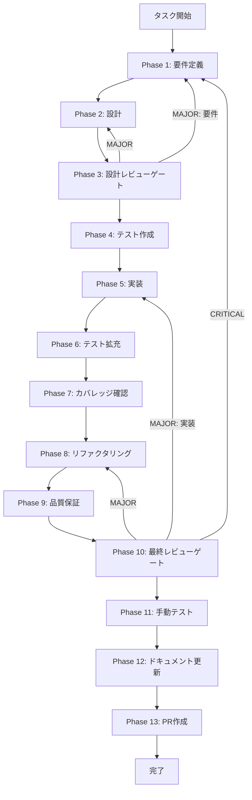

# APIキー設定UI改善 - タスク実行仕様書

## ユーザーからの元の指示

```
連携サービスのようにグリーンで囲われて登録済みというチェック付きの緑色の内容とのようなフォーマットでAPIキー設定も行ってください。
ただし、登録済み、編集、削除という3つの項目は必要です。
色とか内容をこの連携サービスと同じようなフォーマットにしてほしいです。
ただし、登録済み、編集、削除という項目は必要です。
```

## メタ情報

| 項目         | 内容                             |
| ------------ | -------------------------------- |
| タスクID     | TASK-API-KEYS-UI-IMPROVE-001     |
| タスク名     | api-keys-ui-improvement          |
| 分類         | 改善                             |
| 対象機能     | 設定画面 / APIキー設定セクション |
| 優先度       | 中                               |
| 見積もり規模 | 小規模                           |
| ステータス   | 未実施                           |
| 作成日       | 2026-01-18                       |

---

## タスク概要

### 目的

APIキー設定のUIを連携サービス表示と同じ視覚構造に統一し、設定画面の一貫性を高める。

### 背景

設定画面内で連携サービスの表示は緑の枠線とチェック付きの登録済みバッジで示されている。一方でAPIキー設定は別スタイルとなっており、同一画面内の視覚的な一貫性が不足している。ui-ux-forms.mdの「連携済みプロバイダー表示」仕様に合わせ、APIキー設定側の見た目を統一する必要がある。

### 最終ゴール

- APIキー設定の登録済みカードが緑の枠線とチェック付き「登録済み」バッジで表示される
- 「編集」「削除」アクションは現在の機能と配置を維持する
- 連携サービスカードと並べたときに同じ視覚フォーマットである
- APIキー値の表示・ログ出力に変更は発生しない

### スコープ

#### 含むもの

- ApiKeysSectionの登録済み表示スタイルの更新
- 登録済みバッジのチェックアイコン表示
- 既存テストの更新と新規テスト追加
- 仕様・テスト結果のドキュメント化

#### 含まないもの

- APIキー保存/削除のバックエンド処理変更
- 連携サービス機能の仕様変更
- APIキー入力モーダルの機能変更

### 成果物一覧

| 種別         | 成果物             | 配置先                                                                     |
| ------------ | ------------------ | -------------------------------------------------------------------------- |
| UI           | ApiKeysSection更新 | `apps/desktop/src/renderer/components/organisms/ApiKeysSection/index.tsx`  |
| テスト       | 追加/更新テスト    | `apps/desktop/src/renderer/components/organisms/ApiKeysSection/__tests__/` |
| ドキュメント | フェーズ成果物     | `outputs/phase-*/`                                                         |

---

## 参照資料

### システム仕様（aiworkflow-requirements）

| 参照資料          | パス                                                                       | 内容                              |
| ----------------- | -------------------------------------------------------------------------- | --------------------------------- |
| APIキー設定UI設計 | `.claude/skills/aiworkflow-requirements/references/ui-ux-forms.md`         | APIキー設定と連携済み表示のUI仕様 |
| セキュリティ原則  | `.claude/skills/aiworkflow-requirements/references/security-principles.md` | APIキーの取り扱いと表示制約       |
| APIエンドポイント | `.claude/skills/aiworkflow-requirements/references/api-endpoints.md`       | APIキー取得/登録/削除のAPI仕様    |

---

## 参照ファイル

- `docs/00-requirements/master_system_design.md` - システム要件
- `.claude/skills/aiworkflow-requirements/references/` - システム仕様

---

## タスク分解サマリー

| ID     | フェーズ | サブタスク名       | 責務                                   | 依存   |
| ------ | -------- | ------------------ | -------------------------------------- | ------ |
| T-01-1 | Phase 1  | 要件定義           | UI統一要件と受け入れ基準の明文化       | -      |
| T-02-1 | Phase 2  | UI設計             | 連携サービスとのスタイル対応表作成     | T-01-1 |
| T-03-1 | Phase 3  | 設計レビュー       | 仕様適合性と受け入れ基準の確認         | T-02-1 |
| T-04-1 | Phase 4  | テスト作成         | UI差分テストとアクション表示テスト作成 | T-03-1 |
| T-05-1 | Phase 5  | 実装               | ApiKeysSectionのUI更新                 | T-04-1 |
| T-06-1 | Phase 6  | テスト拡充         | a11y/エッジケースの追加                | T-05-1 |
| T-07-1 | Phase 7  | カバレッジ確認     | カバレッジ測定とゲート判定             | T-06-1 |
| T-08-1 | Phase 8  | リファクタリング   | スタイル重複の整理と読みやすさ改善     | T-07-1 |
| T-09-1 | Phase 9  | 品質保証           | Lint/型/テスト結果の確認               | T-08-1 |
| T-10-1 | Phase 10 | 最終レビューゲート | 要件・設計・品質の最終確認             | T-09-1 |
| T-11-1 | Phase 11 | 手動テスト         | UI表示と操作確認                       | T-10-1 |
| T-12-1 | Phase 12 | ドキュメント更新   | 実装ガイドと変更履歴の更新             | T-11-1 |
| T-13-1 | Phase 13 | PR作成             | ローカル確認とPR作成                   | T-12-1 |

**総サブタスク数**: 13個

---

## 実行フロー図



---

## Phase一覧

| Phase | 名称               | 仕様書                                                 | ステータス |
| ----- | ------------------ | ------------------------------------------------------ | ---------- |
| 1     | 要件定義           | [phase-1-requirements.md](phase-1-requirements.md)     | 未実施     |
| 2     | 設計               | [phase-2-design.md](phase-2-design.md)                 | 未実施     |
| 3     | 設計レビューゲート | [phase-3-design-review.md](phase-3-design-review.md)   | 未実施     |
| 4     | テスト作成         | [phase-4-test-creation.md](phase-4-test-creation.md)   | 未実施     |
| 5     | 実装               | [phase-5-implementation.md](phase-5-implementation.md) | 未実施     |
| 6     | テスト拡充         | [phase-6-test-expansion.md](phase-6-test-expansion.md) | 未実施     |
| 7     | カバレッジ確認     | [phase-7-coverage-check.md](phase-7-coverage-check.md) | 未実施     |
| 8     | リファクタリング   | [phase-8-refactoring.md](phase-8-refactoring.md)       | 未実施     |
| 9     | 品質保証           | [phase-9-quality.md](phase-9-quality.md)               | 未実施     |
| 10    | 最終レビューゲート | [phase-10-final-review.md](phase-10-final-review.md)   | 未実施     |
| 11    | 手動テスト         | [phase-11-manual-test.md](phase-11-manual-test.md)     | 未実施     |
| 12    | ドキュメント更新   | [phase-12-documentation.md](phase-12-documentation.md) | 未実施     |
| 13    | PR作成             | [phase-13-pr-creation.md](phase-13-pr-creation.md)     | 未実施     |

---

## Phase完了時の必須アクション

**各Phase完了時に以下を必ず実行すること:**

1. **タスク100%実行**: Phase内で指定された全タスクを完全に実行
2. **成果物確認**: 全ての必須成果物が生成されていることを検証
3. **実行記録**: 実行タスクの結果を記録
4. **artifacts.json更新**: Phase完了ステータスを更新
5. **Phase末端の実行確認**: 各タスクを100%実行し、各タスクを完遂した旨を必ず明記

```bash
# Phase完了時の検証コマンド
node .claude/skills/task-specification-creator/scripts/validate-phase-output.js docs/30-workflows/api-keys-ui-improvement --phase {{PHASE_NUMBER}}

# Phase完了・成果物登録
node .claude/skills/task-specification-creator/scripts/complete-phase.js \
  --workflow docs/30-workflows/api-keys-ui-improvement --phase {{PHASE_NUMBER}} --artifacts "..."
```

---

## テストカバレッジ目標

### ユニットテスト

| 指標              | 最低基準 | 推奨基準 |
| ----------------- | -------- | -------- |
| Line Coverage     | 80%      | 90%      |
| Branch Coverage   | 60%      | 70%      |
| Function Coverage | 80%      | 90%      |

### 結合テスト

| 指標                         | 目標 |
| ---------------------------- | ---- |
| APIエンドポイント            | 100% |
| モジュール間インターフェース | 100% |
| 正常系シナリオ               | 100% |
| 異常系シナリオ               | 80%+ |
| 外部連携ポイント             | 100% |

---

## 統合テスト連携（Phase 1〜11で必須）

| Phase | 統合テスト連携アクション                               |
| ----- | ------------------------------------------------------ |
| 1     | APIキー取得/削除のUIフローに影響がないことを要件に明記 |
| 2     | 連携サービス表示とAPIキー表示の視覚整合を設計で明記    |
| 3     | 統合テスト観点で設計レビューを実施                     |
| 4     | UI状態別の統合テストシナリオを作成                     |
| 5     | UI変更後の設定画面表示が崩れないことを確認             |
| 6     | 手動シナリオをテスト拡充に反映                         |
| 7     | 統合テスト結果の再確認                                 |
| 8     | リファクタ後の統合テスト継続成功を確認                 |
| 9     | 品質保証で統合テスト結果を確認                         |
| 10    | 最終レビューで統合テスト結果を確認                     |
| 11    | 設定画面の実機確認を実施                               |

---

## 使用方法

1. ユーザー要求を分析
2. タスクID・タスク名を生成
3. 変数を実際の値で置換
4. タスク分解サマリーを作成
5. 各Phaseの詳細を `references/phase-templates.md` から展開
6. `docs/30-workflows/api-keys-ui-improvement/index.md` に反映
7. 各Phase仕様書を `phase-N-*.md` として出力

---

## 出力ファイル構成

```
docs/30-workflows/api-keys-ui-improvement/
├── index.md
├── artifacts.json
├── phase-1-requirements.md
├── phase-2-design.md
├── phase-3-design-review.md
├── phase-4-test-creation.md
├── phase-5-implementation.md
├── phase-6-test-expansion.md
├── phase-7-coverage-check.md
├── phase-8-refactoring.md
├── phase-9-quality.md
├── phase-10-final-review.md
├── phase-11-manual-test.md
├── phase-12-documentation.md
├── phase-13-pr-creation.md
└── outputs/
    ├── phase-1/
    ├── phase-2/
    └── ...
```

---

## リスクと対策

| リスク                    | 影響度 | 発生確率 | 対策                                        |
| ------------------------- | ------ | -------- | ------------------------------------------- |
| UIの視認性低下            | 中     | 低       | 連携サービス表示と同じ配色と余白を採用      |
| ボタンの誤操作            | 中     | 低       | ボタン配置とラベルを現状維持                |
| APIキー表示の取り扱い逸脱 | 高     | 低       | セキュリティ仕様に従い表示/ログを変更しない |
