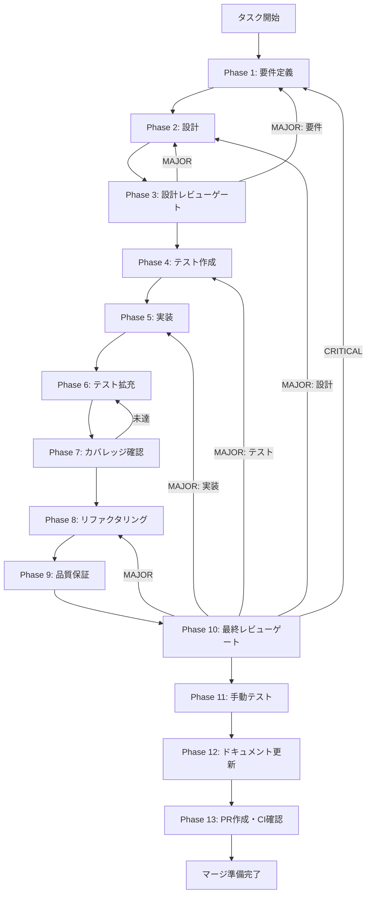

# auth-ui-improvements-282 - タスク実行仕様書

## メタ情報

```yaml
issue_number: 282
github_url: https://github.com/daishiman/AIWorkflowOrchestrator/issues/282
```

## ユーザーからの元の指示

```
- ホバーしたりクリックしたりして表示されるものに関しては、一番レイヤーが表側に来るようにしてください。じゃないと表示が見えないです。表示が隠れてしまっています。
- 名前を変更して保存するとエラーが出ます。「Could not find the table 'public.user_profiles' in the schema cache」
- 連携サービスを解除しても表示が解除済みに変わらないです。データベースの方はどうなっているか確認してください。本当に解除されているのか、バックエンドとの連携もどうなっているか確認しておいてください。
```

## メタ情報

| 項目         | 内容                                       |
| ------------ | ------------------------------------------ |
| タスクID     | AUTH-UI-001                                |
| タスク名     | auth-ui-improvements-282                   |
| 分類         | バグ修正                                   |
| 対象機能     | AccountSection, profileHandlers, authSlice |
| 優先度       | 高                                         |
| 見積もり規模 | 中規模                                     |
| ステータス   | 未実施                                     |
| 作成日       | 2026-02-04                                 |
| 発見元       | ユーザーフィードバック                     |

---

## タスク概要

### 目的

認証UIの3つの問題（z-index、名前変更エラー、連携解除UI更新）を修正し、ユーザーが認証機能を正常に使用できるようにする。

### 背景

認証機能（login-only-auth）実装完了後、実際の動作確認で以下の問題が報告された：

1. ホバー/クリックで表示されるメニューが他の要素に隠れる
2. 名前変更時にSupabaseの`user_profiles`テーブル不在エラー
3. 連携サービス解除後にUIが更新されない

### 最終ゴール

1. ポップアップメニュー（アバター編集メニュー等）が常に最前面に表示される
2. 名前変更がエラーなく完了し、`user_metadata`へのフォールバックが正常動作する
3. 連携サービス解除後にUIが即座に更新される

### 成果物一覧

| 種別         | 成果物                    | 配置先                                                         |
| ------------ | ------------------------- | -------------------------------------------------------------- |
| 機能         | 修正されたAccountSection  | apps/desktop/src/renderer/components/organisms/AccountSection/ |
| 機能         | 修正されたprofileHandlers | apps/desktop/src/main/ipc/profileHandlers.ts                   |
| 機能         | 修正されたauthSlice       | apps/desktop/src/renderer/store/slices/authSlice.ts            |
| テスト       | ユニットテスト            | 各ファイルの.test.tsファイル                                   |
| ドキュメント | 実装ガイド                | outputs/phase-12/implementation-guide.md                       |
| PR           | GitHub Pull Request       | GitHub UI                                                      |

---

## 参照ファイル

本仕様書のコマンド選定は以下を参照：

- `docs/00-requirements/master_system_design.md` - システム要件
- `.claude/skills/aiworkflow-requirements/references/` - システム仕様
- `docs/30-workflows/login-only-auth/` - 認証機能の設計ドキュメント

### システム仕様参照（aiworkflow-requirements）

| 観点               | 参照先仕様書                            | 適用理由                      |
| ------------------ | --------------------------------------- | ----------------------------- |
| UI/UX              | ui-ux-components.md                     | z-index階層、ポップアップ設計 |
| UI/UXポータル      | ui-ux-portal-patterns.md                | z-index値（z-[9999]）根拠     |
| アーキテクチャ     | architecture-patterns.md                | IPC通信パターン、状態管理     |
| 認証アーキテクチャ | architecture-auth-security.md           | Supabase+Electron認証構造     |
| 実装パターン       | architecture-implementation-patterns.md | フォールバックパターン        |
| エラーハンドリング | error-handling.md                       | フォールバック処理パターン    |
| 状態管理           | arch-state-management.md                | authSlice設計                 |
| IPC通信            | interfaces-agent-sdk.md                 | Main-Renderer通信契約         |
| 認証IPC仕様        | api-ipc-auth.md                         | profile:get-providers等       |
| 認証型定義         | interfaces-auth.md                      | Auth/LinkedProvider型         |
| データベース       | database-schema.md                      | user_profilesテーブル定義     |
| セキュリティ       | security-api-electron.md                | Preload APIセキュリティ       |

---

## タスク分解サマリー

| ID     | フェーズ | サブタスク名             | 責務                               | 依存    |
| ------ | -------- | ------------------------ | ---------------------------------- | ------- |
| T-01-1 | Phase 1  | z-index問題の要件定義    | z-index階層の要件を明確化          | -       |
| T-01-2 | Phase 1  | フォールバック要件定義   | エラー検出条件の要件を明確化       | -       |
| T-01-3 | Phase 1  | UI更新要件定義           | 状態更新フローの要件を明確化       | -       |
| T-02-1 | Phase 2  | z-index階層設計          | アプリ全体のz-index階層を定義      | T-01-1  |
| T-02-2 | Phase 2  | フォールバック処理設計   | エラー検出条件の設計               | T-01-2  |
| T-02-3 | Phase 2  | 状態更新フロー設計       | IPC→Store→UI更新フローを設計       | T-01-3  |
| T-03-1 | Phase 3  | 設計レビュー             | 設計の妥当性検証                   | T-02-\* |
| T-04-1 | Phase 4  | z-indexテスト作成        | ポップアップ表示のテスト           | T-03-1  |
| T-04-2 | Phase 4  | フォールバックテスト作成 | user_metadataフォールバックテスト  | T-03-1  |
| T-04-3 | Phase 4  | 状態更新テスト作成       | fetchLinkedProviders呼び出しテスト | T-03-1  |
| T-05-1 | Phase 5  | z-index修正実装          | z-[9999]に変更                     | T-04-1  |
| T-05-2 | Phase 5  | フォールバック実装       | エラー検出条件の追加               | T-04-2  |
| T-05-3 | Phase 5  | 状態更新実装             | onAuthStateChangedでの再取得追加   | T-04-3  |
| T-06-1 | Phase 6  | テスト拡充               | カバレッジ向上                     | T-05-\* |
| T-07-1 | Phase 7  | カバレッジ確認           | カバレッジ基準達成確認             | T-06-1  |
| T-08-1 | Phase 8  | リファクタリング         | 重複排除、共通関数化               | T-07-1  |
| T-09-1 | Phase 9  | 品質保証                 | 全テスト成功、Lint/型エラーなし    | T-08-1  |
| T-10-1 | Phase 10 | 最終レビュー             | コード品質・セキュリティ確認       | T-09-1  |
| T-11-1 | Phase 11 | 手動テスト               | UI動作確認、UX検証                 | T-10-1  |
| T-12-1 | Phase 12 | ドキュメント更新         | 実装ガイド・仕様書更新             | T-11-1  |
| T-13-1 | Phase 13 | PR作成                   | PRとCI確認                         | T-12-1  |

**総サブタスク数**: 22個

---

## 実行フロー図



---

## Phase一覧

| Phase | 名称               | 仕様書                                                 | ステータス |
| ----- | ------------------ | ------------------------------------------------------ | ---------- |
| 1     | 要件定義           | [phase-1-requirements.md](phase-1-requirements.md)     | 未実施     |
| 2     | 設計               | [phase-2-design.md](phase-2-design.md)                 | 未実施     |
| 3     | 設計レビューゲート | [phase-3-design-review.md](phase-3-design-review.md)   | 未実施     |
| 4     | テスト作成         | [phase-4-test-creation.md](phase-4-test-creation.md)   | 未実施     |
| 5     | 実装               | [phase-5-implementation.md](phase-5-implementation.md) | 未実施     |
| 6     | テスト拡充         | [phase-6-test-expansion.md](phase-6-test-expansion.md) | 未実施     |
| 7     | カバレッジ確認     | [phase-7-coverage-check.md](phase-7-coverage-check.md) | 未実施     |
| 8     | リファクタリング   | [phase-8-refactoring.md](phase-8-refactoring.md)       | 未実施     |
| 9     | 品質保証           | [phase-9-quality.md](phase-9-quality.md)               | 未実施     |
| 10    | 最終レビューゲート | [phase-10-final-review.md](phase-10-final-review.md)   | 未実施     |
| 11    | 手動テスト         | [phase-11-manual-test.md](phase-11-manual-test.md)     | 未実施     |
| 12    | ドキュメント更新   | [phase-12-documentation.md](phase-12-documentation.md) | 未実施     |
| 13    | PR作成             | [phase-13-pr-creation.md](phase-13-pr-creation.md)     | 未実施     |

---

## テストカバレッジ目標

### ユニットテスト

| 指標              | 最低基準 | 推奨基準 |
| ----------------- | -------- | -------- |
| Line Coverage     | 80%      | 90%      |
| Branch Coverage   | 60%      | 70%      |
| Function Coverage | 80%      | 90%      |

### 結合テスト

| 指標                         | 目標 |
| ---------------------------- | ---- |
| APIエンドポイント            | 100% |
| モジュール間インターフェース | 100% |
| 正常系シナリオ               | 100% |
| 異常系シナリオ               | 80%+ |
| 外部連携ポイント             | 100% |

---

## 統合テスト連携（Phase 1〜11で必須）

各Phaseで以下の統合テスト連携アクションを実施すること:

| Phase | 統合テスト連携アクション                              |
| ----- | ----------------------------------------------------- |
| 1     | 接続要件（Supabase Auth/IPC/Store）を要件に明記       |
| 2     | 統合ポイント（profileHandlers/authSlice）を設計に反映 |
| 3     | 統合テスト観点のレビューゲートを実施                  |
| 4     | 統合テストシナリオを全カテゴリで作成                  |
| 5     | Main-Renderer連携実装とテスト支援コード整備           |
| 6     | 統合テストの拡充（全カテゴリのカバレッジ向上）        |
| 7     | 統合テストの再実行とゲート判定                        |
| 8     | リファクタ後の統合テスト継続成功を確認                |
| 9     | 品質保証で統合テスト結果を確認                        |
| 10    | 最終レビューで統合テスト結果を確認                    |
| 11    | 手動統合テスト（UI/IPC接続）を確認                    |

---

## リスクと対策

| リスク               | 影響度 | 発生確率 | 対策                           |
| -------------------- | ------ | -------- | ------------------------------ |
| z-index競合          | 低     | 中       | グローバルなz-index階層を定義  |
| フォールバック漏れ   | 中     | 中       | エラーパターンを網羅的にテスト |
| 状態更新の無限ループ | 高     | 低       | 更新条件を慎重に設計           |

---

## 前提条件

- Supabaseプロジェクトが設定済み
- 開発環境が構築済み
- pnpmがインストール済み

---

## 技術的制約

- Supabaseに`user_profiles`テーブルが存在しない
- 認証にはSupabase Authを使用（`user_metadata`が利用可能）
- Electronアプリ（Main-Renderer分離）

---

## Phase完了時の必須アクション

**各Phase完了時に以下を必ず実行すること:**

1. **タスク100%実行**: Phase内で指定された全タスクを完全に実行
2. **成果物確認**: 全ての必須成果物が生成されていることを検証
3. **実行記録**: 実行タスクの結果を記録
4. **artifacts.json更新**: Phase完了ステータスを更新
5. **Phase末端の実行確認**: 各タスクを100%実行し、各タスクを完遂した旨を必ず明記

```bash
# Phase完了時の検証コマンド
node .claude/skills/task-specification-creator/scripts/validate-phase-output.js docs/30-workflows/auth-ui-improvements-282 --phase {{PHASE_NUMBER}}

# Phase完了・成果物登録
node .claude/skills/task-specification-creator/scripts/complete-phase.js \
  --workflow docs/30-workflows/auth-ui-improvements-282 --phase {{PHASE_NUMBER}} --artifacts "..."
```
