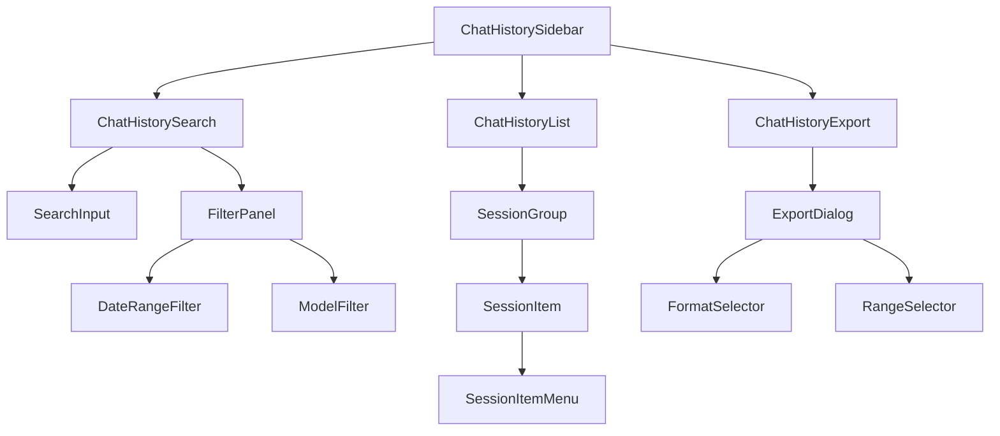

# チャット履歴永続化機能 - コンポーネント設計書

---

title: チャット履歴永続化 コンポーネント設計書
version: 1.0.0
author: .claude/agents/ui-designer.md
created: 2025-12-20
status: draft
parent_task: T-01-2
dependencies:

- ui-ux-design.md
- metadata-specification.md
- database-schema-design.md

---

## 1. 概要

### 1.1 目的

チャット履歴機能の3つの主要コンポーネント（ChatHistoryList, ChatHistorySearch, ChatHistoryExport）の詳細設計を定義し、実装に必要な型定義、状態管理、イベント処理、コンポジションパターンを明確化する。

### 1.2 設計原則

| 原則                   | 説明                                             |
| ---------------------- | ------------------------------------------------ |
| **単一責任の原則**     | 各コンポーネントは1つの明確な責務のみを持つ      |
| **型安全性**           | TypeScriptで完全な型推論が可能                   |
| **テスタビリティ**     | 依存性注入とMock化が容易                         |
| **アクセシビリティ**   | WCAG 2.1 AA準拠、キーボード操作完全対応          |
| **パフォーマンス**     | 仮想化、メモ化、デバウンスなどの最適化技術を活用 |
| **Clean Architecture** | ビジネスロジックとUIロジックの分離、依存性の逆転 |

### 1.3 技術スタック

| 技術                  | バージョン | 用途                     |
| --------------------- | ---------- | ------------------------ |
| React                 | 18.x       | UIフレームワーク         |
| TypeScript            | 5.x        | 型システム               |
| Tailwind CSS          | 3.x        | スタイリング             |
| Zod                   | 3.x        | ランタイムバリデーション |
| Drizzle ORM           | 0.38.x     | データベースアクセス     |
| Vitest                | 1.x        | ユニットテスト           |
| React Testing Library | 14.x       | コンポーネントテスト     |

---

## 2. コンポーネントアーキテクチャ

### 2.1 コンポーネント階層



### 2.2 フォルダ構成

```
apps/desktop/src/features/chat-history/
├── components/
│   ├── ChatHistorySidebar.tsx         # 親コンテナ
│   ├── ChatHistoryList/
│   │   ├── index.tsx                  # エクスポート
│   │   ├── ChatHistoryList.tsx        # 主要コンポーネント
│   │   ├── SessionGroup.tsx           # グループ表示
│   │   ├── SessionItem.tsx            # アイテム表示
│   │   ├── SessionItemMenu.tsx        # コンテキストメニュー
│   │   └── useChatHistoryList.ts      # カスタムフック
│   ├── ChatHistorySearch/
│   │   ├── index.tsx
│   │   ├── ChatHistorySearch.tsx
│   │   ├── SearchInput.tsx
│   │   ├── FilterPanel.tsx
│   │   ├── DateRangeFilter.tsx
│   │   ├── ModelFilter.tsx
│   │   └── useChatHistorySearch.ts
│   ├── ChatHistoryExport/
│   │   ├── index.tsx
│   │   ├── ChatHistoryExport.tsx
│   │   ├── ExportDialog.tsx
│   │   ├── FormatSelector.tsx
│   │   ├── RangeSelector.tsx
│   │   └── useChatHistoryExport.ts
│   └── shared/
│       ├── Skeleton.tsx               # スケルトンローディング
│       └── Toast.tsx                  # 通知トースト
├── hooks/
│   ├── useSessions.ts                 # セッション取得
│   ├── useSessionMutations.ts         # セッション操作
│   └── useSessionSearch.ts            # セッション検索
├── services/
│   ├── sessionRepository.ts           # データアクセス層
│   ├── exportService.ts               # エクスポート処理
│   └── searchService.ts               # 検索処理
└── types/
    ├── session.ts                     # セッション型定義
    └── export.ts                      # エクスポート型定義
```

---

## 3. ChatHistoryList コンポーネント

### 3.1 責務

- ピン留め・お気に入りセッションの表示
- 日付グループ別セッション一覧の表示
- セッション選択/編集/削除操作
- 無限スクロールによる遅延読み込み

### 3.2 Props 型定義

```typescript
import { ChatSession } from "@repo/shared/db/schema";

export type SessionGroup = {
  label: string; // "ピン留め", "今日", "昨日", "2025-12-19"
  sessions: ChatSession[];
};

export type ChatHistoryListProps = {
  /** セッション一覧（グループ分け済み） */
  sessionGroups: SessionGroup[];
  /** 現在選択中のセッションID */
  selectedSessionId: string | null;
  /** セッション選択時のコールバック */
  onSelectSession: (sessionId: string) => void;
  /** ピン留めトグル時のコールバック */
  onTogglePin: (sessionId: string, isPinned: boolean) => Promise<void>;
  /** お気に入りトグル時のコールバック */
  onToggleFavorite: (sessionId: string, isFavorite: boolean) => Promise<void>;
  /** セッション削除時のコールバック */
  onDeleteSession: (sessionId: string) => Promise<void>;
  /** タイトル更新時のコールバック */
  onUpdateTitle: (sessionId: string, newTitle: string) => Promise<void>;
  /** 無限スクロール時の次ページ読み込み */
  onLoadMore?: () => void;
  /** ローディング状態 */
  isLoading?: boolean;
  /** 次ページの有無 */
  hasMore?: boolean;
  /** エラー状態 */
  error?: Error | null;
  /** 空状態カスタマイズ */
  emptyState?: React.ReactNode;
};
```

### 3.3 内部状態管理

```typescript
type ChatHistoryListState = {
  /** 編集中のセッションID */
  editingSessionId: string | null;
  /** コンテキストメニュー表示中のセッションID */
  contextMenuSessionId: string | null;
  /** 削除確認ダイアログ表示中のセッションID */
  deletingSessionId: string | null;
};

const [state, setState] = useState<ChatHistoryListState>({
  editingSessionId: null,
  contextMenuSessionId: null,
  deletingSessionId: null,
});
```

### 3.4 カスタムフック: `useChatHistoryList`

```typescript
import { useCallback, useState } from "react";
import { ChatSession } from "@repo/shared/db/schema";

export type UseChatHistoryListParams = {
  sessions: ChatSession[];
  selectedSessionId: string | null;
  onSelectSession: (sessionId: string) => void;
  onTogglePin: (sessionId: string, isPinned: boolean) => Promise<void>;
  onToggleFavorite: (sessionId: string, isFavorite: boolean) => Promise<void>;
  onDeleteSession: (sessionId: string) => Promise<void>;
  onUpdateTitle: (sessionId: string, newTitle: string) => Promise<void>;
};

export const useChatHistoryList = (params: UseChatHistoryListParams) => {
  const {
    sessions,
    selectedSessionId,
    onSelectSession,
    onTogglePin,
    onToggleFavorite,
    onDeleteSession,
    onUpdateTitle,
  } = params;

  const [editingSessionId, setEditingSessionId] = useState<string | null>(null);
  const [deletingSessionId, setDeletingSessionId] = useState<string | null>(
    null,
  );

  // セッションをグループ分け（ピン留め → 今日 → 昨日 → 日付別）
  const groupedSessions = useMemo(() => {
    const pinned = sessions.filter((s) => s.isPinned && !s.deletedAt);
    const unpinned = sessions.filter((s) => !s.isPinned && !s.deletedAt);

    const groups: SessionGroup[] = [];

    if (pinned.length > 0) {
      groups.push({
        label: "ピン留め",
        sessions: pinned.sort((a, b) => (a.pinOrder ?? 0) - (b.pinOrder ?? 0)),
      });
    }

    // 日付別グループ化
    const today = new Date();
    today.setHours(0, 0, 0, 0);
    const yesterday = new Date(today);
    yesterday.setDate(yesterday.getDate() - 1);

    const todaySessions = unpinned.filter(
      (s) => new Date(s.createdAt) >= today,
    );
    const yesterdaySessions = unpinned.filter(
      (s) =>
        new Date(s.createdAt) >= yesterday && new Date(s.createdAt) < today,
    );
    const olderSessions = unpinned.filter(
      (s) => new Date(s.createdAt) < yesterday,
    );

    if (todaySessions.length > 0) {
      groups.push({ label: "今日", sessions: todaySessions });
    }
    if (yesterdaySessions.length > 0) {
      groups.push({ label: "昨日", sessions: yesterdaySessions });
    }

    // 日付別グループ
    const dateGroups = new Map<string, ChatSession[]>();
    olderSessions.forEach((session) => {
      const date = new Date(session.createdAt).toLocaleDateString("ja-JP");
      if (!dateGroups.has(date)) {
        dateGroups.set(date, []);
      }
      dateGroups.get(date)!.push(session);
    });

    dateGroups.forEach((sessions, date) => {
      groups.push({ label: date, sessions });
    });

    return groups;
  }, [sessions]);

  // タイトル編集開始
  const handleStartEdit = useCallback((sessionId: string) => {
    setEditingSessionId(sessionId);
  }, []);

  // タイトル編集終了（保存）
  const handleSaveTitle = useCallback(
    async (sessionId: string, newTitle: string) => {
      try {
        await onUpdateTitle(sessionId, newTitle);
        setEditingSessionId(null);
      } catch (error) {
        console.error("Failed to update title:", error);
        // エラートースト表示
      }
    },
    [onUpdateTitle],
  );

  // タイトル編集キャンセル
  const handleCancelEdit = useCallback(() => {
    setEditingSessionId(null);
  }, []);

  // 削除確認ダイアログ表示
  const handleShowDeleteDialog = useCallback((sessionId: string) => {
    setDeletingSessionId(sessionId);
  }, []);

  // 削除実行
  const handleConfirmDelete = useCallback(async () => {
    if (!deletingSessionId) return;
    try {
      await onDeleteSession(deletingSessionId);
      setDeletingSessionId(null);
    } catch (error) {
      console.error("Failed to delete session:", error);
      // エラートースト表示
    }
  }, [deletingSessionId, onDeleteSession]);

  // 削除キャンセル
  const handleCancelDelete = useCallback(() => {
    setDeletingSessionId(null);
  }, []);

  return {
    groupedSessions,
    editingSessionId,
    deletingSessionId,
    handleStartEdit,
    handleSaveTitle,
    handleCancelEdit,
    handleShowDeleteDialog,
    handleConfirmDelete,
    handleCancelDelete,
  };
};
```

### 3.5 コンポーネント実装例

```typescript
import React, { useRef, useEffect } from 'react';
import { ChatHistoryListProps } from './types';
import { useChatHistoryList } from './useChatHistoryList';
import { SessionGroup } from './SessionGroup';
import { Skeleton } from '../shared/Skeleton';

export const ChatHistoryList: React.FC<ChatHistoryListProps> = ({
  sessionGroups,
  selectedSessionId,
  onSelectSession,
  onTogglePin,
  onToggleFavorite,
  onDeleteSession,
  onUpdateTitle,
  onLoadMore,
  isLoading = false,
  hasMore = false,
  error,
  emptyState,
}) => {
  const {
    groupedSessions,
    editingSessionId,
    deletingSessionId,
    handleStartEdit,
    handleSaveTitle,
    handleCancelEdit,
    handleShowDeleteDialog,
    handleConfirmDelete,
    handleCancelDelete,
  } = useChatHistoryList({
    sessions: sessionGroups.flatMap((g) => g.sessions),
    selectedSessionId,
    onSelectSession,
    onTogglePin,
    onToggleFavorite,
    onDeleteSession,
    onUpdateTitle,
  });

  const listRef = useRef<HTMLUListElement>(null);

  // 無限スクロール監視
  useEffect(() => {
    if (!onLoadMore || !listRef.current) return;

    const observer = new IntersectionObserver(
      (entries) => {
        if (entries[0].isIntersecting && hasMore && !isLoading) {
          onLoadMore();
        }
      },
      { threshold: 0.1 }
    );

    const sentinel = listRef.current.querySelector('[data-sentinel]');
    if (sentinel) {
      observer.observe(sentinel);
    }

    return () => observer.disconnect();
  }, [onLoadMore, hasMore, isLoading]);

  if (error) {
    return (
      <div className="flex h-full items-center justify-center p-4">
        <div className="text-center">
          <p className="text-hig-error mb-2">エラーが発生しました</p>
          <p className="text-hig-text-secondary text-sm">{error.message}</p>
        </div>
      </div>
    );
  }

  if (!isLoading && groupedSessions.length === 0) {
    return (
      <div className="flex h-full items-center justify-center p-4">
        {emptyState || (
          <div className="text-center">
            <p className="text-hig-text-secondary">まだチャット履歴がありません</p>
            <p className="text-hig-text-secondary text-sm mt-2">
              新しいチャットを開始してください
            </p>
          </div>
        )}
      </div>
    );
  }

  return (
    <div className="flex flex-col h-full">
      <ul
        ref={listRef}
        role="listbox"
        aria-label="チャット履歴"
        className="flex-1 overflow-y-auto px-2 py-2"
      >
        {groupedSessions.map((group) => (
          <SessionGroup
            key={group.label}
            label={group.label}
            sessions={group.sessions}
            selectedSessionId={selectedSessionId}
            editingSessionId={editingSessionId}
            onSelectSession={onSelectSession}
            onTogglePin={onTogglePin}
            onToggleFavorite={onToggleFavorite}
            onStartEdit={handleStartEdit}
            onSaveTitle={handleSaveTitle}
            onCancelEdit={handleCancelEdit}
            onShowDeleteDialog={handleShowDeleteDialog}
          />
        ))}

        {/* 無限スクロールのセンチネル */}
        {hasMore && <div data-sentinel className="h-1" />}

        {/* ローディング表示 */}
        {isLoading && (
          <div className="space-y-2 mt-2">
            <Skeleton className="h-16 rounded-hig-md" />
            <Skeleton className="h-16 rounded-hig-md" />
          </div>
        )}
      </ul>

      {/* 削除確認ダイアログ */}
      {deletingSessionId && (
        <DeleteConfirmDialog
          session={groupedSessions
            .flatMap((g) => g.sessions)
            .find((s) => s.id === deletingSessionId)!}
          onConfirm={handleConfirmDelete}
          onCancel={handleCancelDelete}
        />
      )}
    </div>
  );
};
```

### 3.6 SessionItem コンポーネント

```typescript
import React, { useState, useRef, useEffect } from 'react';
import { ChatSession } from '@repo/shared/db/schema';
import { formatDistanceToNow } from 'date-fns';
import { ja } from 'date-fns/locale';

export type SessionItemProps = {
  session: ChatSession;
  isSelected: boolean;
  isEditing: boolean;
  onSelect: (sessionId: string) => void;
  onTogglePin: (sessionId: string, isPinned: boolean) => Promise<void>;
  onToggleFavorite: (sessionId: string, isFavorite: boolean) => Promise<void>;
  onStartEdit: (sessionId: string) => void;
  onSaveTitle: (sessionId: string, newTitle: string) => Promise<void>;
  onCancelEdit: () => void;
  onShowDeleteDialog: (sessionId: string) => void;
};

export const SessionItem: React.FC<SessionItemProps> = ({
  session,
  isSelected,
  isEditing,
  onSelect,
  onTogglePin,
  onToggleFavorite,
  onStartEdit,
  onSaveTitle,
  onCancelEdit,
  onShowDeleteDialog,
}) => {
  const [title, setTitle] = useState(session.title);
  const [showMenu, setShowMenu] = useState(false);
  const inputRef = useRef<HTMLInputElement>(null);

  useEffect(() => {
    if (isEditing && inputRef.current) {
      inputRef.current.focus();
      inputRef.current.select();
    }
  }, [isEditing]);

  const handleKeyDown = (e: React.KeyboardEvent<HTMLInputElement>) => {
    if (e.key === 'Enter') {
      onSaveTitle(session.id, title);
    } else if (e.key === 'Escape') {
      setTitle(session.title);
      onCancelEdit();
    }
  };

  return (
    <li
      role="option"
      aria-selected={isSelected}
      tabIndex={0}
      className={`
        group relative rounded-hig-md p-3 mb-1
        transition-colors duration-hig-fast
        cursor-pointer
        ${
          isSelected
            ? 'bg-hig-bg-tertiary'
            : 'hover:bg-hig-bg-secondary'
        }
        focus-visible:outline-2 focus-visible:outline-hig-accent
      `}
      onClick={() => !isEditing && onSelect(session.id)}
      onKeyDown={(e) => {
        if (e.key === 'Enter' || e.key === ' ') {
          e.preventDefault();
          onSelect(session.id);
        }
      }}
    >
      <div className="flex items-start gap-2">
        {/* アイコン */}
        <div className="flex-shrink-0 mt-1">
          <span className="text-xl" role="img" aria-label="チャット">
            💬
          </span>
        </div>

        {/* コンテンツ */}
        <div className="flex-1 min-w-0">
          {/* タイトル */}
          {isEditing ? (
            <input
              ref={inputRef}
              type="text"
              value={title}
              onChange={(e) => setTitle(e.target.value)}
              onKeyDown={handleKeyDown}
              onBlur={() => onSaveTitle(session.id, title)}
              className="w-full bg-hig-bg-primary border border-hig-accent rounded px-2 py-1 text-sm"
              aria-label="セッションタイトルを編集"
            />
          ) : (
            <h3 className="font-medium text-hig-text-primary text-sm truncate">
              {session.title}
            </h3>
          )}

          {/* プレビュー */}
          {session.lastMessagePreview && (
            <p className="text-hig-text-secondary text-xs truncate mt-1">
              {session.lastMessagePreview}
            </p>
          )}

          {/* メタ情報 */}
          <div className="flex items-center gap-2 mt-2 text-xs text-hig-text-secondary">
            <span>
              {formatDistanceToNow(new Date(session.updatedAt), {
                addSuffix: true,
                locale: ja,
              })}
            </span>
            <span>•</span>
            <span>{session.messageCount}件</span>
          </div>
        </div>

        {/* アクション */}
        <div className="flex-shrink-0 flex items-center gap-1">
          {/* ピン留め */}
          <button
            type="button"
            onClick={(e) => {
              e.stopPropagation();
              onTogglePin(session.id, !session.isPinned);
            }}
            className={`
              p-1 rounded hover:bg-hig-bg-tertiary
              ${session.isPinned ? 'text-hig-accent' : 'text-hig-text-secondary'}
            `}
            aria-label={session.isPinned ? 'ピン留め解除' : 'ピン留め'}
          >
            📌
          </button>

          {/* お気に入り */}
          <button
            type="button"
            onClick={(e) => {
              e.stopPropagation();
              onToggleFavorite(session.id, !session.isFavorite);
            }}
            className={`
              p-1 rounded hover:bg-hig-bg-tertiary
              ${session.isFavorite ? 'text-yellow-500' : 'text-hig-text-secondary'}
            `}
            aria-label={session.isFavorite ? 'お気に入り解除' : 'お気に入り'}
          >
            ⭐
          </button>

          {/* メニュー */}
          <button
            type="button"
            onClick={(e) => {
              e.stopPropagation();
              setShowMenu(!showMenu);
            }}
            className="p-1 rounded hover:bg-hig-bg-tertiary text-hig-text-secondary opacity-0 group-hover:opacity-100"
            aria-label="その他のアクション"
          >
            ⋮
          </button>
        </div>
      </div>

      {/* コンテキストメニュー */}
      {showMenu && (
        <SessionItemMenu
          onRename={() => {
            setShowMenu(false);
            onStartEdit(session.id);
          }}
          onDelete={() => {
            setShowMenu(false);
            onShowDeleteDialog(session.id);
          }}
          onClose={() => setShowMenu(false)}
        />
      )}
    </li>
  );
};
```

---

## 4. ChatHistorySearch コンポーネント

### 4.1 責務

- キーワード検索（デバウンス処理）
- 日付範囲フィルター
- モデル別フィルター
- プリセットボタン（今日/7日/30日）

### 4.2 Props 型定義

```typescript
export type SearchFilters = {
  query: string;
  dateFrom: Date | null;
  dateTo: Date | null;
  models: string[]; // ["openai/gpt-4", "anthropic/claude-3-5-sonnet"]
  preset: "today" | "7days" | "30days" | "custom" | null;
};

export type ChatHistorySearchProps = {
  /** 現在のフィルター状態 */
  filters: SearchFilters;
  /** フィルター変更時のコールバック */
  onFiltersChange: (filters: SearchFilters) => void;
  /** フィルタークリア */
  onClearFilters: () => void;
  /** 検索実行 */
  onSearch: (filters: SearchFilters) => void;
  /** 利用可能なモデル一覧 */
  availableModels: { provider: string; model: string }[];
  /** デバウンス時間（ms） */
  debounceMs?: number;
};
```

### 4.3 内部状態管理

```typescript
type SearchState = {
  /** フィルターパネルの開閉状態 */
  isExpanded: boolean;
  /** 日付範囲選択モード */
  dateRangeMode: "preset" | "custom";
};

const [state, setState] = useState<SearchState>({
  isExpanded: false,
  dateRangeMode: "preset",
});
```

### 4.4 カスタムフック: `useChatHistorySearch`

#### パフォーマンス最適化（NFR-P-003対応）

検索実行時間100ms以内を達成するため、以下の最適化を実施：

1. **デバウンス処理**: キーボード入力の都度検索を防ぎ、300ms遅延後に検索実行
2. **FTS5全文検索**: SQLite FTS5インデックスによる高速検索（O(log n)）
3. **結果件数制限**: 初期表示は50件まで、無限スクロールで追加読み込み
4. **キャンセル可能な検索**: AbortControllerによる不要な検索のキャンセル

```typescript
import { useState, useEffect, useCallback, useRef } from "react";
import { useDebounce } from "@/hooks/useDebounce";

export const useChatHistorySearch = (
  initialFilters: SearchFilters,
  onSearch: (filters: SearchFilters) => void,
  debounceMs = 300,
) => {
  const [filters, setFilters] = useState<SearchFilters>(initialFilters);
  const [isExpanded, setIsExpanded] = useState(false);
  const abortControllerRef = useRef<AbortController | null>(null);

  // クエリのデバウンス処理（300ms遅延）
  const debouncedQuery = useDebounce(filters.query, debounceMs);

  // デバウンス後の検索実行（キャンセル可能）
  useEffect(() => {
    // 前回の検索をキャンセル
    if (abortControllerRef.current) {
      abortControllerRef.current.abort();
    }

    // 新しいAbortControllerを作成
    abortControllerRef.current = new AbortController();

    onSearch(
      { ...filters, query: debouncedQuery },
      abortControllerRef.current.signal,
    );

    return () => {
      // クリーンアップ時にキャンセル
      if (abortControllerRef.current) {
        abortControllerRef.current.abort();
      }
    };
  }, [debouncedQuery, filters.dateFrom, filters.dateTo, filters.models]);

  // プリセット適用
  const applyPreset = useCallback((preset: "today" | "7days" | "30days") => {
    const now = new Date();
    now.setHours(23, 59, 59, 999);
    const from = new Date();
    from.setHours(0, 0, 0, 0);

    if (preset === "today") {
      // 今日
    } else if (preset === "7days") {
      from.setDate(from.getDate() - 7);
    } else if (preset === "30days") {
      from.setDate(from.getDate() - 30);
    }

    setFilters((prev) => ({
      ...prev,
      dateFrom: from,
      dateTo: now,
      preset,
    }));
  }, []);

  // カスタム日付範囲設定
  const setDateRange = useCallback((from: Date | null, to: Date | null) => {
    setFilters((prev) => ({
      ...prev,
      dateFrom: from,
      dateTo: to,
      preset: "custom",
    }));
  }, []);

  // モデルフィルター追加/削除
  const toggleModel = useCallback((providerModel: string) => {
    setFilters((prev) => ({
      ...prev,
      models: prev.models.includes(providerModel)
        ? prev.models.filter((m) => m !== providerModel)
        : [...prev.models, providerModel],
    }));
  }, []);

  // クエリ更新
  const setQuery = useCallback((query: string) => {
    setFilters((prev) => ({ ...prev, query }));
  }, []);

  // フィルタークリア
  const clearFilters = useCallback(() => {
    setFilters({
      query: "",
      dateFrom: null,
      dateTo: null,
      models: [],
      preset: null,
    });
  }, []);

  return {
    filters,
    isExpanded,
    setIsExpanded,
    setQuery,
    applyPreset,
    setDateRange,
    toggleModel,
    clearFilters,
  };
};
```

### 4.5 コンポーネント実装例

```typescript
import React from 'react';
import { ChatHistorySearchProps } from './types';
import { useChatHistorySearch } from './useChatHistorySearch';
import { SearchInput } from './SearchInput';
import { FilterPanel } from './FilterPanel';

export const ChatHistorySearch: React.FC<ChatHistorySearchProps> = ({
  filters: initialFilters,
  onFiltersChange,
  onClearFilters,
  onSearch,
  availableModels,
  debounceMs = 300,
}) => {
  const {
    filters,
    isExpanded,
    setIsExpanded,
    setQuery,
    applyPreset,
    setDateRange,
    toggleModel,
    clearFilters,
  } = useChatHistorySearch(initialFilters, onSearch, debounceMs);

  // フィルター変更通知
  useEffect(() => {
    onFiltersChange(filters);
  }, [filters, onFiltersChange]);

  return (
    <div
      role="search"
      className="border-b border-hig-border bg-hig-bg-primary"
    >
      {/* 検索入力 */}
      <SearchInput
        value={filters.query}
        onChange={setQuery}
        onToggleFilter={() => setIsExpanded(!isExpanded)}
        isExpanded={isExpanded}
        hasActiveFilters={
          filters.dateFrom !== null ||
          filters.dateTo !== null ||
          filters.models.length > 0
        }
      />

      {/* フィルターパネル */}
      {isExpanded && (
        <FilterPanel
          dateFrom={filters.dateFrom}
          dateTo={filters.dateTo}
          selectedModels={filters.models}
          availableModels={availableModels}
          preset={filters.preset}
          onApplyPreset={applyPreset}
          onSetDateRange={setDateRange}
          onToggleModel={toggleModel}
          onClear={() => {
            clearFilters();
            onClearFilters();
          }}
          onClose={() => setIsExpanded(false)}
        />
      )}
    </div>
  );
};
```

### 4.6 SearchInput コンポーネント

```typescript
import React, { useRef, useEffect } from 'react';

export type SearchInputProps = {
  value: string;
  onChange: (value: string) => void;
  onToggleFilter: () => void;
  isExpanded: boolean;
  hasActiveFilters: boolean;
};

export const SearchInput: React.FC<SearchInputProps> = ({
  value,
  onChange,
  onToggleFilter,
  isExpanded,
  hasActiveFilters,
}) => {
  const inputRef = useRef<HTMLInputElement>(null);

  // Cmd/Ctrl + K でフォーカス
  useEffect(() => {
    const handleKeyDown = (e: KeyboardEvent) => {
      if ((e.metaKey || e.ctrlKey) && e.key === 'k') {
        e.preventDefault();
        inputRef.current?.focus();
      }
    };

    document.addEventListener('keydown', handleKeyDown);
    return () => document.removeEventListener('keydown', handleKeyDown);
  }, []);

  return (
    <div className="relative p-2">
      <div className="relative">
        {/* 検索アイコン */}
        <div className="absolute left-3 top-1/2 -translate-y-1/2 text-hig-text-secondary">
          🔍
        </div>

        {/* 検索入力 */}
        <input
          ref={inputRef}
          type="search"
          value={value}
          onChange={(e) => onChange(e.target.value)}
          placeholder="チャット履歴を検索..."
          className="w-full pl-10 pr-10 py-2 bg-hig-bg-secondary rounded-hig-md text-sm
                     border border-transparent
                     focus:border-hig-accent focus:outline-none
                     transition-colors duration-hig-fast"
          aria-label="チャット履歴を検索"
          aria-describedby="search-hint"
        />

        {/* ヒント（スクリーンリーダー用） */}
        <span id="search-hint" className="sr-only">
          キーワードを入力して履歴を検索
        </span>

        {/* フィルターボタン */}
        <button
          type="button"
          onClick={onToggleFilter}
          className={`
            absolute right-2 top-1/2 -translate-y-1/2 p-1 rounded
            transition-colors duration-hig-fast
            ${
              hasActiveFilters
                ? 'text-hig-accent bg-hig-accent/10'
                : 'text-hig-text-secondary hover:bg-hig-bg-tertiary'
            }
          `}
          aria-label="フィルターを展開"
          aria-expanded={isExpanded}
        >
          {isExpanded ? '🔼' : '🔽'}
        </button>
      </div>

      {/* アクティブフィルターバッジ */}
      {hasActiveFilters && (
        <div className="flex gap-1 mt-2">
          <span className="inline-flex items-center px-2 py-1 bg-hig-accent/10 text-hig-accent rounded text-xs">
            フィルター適用中
          </span>
        </div>
      )}
    </div>
  );
};
```

---

## 5. ChatHistoryExport コンポーネント

### 5.1 責務

- エクスポート形式選択（Markdown/JSON）
- エクスポート範囲選択（全メッセージ/選択範囲）
- ファイル保存ダイアログとの連携
- エクスポート進捗表示

### 5.2 Props 型定義

```typescript
export type ExportFormat = "markdown" | "json";
export type ExportRange = "all" | "selected";

export type ExportOptions = {
  format: ExportFormat;
  range: ExportRange;
  selectedMessageIds?: string[]; // range='selected'の場合に必須
};

export type ChatHistoryExportProps = {
  /** エクスポート対象のセッション */
  session: ChatSession;
  /** エクスポート実行時のコールバック */
  onExport: (options: ExportOptions) => Promise<void>;
  /** ダイアログを閉じるコールバック */
  onClose: () => void;
  /** 初期選択されたメッセージID（オプション） */
  initialSelectedMessageIds?: string[];
};
```

### 5.3 内部状態管理

```typescript
type ExportState = {
  format: ExportFormat;
  range: ExportRange;
  selectedMessageIds: string[];
  isExporting: boolean;
  error: Error | null;
};

const [state, setState] = useState<ExportState>({
  format: "markdown",
  range: "all",
  selectedMessageIds: initialSelectedMessageIds || [],
  isExporting: false,
  error: null,
});
```

### 5.4 カスタムフック: `useChatHistoryExport`

```typescript
import { useState, useCallback } from "react";

export const useChatHistoryExport = (
  session: ChatSession,
  onExport: (options: ExportOptions) => Promise<void>,
  initialSelectedMessageIds: string[] = [],
) => {
  const [format, setFormat] = useState<ExportFormat>("markdown");
  const [range, setRange] = useState<ExportRange>("all");
  const [selectedMessageIds, setSelectedMessageIds] = useState<string[]>(
    initialSelectedMessageIds,
  );
  const [isExporting, setIsExporting] = useState(false);
  const [error, setError] = useState<Error | null>(null);

  const handleExport = useCallback(async () => {
    setIsExporting(true);
    setError(null);

    try {
      const options: ExportOptions = {
        format,
        range,
        selectedMessageIds:
          range === "selected" ? selectedMessageIds : undefined,
      };

      await onExport(options);
      // 成功トースト表示
    } catch (err) {
      setError(err as Error);
      // エラートースト表示
    } finally {
      setIsExporting(false);
    }
  }, [format, range, selectedMessageIds, onExport]);

  return {
    format,
    setFormat,
    range,
    setRange,
    selectedMessageIds,
    setSelectedMessageIds,
    isExporting,
    error,
    handleExport,
  };
};
```

### 5.5 コンポーネント実装例

```typescript
import React from 'react';
import { ChatHistoryExportProps } from './types';
import { useChatHistoryExport } from './useChatHistoryExport';
import { ExportDialog } from './ExportDialog';
import { FormatSelector } from './FormatSelector';
import { RangeSelector } from './RangeSelector';

export const ChatHistoryExport: React.FC<ChatHistoryExportProps> = ({
  session,
  onExport,
  onClose,
  initialSelectedMessageIds,
}) => {
  const {
    format,
    setFormat,
    range,
    setRange,
    selectedMessageIds,
    setSelectedMessageIds,
    isExporting,
    error,
    handleExport,
  } = useChatHistoryExport(session, onExport, initialSelectedMessageIds);

  return (
    <ExportDialog
      title="エクスポート"
      onClose={onClose}
      isOpen={true}
    >
      <div className="space-y-4">
        {/* セッション情報 */}
        <div className="text-sm">
          <p className="text-hig-text-primary font-medium">{session.title}</p>
          <p className="text-hig-text-secondary mt-1">
            メッセージ数: {session.messageCount}件
          </p>
        </div>

        {/* フォーマット選択 */}
        <FormatSelector
          selectedFormat={format}
          onSelectFormat={setFormat}
        />

        {/* 範囲選択 */}
        <RangeSelector
          selectedRange={range}
          onSelectRange={setRange}
          totalMessages={session.messageCount}
          selectedMessageCount={selectedMessageIds.length}
        />

        {/* エラー表示 */}
        {error && (
          <div className="bg-hig-error/10 border border-hig-error rounded-hig-md p-3">
            <p className="text-hig-error text-sm">{error.message}</p>
          </div>
        )}

        {/* アクション */}
        <div className="flex justify-end gap-2">
          <button
            type="button"
            onClick={onClose}
            disabled={isExporting}
            className="px-4 py-2 rounded-hig-md text-sm
                       bg-hig-bg-secondary text-hig-text-primary
                       hover:bg-hig-bg-tertiary
                       disabled:opacity-50 disabled:cursor-not-allowed
                       transition-colors duration-hig-fast"
          >
            キャンセル
          </button>
          <button
            type="button"
            onClick={handleExport}
            disabled={isExporting || (range === 'selected' && selectedMessageIds.length === 0)}
            className="px-4 py-2 rounded-hig-md text-sm
                       bg-hig-accent text-white
                       hover:bg-hig-accent/90
                       disabled:opacity-50 disabled:cursor-not-allowed
                       transition-colors duration-hig-fast"
          >
            {isExporting ? 'エクスポート中...' : 'エクスポート'}
          </button>
        </div>
      </div>
    </ExportDialog>
  );
};
```

### 5.6 FormatSelector コンポーネント

```typescript
import React from 'react';
import { ExportFormat } from './types';

export type FormatSelectorProps = {
  selectedFormat: ExportFormat;
  onSelectFormat: (format: ExportFormat) => void;
};

export const FormatSelector: React.FC<FormatSelectorProps> = ({
  selectedFormat,
  onSelectFormat,
}) => {
  return (
    <fieldset className="space-y-3">
      <legend className="text-sm font-medium text-hig-text-primary flex items-center gap-2">
        📁 エクスポート形式
      </legend>

      <div className="space-y-2">
        {/* Markdown */}
        <label
          className={`
            flex items-start gap-3 p-3 rounded-hig-md border cursor-pointer
            transition-colors duration-hig-fast
            ${
              selectedFormat === 'markdown'
                ? 'border-hig-accent bg-hig-accent/5'
                : 'border-hig-border hover:bg-hig-bg-secondary'
            }
          `}
        >
          <input
            type="radio"
            name="format"
            value="markdown"
            checked={selectedFormat === 'markdown'}
            onChange={() => onSelectFormat('markdown')}
            className="mt-1"
          />
          <div className="flex-1">
            <div className="text-sm font-medium text-hig-text-primary">
              Markdown (.md)
            </div>
            <div className="text-xs text-hig-text-secondary mt-1">
              人間が読みやすい形式
            </div>
          </div>
        </label>

        {/* JSON */}
        <label
          className={`
            flex items-start gap-3 p-3 rounded-hig-md border cursor-pointer
            transition-colors duration-hig-fast
            ${
              selectedFormat === 'json'
                ? 'border-hig-accent bg-hig-accent/5'
                : 'border-hig-border hover:bg-hig-bg-secondary'
            }
          `}
        >
          <input
            type="radio"
            name="format"
            value="json"
            checked={selectedFormat === 'json'}
            onChange={() => onSelectFormat('json')}
            className="mt-1"
          />
          <div className="flex-1">
            <div className="text-sm font-medium text-hig-text-primary">
              JSON (.json)
            </div>
            <div className="text-xs text-hig-text-secondary mt-1">
              プログラムでの処理に最適
            </div>
          </div>
        </label>
      </div>
    </fieldset>
  );
};
```

---

## 6. 共通パターンとベストプラクティス

### 6.1 状態管理パターン

#### ローカル状態（useState）

```typescript
// シンプルなUI状態にはuseStateを使用
const [isExpanded, setIsExpanded] = useState(false);
const [editingId, setEditingId] = useState<string | null>(null);
```

#### 複雑な状態（useReducer）

```typescript
// 複雑な状態遷移にはuseReducerを使用
type SearchAction =
  | { type: "SET_QUERY"; payload: string }
  | { type: "APPLY_PRESET"; payload: "today" | "7days" | "30days" }
  | { type: "TOGGLE_MODEL"; payload: string }
  | { type: "CLEAR_FILTERS" };

const searchReducer = (
  state: SearchFilters,
  action: SearchAction,
): SearchFilters => {
  switch (action.type) {
    case "SET_QUERY":
      return { ...state, query: action.payload };
    case "APPLY_PRESET":
      // プリセットロジック
      return state;
    case "TOGGLE_MODEL":
      return {
        ...state,
        models: state.models.includes(action.payload)
          ? state.models.filter((m) => m !== action.payload)
          : [...state.models, action.payload],
      };
    case "CLEAR_FILTERS":
      return initialFilters;
    default:
      return state;
  }
};

const [filters, dispatch] = useReducer(searchReducer, initialFilters);
```

### 6.2 パフォーマンス最適化

#### メモ化（useMemo）

```typescript
// 高コストな計算をメモ化
const groupedSessions = useMemo(() => {
  return groupSessionsByDate(sessions);
}, [sessions]);
```

#### コールバックメモ化（useCallback）

```typescript
// 子コンポーネントに渡すコールバックをメモ化
const handleSelectSession = useCallback(
  (sessionId: string) => {
    onSelectSession(sessionId);
  },
  [onSelectSession],
);
```

#### 仮想化（react-window）

```typescript
import { FixedSizeList } from 'react-window';

// 大量のアイテムを効率的にレンダリング
<FixedSizeList
  height={600}
  itemCount={sessions.length}
  itemSize={72}
  width="100%"
>
  {({ index, style }) => (
    <SessionItem
      key={sessions[index].id}
      session={sessions[index]}
      style={style}
    />
  )}
</FixedSizeList>
```

### 6.3 エラーハンドリング

```typescript
// カスタムエラー型
export class SessionNotFoundError extends Error {
  constructor(sessionId: string) {
    super(`Session not found: ${sessionId}`);
    this.name = 'SessionNotFoundError';
  }
}

// エラーバウンダリ
export class ChatHistoryErrorBoundary extends React.Component<
  { children: React.ReactNode },
  { hasError: boolean; error: Error | null }
> {
  state = { hasError: false, error: null };

  static getDerivedStateFromError(error: Error) {
    return { hasError: true, error };
  }

  componentDidCatch(error: Error, errorInfo: React.ErrorInfo) {
    console.error('ChatHistory error:', error, errorInfo);
  }

  render() {
    if (this.state.hasError) {
      return (
        <div className="p-4 text-center">
          <p className="text-hig-error">エラーが発生しました</p>
          <button onClick={() => window.location.reload()}>
            ページをリロード
          </button>
        </div>
      );
    }

    return this.props.children;
  }
}
```

### 6.4 アクセシビリティ

```typescript
// ARIA属性の適切な使用
<ul role="listbox" aria-label="チャット履歴">
  <li
    role="option"
    aria-selected={isSelected}
    tabIndex={0}
    onKeyDown={handleKeyDown}
  >
    {/* セッションアイテム */}
  </li>
</ul>

// キーボードナビゲーション
const handleKeyDown = (e: React.KeyboardEvent) => {
  switch (e.key) {
    case 'ArrowUp':
      e.preventDefault();
      focusPreviousItem();
      break;
    case 'ArrowDown':
      e.preventDefault();
      focusNextItem();
      break;
    case 'Enter':
    case ' ':
      e.preventDefault();
      selectItem();
      break;
    case 'Escape':
      closeMenu();
      break;
  }
};

// スクリーンリーダー対応
<span className="sr-only">
  セッション「{session.title}」、{session.messageCount}件のメッセージ、
  最終更新: {formatDate(session.updatedAt)}
</span>
```

---

## 7. テスト戦略

### 7.1 ユニットテスト（Vitest）

```typescript
import { describe, it, expect, vi } from "vitest";
import { renderHook, act } from "@testing-library/react";
import { useChatHistoryList } from "./useChatHistoryList";

describe("useChatHistoryList", () => {
  it("should group sessions by date", () => {
    const sessions = [
      { id: "1", createdAt: new Date().toISOString(), isPinned: false },
      { id: "2", createdAt: new Date().toISOString(), isPinned: true },
    ];

    const { result } = renderHook(() =>
      useChatHistoryList({
        sessions,
        onSelectSession: vi.fn(),
        // ...other props
      }),
    );

    expect(result.current.groupedSessions).toHaveLength(2);
    expect(result.current.groupedSessions[0].label).toBe("ピン留め");
    expect(result.current.groupedSessions[1].label).toBe("今日");
  });

  it("should handle pin toggle", async () => {
    const onTogglePin = vi.fn().mockResolvedValue(undefined);
    const { result } = renderHook(() =>
      useChatHistoryList({
        sessions: [],
        onTogglePin,
        // ...other props
      }),
    );

    await act(async () => {
      await onTogglePin("session-1", true);
    });

    expect(onTogglePin).toHaveBeenCalledWith("session-1", true);
  });
});
```

### 7.2 コンポーネントテスト（React Testing Library）

```typescript
import { render, screen, fireEvent } from '@testing-library/react';
import { SessionItem } from './SessionItem';

describe('SessionItem', () => {
  const mockSession = {
    id: 'test-session',
    title: 'Test Session',
    lastMessagePreview: 'Hello world',
    updatedAt: new Date().toISOString(),
    messageCount: 5,
    isPinned: false,
    isFavorite: false,
  };

  it('should render session title and preview', () => {
    render(
      <SessionItem
        session={mockSession}
        isSelected={false}
        isEditing={false}
        onSelect={vi.fn()}
        // ...other props
      />
    );

    expect(screen.getByText('Test Session')).toBeInTheDocument();
    expect(screen.getByText('Hello world')).toBeInTheDocument();
  });

  it('should call onSelect when clicked', () => {
    const onSelect = vi.fn();
    render(
      <SessionItem
        session={mockSession}
        isSelected={false}
        isEditing={false}
        onSelect={onSelect}
        // ...other props
      />
    );

    fireEvent.click(screen.getByRole('option'));
    expect(onSelect).toHaveBeenCalledWith('test-session');
  });

  it('should toggle pin when pin button clicked', async () => {
    const onTogglePin = vi.fn().mockResolvedValue(undefined);
    render(
      <SessionItem
        session={mockSession}
        isSelected={false}
        isEditing={false}
        onTogglePin={onTogglePin}
        // ...other props
      />
    );

    const pinButton = screen.getByLabelText('ピン留め');
    fireEvent.click(pinButton);
    expect(onTogglePin).toHaveBeenCalledWith('test-session', true);
  });
});
```

### 7.3 E2Eテスト（Playwright）

```typescript
import { test, expect } from "@playwright/test";

test.describe("Chat History", () => {
  test("should display session list", async ({ page }) => {
    await page.goto("/");

    // セッション一覧が表示されることを確認
    const sessionList = page.getByRole("listbox", { name: "チャット履歴" });
    await expect(sessionList).toBeVisible();

    // セッションアイテムが存在することを確認
    const sessionItems = page.getByRole("option");
    await expect(sessionItems).toHaveCount(5);
  });

  test("should search sessions", async ({ page }) => {
    await page.goto("/");

    // 検索ボックスに入力
    const searchInput = page.getByPlaceholder("チャット履歴を検索...");
    await searchInput.fill("React");

    // デバウンス後に結果が更新されることを確認
    await page.waitForTimeout(400);
    const results = page.getByRole("option");
    await expect(results).toHaveCount(2);
  });

  test("should export session as markdown", async ({ page }) => {
    await page.goto("/");

    // セッションを選択
    await page.getByRole("option").first().click();

    // メニューを開く
    await page.getByLabel("その他のアクション").click();

    // エクスポートダイアログを開く
    await page.getByText("エクスポート").click();

    // Markdown形式を選択
    await page.getByLabel("Markdown (.md)").click();

    // エクスポート実行
    const downloadPromise = page.waitForEvent("download");
    await page.getByRole("button", { name: "エクスポート" }).click();
    const download = await downloadPromise;

    // ファイル名を確認
    expect(download.suggestedFilename()).toMatch(/\.md$/);
  });
});
```

---

## 8. 次のステップ

### 8.1 実装推奨順序

1. **Phase 1: 基礎実装**
   - [ ] Zodスキーマ定義（`@repo/shared/schemas`）
   - [ ] データベーススキーマ実装（`chat-history.ts`）
   - [ ] リポジトリ層実装（`sessionRepository.ts`）
   - [ ] カスタムフック実装（`useSessions.ts`）

2. **Phase 2: ChatHistoryList**
   - [ ] SessionItem コンポーネント
   - [ ] SessionGroup コンポーネント
   - [ ] ChatHistoryList コンポーネント
   - [ ] ユニット/コンポーネントテスト

3. **Phase 3: ChatHistorySearch**
   - [ ] SearchInput コンポーネント
   - [ ] FilterPanel コンポーネント
   - [ ] ChatHistorySearch コンポーネント
   - [ ] デバウンス処理実装
   - [ ] ユニット/コンポーネントテスト

4. **Phase 4: ChatHistoryExport**
   - [ ] ExportDialog コンポーネント
   - [ ] FormatSelector コンポーネント
   - [ ] RangeSelector コンポーネント
   - [ ] エクスポートサービス実装
   - [ ] ユニット/コンポーネントテスト

5. **Phase 5: 統合とE2Eテスト**
   - [ ] ChatHistorySidebar 親コンポーネント
   - [ ] E2Eテスト実装
   - [ ] アクセシビリティ監査
   - [ ] パフォーマンス最適化

### 8.2 参照ドキュメント

- [UI/UX設計書](./ui-ux-design.md)
- [メタデータ仕様書](./metadata-specification.md)
- [データベーススキーマ設計](./database-schema-design.md)
- [React Testing Library ドキュメント](https://testing-library.com/docs/react-testing-library/intro/)
- [Vitest ドキュメント](https://vitest.dev/)
- [Playwright ドキュメント](https://playwright.dev/)

---

## 9. 変更履歴

| バージョン | 日付       | 変更内容                        | 変更者       |
| ---------- | ---------- | ------------------------------- | ------------ |
| 1.0.0      | 2025-12-20 | 初版作成 - T-01-2タスクの成果物 | .claude/agents/ui-designer.md |
