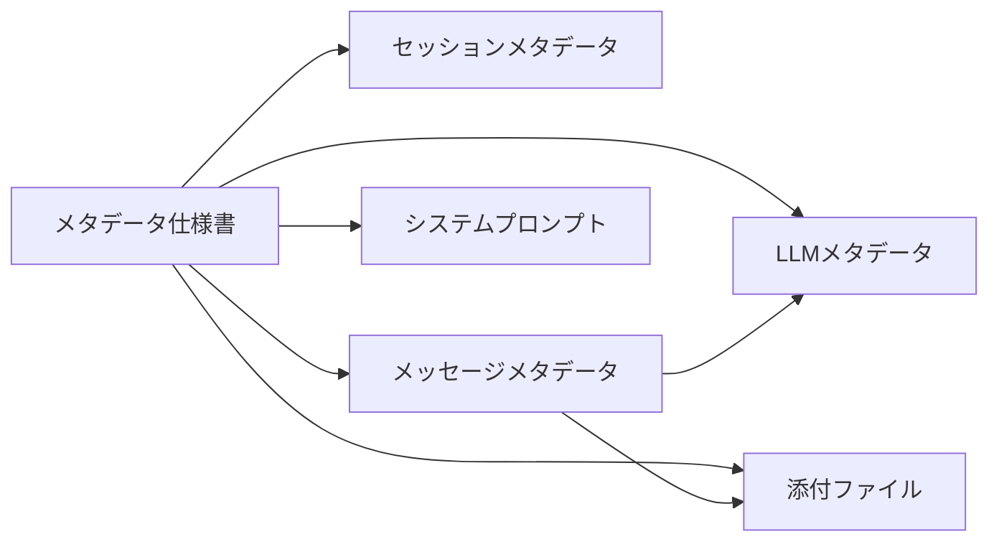

# チャット履歴メタデータ仕様書

---

title: チャット履歴メタデータ仕様書
version: 1.0.0
author: @spec-writer
created: 2025-12-20
status: draft
parent_task: T-00-2
dependencies:

- requirements-functional.md
- requirements-non-functional.md
- acceptance-criteria.md
- docs/00-requirements/15-database-design.md

---

## 1. 概要

### 1.1 目的

LLMベースのAIチャット機能における履歴データとして保存すべきメタデータの詳細構造を定義する。このドキュメントは、データベーススキーマ設計とZodスキーマ定義の基礎となる正本として機能する。

### 1.2 スコープ

**含むもの**:

- チャットセッションメタデータ（全体情報）
- 個別メッセージメタデータ（会話の1ターン）
- LLMメタデータ（使用されたモデル・プロバイダー情報）
- システムプロンプトメタデータ
- 添付ファイルメタデータ

**含まないもの**:

- データベース物理設計の詳細（schema-requirements.mdを参照）
- UI設計・ワイヤーフレーム
- パフォーマンス要件（requirements-non-functional.mdを参照）

### 1.3 ドキュメント構造



---

## 2. プロジェクト固有制約（master_system_design.md準拠）

### 2.1 技術スタック

| 技術              | バージョン | 用途                     |
| ----------------- | ---------- | ------------------------ |
| Turso             | Latest     | クラウドDB（libSQL）     |
| Drizzle ORM       | 0.38.x     | 型安全なORM              |
| Zod               | 3.x        | ランタイムバリデーション |
| TypeScript        | 5.x        | 型定義                   |
| Embedded Replicas | Latest     | ローカル↔クラウド同期    |

### 2.2 データ型の基本原則

| 原則                | 説明                                                |
| ------------------- | --------------------------------------------------- |
| ISO 8601形式の日時  | すべての日時は`YYYY-MM-DDTHH:mm:ss.sssZ`形式（UTC） |
| UUID v4主キー       | すべてのIDはUUID v4形式                             |
| JSON型の活用        | 柔軟なメタデータはJSON型で保存、Zodでバリデーション |
| NOT NULL デフォルト | NULL許容は明示的に必要な場合のみ                    |
| ソフトデリート      | `deleted_at`カラムでの論理削除                      |

### 2.3 命名規則

| 対象          | ルール                    | 例                  |
| ------------- | ------------------------- | ------------------- |
| テーブル名    | スネークケース（複数形）  | `chat_sessions`     |
| カラム名      | スネークケース            | `created_at`        |
| TypeScript型  | パスカルケース            | `ChatSession`       |
| Zodスキーマ名 | キャメルケース + `Schema` | `chatSessionSchema` |
| JSON内キー    | キャメルケース            | `maxTokens`         |

---

## 3. チャットセッションメタデータ

### 3.1 定義

チャットセッションは、ユーザーとアシスタント間の一連の会話の最上位エンティティ。1つのセッションは複数のメッセージを含む。

### 3.2 メタデータ項目

| フィールド名           | データ型 | NULL | デフォルト値                        | 説明                                                   |
| ---------------------- | -------- | ---- | ----------------------------------- | ------------------------------------------------------ |
| `id`                   | TEXT     | NO   | UUID v4自動生成                     | セッション一意識別子                                   |
| `title`                | TEXT     | NO   | `新しいチャット - YYYY-MM-DD HH:mm` | セッションタイトル（ユーザー編集可）                   |
| `created_at`           | TEXT     | NO   | `new Date().toISOString()`          | 作成日時（UTC、ISO 8601）                              |
| `updated_at`           | TEXT     | NO   | `new Date().toISOString()`          | 最終更新日時（メッセージ追加時に更新）                 |
| `message_count`        | INTEGER  | NO   | 0                                   | セッション内のメッセージ総数（非正規化、検索最適化用） |
| `is_favorite`          | INTEGER  | NO   | 0                                   | お気に入りフラグ（0: false, 1: true）                  |
| `is_pinned`            | INTEGER  | NO   | 0                                   | ピン留めフラグ（0: false, 1: true）                    |
| `pin_order`            | INTEGER  | YES  | NULL                                | ピン留め時の表示順序（昇順）                           |
| `last_message_preview` | TEXT     | YES  | NULL                                | 最終メッセージのプレビュー（最大50文字）               |
| `metadata`             | JSON     | YES  | `{}`                                | 拡張メタデータ（将来の拡張用）                         |
| `deleted_at`           | TEXT     | YES  | NULL                                | 削除日時（ソフトデリート）                             |

### 3.3 制約条件

| 制約               | 説明                                       |
| ------------------ | ------------------------------------------ |
| タイトル最大長     | 100文字以内                                |
| タイトル空文字禁止 | 空文字の場合はデフォルトタイトルに自動復元 |
| ピン留め最大数     | `is_pinned = 1`のセッションは最大10件まで  |
| `pin_order`範囲    | 1-10（ピン留めセッションのみ使用）         |
| `deleted_at`索引   | NULL値のみ検索対象（有効セッション）       |

### 3.4 ビジネスルール

#### BR-SESSION-001: タイトル自動生成

```
WHEN セッション作成時 AND タイトル未指定
THEN タイトル = "新しいチャット - ${現在日時(yyyy-MM-dd HH:mm)}"
```

#### BR-SESSION-002: ピン留め上限制御

```
WHEN ユーザーが11件目のセッションをピン留めしようとする
THEN エラー「ピン留めは最大10件までです」を返す
```

#### BR-SESSION-003: 最終メッセージプレビュー更新

```
WHEN 新しいメッセージが追加される
THEN last_message_preview = 最新メッセージの先頭50文字
AND updated_at = 現在日時
AND message_count = message_count + 1
```

### 3.5 TypeScript型定義

```typescript
export type ChatSession = {
  id: string; // UUID v4
  title: string; // 3-100文字
  createdAt: string; // ISO 8601
  updatedAt: string; // ISO 8601
  messageCount: number; // >= 0
  isFavorite: boolean;
  isPinned: boolean;
  pinOrder: number | null; // 1-10 or null
  lastMessagePreview: string | null; // max 50 chars
  metadata: Record<string, unknown>; // JSON拡張用
  deletedAt: string | null; // ISO 8601 or null
};
```

---

## 4. チャットメッセージメタデータ

### 4.1 定義

チャットメッセージは、セッション内の個別の発言（ユーザーまたはアシスタント）を表すエンティティ。

### 4.2 メタデータ項目

| フィールド名    | データ型 | NULL | デフォルト値               | 説明                                                 |
| --------------- | -------- | ---- | -------------------------- | ---------------------------------------------------- |
| `id`            | TEXT     | NO   | UUID v4自動生成            | メッセージ一意識別子                                 |
| `session_id`    | TEXT     | NO   | 親セッションID             | 外部キー（CASCADE DELETE）                           |
| `role`          | TEXT     | NO   | -                          | メッセージロール: `"user"` or `"assistant"`          |
| `content`       | TEXT     | NO   | -                          | メッセージ本文（最大100,000文字）                    |
| `message_index` | INTEGER  | NO   | 自動採番                   | セッション内の順序（0から連番）                      |
| `timestamp`     | TEXT     | NO   | `new Date().toISOString()` | メッセージ送信日時（UTC、ISO 8601）                  |
| `llm_provider`  | TEXT     | YES  | NULL                       | LLMプロバイダー名（アシスタント応答のみ）            |
| `llm_model`     | TEXT     | YES  | NULL                       | LLMモデル名（アシスタント応答のみ）                  |
| `llm_metadata`  | JSON     | YES  | NULL                       | LLMメタデータ（詳細は5章参照）                       |
| `attachments`   | JSON     | YES  | `[]`                       | 添付ファイル情報の配列（詳細は7章参照）              |
| `system_prompt` | TEXT     | YES  | NULL                       | システムプロンプト（アシスタント応答のみ、将来対応） |
| `metadata`      | JSON     | YES  | `{}`                       | 拡張メタデータ（将来の拡張用）                       |

### 4.3 制約条件

| 制約                   | 説明                                                     |
| ---------------------- | -------------------------------------------------------- |
| コンテンツ最大長       | 100,000文字以内                                          |
| コンテンツ空文字禁止   | 最低1文字以上必須                                        |
| ロール値制約           | `"user"` または `"assistant"` のみ許可                   |
| メッセージインデックス | セッション内で一意、0から連番                            |
| 外部キー制約           | `session_id`は`chat_sessions.id`を参照（CASCADE DELETE） |

### 4.4 ビジネスルール

#### BR-MESSAGE-001: メッセージインデックス自動採番

```
WHEN 新しいメッセージを保存する
THEN message_index = MAX(session内のmessage_index) + 1
初回メッセージの場合 message_index = 0
```

#### BR-MESSAGE-002: LLMメタデータ必須条件

```
WHEN role = "assistant"
THEN llm_provider, llm_model, llm_metadata は必須
WHEN role = "user"
THEN llm_provider, llm_model, llm_metadata は NULL
```

#### BR-MESSAGE-003: カスケード削除

```
WHEN セッションが削除される
THEN 関連するすべてのメッセージも削除される（CASCADE DELETE）
```

### 4.5 TypeScript型定義

```typescript
export type MessageRole = "user" | "assistant";

export type ChatMessage = {
  id: string; // UUID v4
  sessionId: string; // FK to chat_sessions
  role: MessageRole;
  content: string; // 1-100,000 chars
  messageIndex: number; // >= 0
  timestamp: string; // ISO 8601
  llmProvider: string | null; // "openai", "anthropic", etc.
  llmModel: string | null; // "gpt-4", "claude-3-5-sonnet", etc.
  llmMetadata: LlmMetadata | null; // See section 5
  attachments: Attachment[]; // See section 7
  systemPrompt: string | null; // Future
  metadata: Record<string, unknown>;
};
```

---

## 5. LLMメタデータ

### 5.1 定義

アシスタント応答に使用されたLLMの詳細情報を記録するメタデータ。トークン使用量、応答時間、モデルパラメータを含む。

### 5.2 メタデータ構造

| フィールド名     | データ型 | NULL | 説明                                                           |
| ---------------- | -------- | ---- | -------------------------------------------------------------- |
| `provider`       | string   | NO   | プロバイダー名: `"openai"`, `"anthropic"`, `"google"`, `"xai"` |
| `model`          | string   | NO   | モデル名: `"gpt-4"`, `"claude-3-5-sonnet-20241022"`, etc.      |
| `version`        | string   | YES  | モデルバージョン: `"20241022"`, etc.                           |
| `temperature`    | number   | YES  | 温度パラメータ（0.0-2.0）                                      |
| `maxTokens`      | number   | YES  | 最大トークン数                                                 |
| `topP`           | number   | YES  | Top-pサンプリング（0.0-1.0）                                   |
| `stream`         | boolean  | YES  | ストリーミングモードの有無                                     |
| `responseTimeMs` | number   | YES  | 応答時間（ミリ秒）                                             |
| `tokenUsage`     | object   | YES  | トークン使用量（詳細は5.3参照）                                |
| `error`          | boolean  | YES  | エラー発生フラグ（デフォルト: false）                          |
| `errorMessage`   | string   | YES  | エラーメッセージ                                               |

### 5.3 トークン使用量（`tokenUsage`）構造

| フィールド名   | データ型 | NULL | 説明                                           |
| -------------- | -------- | ---- | ---------------------------------------------- |
| `inputTokens`  | number   | NO   | 入力トークン数                                 |
| `outputTokens` | number   | NO   | 出力トークン数                                 |
| `totalTokens`  | number   | YES  | 合計トークン数（= inputTokens + outputTokens） |

### 5.4 プロバイダー別モデル一覧

#### OpenAI

| モデル名        | 説明          | `version`例 |
| --------------- | ------------- | ----------- |
| `gpt-4`         | GPT-4         | `0613`      |
| `gpt-4-turbo`   | GPT-4 Turbo   | `1106`      |
| `gpt-3.5-turbo` | GPT-3.5 Turbo | `0125`      |

#### Anthropic

| モデル名                     | 説明              | `version`例 |
| ---------------------------- | ----------------- | ----------- |
| `claude-3-5-sonnet-20241022` | Claude 3.5 Sonnet | `20241022`  |
| `claude-3-opus-20240229`     | Claude 3 Opus     | `20240229`  |
| `claude-3-haiku-20240307`    | Claude 3 Haiku    | `20240307`  |

#### Google AI

| モデル名       | 説明         | `version`例 |
| -------------- | ------------ | ----------- |
| `gemini-pro`   | Gemini Pro   | `1.0`       |
| `gemini-flash` | Gemini Flash | `1.5`       |

#### xAI

| モデル名      | 説明        | `version`例 |
| ------------- | ----------- | ----------- |
| `grok-2`      | Grok 2      | -           |
| `grok-2-mini` | Grok 2 Mini | -           |

### 5.5 TypeScript型定義

```typescript
export type LlmProvider = "openai" | "anthropic" | "google" | "xai";

export type TokenUsage = {
  inputTokens: number;
  outputTokens: number;
  totalTokens?: number;
};

export type LlmMetadata = {
  provider: LlmProvider;
  model: string;
  version?: string;
  temperature?: number; // 0.0-2.0
  maxTokens?: number;
  topP?: number; // 0.0-1.0
  stream?: boolean;
  responseTimeMs?: number;
  tokenUsage?: TokenUsage;
  error?: boolean;
  errorMessage?: string;
};
```

### 5.6 JSON保存例

```json
{
  "provider": "anthropic",
  "model": "claude-3-5-sonnet-20241022",
  "version": "20241022",
  "temperature": 0.7,
  "maxTokens": 4096,
  "topP": 1.0,
  "stream": true,
  "responseTimeMs": 1234,
  "tokenUsage": {
    "inputTokens": 150,
    "outputTokens": 320,
    "totalTokens": 470
  },
  "error": false
}
```

---

## 6. システムプロンプトメタデータ

### 6.1 定義（将来対応）

システムプロンプトは、LLMに対する初期指示や制約条件を定義するテキスト。フェーズ1では対象外だが、将来の拡張のためにスキーマに含める。

### 6.2 メタデータ項目

| フィールド名     | データ型 | NULL | 説明                       |
| ---------------- | -------- | ---- | -------------------------- |
| `system_prompt`  | TEXT     | YES  | システムプロンプトの全文   |
| `prompt_version` | TEXT     | YES  | プロンプトバージョン識別子 |

### 6.3 将来の拡張方針

- プロンプトテンプレート管理機能
- ユーザーカスタムプロンプト保存
- プロンプト履歴管理

---

## 7. 添付ファイルメタデータ

### 7.1 定義

ユーザーがメッセージに添付したファイルの情報を記録するメタデータ。ファイル実体は別ディレクトリに保存し、DBにはパス参照のみを保持する。

### 7.2 メタデータ構造

| フィールド名    | データ型 | NULL | 説明                                            |
| --------------- | -------- | ---- | ----------------------------------------------- |
| `id`            | string   | NO   | 添付ファイル一意識別子（UUID v4）               |
| `fileName`      | string   | NO   | ファイル名（拡張子含む）                        |
| `filePath`      | string   | NO   | ストレージ内の相対パス                          |
| `mimeType`      | string   | NO   | MIMEタイプ: `"image/png"`, `"text/plain"`, etc. |
| `fileSize`      | number   | NO   | ファイルサイズ（バイト）                        |
| `uploadedAt`    | string   | NO   | アップロード日時（ISO 8601）                    |
| `thumbnailPath` | string   | YES  | サムネイル画像パス（画像ファイルのみ）          |

### 7.3 ストレージパス設計

```
{userData}/attachments/
├── {session_id}/
│   ├── {message_id}/
│   │   ├── {file_id}.{ext}        # 元ファイル
│   │   └── {file_id}_thumb.webp   # サムネイル
```

### 7.4 制約条件

| 制約               | 説明                                                       |
| ------------------ | ---------------------------------------------------------- |
| ファイル名最大長   | 255文字以内                                                |
| ファイルサイズ上限 | 5MB（画像）、10MB（その他）                                |
| 対応MIMEタイプ     | `image/*`, `text/*`, `application/pdf`, `application/json` |

### 7.5 TypeScript型定義

```typescript
export type Attachment = {
  id: string; // UUID v4
  fileName: string; // max 255 chars
  filePath: string; // Relative path
  mimeType: string; // e.g., "image/png"
  fileSize: number; // bytes
  uploadedAt: string; // ISO 8601
  thumbnailPath?: string; // For images only
};
```

### 7.6 JSON保存例（`attachments`配列）

```json
[
  {
    "id": "550e8400-e29b-41d4-a716-446655440000",
    "fileName": "screenshot.png",
    "filePath": "session-123/message-456/550e8400-e29b-41d4-a716-446655440000.png",
    "mimeType": "image/png",
    "fileSize": 1234567,
    "uploadedAt": "2025-12-20T14:30:00.000Z",
    "thumbnailPath": "session-123/message-456/550e8400-e29b-41d4-a716-446655440000_thumb.webp"
  }
]
```

---

## 8. Zodスキーマ定義

### 8.1 セッションスキーマ

```typescript
import { z } from "zod";

export const chatSessionSchema = z.object({
  id: z.string().uuid(),
  title: z.string().min(1).max(100),
  createdAt: z.string().datetime(),
  updatedAt: z.string().datetime(),
  messageCount: z.number().int().min(0),
  isFavorite: z.boolean(),
  isPinned: z.boolean(),
  pinOrder: z.number().int().min(1).max(10).nullable(),
  lastMessagePreview: z.string().max(50).nullable(),
  metadata: z.record(z.unknown()),
  deletedAt: z.string().datetime().nullable(),
});

export type ChatSession = z.infer<typeof chatSessionSchema>;
```

### 8.2 メッセージスキーマ

```typescript
export const messageRoleSchema = z.enum(["user", "assistant"]);

export const tokenUsageSchema = z.object({
  inputTokens: z.number().int().min(0),
  outputTokens: z.number().int().min(0),
  totalTokens: z.number().int().min(0).optional(),
});

export const llmMetadataSchema = z.object({
  provider: z.enum(["openai", "anthropic", "google", "xai"]),
  model: z.string(),
  version: z.string().optional(),
  temperature: z.number().min(0).max(2).optional(),
  maxTokens: z.number().int().positive().optional(),
  topP: z.number().min(0).max(1).optional(),
  stream: z.boolean().optional(),
  responseTimeMs: z.number().int().min(0).optional(),
  tokenUsage: tokenUsageSchema.optional(),
  error: z.boolean().optional(),
  errorMessage: z.string().optional(),
});

export const attachmentSchema = z.object({
  id: z.string().uuid(),
  fileName: z.string().max(255),
  filePath: z.string(),
  mimeType: z.string(),
  fileSize: z.number().int().positive(),
  uploadedAt: z.string().datetime(),
  thumbnailPath: z.string().optional(),
});

export const chatMessageSchema = z.object({
  id: z.string().uuid(),
  sessionId: z.string().uuid(),
  role: messageRoleSchema,
  content: z.string().min(1).max(100000),
  messageIndex: z.number().int().min(0),
  timestamp: z.string().datetime(),
  llmProvider: z.string().nullable(),
  llmModel: z.string().nullable(),
  llmMetadata: llmMetadataSchema.nullable(),
  attachments: z.array(attachmentSchema),
  systemPrompt: z.string().nullable(),
  metadata: z.record(z.unknown()),
});

export type MessageRole = z.infer<typeof messageRoleSchema>;
export type TokenUsage = z.infer<typeof tokenUsageSchema>;
export type LlmMetadata = z.infer<typeof llmMetadataSchema>;
export type Attachment = z.infer<typeof attachmentSchema>;
export type ChatMessage = z.infer<typeof chatMessageSchema>;
```

### 8.3 バリデーション使用例

```typescript
import { chatSessionSchema, chatMessageSchema } from "./schemas";

// セッション作成時のバリデーション
try {
  const session = chatSessionSchema.parse({
    id: crypto.randomUUID(),
    title: "新しいチャット - 2025-12-20 14:30",
    createdAt: new Date().toISOString(),
    updatedAt: new Date().toISOString(),
    messageCount: 0,
    isFavorite: false,
    isPinned: false,
    pinOrder: null,
    lastMessagePreview: null,
    metadata: {},
    deletedAt: null,
  });
  // 成功: sessionを使用
} catch (error) {
  // バリデーションエラー処理
  console.error(error);
}
```

---

## 9. エラーハンドリング

### 9.1 バリデーションエラー

| エラーコード       | 説明                                    | HTTPステータス |
| ------------------ | --------------------------------------- | -------------- |
| `INVALID_TITLE`    | タイトルが空または100文字超過           | 400            |
| `INVALID_CONTENT`  | メッセージ本文が空または100,000文字超過 | 400            |
| `INVALID_ROLE`     | ロールが`"user"`または`"assistant"`以外 | 400            |
| `MISSING_LLM_META` | アシスタント応答にLLMメタデータが未設定 | 400            |
| `PIN_LIMIT`        | ピン留めセッションが10件を超過          | 400            |

### 9.2 データ整合性エラー

| エラーコード        | 説明                                           | HTTPステータス |
| ------------------- | ---------------------------------------------- | -------------- |
| `SESSION_NOT_FOUND` | 指定されたセッションIDが存在しない             | 404            |
| `FK_VIOLATION`      | 外部キー制約違反（存在しないセッションID参照） | 409            |
| `DUPLICATE_INDEX`   | メッセージインデックスの重複                   | 409            |

---

## 10. パフォーマンス考慮事項

### 10.1 インデックス推奨

| テーブル        | インデックス対象カラム      | 用途                   |
| --------------- | --------------------------- | ---------------------- |
| `chat_sessions` | `deleted_at`                | 有効セッション取得     |
| `chat_sessions` | `is_pinned, pin_order`      | ピン留めセッション表示 |
| `chat_sessions` | `created_at DESC`           | 新着順ソート           |
| `chat_messages` | `session_id, message_index` | メッセージ順序取得     |
| `chat_messages` | `timestamp DESC`            | 時系列検索             |
| `chat_messages` | `llm_provider, llm_model`   | モデル別フィルタリング |

### 10.2 FTS5（全文検索）推奨

| 対象カラム              | 検索用途               |
| ----------------------- | ---------------------- |
| `chat_sessions.title`   | セッションタイトル検索 |
| `chat_messages.content` | メッセージ内容検索     |

---

## 11. セキュリティ考慮事項

### 11.1 データ保護

| 項目           | 対策                                                     |
| -------------- | -------------------------------------------------------- |
| メッセージ内容 | ローカルストレージ（Embedded Replicas）のファイル権限600 |
| 添付ファイル   | `{userData}/attachments/`に保存、ファイル権限600         |
| LLMメタデータ  | 特に保護不要（公開情報）                                 |

### 11.2 監査ログ

| イベント         | 記録内容                                        |
| ---------------- | ----------------------------------------------- |
| セッション作成   | `session.id`, `user_id`, `timestamp`            |
| セッション削除   | `session.id`, `user_id`, `timestamp`            |
| メッセージ保存   | `message.id`, `session.id`, `role`, `timestamp` |
| エクスポート実行 | `session.id`, `format`, `user_id`, `timestamp`  |

---

## 12. 次のステップ

### 12.1 後続ドキュメント

- [ ] `schema-requirements.md` - データベース物理スキーマ設計
- [ ] `database-schema.ts` - Drizzle ORMスキーマ実装
- [ ] `repositories.ts` - データアクセス層実装

### 12.2 実装推奨順序

1. Zodスキーマ定義（`schemas.ts`）
2. Drizzle ORMスキーマ定義（`database-schema.ts`）
3. マイグレーション生成（`drizzle-kit generate`）
4. リポジトリ層実装（`chat-session-repository.ts`, `chat-message-repository.ts`）
5. ユニットテスト作成（TDDサイクル）

---

## 13. 変更履歴

| バージョン | 日付       | 変更内容                                  | 変更者       |
| ---------- | ---------- | ----------------------------------------- | ------------ |
| 1.0.0      | 2025-12-20 | 初版作成 - T-00-2タスクの成果物として作成 | @spec-writer |

---

## 14. 参照ドキュメント

- [機能要件定義書](./requirements-functional.md)
- [非機能要件定義書](./requirements-non-functional.md)
- [受け入れ基準書](./acceptance-criteria.md)
- [データベース設計](../../00-requirements/15-database-design.md)
- [master_system_design.md](../../00-requirements/master_system_design.md)
