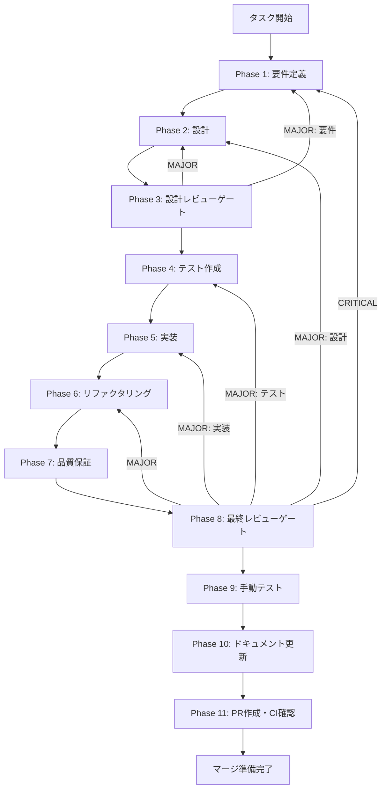

# チャット履歴永続化機能 - タスク実行仕様書

## ユーザーからの元の指示

```
チャットの履歴を保存してほしいです。
```

## メタ情報

| 項目         | 内容                               |
| ------------ | ---------------------------------- |
| タスクID     | TASK-CHAT-HISTORY-001              |
| Worktreeパス | `.worktrees/task-chat-history-001` |
| ブランチ名   | `feat/chat-history-persistence`    |
| タスク名     | チャット履歴永続化機能             |
| 分類         | 新規機能                           |
| 対象機能     | チャット                           |
| 優先度       | 高                                 |
| 見積もり規模 | 中規模                             |
| ステータス   | 未実施                             |
| 作成日       | 2026-01-04                         |

---

## タスク概要

### 目的

チャット履歴をローカルに保存し、過去の会話を検索・参照できるようにする。

### 背景

チャットでのやり取りは重要な知識や成果物を含むことが多い。履歴を永続化することで、過去の会話を参照したり、ワークスペースと連携して成果物を管理できるようになる。

現状の問題点:

- チャット履歴が保存されない
- 過去の会話を参照できない
- 有用なやり取りが失われる
- セッション間で情報が引き継がれない

放置した場合の影響:

- 知識の蓄積ができない
- 同じ質問を繰り返す必要がある
- 作業の連続性が損なわれる

### 最終ゴール

- チャット履歴の自動保存
- 履歴一覧・検索機能
- 過去の会話の再開・継続
- 履歴のエクスポート（Markdown/JSON）
- ワークスペースへの履歴連携

### 成果物一覧

| 種別         | 成果物                     | 配置先                             |
| ------------ | -------------------------- | ---------------------------------- |
| 環境         | Git Worktree環境           | `.worktrees/task-chat-history-001` |
| DB設計       | 履歴テーブルスキーマ       | `packages/shared/src/db/schema/`   |
| 機能         | 履歴保存ロジック           | `packages/shared/src/services/`    |
| 機能         | 履歴一覧UI                 | `apps/desktop/src/components/`     |
| 機能         | 検索機能                   | `packages/shared/src/services/`    |
| 機能         | エクスポート機能           | `packages/shared/src/services/`    |
| テスト       | ユニットテスト・統合テスト | `packages/shared/src/__tests__/`   |
| ドキュメント | API仕様・使い方ガイド      | `docs/`                            |
| PR           | GitHub Pull Request        | GitHub UI                          |

---

## 参照ファイル

本仕様書のコマンド選定は以下を参照:

- `docs/00-requirements/master_system_design.md` - システム要件
- `.claude/skills/skill_list.md` - スキル定義
- `.claude/skills/aiworkflow-requirements/` - システム仕様

---

## タスク分解サマリー

| ID     | フェーズ | サブタスク名       | 責務                             | 依存 |
| ------ | -------- | ------------------ | -------------------------------- | ---- |
| T-01-1 | Phase 1  | 要件定義           | 目的・スコープ・受け入れ基準     | -    |
| T-02-1 | Phase 2  | DB設計             | 履歴テーブルスキーマ設計         | T-01 |
| T-02-2 | Phase 2  | API設計            | 履歴操作APIインターフェース      | T-01 |
| T-02-3 | Phase 2  | UI設計             | 履歴一覧・検索UIワイヤーフレーム | T-01 |
| T-03-1 | Phase 3  | 設計レビューゲート | 要件・設計の妥当性検証           | T-02 |
| T-04-1 | Phase 4  | テスト作成         | TDD: Red（失敗するテスト作成）   | T-03 |
| T-05-1 | Phase 5  | Repository実装     | データアクセス層実装             | T-04 |
| T-05-2 | Phase 5  | Service実装        | 保存・検索ロジック実装           | T-04 |
| T-05-3 | Phase 5  | UI実装             | 履歴一覧・検索UI実装             | T-04 |
| T-06-1 | Phase 6  | リファクタリング   | TDD: Refactor（品質改善）        | T-05 |
| T-07-1 | Phase 7  | 品質保証           | 静的解析・セキュリティ・性能     | T-06 |
| T-08-1 | Phase 8  | 最終レビューゲート | 全体品質・整合性検証             | T-07 |
| T-09-1 | Phase 9  | 手動テスト検証     | UX・実環境動作確認               | T-08 |
| T-10-1 | Phase 10 | ドキュメント更新   | ドキュメント更新・仕様反映       | T-09 |
| T-11-1 | Phase 11 | PR作成             | コミット・PR・CI確認             | T-10 |

**総サブタスク数**: 15個

---

## 実行フロー図



---

## スコープ

### 含むもの

**保存機能**

- チャットセッションの自動保存
- メタデータ（日時、使用LLM、タイトル）の保存
- システムプロンプトの保存
- 添付ファイル情報の保存

**履歴管理**

- 履歴一覧表示（サイドバー）
- 日付/キーワード検索
- タイトル編集
- 履歴の削除
- お気に入り/ピン留め

**エクスポート**

- Markdown形式でのエクスポート
- JSON形式でのエクスポート
- 選択範囲のエクスポート

### 含まないもの

- クラウド同期
- 複数デバイス間の履歴共有
- 履歴の暗号化（将来対応）

---

## 主要エージェント

| エージェント | 役割                   | 担当Phase |
| ------------ | ---------------------- | --------- |
| db-architect | 履歴データスキーマ設計 | Phase 2   |
| ui-designer  | 履歴一覧UIの設計       | Phase 2   |
| logic-dev    | 保存・検索ロジック     | Phase 4-6 |
| repo-dev     | データアクセス層       | Phase 5   |

---

## 関連タスク

- TASK-CHAT-WS-EXPORT-001: チャット成果物のワークスペース連携

---

## 次のステップ

Phase 1 仕様書を実行してください:
`docs/30-workflows/chat-history-persistence/phase-1-requirements.md`
