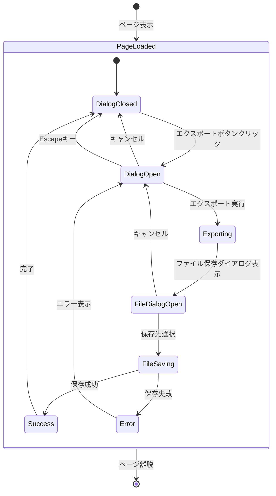
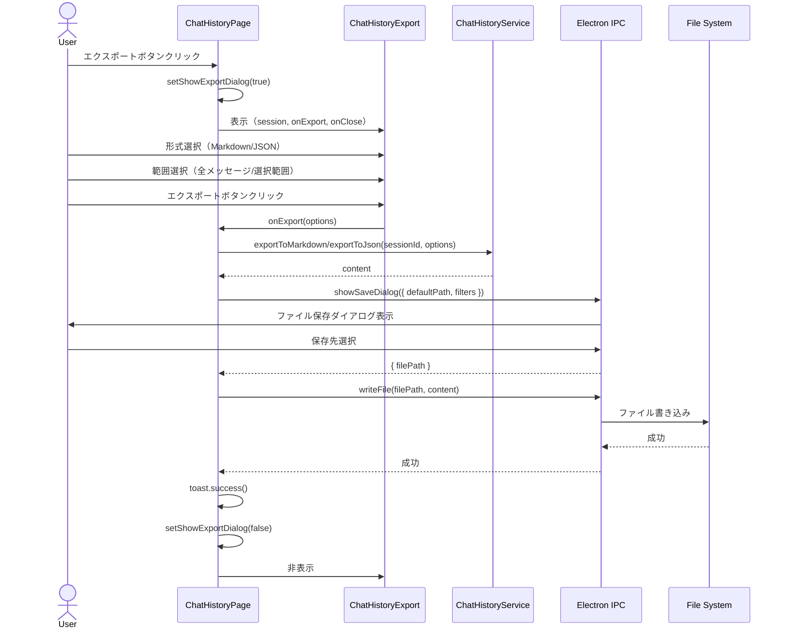

# チャット履歴エクスポート機能 - UI統合設計書

---

title: エクスポート機能UI統合設計書
version: 1.0.0
author: .claude/agents/ui-designer.md
created: 2025-12-22
status: draft
parent_task: T-01-4

---

## 1. 概要

### 1.1 目的

ChatHistoryExportコンポーネント（独立実装済み）をチャット履歴ページに統合し、ユーザーがセッションをエクスポートできるようにする。

### 1.2 スコープ

- **対象ページ**: `/chat/history/:sessionId`
- **統合コンポーネント**: `ChatHistoryExport`
- **新規追加要素**: エクスポートボタン、ダイアログ状態管理、onExportハンドラー

### 1.3 設計原則

- **既存UIとの一貫性**: Apple HIGに準拠したボタン配置
- **状態の局所性**: ダイアログ状態は親コンポーネントで管理
- **責任の分離**: UIロジックとElectron IPCロジックを分離

---

## 2. エクスポートボタンの配置

### 2.1 配置場所の決定

**選択肢の検討**:

| 配置場所                               | 長所                     | 短所                       | 採用 |
| -------------------------------------- | ------------------------ | -------------------------- | ---- |
| チャット履歴ページヘッダー             | アクセスしやすい、目立つ | ページ固有の操作のため適切 | ✅   |
| セッションカードのコンテキストメニュー | 一覧から直接操作可能     | 個別ページには不適         | ❌   |
| フローティングアクションボタン         | 常に表示される           | スペースを取る             | ❌   |

**決定**: チャット履歴ページヘッダーの右側に配置

### 2.2 ワイヤーフレーム

```
チャット履歴ページ (/chat/history/:sessionId)
┌─────────────────────────────────────────────────────────────────┐
│  ← 戻る           React開発についての質問         [エクスポート] │ ← ヘッダー
├─────────────────────────────────────────────────────────────────┤
│                                                                 │
│  セッション情報:                                                │
│  - 作成日: 2025-12-20 14:30                                     │
│  - メッセージ数: 24件                                           │
│  - 総トークン数: 4,520                                          │
│  - モデル: Claude 3.5 Sonnet                                    │
│                                                                 │
│  ────────────────────────────────────────                       │
│                                                                 │
│  メッセージ一覧:                                                │
│  ┌─────────────────────────────────────────────────────────┐   │
│  │ [User] ReactのuseEffectフックについて教えてください。   │   │
│  └─────────────────────────────────────────────────────────┘   │
│  ┌─────────────────────────────────────────────────────────┐   │
│  │ [AI] useEffectは副作用を扱うためのReact Hookです...    │   │
│  └─────────────────────────────────────────────────────────┘   │
│                                                                 │
└─────────────────────────────────────────────────────────────────┘
```

### 2.3 ボタンの仕様

```tsx
<button
  type="button"
  onClick={handleExportButtonClick}
  aria-label="エクスポート"
  className="flex items-center gap-2 rounded-hig-sm bg-hig-accent px-4 py-2 text-sm text-white hover:opacity-90 transition-opacity duration-hig-micro"
>
  <Download className="h-4 w-4" />
  エクスポート
</button>
```

**デザイントークン**:

- アイコン: `lucide-react` の `Download`
- 背景色: `hig-accent` (#007AFF)
- テキスト色: white
- パディング: px-4 py-2 (16px horizontal, 8px vertical)
- 角丸: `hig-sm` (8px)
- ホバー: 不透明度90%
- トランジション: `hig-micro` (150ms)

**アクセシビリティ**:

- `aria-label="エクスポート"`: スクリーンリーダー対応
- `type="button"`: フォーム送信防止
- フォーカス時: 2pxアウトライン + オフセット

---

## 3. ダイアログの統合

### 3.1 状態管理

**親コンポーネント** (`ChatHistoryPage.tsx`) で以下の状態を管理:

```typescript
// ダイアログの表示/非表示
const [showExportDialog, setShowExportDialog] = useState(false);

// エクスポート中の状態（オプション）
const [isExporting, setIsExporting] = useState(false);
```

### 3.2 イベントハンドラー

```typescript
/**
 * エクスポートボタンクリック
 * ダイアログを表示
 */
const handleExportButtonClick = () => {
  setShowExportDialog(true);
};

/**
 * ダイアログを閉じる
 */
const handleCloseDialog = () => {
  setShowExportDialog(false);
};

/**
 * エクスポート実行
 * @param options - エクスポートオプション
 */
const handleExport = async (options: ExportOptions) => {
  setIsExporting(true);
  try {
    // ChatHistoryServiceからデータ取得
    const service = new ChatHistoryService(/* deps */);
    const content =
      options.format === "markdown"
        ? await service.exportToMarkdown(session.id, options)
        : await service.exportToJson(session.id, options);

    // Electronファイル保存ダイアログ
    const result = await window.electron.dialog.showSaveDialog({
      title: "エクスポート",
      defaultPath: `${session.title}.${options.format === "markdown" ? "md" : "json"}`,
      filters: [
        options.format === "markdown"
          ? { name: "Markdown", extensions: ["md"] }
          : { name: "JSON", extensions: ["json"] },
      ],
    });

    if (!result.canceled && result.filePath) {
      // ファイル書き込み
      await window.electron.fs.writeFile(result.filePath, content, "utf-8");

      // 成功通知
      toast.success(
        `エクスポートが完了しました: ${path.basename(result.filePath)}`,
      );

      // ダイアログを閉じる
      setShowExportDialog(false);
    }
  } catch (error) {
    // エラー処理はChatHistoryExportコンポーネント内で表示される
    throw error;
  } finally {
    setIsExporting(false);
  }
};
```

### 3.3 コンポーネント構成

```tsx
export function ChatHistoryPage() {
  const { sessionId } = useParams();
  const [session, setSession] = useState<ChatSession | null>(null);
  const [showExportDialog, setShowExportDialog] = useState(false);

  // セッションデータの取得
  useEffect(() => {
    // ... session fetch logic
  }, [sessionId]);

  if (!session) {
    return <LoadingSpinner />;
  }

  return (
    <div className="flex h-full flex-col">
      {/* ヘッダー */}
      <header className="flex items-center justify-between border-b border-hig-border bg-hig-bg-primary px-6 py-4">
        <div className="flex items-center gap-4">
          <button
            type="button"
            onClick={() => router.back()}
            aria-label="戻る"
            className="rounded-hig-sm p-2 text-hig-text-secondary hover:bg-hig-bg-secondary"
          >
            <ArrowLeft className="h-5 w-5" />
          </button>
          <h1 className="text-lg font-semibold text-hig-text-primary">
            {session.title}
          </h1>
        </div>

        {/* エクスポートボタン */}
        <button
          type="button"
          onClick={handleExportButtonClick}
          aria-label="エクスポート"
          className="flex items-center gap-2 rounded-hig-sm bg-hig-accent px-4 py-2 text-sm text-white hover:opacity-90 transition-opacity duration-hig-micro"
        >
          <Download className="h-4 w-4" />
          エクスポート
        </button>
      </header>

      {/* メインコンテンツ */}
      <main className="flex-1 overflow-y-auto p-6">
        {/* セッション情報 */}
        {/* メッセージ一覧 */}
      </main>

      {/* エクスポートダイアログ */}
      {showExportDialog && (
        <ChatHistoryExport
          session={session}
          onExport={handleExport}
          onClose={handleCloseDialog}
        />
      )}
    </div>
  );
}
```

---

## 4. 状態遷移図



---

## 5. データフロー



---

## 6. エラーハンドリング

### 6.1 エラーケース

| エラーケース                       | 発生タイミング    | エラーメッセージ                   | 回復方法               |
| ---------------------------------- | ----------------- | ---------------------------------- | ---------------------- |
| セッションが見つからない           | データ取得時      | "セッションが見つかりませんでした" | ページリロード         |
| エクスポートデータの取得失敗       | Service呼び出し時 | "データの取得に失敗しました"       | 再試行                 |
| ファイル保存ダイアログのキャンセル | IPC呼び出し時     | なし（正常フロー）                 | ダイアログを開いたまま |
| ファイル書き込み失敗               | writeFile時       | "ファイルの保存に失敗しました"     | 再試行                 |
| ディスク容量不足                   | writeFile時       | "ディスク容量が不足しています"     | 空き容量確保を促す     |

### 6.2 エラー表示

```tsx
// エラートースト（画面右上）
toast.error("エクスポートに失敗しました", {
  description: error.message,
  action: {
    label: "再試行",
    onClick: () => handleExport(options),
  },
});
```

**エラートーストの仕様**:

- 位置: 画面右上
- 表示時間: 5秒（自動消失）
- アイコン: `AlertCircle`（赤色）
- アクション: 再試行ボタン（オプション）

---

## 7. パフォーマンス最適化

### 7.1 遅延読み込み

```typescript
// ChatHistoryExportコンポーネントの遅延読み込み
const ChatHistoryExport = lazy(() => import('./ChatHistoryExport'));

// 使用時
{showExportDialog && (
  <Suspense fallback={<DialogSkeleton />}>
    <ChatHistoryExport
      session={session}
      onExport={handleExport}
      onClose={handleCloseDialog}
    />
  </Suspense>
)}
```

### 7.2 メモ化

```typescript
// エクスポートハンドラーのメモ化
const handleExport = useCallback(
  async (options: ExportOptions) => {
    // ... implementation
  },
  [session.id],
);

// ダイアログを閉じるハンドラーのメモ化
const handleCloseDialog = useCallback(() => {
  setShowExportDialog(false);
}, []);
```

---

## 8. レスポンシブ対応

### 8.1 モバイル/コンパクトビュー

```
ウィンドウ幅 < 800px の場合:
┌────────────────────────────────────────┐
│  ← 戻る    React開発につい... [↓]     │ ← アイコンのみ
├────────────────────────────────────────┤
│                                        │
│  セッション情報                         │
│  メッセージ一覧                         │
│                                        │
└────────────────────────────────────────┘

エクスポートボタン:
- テキストを非表示、アイコンのみ表示
- ツールチップで "エクスポート" を表示
```

### 8.2 実装例

```tsx
<button
  type="button"
  onClick={handleExportButtonClick}
  aria-label="エクスポート"
  className="flex items-center gap-2 rounded-hig-sm bg-hig-accent px-4 py-2 text-sm text-white hover:opacity-90 transition-opacity duration-hig-micro md:gap-2"
>
  <Download className="h-4 w-4" />
  <span className="hidden md:inline">エクスポート</span>
</button>
```

---

## 9. アクセシビリティ要件

### 9.1 WCAG 2.1 AA準拠

| 要件                     | 実装                                    | 検証方法       |
| ------------------------ | --------------------------------------- | -------------- |
| 4.5:1コントラスト比      | アクセントカラー (#007AFF) と白 (white) | axe DevTools   |
| フォーカスインジケーター | 2pxアウトライン + 2pxオフセット         | 手動検証       |
| キーボード操作           | Tab/Enter/Escapeで操作可能              | 手動検証       |
| スクリーンリーダー       | aria-label設定                          | NVDA/VoiceOver |

### 9.2 キーボードナビゲーション

| キー     | 動作                           |
| -------- | ------------------------------ |
| `Tab`    | エクスポートボタンにフォーカス |
| `Enter`  | ダイアログを開く               |
| `Escape` | ダイアログを閉じる             |

---

## 10. テスト観点

### 10.1 単体テスト

```typescript
describe("ChatHistoryPage", () => {
  it("エクスポートボタンが表示される", () => {
    // ...
  });

  it("エクスポートボタンクリックでダイアログが開く", () => {
    // ...
  });

  it("ダイアログのonCloseでダイアログが閉じる", () => {
    // ...
  });

  it("エクスポート実行でファイル保存ダイアログが開く", async () => {
    // ...
  });
});
```

### 10.2 E2Eテスト（Playwright）

既存の `chat-history-export.spec.ts` の L112 で以下をテスト:

```typescript
await page.goto(`/chat/history/${TEST_SESSION.id}`);
await page.getByRole("button", { name: /エクスポート/i }).click();
await expect(page.getByRole("dialog", { name: /エクスポート/i })).toBeVisible();
```

---

## 11. 実装チェックリスト

- [ ] エクスポートボタンをヘッダーに追加
- [ ] `showExportDialog` 状態の追加
- [ ] `handleExportButtonClick` ハンドラーの実装
- [ ] `handleExport` ハンドラーの実装
- [ ] `handleCloseDialog` ハンドラーの実装
- [ ] `ChatHistoryExport` コンポーネントの条件付きレンダリング
- [ ] エラートーストの統合
- [ ] レスポンシブスタイルの適用
- [ ] アクセシビリティ検証 (axe DevTools)
- [ ] キーボードナビゲーション検証
- [ ] E2Eテストの実行確認

---

## 12. 依存関係

### 12.1 前提タスク

- **T-01-2**: UI/UX設計書完成
- **T-01-3**: 受け入れ基準書完成
- **T-04-4**: ChatHistoryExportコンポーネント実装完了 ✅

### 12.2 後続タスク

- **T-02-1**: 設計レビュー（T-01-4を含む）
- **T-03-4**: エクスポートUI統合テスト作成
- **T-04-5**: エクスポート機能UI統合実装

---

## 13. 参照ドキュメント

- [UI/UX設計書](./ui-ux-design.md)
- [ChatHistoryExportコンポーネント](../../../apps/desktop/src/components/chat/ChatHistoryExport.tsx)
- [Electron IPC設計書](./electron-ipc-export-design.md)
- [E2Eテスト仕様](../../../apps/desktop/e2e/chat-history-export.spec.ts)
- [Apple Human Interface Guidelines](https://developer.apple.com/design/human-interface-guidelines/)

---

## 14. 変更履歴

| バージョン | 日付       | 変更内容                        | 変更者       |
| ---------- | ---------- | ------------------------------- | ------------ |
| 1.0.0      | 2025-12-22 | 初版作成 - T-01-4タスクの成果物 | .claude/agents/ui-designer.md |
