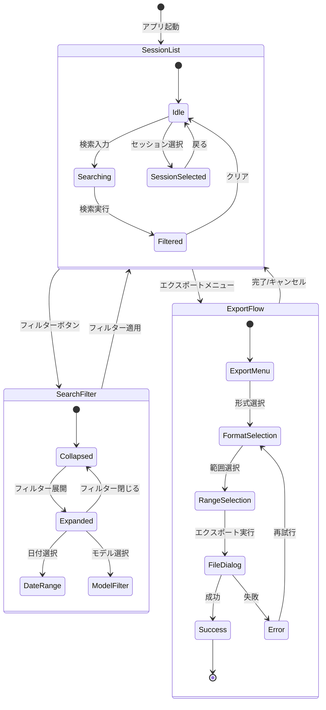
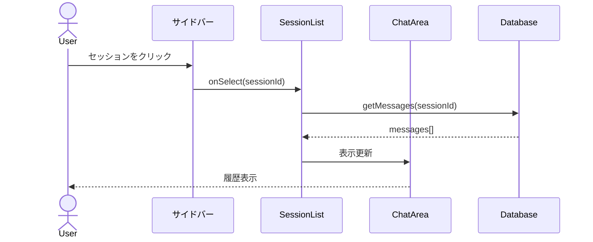
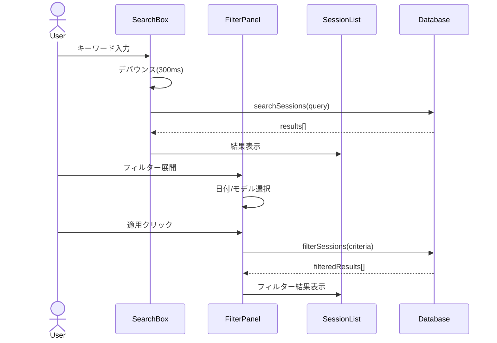
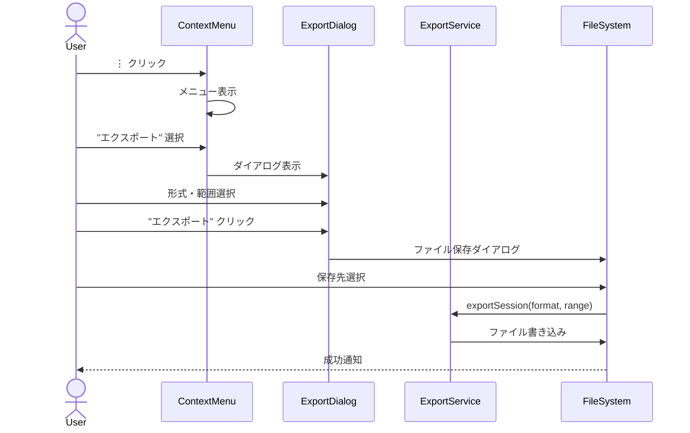

# チャット履歴永続化機能 - UI/UX設計書

---

title: チャット履歴永続化 UI/UX設計書
version: 1.0.0
author: .claude/agents/ui-designer.md
created: 2025-12-20
status: draft
parent_task: T-01-2

---

## 1. 概要

### 1.1 目的

チャット履歴機能のUI/UX設計を定義し、ユーザーが直感的に履歴を参照・管理できるインターフェースを提供する。

### 1.2 設計原則

本設計は以下の原則に基づく:

1. **Apple HIG準拠**: macOSネイティブ体験に近いデザイン
2. **アクセシビリティファースト**: WCAG 2.1 AA準拠
3. **ミニマリズム**: 必要な情報のみを表示
4. **一貫性**: アプリ全体で統一されたインタラクション

### 1.3 対象画面

| 画面              | 説明                                 |
| ----------------- | ------------------------------------ |
| ChatHistoryList   | サイドバーに表示されるセッション一覧 |
| ChatHistorySearch | 検索・フィルター機能                 |
| ChatHistoryExport | エクスポート機能のUI                 |

---

## 2. Apple HIG準拠デザインガイドライン

### 2.1 視覚的スタイル

| 要素     | 仕様                               | 根拠                          |
| -------- | ---------------------------------- | ----------------------------- |
| 角丸     | 8px (小) / 12px (中) / 16px (大)   | HIG: Continuous Corner Radius |
| シャドウ | `0 2px 8px rgba(0,0,0,0.15)`       | HIG: Elevation System         |
| 境界線   | 1px solid rgba(0,0,0,0.1)          | HIG: Subtle Borders           |
| フォント | SF Pro Text / SF Pro Display       | HIG: Typography               |
| アイコン | SF Symbols準拠（Lucide Icons代替） | HIG: Iconography              |

### 2.2 アニメーション

| 種類                     | 時間  | イージング                   | Tailwindクラス                                |
| ------------------------ | ----- | ---------------------------- | --------------------------------------------- |
| マイクロインタラクション | 150ms | ease-out                     | `transition-all duration-150 ease-out`        |
| 要素の表示/非表示        | 200ms | ease-in-out                  | `transition-opacity duration-200 ease-in-out` |
| 画面遷移                 | 300ms | cubic-bezier(0.4, 0, 0.2, 1) | `transition-transform duration-300`           |
| ホバー状態               | 100ms | ease                         | `transition-colors duration-100`              |

**実装例**:

```tsx
// ボタンホバー
<button className="transition-colors duration-100 hover:bg-hig-bg-secondary">

// ダイアログフェードイン
<div className="transition-opacity duration-200 ease-in-out data-[state=open]:animate-in data-[state=closed]:animate-out">

// スムーズなスクロール
<div className="transition-transform duration-300 ease-[cubic-bezier(0.4,0,0.2,1)]">
```

### 2.3 カラーシステム

```
ライトモード:
- 背景（プライマリ）: #FFFFFF
- 背景（セカンダリ）: #F5F5F7
- 背景（ターシャリ）: #E8E8ED
- テキスト（プライマリ）: #1D1D1F
- テキスト（セカンダリ）: #86868B
- アクセント: #007AFF
- 成功: #34C759
- 警告: #FF9500
- エラー: #FF3B30

ダークモード:
- 背景（プライマリ）: #1C1C1E
- 背景（セカンダリ）: #2C2C2E
- 背景（ターシャリ）: #3A3A3C
- テキスト（プライマリ）: #F5F5F7
- テキスト（セカンダリ）: #8E8E93
- アクセント: #0A84FF
```

---

## 3. ワイヤーフレーム

### 3.1 全体レイアウト

```
┌─────────────────────────────────────────────────────────────────────────┐
│  ◀ ▶  🔄                      AIWorkflowOrchestrator              ─ □ ✕ │
├───────────────────┬─────────────────────────────────────────────────────┤
│                   │                                                     │
│  ┌─────────────┐  │  ┌─────────────────────────────────────────────┐   │
│  │ 🔍 検索...   │  │  │                                             │   │
│  └─────────────┘  │  │                                             │   │
│                   │  │                                             │   │
│  ┌─────────────┐  │  │            チャットエリア                   │   │
│  │ + 新規チャット│  │  │                                             │   │
│  └─────────────┘  │  │                                             │   │
│                   │  │                                             │   │
│  ── ピン留め ──   │  │                                             │   │
│  📌 重要な会話    │  │                                             │   │
│  📌 プロジェクト.. │  │                                             │   │
│                   │  │                                             │   │
│  ── 今日 ──      │  │                                             │   │
│  💬 React開発... │  │  └─────────────────────────────────────────────┘   │
│     Claude 3.5   │  │                                                     │
│     14:30        │  │  ┌─────────────────────────────────────────────┐   │
│                   │  │  │ メッセージを入力...                 📎 ⬆️ │   │
│  💬 TypeScript.. │  │  └─────────────────────────────────────────────┘   │
│     GPT-4        │  │                                                     │
│     12:15        │  │                                                     │
│                   │  │                                                     │
│  ── 昨日 ──      │  │                                                     │
│  💬 データベース.. │  │                                                     │
│                   │  │                                                     │
│  ──────────────  │  │                                                     │
│  ⚙️ 設定         │  │                                                     │
└───────────────────┴─────────────────────────────────────────────────────┘
     サイドバー                          メインエリア
     (280px)                            (可変幅)
```

### 3.2 セッションアイテム詳細

```
┌─────────────────────────────────────────────┐
│ ┌───┐                                       │
│ │💬 │ React開発についての質問          ⋮   │
│ └───┘ こんにちは！Reactの useEffect...      │
│       Claude 3.5 Sonnet  •  14:30    📌 ⭐ │
└─────────────────────────────────────────────┘
  ↑      ↑                              ↑  ↑
アイコン タイトル/プレビュー          ピン お気に入り

ホバー状態:
┌─────────────────────────────────────────────┐
│ ┌───┐                                  ───  │  ← 削除・その他メニュー
│ │💬 │ React開発についての質問          ⋯   │
│ └───┘ こんにちは！Reactの useEffect...      │
│       Claude 3.5 Sonnet  •  14:30    📌 ⭐ │
└─────────────────────────────────────────────┘
  背景色: #F5F5F7 (hover)
```

### 3.3 検索・フィルターUI

```
展開前（デフォルト）:
┌─────────────────────────────────────────────┐
│ 🔍 チャット履歴を検索...              🔽    │
└─────────────────────────────────────────────┘

展開後（フィルター表示）:
┌─────────────────────────────────────────────┐
│ 🔍 チャット履歴を検索...              🔼    │
├─────────────────────────────────────────────┤
│                                             │
│ 📅 日付範囲                                 │
│ ┌─────────────┐ ～ ┌─────────────┐         │
│ │ 2025-12-01  │    │ 2025-12-20  │         │
│ └─────────────┘    └─────────────┘         │
│                                             │
│ 🤖 モデル                                   │
│ ┌─────────────────────────────────────────┐ │
│ │ すべてのモデル                      🔽  │ │
│ └─────────────────────────────────────────┘ │
│                                             │
│ プリセット:                                 │
│ [今日] [直近7日] [直近30日] [カスタム]      │
│                                             │
│              [クリア] [適用]                │
└─────────────────────────────────────────────┘
```

### 3.4 エクスポートダイアログ

```
┌─────────────────────────────────────────────────────┐
│                   📤 エクスポート                   │
├─────────────────────────────────────────────────────┤
│                                                     │
│  セッション: React開発についての質問                │
│  メッセージ数: 24件                                 │
│                                                     │
│  ┌─────────────────────────────────────────────┐   │
│  │  📁 エクスポート形式                         │   │
│  ├─────────────────────────────────────────────┤   │
│  │  ○ Markdown (.md)                           │   │
│  │    └─ 人間が読みやすい形式                   │   │
│  │                                             │   │
│  │  ○ JSON (.json)                             │   │
│  │    └─ プログラムでの処理に最適              │   │
│  └─────────────────────────────────────────────┘   │
│                                                     │
│  ┌─────────────────────────────────────────────┐   │
│  │  📝 エクスポート範囲                         │   │
│  ├─────────────────────────────────────────────┤   │
│  │  ◉ 全メッセージ (24件)                      │   │
│  │  ○ 選択した範囲のみ                         │   │
│  └─────────────────────────────────────────────┘   │
│                                                     │
│                        [キャンセル] [エクスポート]  │
└─────────────────────────────────────────────────────┘
```

---

## 4. 画面遷移図



---

## 5. 操作フロー

### 5.1 セッション選択フロー



### 5.2 検索フロー



### 5.3 エクスポートフロー



---

## 6. デザイントークン

### 6.1 Tailwind CSSカスタム設定

```javascript
// tailwind.config.js (抜粋)
module.exports = {
  theme: {
    extend: {
      colors: {
        // Apple HIG準拠カラーパレット
        "hig-bg-primary": "var(--hig-bg-primary)",
        "hig-bg-secondary": "var(--hig-bg-secondary)",
        "hig-bg-tertiary": "var(--hig-bg-tertiary)",
        "hig-text-primary": "var(--hig-text-primary)",
        "hig-text-secondary": "var(--hig-text-secondary)",
        "hig-accent": "var(--hig-accent)",
        "hig-success": "var(--hig-success)",
        "hig-warning": "var(--hig-warning)",
        "hig-error": "var(--hig-error)",
      },
      borderRadius: {
        "hig-sm": "8px",
        "hig-md": "12px",
        "hig-lg": "16px",
      },
      boxShadow: {
        "hig-sm": "0 1px 3px rgba(0,0,0,0.1)",
        "hig-md": "0 2px 8px rgba(0,0,0,0.15)",
        "hig-lg": "0 4px 16px rgba(0,0,0,0.2)",
      },
      transitionDuration: {
        "hig-micro": "150ms",
        "hig-fast": "200ms",
        "hig-normal": "300ms",
      },
      spacing: {
        "hig-sidebar": "280px",
        "hig-header": "52px",
      },
    },
  },
};
```

### 6.2 CSSカスタムプロパティ

```css
:root {
  /* ライトモード */
  --hig-bg-primary: #ffffff;
  --hig-bg-secondary: #f5f5f7;
  --hig-bg-tertiary: #e8e8ed;
  --hig-text-primary: #1d1d1f;
  --hig-text-secondary: #86868b;
  --hig-accent: #007aff;
  --hig-success: #34c759;
  --hig-warning: #ff9500;
  --hig-error: #ff3b30;
  --hig-border: rgba(0, 0, 0, 0.1);
}

.dark {
  /* ダークモード */
  --hig-bg-primary: #1c1c1e;
  --hig-bg-secondary: #2c2c2e;
  --hig-bg-tertiary: #3a3a3c;
  --hig-text-primary: #f5f5f7;
  --hig-text-secondary: #8e8e93;
  --hig-accent: #0a84ff;
  --hig-border: rgba(255, 255, 255, 0.1);
}
```

---

## 7. アクセシビリティ設計

### 7.1 WCAG 2.1 AA準拠要件

| 要件                     | 実装                                 |
| ------------------------ | ------------------------------------ |
| 4.5:1コントラスト比      | テキスト色と背景色の組み合わせを検証 |
| フォーカスインジケーター | 2pxアウトライン + 2pxオフセット      |
| 代替テキスト             | すべてのアイコンに`aria-label`       |
| キーボード操作           | すべての操作がキーボードで可能       |

#### 7.1.1 コントラスト比実測値

| テキスト色                   | 背景色                 | コントラスト比 | 判定    |
| ---------------------------- | ---------------------- | -------------- | ------- |
| #1D1D1F (プライマリ)         | #FFFFFF (背景)         | 16.1:1         | ✅ PASS |
| #86868B (セカンダリ)         | #FFFFFF (背景)         | 4.6:1          | ✅ PASS |
| #FFFFFF (白)                 | #007AFF (アクセント)   | 4.5:1          | ✅ PASS |
| #FF3B30 (エラー)             | #FFFFFF (背景)         | 5.3:1          | ✅ PASS |
| #F5F5F7 (プライマリ・ダーク) | #1C1C1E (背景・ダーク) | 15.8:1         | ✅ PASS |

#### 7.1.2 フォーカススタイル詳細

```css
/* フォーカスインジケーター統一スタイル */
.focus-ring {
  @apply focus-visible:outline-none
         focus-visible:ring-2
         focus-visible:ring-hig-accent
         focus-visible:ring-offset-2;
}

/* ボタンのフォーカス */
button:focus-visible {
  outline: 2px solid var(--hig-accent);
  outline-offset: 2px;
  box-shadow: 0 0 0 3px rgba(0, 122, 255, 0.3);
}

/* インプットフィールドのフォーカス */
input:focus-visible,
textarea:focus-visible {
  outline: 2px solid var(--hig-accent);
  outline-offset: 0;
  border-color: var(--hig-accent);
}
```

### 7.2 キーボードナビゲーション

| キー                 | 動作                           |
| -------------------- | ------------------------------ |
| `Tab`                | 次のインタラクティブ要素へ移動 |
| `Shift + Tab`        | 前のインタラクティブ要素へ移動 |
| `↑ / ↓`              | リスト内のアイテム移動         |
| `Enter / Space`      | 選択/アクティベート            |
| `Escape`             | ダイアログ閉じる / 検索クリア  |
| `Cmd/Ctrl + K`       | 検索ボックスにフォーカス       |
| `Delete / Backspace` | 選択アイテムの削除（確認あり） |

### 7.3 ARIA属性

```html
<!-- セッションリスト -->
<ul role="listbox" aria-label="チャット履歴">
  <li role="option" aria-selected="true" tabindex="0">
    <!-- セッションアイテム -->
  </li>
</ul>

<!-- 検索ボックス -->
<div role="search">
  <input
    type="search"
    aria-label="チャット履歴を検索"
    aria-describedby="search-hint"
  />
  <span id="search-hint" class="sr-only"> キーワードを入力して履歴を検索 </span>
</div>

<!-- エクスポートダイアログ -->
<dialog role="dialog" aria-modal="true" aria-labelledby="export-title">
  <h2 id="export-title">エクスポート</h2>
  <!-- コンテンツ -->
</dialog>
```

### 7.4 スクリーンリーダー対応

```html
<!-- 読み上げ専用テキスト -->
<span class="sr-only">
  セッション「React開発についての質問」、 Claude 3.5 Sonnetを使用、
  24件のメッセージ、 最終更新: 2025年12月20日 14時30分
</span>

<!-- ライブリージョン（動的更新の通知） -->
<div aria-live="polite" aria-atomic="true">
  検索結果: 5件のセッションが見つかりました
</div>
```

---

## 8. レスポンシブデザイン

### 8.1 ブレークポイント

| サイズ     | 幅             | レイアウト                               |
| ---------- | -------------- | ---------------------------------------- |
| コンパクト | < 800px        | サイドバー非表示（ハンバーガーメニュー） |
| 標準       | 800px - 1280px | サイドバー表示（280px固定）              |
| ワイド     | > 1280px       | サイドバー表示 + 追加余白                |

### 8.2 コンパクトモード

```
┌───────────────────────────────────────────────────┐
│  ☰  AIWorkflowOrchestrator                   ─ □ ✕│
├───────────────────────────────────────────────────┤
│                                                   │
│  ┌───────────────────────────────────────────┐   │
│  │                                           │   │
│  │            チャットエリア                 │   │
│  │                                           │   │
│  │                                           │   │
│  └───────────────────────────────────────────┘   │
│                                                   │
│  ┌───────────────────────────────────────────┐   │
│  │ メッセージを入力...                 📎 ⬆️ │   │
│  └───────────────────────────────────────────┘   │
└───────────────────────────────────────────────────┘

サイドバー（オーバーレイ表示）:
┌─────────────────────────────────────────┐
│  ✕ チャット履歴                         │
├─────────────────────────────────────────┤
│  🔍 検索...                             │
│  + 新規チャット                         │
│                                         │
│  ── ピン留め ──                         │
│  📌 重要な会話                          │
│  📌 プロジェクト...                     │
│                                         │
│  ── 今日 ──                            │
│  💬 React開発...                       │
│  ...                                   │
└─────────────────────────────────────────┘
```

### 8.3 サイドバー折りたたみ

```css
/* サイドバー遷移 */
.sidebar {
  width: 280px;
  transition: width var(--hig-duration-normal) ease-in-out;
}

.sidebar.collapsed {
  width: 0;
  overflow: hidden;
}

/* オーバーレイ */
.sidebar-overlay {
  position: fixed;
  inset: 0;
  background: rgba(0, 0, 0, 0.4);
  opacity: 0;
  pointer-events: none;
  transition: opacity var(--hig-duration-fast) ease;
}

.sidebar-overlay.visible {
  opacity: 1;
  pointer-events: auto;
}
```

---

## 9. インタラクション詳細

### 9.1 ホバー状態

| 要素               | 変化                               |
| ------------------ | ---------------------------------- |
| セッションアイテム | 背景色を`hig-bg-secondary`に変更   |
| ボタン             | 不透明度80% + 軽微なスケール(1.02) |
| リンク             | アンダーライン表示                 |
| アイコンボタン     | 背景円形ハイライト                 |

### 9.2 フォーカス状態

```css
/* フォーカスリング */
:focus-visible {
  outline: 2px solid var(--hig-accent);
  outline-offset: 2px;
  border-radius: var(--hig-radius-sm);
}

/* ボタンのフォーカス */
button:focus-visible {
  box-shadow: 0 0 0 3px rgba(0, 122, 255, 0.3);
}
```

### 9.3 アクティブ/押下状態

| 要素             | 変化                        |
| ---------------- | --------------------------- |
| ボタン           | スケール(0.98) + 背景色暗め |
| リストアイテム   | 背景色`hig-bg-tertiary`     |
| チェックボックス | 色反転 + チェックマーク表示 |

### 9.4 ローディング状態

```
セッション読み込み中:
┌─────────────────────────────────────────────┐
│  ░░░░░░░░░░░░░░░░░░░░░░░░░░░░░░░░░░░░░░░░  │  ← スケルトン
│  ░░░░░░░░░░░░░░░░░░░░░░                     │
│  ░░░░░░░░░░                                 │
└─────────────────────────────────────────────┘

検索中:
┌─────────────────────────────────────────────┐
│ 🔍 チャット履歴を検索...     ⟳             │  ← スピナー
└─────────────────────────────────────────────┘
```

---

## 10. エラー状態とフィードバック

### 10.1 エラーメッセージ

```
エクスポート失敗:
┌─────────────────────────────────────────────────────┐
│  ⚠️ エクスポートに失敗しました                      │
│                                                     │
│  ディスク容量が不足しています。                     │
│  空き容量を確保してから再度お試しください。         │
│                                                     │
│                              [閉じる] [再試行]      │
└─────────────────────────────────────────────────────┘
```

### 10.2 確認ダイアログ

```
削除確認:
┌─────────────────────────────────────────────────────┐
│  🗑️ セッションを削除しますか？                     │
│                                                     │
│  「React開発についての質問」                        │
│  24件のメッセージを含む                             │
│                                                     │
│  この操作は取り消せません。                         │
│                                                     │
│                              [キャンセル] [削除]    │
└─────────────────────────────────────────────────────┘
```

### 10.3 成功フィードバック

```
トースト通知（成功）:
┌─────────────────────────────────────────────────────┐
│  ✓ エクスポートが完了しました                       │
│    React開発についての質問.md                       │
└─────────────────────────────────────────────────────┘
  ↑ 3秒後に自動消失
```

---

## 11. 次のステップ

- [ ] コンポーネント設計書の作成 (`component-design.md`)
- [ ] Figma/Sketchによる高精細モックアップ（オプション）
- [ ] ユーザビリティテスト計画
- [ ] 実装フェーズへの引き継ぎ

---

## 12. 変更履歴

| バージョン | 日付       | 変更内容                        | 変更者       |
| ---------- | ---------- | ------------------------------- | ------------ |
| 1.0.0      | 2025-12-20 | 初版作成 - T-01-2タスクの成果物 | .claude/agents/ui-designer.md |

---

## 13. 参照ドキュメント

- [機能要件定義書](./requirements-functional.md)
- [非機能要件定義書](./requirements-non-functional.md)
- [受け入れ基準書](./acceptance-criteria.md)
- [Apple Human Interface Guidelines](https://developer.apple.com/design/human-interface-guidelines/)
- [WCAG 2.1 Guidelines](https://www.w3.org/WAI/WCAG21/quickref/)
