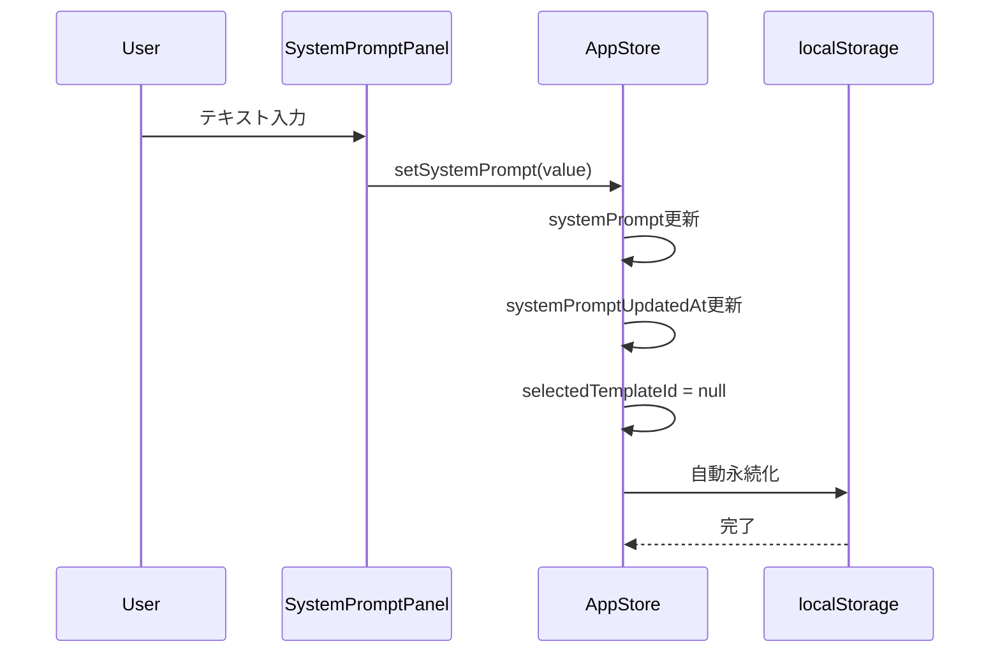
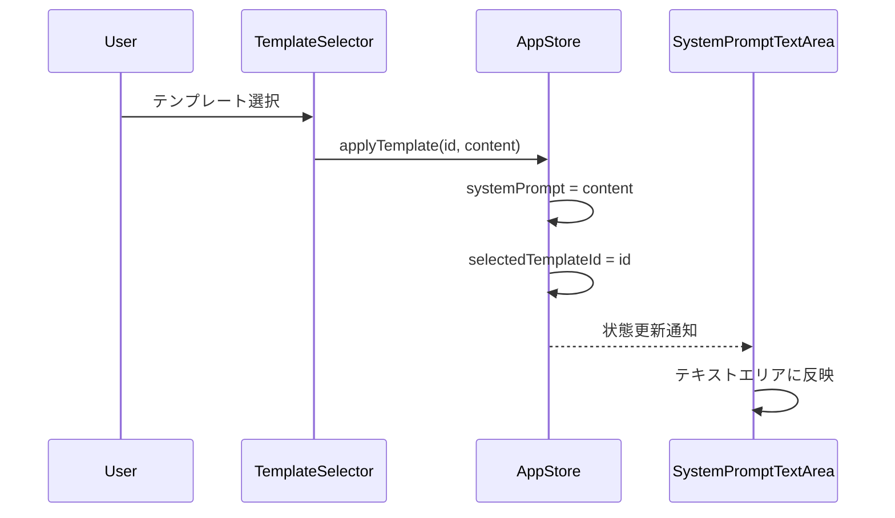
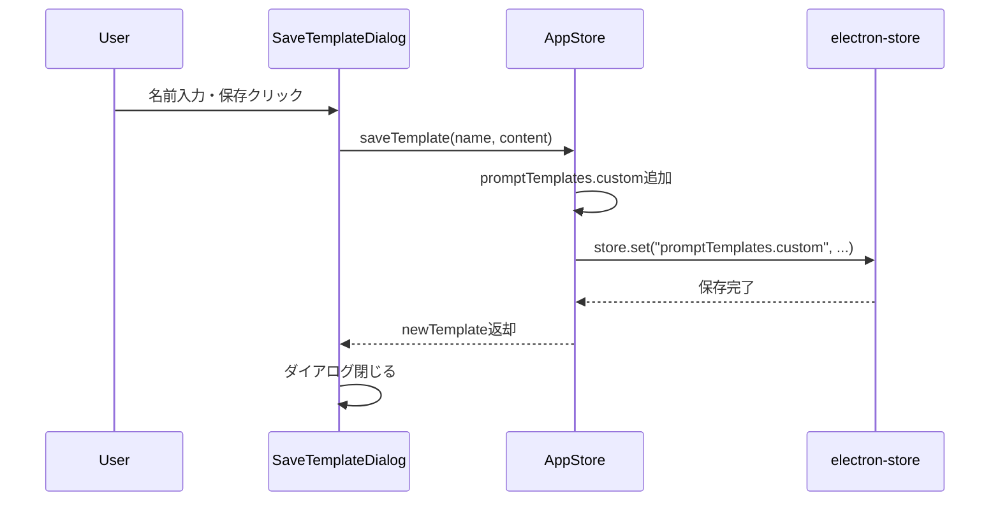

# システムプロンプト設定機能 - 状態管理設計書

## メタ情報

| 項目           | 内容                                                               |
| -------------- | ------------------------------------------------------------------ |
| ドキュメントID | SM-CHAT-SYSPROMPT-001                                              |
| 作成日         | 2025-12-25                                                         |
| ステータス     | ドラフト                                                           |
| 関連タスク     | T-01-2                                                             |
| 参照           | `docs/30-workflows/chat-system-prompt/task-step00-requirements.md` |
|                | `docs/30-workflows/chat-system-prompt/task-step01-ui-design.md`    |

---

## 1. 設計概要

### 1.1 設計方針

既存のZustand Sliceパターンに従い、システムプロンプト関連の状態を**ChatSlice**に統合する。テンプレート管理は別Sliceとして分離し、関心の分離を維持する。

### 1.2 状態の分類

| 状態種別           | 管理方法                  | 永続化         |
| ------------------ | ------------------------- | -------------- |
| システムプロンプト | ChatSlice（拡張）         | localStorage   |
| UIパネル状態       | UISlice（拡張）           | なし           |
| テンプレート       | SystemPromptTemplateSlice | electron-store |

---

## 2. 型定義

### 2.1 システムプロンプト関連型

**ファイルパス**: `apps/desktop/src/renderer/store/types.ts`

```typescript
/**
 * システムプロンプト型
 */
export interface SystemPrompt {
  /** プロンプト本文（最大4000文字） */
  content: string;
  /** 最終更新日時 */
  updatedAt: Date;
}

/**
 * プロンプトテンプレート型
 */
export interface PromptTemplate {
  /** ユニークID（UUID v4） */
  id: string;
  /** テンプレート名（最大50文字） */
  name: string;
  /** プロンプト本文（最大4000文字） */
  content: string;
  /** プリセットフラグ（true=システム定義、false=ユーザー定義） */
  isPreset: boolean;
  /** 作成日時 */
  createdAt: Date;
  /** 最終更新日時 */
  updatedAt: Date;
}

/**
 * テンプレートストレージ構造
 */
export interface PromptTemplateStorage {
  /** プリセットテンプレート */
  presets: PromptTemplate[];
  /** カスタムテンプレート */
  custom: PromptTemplate[];
}

/**
 * システムプロンプトパネル表示状態
 */
export type SystemPromptPanelState = "collapsed" | "expanded";
```

### 2.2 定数定義

**ファイルパス**: `apps/desktop/src/renderer/store/constants/systemPrompt.ts`

```typescript
/**
 * システムプロンプト関連の定数
 */
export const SYSTEM_PROMPT_CONSTANTS = {
  /** 最大文字数 */
  MAX_LENGTH: 4000,
  /** テンプレート名最大文字数 */
  TEMPLATE_NAME_MAX_LENGTH: 50,
  /** 文字数警告閾値（%） */
  WARNING_THRESHOLD: 0.8,
  /** 文字数エラー閾値（%） */
  ERROR_THRESHOLD: 0.95,
} as const;

/**
 * プリセットテンプレートID
 */
export const PRESET_TEMPLATE_IDS = {
  TRANSLATOR: "preset-translator",
  PROGRAMMER: "preset-programmer",
  WRITER: "preset-writer",
} as const;
```

---

## 3. ChatSlice拡張設計

### 3.1 拡張後のChatSlice

**ファイルパス**: `apps/desktop/src/renderer/store/slices/chatSlice.ts`

```typescript
import { StateCreator } from "zustand";
import type { ChatMessage, RagConnectionStatus, SystemPrompt } from "../types";

export interface ChatSlice {
  // ===== Existing State =====
  chatMessages: ChatMessage[];
  chatInput: string;
  isSending: boolean;
  ragConnectionStatus: RagConnectionStatus;

  // ===== New State (System Prompt) =====
  /** 現在のシステムプロンプト */
  systemPrompt: string;
  /** システムプロンプトの最終更新日時 */
  systemPromptUpdatedAt: Date | null;
  /** 選択中のテンプレートID（null=テンプレート未選択） */
  selectedTemplateId: string | null;

  // ===== Existing Actions =====
  addMessage: (message: ChatMessage) => void;
  updateMessage: (id: string, content: string) => void;
  setChatInput: (input: string) => void;
  setIsSending: (sending: boolean) => void;
  setRagConnectionStatus: (status: RagConnectionStatus) => void;
  clearMessages: () => void;

  // ===== New Actions (System Prompt) =====
  /** システムプロンプトを設定 */
  setSystemPrompt: (prompt: string) => void;
  /** システムプロンプトをクリア */
  clearSystemPrompt: () => void;
  /** テンプレートを選択・適用 */
  applyTemplate: (templateId: string, content: string) => void;
  /** テンプレート選択を解除 */
  clearTemplateSelection: () => void;
}
```

### 3.2 Slice実装

```typescript
export const createChatSlice: StateCreator<ChatSlice, [], [], ChatSlice> = (
  set,
) => ({
  // ===== Initial State =====
  chatMessages: [initialMessage],
  chatInput: "",
  isSending: false,
  ragConnectionStatus: "disconnected",

  // New State
  systemPrompt: "",
  systemPromptUpdatedAt: null,
  selectedTemplateId: null,

  // ===== Existing Actions =====
  addMessage: (message) => {
    set((state) => ({
      chatMessages: [...state.chatMessages, message],
    }));
  },

  updateMessage: (id, content) => {
    set((state) => ({
      chatMessages: state.chatMessages.map((msg) =>
        msg.id === id ? { ...msg, content, isStreaming: false } : msg,
      ),
    }));
  },

  setChatInput: (input) => {
    set({ chatInput: input });
  },

  setIsSending: (sending) => {
    set({ isSending: sending });
  },

  setRagConnectionStatus: (status) => {
    set({ ragConnectionStatus: status });
  },

  clearMessages: () => {
    set({ chatMessages: [initialMessage] });
  },

  // ===== New Actions =====
  setSystemPrompt: (prompt) => {
    set({
      systemPrompt: prompt,
      systemPromptUpdatedAt: new Date(),
      // テンプレートから変更された場合は選択解除
      selectedTemplateId: null,
    });
  },

  clearSystemPrompt: () => {
    set({
      systemPrompt: "",
      systemPromptUpdatedAt: null,
      selectedTemplateId: null,
    });
  },

  applyTemplate: (templateId, content) => {
    set({
      systemPrompt: content,
      systemPromptUpdatedAt: new Date(),
      selectedTemplateId: templateId,
    });
  },

  clearTemplateSelection: () => {
    set({ selectedTemplateId: null });
  },
});
```

---

## 4. SystemPromptTemplateSlice設計

### 4.1 Slice定義

**ファイルパス**: `apps/desktop/src/renderer/store/slices/systemPromptTemplateSlice.ts`

```typescript
import { StateCreator } from "zustand";
import { v4 as uuidv4 } from "uuid";
import type { PromptTemplate, PromptTemplateStorage } from "../types";
import { getPresetTemplates } from "../constants/presetTemplates";

export interface SystemPromptTemplateSlice {
  // ===== State =====
  /** テンプレート一覧 */
  promptTemplates: PromptTemplateStorage;
  /** テンプレート読み込み中フラグ */
  isLoadingTemplates: boolean;
  /** テンプレート操作エラー */
  templateError: string | null;

  // ===== Actions =====
  /** テンプレートを初期化（アプリ起動時） */
  initializeTemplates: () => Promise<void>;
  /** カスタムテンプレートを保存 */
  saveTemplate: (name: string, content: string) => Promise<PromptTemplate>;
  /** カスタムテンプレートを更新 */
  updateTemplate: (
    id: string,
    updates: Partial<Pick<PromptTemplate, "name" | "content">>,
  ) => Promise<void>;
  /** カスタムテンプレートを削除 */
  deleteTemplate: (id: string) => Promise<void>;
  /** テンプレートを取得 */
  getTemplateById: (id: string) => PromptTemplate | undefined;
  /** エラーをクリア */
  clearTemplateError: () => void;
}
```

### 4.2 Slice実装

```typescript
export const createSystemPromptTemplateSlice: StateCreator<
  SystemPromptTemplateSlice,
  [],
  [],
  SystemPromptTemplateSlice
> = (set, get) => ({
  // ===== Initial State =====
  promptTemplates: {
    presets: getPresetTemplates(),
    custom: [],
  },
  isLoadingTemplates: false,
  templateError: null,

  // ===== Actions =====
  initializeTemplates: async () => {
    set({ isLoadingTemplates: true, templateError: null });
    try {
      // electron-storeからカスタムテンプレートを読み込み
      const stored = await window.electronAPI.store.get("promptTemplates");
      if (stored?.custom) {
        set((state) => ({
          promptTemplates: {
            ...state.promptTemplates,
            custom: stored.custom.map((t: PromptTemplate) => ({
              ...t,
              createdAt: new Date(t.createdAt),
              updatedAt: new Date(t.updatedAt),
            })),
          },
          isLoadingTemplates: false,
        }));
      } else {
        set({ isLoadingTemplates: false });
      }
    } catch (error) {
      set({
        templateError: "テンプレートの読み込みに失敗しました",
        isLoadingTemplates: false,
      });
    }
  },

  saveTemplate: async (name, content) => {
    const newTemplate: PromptTemplate = {
      id: uuidv4(),
      name,
      content,
      isPreset: false,
      createdAt: new Date(),
      updatedAt: new Date(),
    };

    set((state) => ({
      promptTemplates: {
        ...state.promptTemplates,
        custom: [...state.promptTemplates.custom, newTemplate],
      },
    }));

    // electron-storeに永続化
    await window.electronAPI.store.set(
      "promptTemplates.custom",
      get().promptTemplates.custom,
    );

    return newTemplate;
  },

  updateTemplate: async (id, updates) => {
    set((state) => ({
      promptTemplates: {
        ...state.promptTemplates,
        custom: state.promptTemplates.custom.map((t) =>
          t.id === id ? { ...t, ...updates, updatedAt: new Date() } : t,
        ),
      },
    }));

    await window.electronAPI.store.set(
      "promptTemplates.custom",
      get().promptTemplates.custom,
    );
  },

  deleteTemplate: async (id) => {
    set((state) => ({
      promptTemplates: {
        ...state.promptTemplates,
        custom: state.promptTemplates.custom.filter((t) => t.id !== id),
      },
    }));

    await window.electronAPI.store.set(
      "promptTemplates.custom",
      get().promptTemplates.custom,
    );
  },

  getTemplateById: (id) => {
    const { presets, custom } = get().promptTemplates;
    return [...presets, ...custom].find((t) => t.id === id);
  },

  clearTemplateError: () => {
    set({ templateError: null });
  },
});
```

---

## 5. UISlice拡張設計

### 5.1 拡張内容

**ファイルパス**: `apps/desktop/src/renderer/store/slices/uiSlice.ts`

```typescript
// 既存のUISliceに以下を追加

export interface UISlice {
  // ... existing state

  // ===== New State (System Prompt Panel) =====
  /** システムプロンプトパネルの表示状態 */
  isSystemPromptPanelExpanded: boolean;
  /** テンプレート保存ダイアログの表示状態 */
  isSaveTemplateDialogOpen: boolean;

  // ... existing actions

  // ===== New Actions =====
  /** システムプロンプトパネルを展開/折りたたみ */
  toggleSystemPromptPanel: () => void;
  /** システムプロンプトパネルを設定 */
  setSystemPromptPanelExpanded: (expanded: boolean) => void;
  /** テンプレート保存ダイアログを開く */
  openSaveTemplateDialog: () => void;
  /** テンプレート保存ダイアログを閉じる */
  closeSaveTemplateDialog: () => void;
}

// 実装追加
// Initial state
isSystemPromptPanelExpanded: false,
isSaveTemplateDialogOpen: false,

// Actions
toggleSystemPromptPanel: () => {
  set((state) => ({
    isSystemPromptPanelExpanded: !state.isSystemPromptPanelExpanded,
  }));
},

setSystemPromptPanelExpanded: (expanded) => {
  set({ isSystemPromptPanelExpanded: expanded });
},

openSaveTemplateDialog: () => {
  set({ isSaveTemplateDialogOpen: true });
},

closeSaveTemplateDialog: () => {
  set({ isSaveTemplateDialogOpen: false });
},
```

---

## 6. Store統合

### 6.1 AppStore型の拡張

**ファイルパス**: `apps/desktop/src/renderer/store/index.ts`

```typescript
import {
  createSystemPromptTemplateSlice,
  type SystemPromptTemplateSlice,
} from "./slices/systemPromptTemplateSlice";

// Combined store type
export type AppStore = NavigationSlice &
  EditorSlice &
  ChatSlice &
  GraphSlice &
  SettingsSlice &
  UISlice &
  DashboardSlice &
  AuthSlice &
  WorkspaceSlice &
  FileSelectionSlice &
  SystemPromptTemplateSlice; // 追加
```

### 6.2 永続化設定の更新

```typescript
// persist partialize の更新
partialize: (state) => ({
  // Only persist these fields
  currentView: state.currentView,
  selectedFile: state.selectedFile,
  expandedFolders: state.expandedFolders,
  userProfile: state.userProfile,
  autoSyncEnabled: state.autoSyncEnabled,
  windowSize: state.windowSize,
  // 追加: システムプロンプト関連
  systemPrompt: state.systemPrompt,
  systemPromptUpdatedAt: state.systemPromptUpdatedAt,
}),
```

### 6.3 Selector Hooks追加

```typescript
// System Prompt selectors
export const useSystemPrompt = () => useAppStore((state) => state.systemPrompt);
export const useSystemPromptUpdatedAt = () =>
  useAppStore((state) => state.systemPromptUpdatedAt);
export const useSelectedTemplateId = () =>
  useAppStore((state) => state.selectedTemplateId);
export const useHasSystemPrompt = () =>
  useAppStore((state) => state.systemPrompt.length > 0);

// System Prompt Panel selectors
export const useIsSystemPromptPanelExpanded = () =>
  useAppStore((state) => state.isSystemPromptPanelExpanded);
export const useIsSaveTemplateDialogOpen = () =>
  useAppStore((state) => state.isSaveTemplateDialogOpen);

// Template selectors
export const usePromptTemplates = () =>
  useAppStore((state) => state.promptTemplates);
export const usePresetTemplates = () =>
  useAppStore((state) => state.promptTemplates.presets);
export const useCustomTemplates = () =>
  useAppStore((state) => state.promptTemplates.custom);
export const useIsLoadingTemplates = () =>
  useAppStore((state) => state.isLoadingTemplates);
export const useTemplateError = () =>
  useAppStore((state) => state.templateError);

// Template actions
export const useSaveTemplate = () => useAppStore((state) => state.saveTemplate);
export const useUpdateTemplate = () =>
  useAppStore((state) => state.updateTemplate);
export const useDeleteTemplate = () =>
  useAppStore((state) => state.deleteTemplate);
export const useGetTemplateById = () =>
  useAppStore((state) => state.getTemplateById);

// Computed selectors
export const useAllTemplates = () =>
  useAppStore((state) => [
    ...state.promptTemplates.presets,
    ...state.promptTemplates.custom,
  ]);

export const useSystemPromptCharCount = () =>
  useAppStore((state) => state.systemPrompt.length);

export const useIsSystemPromptNearLimit = () =>
  useAppStore(
    (state) =>
      state.systemPrompt.length / SYSTEM_PROMPT_CONSTANTS.MAX_LENGTH >=
      SYSTEM_PROMPT_CONSTANTS.WARNING_THRESHOLD,
  );
```

---

## 7. 状態フロー図

### 7.1 システムプロンプト入力フロー



### 7.2 テンプレート適用フロー



### 7.3 テンプレート保存フロー



---

## 8. 初期化フロー

### 8.1 アプリ起動時の状態復元

```typescript
// App.tsx または useEffect で実行
useEffect(() => {
  // テンプレートの初期化
  initializeTemplates();

  // システムプロンプトは persist により自動復元
}, [initializeTemplates]);
```

### 8.2 初期化順序

```
1. Zustand store作成
2. persist middleware による localStorage からの復元
   - systemPrompt
   - systemPromptUpdatedAt
3. initializeTemplates() 実行
   - electron-store からカスタムテンプレート読み込み
   - プリセットテンプレートは常にメモリから
4. UI レンダリング準備完了
```

---

## 9. エラーハンドリング

### 9.1 エラー種別と対処

| エラー種別               | 発生箇所            | 対処                             |
| ------------------------ | ------------------- | -------------------------------- |
| テンプレート読み込み失敗 | initializeTemplates | プリセットのみで継続、エラー表示 |
| テンプレート保存失敗     | saveTemplate        | エラートースト、リトライ可能     |
| テンプレート削除失敗     | deleteTemplate      | エラートースト、状態ロールバック |
| 永続化失敗               | persist middleware  | コンソール警告、メモリ内で継続   |

### 9.2 フォールバック戦略

```typescript
// テンプレート読み込み失敗時
initializeTemplates: async () => {
  try {
    // electron-storeから読み込み
  } catch (error) {
    console.error("Failed to load templates:", error);
    // プリセットテンプレートのみで継続
    set({
      promptTemplates: {
        presets: getPresetTemplates(),
        custom: [],
      },
      templateError: "カスタムテンプレートの読み込みに失敗しました。プリセットのみ使用可能です。",
      isLoadingTemplates: false,
    });
  }
},
```

---

## 10. テスト設計

### 10.1 単体テスト対象

| テスト対象                | テストファイル                      |
| ------------------------- | ----------------------------------- |
| ChatSlice拡張             | `chatSlice.test.ts`                 |
| SystemPromptTemplateSlice | `systemPromptTemplateSlice.test.ts` |
| UISlice拡張               | `uiSlice.test.ts`                   |

### 10.2 テストケース例

```typescript
// chatSlice.test.ts
describe("ChatSlice - System Prompt", () => {
  it("should set system prompt and update timestamp", () => {
    const { result } = renderHook(() => useAppStore());

    act(() => {
      result.current.setSystemPrompt("Test prompt");
    });

    expect(result.current.systemPrompt).toBe("Test prompt");
    expect(result.current.systemPromptUpdatedAt).toBeInstanceOf(Date);
    expect(result.current.selectedTemplateId).toBeNull();
  });

  it("should clear system prompt", () => {
    const { result } = renderHook(() => useAppStore());

    act(() => {
      result.current.setSystemPrompt("Test prompt");
      result.current.clearSystemPrompt();
    });

    expect(result.current.systemPrompt).toBe("");
    expect(result.current.systemPromptUpdatedAt).toBeNull();
  });

  it("should apply template and set selection", () => {
    const { result } = renderHook(() => useAppStore());

    act(() => {
      result.current.applyTemplate("preset-translator", "Template content");
    });

    expect(result.current.systemPrompt).toBe("Template content");
    expect(result.current.selectedTemplateId).toBe("preset-translator");
  });
});
```

---

## 11. ファイル構成

```
apps/desktop/src/renderer/store/
├── index.ts                              # 更新: SystemPromptTemplateSlice統合
├── types.ts                              # 更新: 型定義追加
├── constants/
│   ├── systemPrompt.ts                   # 新規: 定数定義
│   └── presetTemplates.ts                # 新規: プリセットテンプレート
├── slices/
│   ├── chatSlice.ts                      # 更新: システムプロンプト状態追加
│   ├── chatSlice.test.ts                 # 更新: テスト追加
│   ├── uiSlice.ts                        # 更新: パネル状態追加
│   ├── uiSlice.test.ts                   # 更新: テスト追加
│   ├── systemPromptTemplateSlice.ts      # 新規
│   └── systemPromptTemplateSlice.test.ts # 新規
```

---

## 12. 完了条件チェックリスト

- [x] 状態構造が定義されている
- [x] アクションが定義されている
- [x] 永続化戦略が設計されている
- [x] エラーハンドリングが考慮されている
- [x] テスト設計が含まれている

---

## 13. 次のアクション

1. **T-01-3: テンプレート管理設計** - electron-storeでの永続化詳細設計
2. **T-02-1: 設計レビュー** - 設計全体の妥当性検証

---

## 更新履歴

| 日付       | 版  | 変更内容 | 作成者 |
| ---------- | --- | -------- | ------ |
| 2025-12-25 | 1.0 | 初版作成 | Claude |
