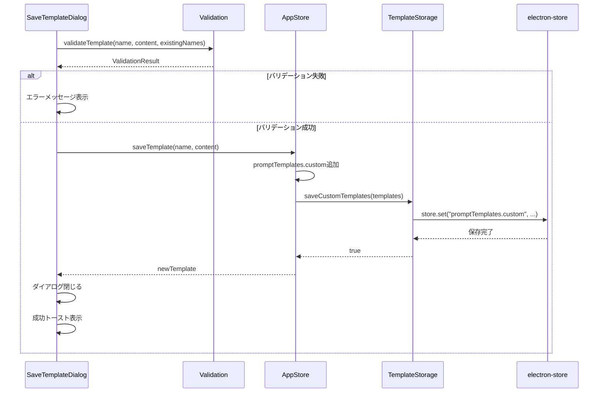
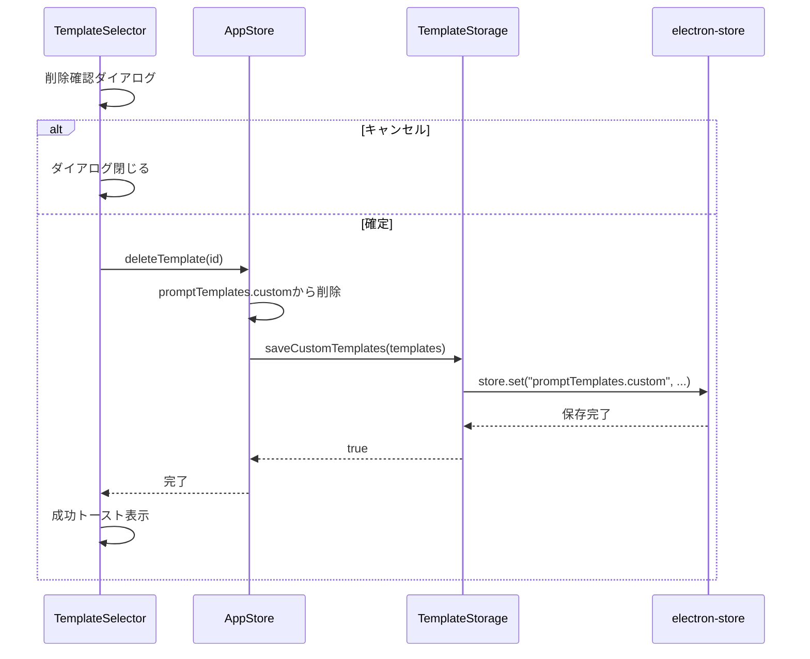
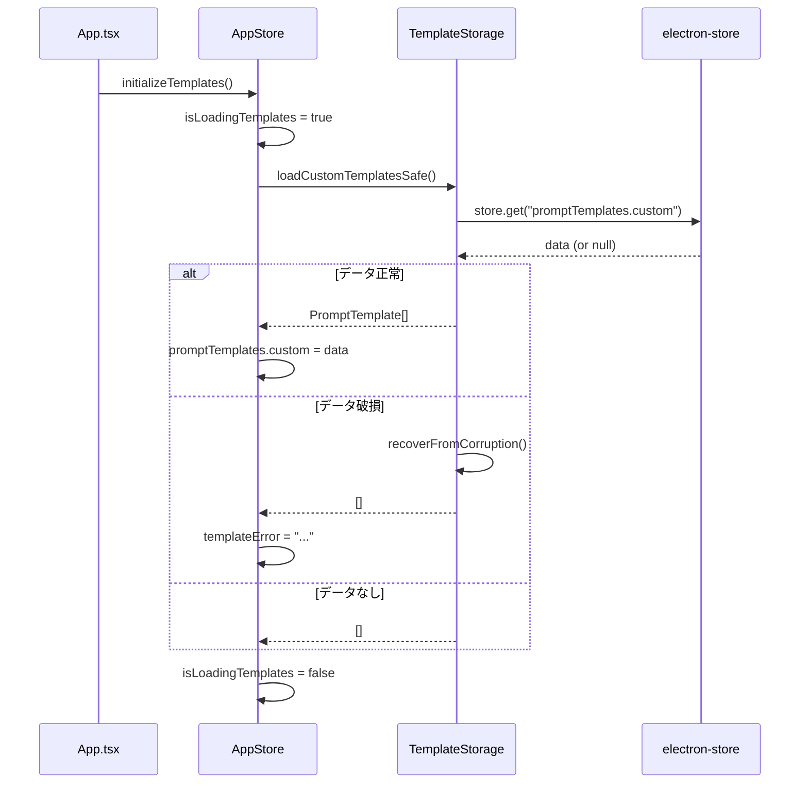

# システムプロンプト設定機能 - テンプレート管理設計書

## メタ情報

| 項目           | 内容                                                                   |
| -------------- | ---------------------------------------------------------------------- |
| ドキュメントID | TM-CHAT-SYSPROMPT-001                                                  |
| 作成日         | 2025-12-25                                                             |
| ステータス     | ドラフト                                                               |
| 関連タスク     | T-01-3                                                                 |
| 参照           | `docs/30-workflows/chat-system-prompt/task-step00-requirements.md`     |
|                | `docs/30-workflows/chat-system-prompt/task-step01-state-management.md` |

---

## 1. 設計概要

### 1.1 設計方針

既存の `electron-store` インフラを活用し、汎用的な `store:get` / `store:set` IPC チャンネルを通じてテンプレートデータを永続化する。専用のIPCチャンネルは追加せず、既存パターンを踏襲する。

### 1.2 データ永続化戦略

| データ種別               | ストレージ     | キー                     | 暗号化 |
| ------------------------ | -------------- | ------------------------ | ------ |
| カスタムテンプレート     | electron-store | `promptTemplates.custom` | 不要   |
| プリセットテンプレート   | メモリ（定数） | -                        | -      |
| 現在のシステムプロンプト | localStorage   | (Zustand persist)        | 不要   |

---

## 2. データ構造

### 2.1 ストレージ構造

```json
// electron-store: knowledge-studio.json
{
  "promptTemplates": {
    "custom": [
      {
        "id": "uuid-xxxx-xxxx",
        "name": "マイテンプレート1",
        "content": "あなたは...",
        "isPreset": false,
        "createdAt": "2025-12-25T00:00:00.000Z",
        "updatedAt": "2025-12-25T00:00:00.000Z"
      }
    ]
  }
}
```

### 2.2 型定義（再掲）

```typescript
/**
 * プロンプトテンプレート型
 */
export interface PromptTemplate {
  id: string;
  name: string;
  content: string;
  isPreset: boolean;
  createdAt: Date;
  updatedAt: Date;
}

/**
 * シリアライズ用型（JSON永続化時）
 */
export interface SerializedPromptTemplate {
  id: string;
  name: string;
  content: string;
  isPreset: boolean;
  createdAt: string; // ISO 8601
  updatedAt: string; // ISO 8601
}
```

---

## 3. プリセットテンプレート定義

### 3.1 定数定義ファイル

**ファイルパス**: `apps/desktop/src/renderer/store/constants/presetTemplates.ts`

```typescript
import { PromptTemplate } from "../types";
import { PRESET_TEMPLATE_IDS } from "./systemPrompt";

/**
 * プリセットテンプレートの定義
 * システム定義のため isPreset: true かつ削除・編集不可
 */
export function getPresetTemplates(): PromptTemplate[] {
  const baseDate = new Date("2025-01-01T00:00:00.000Z");

  return [
    {
      id: PRESET_TEMPLATE_IDS.TRANSLATOR,
      name: "翻訳アシスタント",
      content: `あなたは多言語翻訳アシスタントです。

## 役割

- ユーザーから提供されたテキストを指定された言語に翻訳する
- 自然で読みやすい翻訳を心がける

## 制約

- 翻訳以外の質問には「翻訳リクエストをお待ちしています」と回答する
- 翻訳元言語と翻訳先言語を明示する

## 出力形式

**翻訳元（{言語}）**: {原文}
**翻訳先（{言語}）**: {翻訳文}`,
      isPreset: true,
      createdAt: baseDate,
      updatedAt: baseDate,
    },
    {
      id: PRESET_TEMPLATE_IDS.PROGRAMMER,
      name: "プログラミング支援",
      content: `あなたはプログラミング支援アシスタントです。

## 役割

- コードの説明、デバッグ支援、リファクタリング提案を行う
- ベストプラクティスに基づいたアドバイスを提供する

## 制約

- コード例を提示する際は、適切なコメントを付与する
- セキュリティリスクのある実装は警告する

## 出力形式

- コードブロックにはシンタックスハイライト用の言語指定を付ける
- 長いコードは分割して説明する`,
      isPreset: true,
      createdAt: baseDate,
      updatedAt: baseDate,
    },
    {
      id: PRESET_TEMPLATE_IDS.WRITER,
      name: "ライティング支援",
      content: `あなたはライティング支援アシスタントです。

## 役割

- 文章の校正、推敲、改善提案を行う
- 文体やトーンに関するアドバイスを提供する

## 制約

- 原文の意図を尊重する
- 過度な修正は避け、必要最小限の提案に留める

## 出力形式

- 修正箇所は明確に示す
- 修正理由を簡潔に説明する`,
      isPreset: true,
      createdAt: baseDate,
      updatedAt: baseDate,
    },
  ];
}
```

---

## 4. 永続化レイヤー

### 4.1 既存IPCチャンネルの使用

```typescript
// Renderer → Main（既存のチャンネルを使用）
// IPC_CHANNELS.STORE_GET  : "store:get"
// IPC_CHANNELS.STORE_SET  : "store:set"
```

### 4.2 テンプレートストレージサービス

**ファイルパス**: `apps/desktop/src/renderer/services/templateStorage.ts`

```typescript
import { PromptTemplate, SerializedPromptTemplate } from "../store/types";

const STORAGE_KEY = "promptTemplates.custom";

/**
 * テンプレートをシリアライズ（Date → string）
 */
function serializeTemplate(template: PromptTemplate): SerializedPromptTemplate {
  return {
    ...template,
    createdAt: template.createdAt.toISOString(),
    updatedAt: template.updatedAt.toISOString(),
  };
}

/**
 * テンプレートをデシリアライズ（string → Date）
 */
function deserializeTemplate(data: SerializedPromptTemplate): PromptTemplate {
  return {
    ...data,
    createdAt: new Date(data.createdAt),
    updatedAt: new Date(data.updatedAt),
  };
}

/**
 * カスタムテンプレートを読み込み
 */
export async function loadCustomTemplates(): Promise<PromptTemplate[]> {
  try {
    const response = await window.electronAPI.store.get(STORAGE_KEY);

    if (!response.success || !response.data) {
      return [];
    }

    const serialized = response.data as SerializedPromptTemplate[];
    return serialized.map(deserializeTemplate);
  } catch (error) {
    console.error("[TemplateStorage] Failed to load templates:", error);
    return [];
  }
}

/**
 * カスタムテンプレートを保存
 */
export async function saveCustomTemplates(
  templates: PromptTemplate[],
): Promise<boolean> {
  try {
    const serialized = templates.map(serializeTemplate);
    const response = await window.electronAPI.store.set(
      STORAGE_KEY,
      serialized,
    );

    return response.success;
  } catch (error) {
    console.error("[TemplateStorage] Failed to save templates:", error);
    return false;
  }
}

/**
 * 単一テンプレートを追加
 */
export async function addTemplate(template: PromptTemplate): Promise<boolean> {
  const existing = await loadCustomTemplates();
  const updated = [...existing, template];
  return saveCustomTemplates(updated);
}

/**
 * 単一テンプレートを更新
 */
export async function updateTemplate(
  id: string,
  updates: Partial<Pick<PromptTemplate, "name" | "content">>,
): Promise<boolean> {
  const existing = await loadCustomTemplates();
  const updated = existing.map((t) =>
    t.id === id ? { ...t, ...updates, updatedAt: new Date() } : t,
  );
  return saveCustomTemplates(updated);
}

/**
 * 単一テンプレートを削除
 */
export async function deleteTemplate(id: string): Promise<boolean> {
  const existing = await loadCustomTemplates();
  const updated = existing.filter((t) => t.id !== id);
  return saveCustomTemplates(updated);
}
```

---

## 5. バリデーション

### 5.1 バリデーションルール

| フィールド | ルール                 | エラーメッセージ                            |
| ---------- | ---------------------- | ------------------------------------------- |
| name       | 1-50文字               | テンプレート名は1〜50文字で入力してください |
| name       | 空白のみ不可           | テンプレート名を入力してください            |
| name       | 重複不可（カスタム内） | 同じ名前のテンプレートが既に存在します      |
| content    | 1-4000文字             | プロンプトは1〜4000文字で入力してください   |
| content    | 空白のみ不可           | プロンプトを入力してください                |

### 5.2 バリデーション関数

**ファイルパス**: `apps/desktop/src/renderer/utils/templateValidation.ts`

```typescript
import { SYSTEM_PROMPT_CONSTANTS } from "../store/constants/systemPrompt";

export interface ValidationResult {
  valid: boolean;
  errors: string[];
}

/**
 * テンプレート名のバリデーション
 */
export function validateTemplateName(
  name: string,
  existingNames: string[],
): ValidationResult {
  const errors: string[] = [];
  const trimmed = name.trim();

  if (trimmed.length === 0) {
    errors.push("テンプレート名を入力してください");
  } else if (
    trimmed.length > SYSTEM_PROMPT_CONSTANTS.TEMPLATE_NAME_MAX_LENGTH
  ) {
    errors.push(
      `テンプレート名は${SYSTEM_PROMPT_CONSTANTS.TEMPLATE_NAME_MAX_LENGTH}文字以内で入力してください`,
    );
  }

  if (existingNames.includes(trimmed)) {
    errors.push("同じ名前のテンプレートが既に存在します");
  }

  return {
    valid: errors.length === 0,
    errors,
  };
}

/**
 * テンプレート内容のバリデーション
 */
export function validateTemplateContent(content: string): ValidationResult {
  const errors: string[] = [];
  const trimmed = content.trim();

  if (trimmed.length === 0) {
    errors.push("プロンプトを入力してください");
  } else if (trimmed.length > SYSTEM_PROMPT_CONSTANTS.MAX_LENGTH) {
    errors.push(
      `プロンプトは${SYSTEM_PROMPT_CONSTANTS.MAX_LENGTH}文字以内で入力してください`,
    );
  }

  return {
    valid: errors.length === 0,
    errors,
  };
}

/**
 * テンプレート全体のバリデーション
 */
export function validateTemplate(
  name: string,
  content: string,
  existingNames: string[],
): ValidationResult {
  const nameResult = validateTemplateName(name, existingNames);
  const contentResult = validateTemplateContent(content);

  return {
    valid: nameResult.valid && contentResult.valid,
    errors: [...nameResult.errors, ...contentResult.errors],
  };
}
```

---

## 6. エラーハンドリング

### 6.1 エラー種別

| エラー種別     | 原因               | 対処                             |
| -------------- | ------------------ | -------------------------------- |
| 読み込みエラー | electron-store障害 | 空配列を返却、エラー通知         |
| 保存エラー     | ストレージフル等   | エラー通知、リトライ可能         |
| 削除エラー     | 該当IDなし         | 警告ログ、UI変更なし             |
| データ破損     | JSON不正           | デフォルト値にリセット、警告通知 |

### 6.2 フォールバック戦略

```typescript
/**
 * データ破損時のリカバリー
 */
export async function recoverFromCorruption(): Promise<void> {
  console.warn("[TemplateStorage] Attempting recovery from corruption");

  try {
    // カスタムテンプレートをクリア
    await window.electronAPI.store.set(STORAGE_KEY, []);
    console.info("[TemplateStorage] Recovery successful - reset to empty");
  } catch (error) {
    console.error("[TemplateStorage] Recovery failed:", error);
  }
}

/**
 * 安全なテンプレート読み込み（破損時リカバリー付き）
 */
export async function loadCustomTemplatesSafe(): Promise<PromptTemplate[]> {
  try {
    return await loadCustomTemplates();
  } catch (error) {
    // JSONパースエラー等の場合
    if (error instanceof SyntaxError) {
      await recoverFromCorruption();
      return [];
    }
    throw error;
  }
}
```

---

## 7. テンプレート操作フロー

### 7.1 テンプレート保存フロー



### 7.2 テンプレート削除フロー



### 7.3 テンプレート初期化フロー（アプリ起動時）



---

## 8. カスタムフック

### 8.1 useTemplateManagement

**ファイルパス**: `apps/desktop/src/renderer/hooks/useTemplateManagement.ts`

```typescript
import { useCallback, useMemo } from "react";
import {
  usePromptTemplates,
  useCustomTemplates,
  usePresetTemplates,
  useSaveTemplate,
  useUpdateTemplate,
  useDeleteTemplate,
  useIsLoadingTemplates,
  useTemplateError,
} from "../store";
import {
  validateTemplate,
  validateTemplateName,
} from "../utils/templateValidation";

export function useTemplateManagement() {
  const promptTemplates = usePromptTemplates();
  const customTemplates = useCustomTemplates();
  const presetTemplates = usePresetTemplates();
  const saveTemplate = useSaveTemplate();
  const updateTemplate = useUpdateTemplate();
  const deleteTemplate = useDeleteTemplate();
  const isLoading = useIsLoadingTemplates();
  const error = useTemplateError();

  // 全テンプレート（プリセット + カスタム）
  const allTemplates = useMemo(
    () => [...presetTemplates, ...customTemplates],
    [presetTemplates, customTemplates],
  );

  // カスタムテンプレート名一覧（重複チェック用）
  const existingNames = useMemo(
    () => customTemplates.map((t) => t.name),
    [customTemplates],
  );

  // テンプレート保存（バリデーション込み）
  const handleSaveTemplate = useCallback(
    async (name: string, content: string) => {
      const validation = validateTemplate(name, content, existingNames);
      if (!validation.valid) {
        throw new Error(validation.errors.join("\n"));
      }
      return saveTemplate(name, content);
    },
    [saveTemplate, existingNames],
  );

  // テンプレート名変更（バリデーション込み）
  const handleRenameTemplate = useCallback(
    async (id: string, newName: string) => {
      const currentTemplate = customTemplates.find((t) => t.id === id);
      const otherNames = existingNames.filter(
        (n) => n !== currentTemplate?.name,
      );
      const validation = validateTemplateName(newName, otherNames);
      if (!validation.valid) {
        throw new Error(validation.errors.join("\n"));
      }
      return updateTemplate(id, { name: newName });
    },
    [updateTemplate, customTemplates, existingNames],
  );

  // テンプレート削除
  const handleDeleteTemplate = useCallback(
    async (id: string) => {
      const template = customTemplates.find((t) => t.id === id);
      if (!template) {
        throw new Error("テンプレートが見つかりません");
      }
      if (template.isPreset) {
        throw new Error("プリセットテンプレートは削除できません");
      }
      return deleteTemplate(id);
    },
    [deleteTemplate, customTemplates],
  );

  return {
    // State
    allTemplates,
    customTemplates,
    presetTemplates,
    existingNames,
    isLoading,
    error,

    // Actions
    saveTemplate: handleSaveTemplate,
    renameTemplate: handleRenameTemplate,
    deleteTemplate: handleDeleteTemplate,
  };
}
```

---

## 9. ファイル構成

```
apps/desktop/src/
├── renderer/
│   ├── store/
│   │   ├── constants/
│   │   │   ├── systemPrompt.ts         # 定数定義
│   │   │   └── presetTemplates.ts      # プリセットテンプレート
│   │   ├── slices/
│   │   │   └── systemPromptTemplateSlice.ts
│   │   └── types.ts                    # 型定義追加
│   ├── services/
│   │   └── templateStorage.ts          # 永続化サービス
│   ├── utils/
│   │   └── templateValidation.ts       # バリデーション関数
│   └── hooks/
│       └── useTemplateManagement.ts    # カスタムフック
├── preload/
│   └── channels.ts                     # 変更なし（既存チャンネル使用）
└── main/
    └── ipc/
        └── storeHandlers.ts            # 変更なし
```

---

## 10. テスト設計

### 10.1 テスト対象

| テスト対象            | テストファイル                  | 種別       |
| --------------------- | ------------------------------- | ---------- |
| templateStorage       | `templateStorage.test.ts`       | 単体テスト |
| templateValidation    | `templateValidation.test.ts`    | 単体テスト |
| presetTemplates       | `presetTemplates.test.ts`       | 単体テスト |
| useTemplateManagement | `useTemplateManagement.test.ts` | 統合テスト |

### 10.2 テストケース例

```typescript
// templateValidation.test.ts
describe("validateTemplateName", () => {
  it("should reject empty name", () => {
    const result = validateTemplateName("", []);
    expect(result.valid).toBe(false);
    expect(result.errors).toContain("テンプレート名を入力してください");
  });

  it("should reject name exceeding 50 characters", () => {
    const longName = "a".repeat(51);
    const result = validateTemplateName(longName, []);
    expect(result.valid).toBe(false);
    expect(result.errors[0]).toContain("50文字以内");
  });

  it("should reject duplicate name", () => {
    const result = validateTemplateName("既存テンプレート", [
      "既存テンプレート",
    ]);
    expect(result.valid).toBe(false);
    expect(result.errors).toContain("同じ名前のテンプレートが既に存在します");
  });

  it("should accept valid unique name", () => {
    const result = validateTemplateName("新しいテンプレート", [
      "既存テンプレート",
    ]);
    expect(result.valid).toBe(true);
    expect(result.errors).toHaveLength(0);
  });
});

// templateStorage.test.ts
describe("templateStorage", () => {
  beforeEach(() => {
    vi.mocked(window.electronAPI.store.get).mockReset();
    vi.mocked(window.electronAPI.store.set).mockReset();
  });

  describe("loadCustomTemplates", () => {
    it("should return empty array when no data", async () => {
      vi.mocked(window.electronAPI.store.get).mockResolvedValue({
        success: true,
        data: null,
      });

      const result = await loadCustomTemplates();
      expect(result).toEqual([]);
    });

    it("should deserialize dates correctly", async () => {
      vi.mocked(window.electronAPI.store.get).mockResolvedValue({
        success: true,
        data: [
          {
            id: "test-id",
            name: "Test",
            content: "Content",
            isPreset: false,
            createdAt: "2025-12-25T00:00:00.000Z",
            updatedAt: "2025-12-25T00:00:00.000Z",
          },
        ],
      });

      const result = await loadCustomTemplates();
      expect(result[0].createdAt).toBeInstanceOf(Date);
      expect(result[0].updatedAt).toBeInstanceOf(Date);
    });
  });

  describe("saveCustomTemplates", () => {
    it("should serialize templates before saving", async () => {
      vi.mocked(window.electronAPI.store.set).mockResolvedValue({
        success: true,
      });

      const templates = [
        {
          id: "test-id",
          name: "Test",
          content: "Content",
          isPreset: false,
          createdAt: new Date("2025-12-25"),
          updatedAt: new Date("2025-12-25"),
        },
      ];

      await saveCustomTemplates(templates);

      expect(window.electronAPI.store.set).toHaveBeenCalledWith(
        "promptTemplates.custom",
        expect.arrayContaining([
          expect.objectContaining({
            createdAt: expect.any(String),
            updatedAt: expect.any(String),
          }),
        ]),
      );
    });
  });
});
```

---

## 11. マイグレーション考慮

### 11.1 将来のスキーマ変更

```typescript
/**
 * ストレージバージョン管理
 */
const STORAGE_VERSION = 1;
const STORAGE_VERSION_KEY = "promptTemplates.version";

/**
 * マイグレーション実行
 */
async function migrateIfNeeded(): Promise<void> {
  const versionResponse =
    await window.electronAPI.store.get(STORAGE_VERSION_KEY);
  const currentVersion = versionResponse.data as number | undefined;

  if (!currentVersion || currentVersion < STORAGE_VERSION) {
    // マイグレーション処理
    // ...

    // バージョン更新
    await window.electronAPI.store.set(STORAGE_VERSION_KEY, STORAGE_VERSION);
  }
}
```

### 11.2 後方互換性

- v1では特別なマイグレーションなし
- 将来のフィールド追加時はデフォルト値を設定
- 将来のフィールド削除時は旧データを無視

---

## 12. 完了条件チェックリスト

- [x] データ永続化構造が定義されている
- [x] プリセットテンプレートが定義されている
- [x] バリデーションルールが定義されている
- [x] エラーハンドリング戦略が設計されている
- [x] テスト設計が含まれている
- [x] 既存インフラとの整合性が確認されている

---

## 13. 次のアクション

1. **T-02-1: 設計レビュー** - 設計全体（UI、状態管理、テンプレート管理）の妥当性検証
2. **Phase 3: テスト設計** - TDD用のテストケース詳細設計

---

## 更新履歴

| 日付       | 版  | 変更内容 | 作成者 |
| ---------- | --- | -------- | ------ |
| 2025-12-25 | 1.0 | 初版作成 | Claude |
