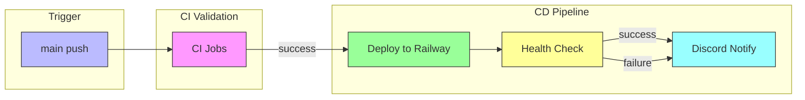

# CDパイプライン設計書

## 1. 概要

### 1.1 目的

mainブランチへのマージ時に自動デプロイを実行するワークフローの設計。
backend（既存）とweb（新規）の両方に対応。

### 1.2 設計原則

- **パスフィルター**: 変更のあったアプリのみデプロイ
- **ヘルスチェック**: デプロイ後の動作確認を自動化
- **失敗通知**: デプロイ失敗時は即座に通知

---

## 2. デプロイフロー図



---

## 3. ワークフロー構成

### 3.1 既存: backend-ci.yml

| 項目       | 設定                                                      |
| ---------- | --------------------------------------------------------- |
| トリガー   | push to main (paths: apps/backend/**, packages/shared/**) |
| 環境       | production                                                |
| デプロイ   | Railway CLI                                               |
| サービス名 | backend                                                   |

### 3.2 新規: web-cd.yml

| 項目       | 設定                                                  |
| ---------- | ----------------------------------------------------- |
| トリガー   | push to main (paths: apps/web/**, packages/shared/**) |
| 環境       | production                                            |
| デプロイ   | Railway CLI                                           |
| サービス名 | web                                                   |

---

## 4. web-cd.yml 詳細設計

### 4.1 トリガー設定

```yaml
on:
  push:
    branches: [main]
    paths:
      - "apps/web/**"
      - "packages/shared/**"
      - ".github/workflows/web-cd.yml"
  workflow_dispatch:
```

### 4.2 同時実行制御

```yaml
concurrency:
  group: web-cd-${{ github.ref }}
  cancel-in-progress: false # デプロイは完了させる
```

### 4.3 ジョブ構成

#### ci ジョブ（検証）

```yaml
jobs:
  ci:
    name: Validate Build
    runs-on: ubuntu-latest
    steps:
      - uses: actions/checkout@v4
      - uses: pnpm/action-setup@v4
      - uses: actions/setup-node@v4
        with:
          node-version: "22"
          cache: "pnpm"
      - run: pnpm install --frozen-lockfile
      - run: pnpm --filter @repo/shared build
      - run: pnpm --filter @repo/web build
      - run: pnpm --filter @repo/web typecheck
      - run: pnpm --filter @repo/web lint
```

#### deploy ジョブ

```yaml
deploy:
  name: Deploy to Railway
  runs-on: ubuntu-latest
  needs: ci
  if: github.ref == 'refs/heads/main' && github.event_name == 'push'
  environment:
    name: production
  steps:
    - uses: actions/checkout@v4

    - name: Install Railway CLI
      run: npm install -g @railway/cli

    - name: Deploy to Railway
      env:
        RAILWAY_TOKEN: ${{ secrets.RAILWAY_TOKEN }}
      run: |
        echo "Deploying to Railway..."
        railway up --service web --detach
        echo "Deployment triggered successfully"

    - name: Wait for deployment
      run: sleep 30

    - name: Health check
      run: |
        WEB_DOMAIN="${{ secrets.RAILWAY_WEB_DOMAIN }}"
        if [ -z "$WEB_DOMAIN" ]; then
          echo "RAILWAY_WEB_DOMAIN is not set. Skipping health check."
          exit 0
        fi

        MAX_RETRIES=10
        RETRY_COUNT=0

        while [ $RETRY_COUNT -lt $MAX_RETRIES ]; do
          echo "Health check attempt $((RETRY_COUNT + 1))/$MAX_RETRIES..."

          if curl -f -s "https://${WEB_DOMAIN}" > /dev/null; then
            echo "Deploy succeeded!"
            exit 0
          fi

          RETRY_COUNT=$((RETRY_COUNT + 1))
          sleep 10
        done

        echo "Health check failed"
        exit 1
```

---

## 5. Railway設定

### 5.1 apps/web/railway.json

```json
{
  "$schema": "https://railway.app/railway.schema.json",
  "build": {
    "builder": "NIXPACKS",
    "buildCommand": "pnpm install --frozen-lockfile && pnpm --filter @repo/shared build && pnpm --filter @repo/web build"
  },
  "deploy": {
    "startCommand": "pnpm --filter @repo/web start",
    "restartPolicyType": "ON_FAILURE",
    "restartPolicyMaxRetries": 3
  }
}
```

### 5.2 環境変数設定（Railway Dashboard）

| 変数名   | 説明       | 設定場所                      |
| -------- | ---------- | ----------------------------- |
| NODE_ENV | production | Railway Variables             |
| PORT     | 3000       | Railway Variables（自動設定） |

---

## 6. ヘルスチェック仕様

### 6.1 backend ヘルスチェック

| 項目           | 値                                     |
| -------------- | -------------------------------------- |
| エンドポイント | `https://${RAILWAY_DOMAIN}/api/health` |
| 期待レスポンス | HTTP 200                               |
| リトライ回数   | 10回                                   |
| リトライ間隔   | 10秒                                   |

### 6.2 web ヘルスチェック

| 項目           | 値                               |
| -------------- | -------------------------------- |
| エンドポイント | `https://${RAILWAY_WEB_DOMAIN}/` |
| 期待レスポンス | HTTP 200                         |
| リトライ回数   | 10回                             |
| リトライ間隔   | 10秒                             |

---

## 7. ロールバック方針

### 7.1 MVP（手動対応）

1. デプロイ失敗時はDiscord通知で検知
2. Railwayダッシュボードから前回デプロイを手動選択
3. または`railway rollback`コマンド実行

### 7.2 将来（自動化検討）

- ヘルスチェック失敗時の自動ロールバック
- カナリアデプロイ

---

## 8. シークレット要件

| Secret名            | 用途                     | 備考         |
| ------------------- | ------------------------ | ------------ |
| RAILWAY_TOKEN       | Railway CLI認証          | 既存         |
| RAILWAY_DOMAIN      | backendヘルスチェックURL | 既存         |
| RAILWAY_WEB_DOMAIN  | webヘルスチェックURL     | **新規追加** |
| DISCORD_WEBHOOK_URL | 通知送信                 | 新規追加     |

---

## 9. 完了条件

- [x] デプロイトリガー条件が定義されている
- [x] ヘルスチェック仕様が設計されている
- [x] ロールバック方針が明確化されている
