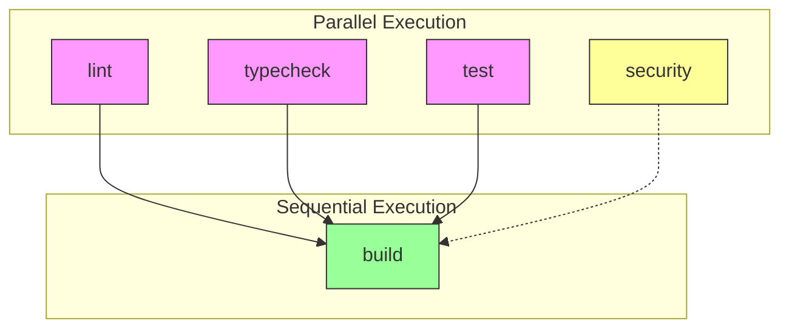

# CI品質ゲート設計書

## 1. 概要

### 1.1 目的

PRマージ前に品質を担保するためのCIパイプライン設計。
`continue-on-error`を適切に管理し、必須チェックと推奨チェックを明確に分離する。

### 1.2 設計原則

- **Fail Fast**: 早期に失敗を検出し、フィードバックループを短縮
- **並列実行**: 独立したジョブは並列で実行し、CI時間を短縮
- **キャッシュ活用**: pnpm依存関係をキャッシュし、インストール時間を削減

---

## 2. ジョブ構成図



**凡例**:

- ピンク: 必須チェック（失敗時マージ不可）
- 緑: 依存ジョブ（前段成功後に実行）
- 黄: 推奨チェック（失敗時も続行）

---

## 3. ジョブ詳細設計

### 3.1 lint ジョブ

| 項目              | 設定値        |
| ----------------- | ------------- |
| runs-on           | ubuntu-latest |
| continue-on-error | **false**     |
| timeout-minutes   | 10            |

```yaml
steps:
  - uses: actions/checkout@v4
  - uses: pnpm/action-setup@v4
  - uses: actions/setup-node@v4
    with:
      node-version: "22"
      cache: "pnpm"
  - run: pnpm install --frozen-lockfile
  - run: pnpm lint
```

### 3.2 typecheck ジョブ

| 項目              | 設定値        |
| ----------------- | ------------- |
| runs-on           | ubuntu-latest |
| continue-on-error | **false**     |
| timeout-minutes   | 10            |

```yaml
steps:
  - uses: actions/checkout@v4
  - uses: pnpm/action-setup@v4
  - uses: actions/setup-node@v4
    with:
      node-version: "22"
      cache: "pnpm"
  - run: pnpm install --frozen-lockfile
  - run: pnpm --filter @repo/shared build
  - run: pnpm typecheck
```

### 3.3 test ジョブ

| 項目              | 設定値        |
| ----------------- | ------------- |
| runs-on           | ubuntu-latest |
| continue-on-error | **false**     |
| timeout-minutes   | 15            |

```yaml
steps:
  - uses: actions/checkout@v4
  - uses: pnpm/action-setup@v4
  - uses: actions/setup-node@v4
    with:
      node-version: "22"
      cache: "pnpm"
  - run: pnpm install --frozen-lockfile
  - run: pnpm --filter @repo/shared build
  - run: pnpm --filter @repo/shared test:run
  - run: pnpm --filter @repo/desktop test:run
```

### 3.4 security ジョブ

| 項目              | 設定値        |
| ----------------- | ------------- |
| runs-on           | ubuntu-latest |
| continue-on-error | **true**      |
| timeout-minutes   | 5             |

```yaml
steps:
  - uses: actions/checkout@v4
  - uses: pnpm/action-setup@v4
  - uses: actions/setup-node@v4
    with:
      node-version: "22"
      cache: "pnpm"
  - run: pnpm install --frozen-lockfile
  - run: pnpm audit --audit-level=high
```

### 3.5 build ジョブ

| 項目              | 設定値                  |
| ----------------- | ----------------------- |
| runs-on           | ubuntu-latest           |
| needs             | [lint, typecheck, test] |
| continue-on-error | **false**               |
| timeout-minutes   | 15                      |

```yaml
steps:
  - uses: actions/checkout@v4
  - uses: pnpm/action-setup@v4
  - uses: actions/setup-node@v4
    with:
      node-version: "22"
      cache: "pnpm"
  - run: pnpm install --frozen-lockfile
  - run: pnpm --filter @repo/shared build
  - run: pnpm --filter @repo/desktop build
  - name: Verify build artifacts
    run: |
      test -d packages/shared/dist || exit 1
      echo "Shared package built successfully"
      test -d apps/desktop/out || exit 1
      echo "Desktop app built successfully"
```

---

## 4. 同時実行制御

```yaml
concurrency:
  group: ${{ github.workflow }}-${{ github.ref }}
  cancel-in-progress: true
```

**効果**:

- 同一ブランチで新しいプッシュがあった場合、古いワークフローをキャンセル
- リソース節約とフィードバック高速化

---

## 5. ブランチ保護ルール設定

### 5.1 GitHub設定（Settings > Branches > Branch protection rules）

| 設定項目                          | 値                           |
| --------------------------------- | ---------------------------- |
| Branch name pattern               | `main`                       |
| Require status checks             | Enabled                      |
| Required checks                   | lint, typecheck, test, build |
| Require branches to be up to date | Enabled                      |
| Require linear history            | Optional                     |

### 5.2 必須ステータスチェック

```
required_status_checks:
  strict: true
  contexts:
    - lint
    - typecheck
    - test
    - build
```

---

## 6. キャッシュ戦略

### 6.1 pnpmキャッシュ

```yaml
- uses: actions/setup-node@v4
  with:
    node-version: "22"
    cache: "pnpm"
```

**キャッシュキー**: `pnpm-store-${{ runner.os }}-${{ hashFiles('**/pnpm-lock.yaml') }}`

### 6.2 キャッシュヒット率向上

- `pnpm-lock.yaml`の変更時のみキャッシュ無効化
- OSごとに個別キャッシュ（ubuntu-latestで統一により不要）

---

## 7. 変更点サマリー（現行 → 新設計）

| ジョブ        | 現行                    | 新設計            | 変更内容       |
| ------------- | ----------------------- | ----------------- | -------------- |
| lint          | continue-on-error未設定 | **false（明示）** | 必須化         |
| typecheck     | なし                    | **false（明示）** | 必須化         |
| test          | なし                    | **false（明示）** | 必須化         |
| security      | continue-on-error: true | **true（維持）**  | 変更なし       |
| test:coverage | continue-on-error: true | **削除**          | 別ジョブ化検討 |
| build         | なし                    | **false（明示）** | 必須化         |

---

## 8. 完了条件

- [x] 必須品質チェック（lint, typecheck, test）が定義されている
- [x] ジョブ依存関係が設計されている
- [x] ブランチ保護ルールの要件が明確化されている
