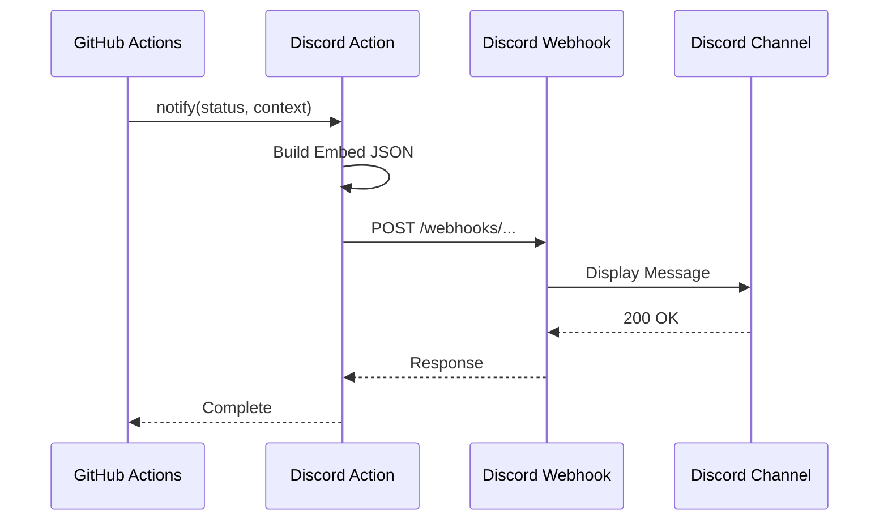

# 通知システム設計書

## 1. 概要

### 1.1 目的

デプロイ成功/失敗時にDiscord Webhookで即座に通知を送信する。
チームがデプロイ状況をリアルタイムで把握できるようにする。

### 1.2 設計原則

- **Embed形式**: 視認性の高いリッチメッセージ
- **再利用可能**: Composite Actionとして共通化
- **冪等性**: 複数回呼び出しても安全

---

## 2. 通知フロー図



---

## 3. Discord Embed形式設計

### 3.1 成功通知

```json
{
  "embeds": [
    {
      "title": "Deploy Succeeded",
      "description": "Deployment completed successfully.",
      "color": 3066993,
      "fields": [
        {
          "name": "Service",
          "value": "web",
          "inline": true
        },
        {
          "name": "Branch",
          "value": "main",
          "inline": true
        },
        {
          "name": "Commit",
          "value": "[abc1234](https://github.com/owner/repo/commit/abc1234)",
          "inline": true
        },
        {
          "name": "Author",
          "value": "@username",
          "inline": true
        },
        {
          "name": "Workflow",
          "value": "[View Run](https://github.com/owner/repo/actions/runs/123)",
          "inline": false
        }
      ],
      "timestamp": "2025-12-07T10:00:00.000Z",
      "footer": {
        "text": "AI Workflow Orchestrator"
      }
    }
  ]
}
```

### 3.2 失敗通知

```json
{
  "embeds": [
    {
      "title": "Deploy Failed",
      "description": "Deployment encountered an error.",
      "color": 15158332,
      "fields": [
        {
          "name": "Service",
          "value": "web",
          "inline": true
        },
        {
          "name": "Branch",
          "value": "main",
          "inline": true
        },
        {
          "name": "Commit",
          "value": "[abc1234](https://github.com/owner/repo/commit/abc1234)",
          "inline": true
        },
        {
          "name": "Error",
          "value": "Health check failed after 10 retries",
          "inline": false
        },
        {
          "name": "Workflow",
          "value": "[View Run](https://github.com/owner/repo/actions/runs/123)",
          "inline": false
        }
      ],
      "timestamp": "2025-12-07T10:00:00.000Z",
      "footer": {
        "text": "AI Workflow Orchestrator"
      }
    }
  ]
}
```

### 3.3 カラーコード

| 状態 | カラーコード | 16進数       |
| ---- | ------------ | ------------ |
| 成功 | 3066993      | #2ECC71 (緑) |
| 失敗 | 15158332     | #E74C3C (赤) |
| 警告 | 16776960     | #FFFF00 (黄) |

---

## 4. Composite Action設計

### 4.1 ファイル構成

```
.github/
└── actions/
    └── discord-notify/
        └── action.yml
```

### 4.2 action.yml

```yaml
name: "Discord Deploy Notification"
description: "Send deployment status to Discord webhook"
inputs:
  webhook_url:
    description: "Discord Webhook URL"
    required: true
  status:
    description: "Deployment status (success/failure)"
    required: true
  service:
    description: "Service name (backend/web)"
    required: true
  error_message:
    description: "Error message (only for failure)"
    required: false
    default: ""

runs:
  using: "composite"
  steps:
    - name: Send Discord Notification
      shell: bash
      env:
        WEBHOOK_URL: ${{ inputs.webhook_url }}
        STATUS: ${{ inputs.status }}
        SERVICE: ${{ inputs.service }}
        ERROR_MESSAGE: ${{ inputs.error_message }}
      run: |
        if [ "$STATUS" = "success" ]; then
          COLOR=3066993
          TITLE="Deploy Succeeded"
          DESC="Deployment completed successfully."
        else
          COLOR=15158332
          TITLE="Deploy Failed"
          DESC="Deployment encountered an error."
        fi

        COMMIT_URL="https://github.com/${{ github.repository }}/commit/${{ github.sha }}"
        RUN_URL="https://github.com/${{ github.repository }}/actions/runs/${{ github.run_id }}"

        FIELDS='[
          {"name": "Service", "value": "'"$SERVICE"'", "inline": true},
          {"name": "Branch", "value": "'"${{ github.ref_name }}"'", "inline": true},
          {"name": "Commit", "value": "['"${GITHUB_SHA:0:7}"']('"$COMMIT_URL"')", "inline": true},
          {"name": "Author", "value": "@'"${{ github.actor }}"'", "inline": true},
          {"name": "Workflow", "value": "[View Run]('"$RUN_URL"')", "inline": false}
        ]'

        if [ -n "$ERROR_MESSAGE" ]; then
          FIELDS=$(echo "$FIELDS" | jq '. += [{"name": "Error", "value": "'"$ERROR_MESSAGE"'", "inline": false}]')
        fi

        PAYLOAD=$(jq -n \
          --arg title "$TITLE" \
          --arg desc "$DESC" \
          --argjson color "$COLOR" \
          --argjson fields "$FIELDS" \
          '{
            "embeds": [{
              "title": $title,
              "description": $desc,
              "color": $color,
              "fields": $fields,
              "timestamp": (now | todate),
              "footer": {"text": "AI Workflow Orchestrator"}
            }]
          }')

        curl -H "Content-Type: application/json" \
             -d "$PAYLOAD" \
             "$WEBHOOK_URL"
```

---

## 5. ワークフローでの使用例

### 5.1 成功時の呼び出し

```yaml
- name: Notify Success
  if: success()
  uses: ./.github/actions/discord-notify
  with:
    webhook_url: ${{ secrets.DISCORD_WEBHOOK_URL }}
    status: success
    service: web
```

### 5.2 失敗時の呼び出し

```yaml
- name: Notify Failure
  if: failure()
  uses: ./.github/actions/discord-notify
  with:
    webhook_url: ${{ secrets.DISCORD_WEBHOOK_URL }}
    status: failure
    service: web
    error_message: "Health check failed after 10 retries"
```

### 5.3 常に実行（always）

```yaml
- name: Notify Result
  if: always()
  uses: ./.github/actions/discord-notify
  with:
    webhook_url: ${{ secrets.DISCORD_WEBHOOK_URL }}
    status: ${{ job.status }}
    service: web
```

---

## 6. シークレット管理

### 6.1 設定場所

GitHub Repository Settings > Secrets and variables > Actions

### 6.2 シークレット一覧

| Secret名            | 形式                                   | 備考            |
| ------------------- | -------------------------------------- | --------------- |
| DISCORD_WEBHOOK_URL | `https://discord.com/api/webhooks/...` | Webhook URL全体 |

### 6.3 セキュリティ考慮

- Webhook URLはログに出力されない（自動マスク）
- Repository Secretsのみ使用（Environment Secretsは不要）
- Webhook URLはReadOnlyで書き込み権限なし

---

## 7. Discord Webhook設定手順

### 7.1 Webhook作成

1. Discordサーバー設定 > 連携サービス > ウェブフック
2. 「新しいウェブフック」をクリック
3. 名前を設定（例: "GitHub Deploy"）
4. 通知先チャンネルを選択
5. 「ウェブフックURLをコピー」

### 7.2 GitHub設定

1. リポジトリ Settings > Secrets and variables > Actions
2. 「New repository secret」をクリック
3. Name: `DISCORD_WEBHOOK_URL`
4. Value: コピーしたWebhook URL
5. 「Add secret」をクリック

---

## 8. エラーハンドリング

### 8.1 Webhook呼び出し失敗時

- curlの終了コードを無視（通知失敗でデプロイを失敗させない）
- ワークフローログにエラーを記録

```yaml
- name: Notify (best effort)
  continue-on-error: true
  uses: ./.github/actions/discord-notify
  ...
```

### 8.2 レート制限対応

- Discord Webhookのレート制限: 30リクエスト/分
- 通常のデプロイでは問題なし
- 複数サービスの同時デプロイ時は注意

---

## 9. 完了条件

- [x] Discord Embed形式のメッセージ構造が定義されている
- [x] 通知トリガー条件（成功/失敗）が設計されている
- [x] シークレット管理方針が明確化されている
