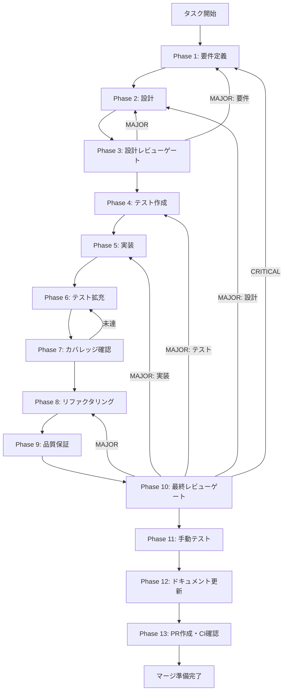

# claude-cli-renderer-api - タスク実行仕様書

## ユーザーからの元の指示

```
Claude CLI Renderer API実装（contextBridge API公開がpreloadで未実装）
```

## メタ情報

| 項目         | 内容                              |
| ------------ | --------------------------------- |
| タスクID     | TASK-20260117-CLI-RENDERER-API    |
| タスク名     | Claude CLI Renderer API実装       |
| 分類         | 機能実装                          |
| 対象機能     | Claude Code CLI統合 - Preload API |
| 優先度       | 高                                |
| 見積もり規模 | 中規模                            |
| ステータス   | 未実施                            |
| 作成日       | 2026-01-17                        |

---

## タスク概要

### 目的

Renderer ProcessからClaude CLI APIを安全に呼び出すためのPreload API（`window.claudeCliAPI`）を実装し、UIコンポーネントからClaude CLI機能を利用可能にする。

### 背景

- Claude Code CLI統合のAPI層（Main Process）は完成している
- しかし、Renderer ProcessからIPCを呼び出すためのPreload APIが存在しないという指摘があった
- UIコンポーネントからClaude CLI機能を利用できない状態を解消する必要がある

> **重要な発見**: 調査の結果、`apps/desktop/src/preload/index.ts`に`claudeCliAPI`として既に実装されていることを確認。本タスクは既存実装の検証・テスト追加・品質保証に重点を置く。

### 最終ゴール

- `window.claudeCliAPI`としてRenderer Processに公開された状態
- 型安全なAPI呼び出しの保証
- ストリーミングイベントの購読機能の動作確認
- 十分なテストカバレッジの確保

### 成果物一覧

| 種別         | 成果物              | 配置先                                     |
| ------------ | ------------------- | ------------------------------------------ |
| 実装（確認） | claudeCliAPI定義    | `apps/desktop/src/preload/index.ts`        |
| 型定義       | ClaudeCliAPI型      | `apps/desktop/src/preload/types.ts`        |
| テスト       | Preload APIテスト   | `apps/desktop/src/preload/__tests__/`      |
| ドキュメント | 実装ガイド          | `outputs/phase-12/implementation-guide.md` |
| PR           | GitHub Pull Request | GitHub UI                                  |

---

## 参照ファイル

本仕様書のコマンド選定は以下を参照：

- `docs/00-requirements/master_system_design.md` - システム要件
- `.claude/skills/aiworkflow-requirements/references/` - システム仕様
- `.claude/skills/aiworkflow-requirements/references/architecture-patterns.md` - Claude Code CLI連携パターン

---

## タスク分解サマリー

| ID     | フェーズ | サブタスク名               | 責務                       | 依存 |
| ------ | -------- | -------------------------- | -------------------------- | ---- |
| T-01-1 | Phase 1  | 要件定義・既存実装確認     | 要件整理・実装状況の確認   | -    |
| T-02-1 | Phase 2  | 設計レビュー・型定義確認   | 型安全性・API設計の確認    | T-01 |
| T-03-1 | Phase 3  | 設計レビューゲート         | 実装状況の妥当性検証       | T-02 |
| T-04-1 | Phase 4  | テスト作成（Red）          | 失敗するテスト作成         | T-03 |
| T-05-1 | Phase 5  | 実装確認・必要に応じた修正 | 既存実装の動作確認         | T-04 |
| T-06-1 | Phase 6  | テスト拡充                 | カバレッジ向上             | T-05 |
| T-07-1 | Phase 7  | テストカバレッジ確認       | カバレッジ目標検証         | T-06 |
| T-08-1 | Phase 8  | リファクタリング           | コード品質改善             | T-07 |
| T-09-1 | Phase 9  | 品質保証                   | 静的解析・セキュリティ確認 | T-08 |
| T-10-1 | Phase 10 | 最終レビューゲート         | 全体品質検証               | T-09 |
| T-11-1 | Phase 11 | 手動テスト検証             | UX・実環境動作確認         | T-10 |
| T-12-1 | Phase 12 | ドキュメント更新           | 実装ガイド作成             | T-11 |
| T-13-1 | Phase 13 | PR作成                     | コミット・PR・CI確認       | T-12 |

**総サブタスク数**: 13個

---

## 実行フロー図



---

## Phase一覧

| Phase | 名称               | 仕様書                                                 | ステータス |
| ----- | ------------------ | ------------------------------------------------------ | ---------- |
| 1     | 要件定義           | [phase-1-requirements.md](phase-1-requirements.md)     | 未実施     |
| 2     | 設計               | [phase-2-design.md](phase-2-design.md)                 | 未実施     |
| 3     | 設計レビューゲート | [phase-3-design-review.md](phase-3-design-review.md)   | 未実施     |
| 4     | テスト作成         | [phase-4-test-creation.md](phase-4-test-creation.md)   | 未実施     |
| 5     | 実装               | [phase-5-implementation.md](phase-5-implementation.md) | 未実施     |
| 6     | テスト拡充         | [phase-6-test-expansion.md](phase-6-test-expansion.md) | 未実施     |
| 7     | カバレッジ確認     | [phase-7-coverage-check.md](phase-7-coverage-check.md) | 未実施     |
| 8     | リファクタリング   | [phase-8-refactoring.md](phase-8-refactoring.md)       | 未実施     |
| 9     | 品質保証           | [phase-9-quality.md](phase-9-quality.md)               | 未実施     |
| 10    | 最終レビューゲート | [phase-10-final-review.md](phase-10-final-review.md)   | 未実施     |
| 11    | 手動テスト         | [phase-11-manual-test.md](phase-11-manual-test.md)     | 未実施     |
| 12    | ドキュメント更新   | [phase-12-documentation.md](phase-12-documentation.md) | 未実施     |
| 13    | PR作成             | [phase-13-pr-creation.md](phase-13-pr-creation.md)     | 未実施     |

---

## テストカバレッジ目標

### ユニットテスト

| 指標              | 最低基準 | 推奨基準 |
| ----------------- | -------- | -------- |
| Line Coverage     | 80%      | 90%      |
| Branch Coverage   | 60%      | 70%      |
| Function Coverage | 80%      | 90%      |

### 結合テスト

| 指標                         | 目標 |
| ---------------------------- | ---- |
| APIエンドポイント（IPC）     | 100% |
| モジュール間インターフェース | 100% |
| 正常系シナリオ               | 100% |
| 異常系シナリオ               | 80%+ |
| 外部連携ポイント             | 100% |

---

## 統合テスト連携（Phase 1〜11で必須）

各Phaseで以下の統合テスト連携アクションを実施すること:

| Phase | 統合テスト連携アクション                               |
| ----- | ------------------------------------------------------ |
| 1     | IPC接続要件（Main→Renderer）を要件に明記               |
| 2     | Preload API設計・contextBridge公開パターンを設計に反映 |
| 3     | Preload API設計のレビューゲートを実施                  |
| 4     | Preload APIの各メソッドに対するテストシナリオを作成    |
| 5     | 既存実装の動作確認・必要に応じた修正                   |
| 6     | ストリーミングイベント・エラーハンドリングのテスト拡充 |
| 7     | 統合テストの再実行とカバレッジゲート判定               |
| 8     | リファクタ後のPreload API・IPC連携テスト継続成功を確認 |
| 9     | 品質保証でPreload APIテスト結果を確認                  |
| 10    | 最終レビューで統合テスト結果を確認                     |
| 11    | 手動でUI→Preload→Main→Preload→UIの往復動作を確認       |

---

## Phase完了時の必須アクション

**各Phase完了時に以下を必ず実行すること:**

1. **タスク100%実行**: Phase内で指定された全タスクを完全に実行
2. **成果物確認**: 全ての必須成果物が生成されていることを検証
3. **実行記録**: 実行タスクの結果を記録
4. **artifacts.json更新**: Phase完了ステータスを更新
5. **Phase末端の実行確認**: 各タスクを100%実行し、各タスクを完遂した旨を必ず明記

```bash
# Phase完了時の検証コマンド
node .claude/skills/task-specification-creator/scripts/validate-phase-output.js docs/30-workflows/claude-cli-renderer-api --phase {{PHASE_NUMBER}}

# Phase完了・成果物登録
node .claude/skills/task-specification-creator/scripts/complete-phase.js \
  --workflow docs/30-workflows/claude-cli-renderer-api --phase {{PHASE_NUMBER}} --artifacts "..."
```

---

## 使用方法

1. Phase 1から順番に実行
2. 各Phaseの仕様書に従ってタスクを完了
3. 完了条件を全て満たしてから次のPhaseへ
4. レビューゲート（Phase 3, 10）では判定基準に従い、問題があれば適切なPhaseに戻る

---

## 変更履歴

| バージョン | 日付       | 変更内容                                         |
| ---------- | ---------- | ------------------------------------------------ |
| 1.0.0      | 2026-01-17 | 初版作成（既存実装確認・テスト追加に重点を置く） |
