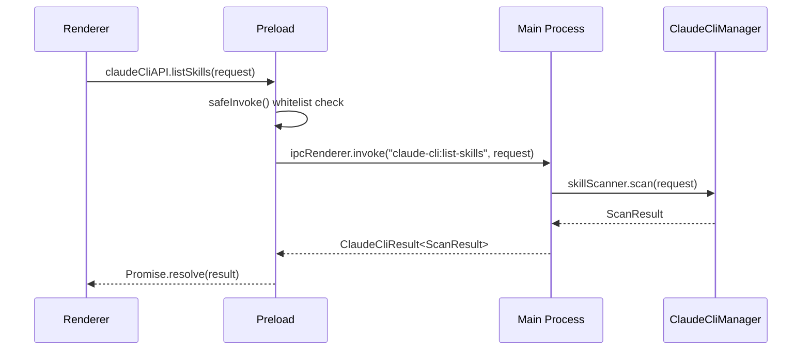
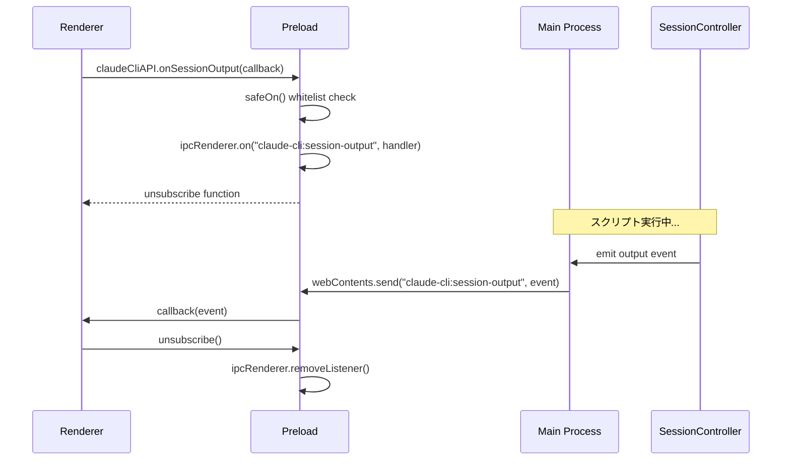

# Claude CLI IPC通信設計書

## メタ情報

| 項目       | 内容       |
| ---------- | ---------- |
| バージョン | 1.0.0      |
| 作成日     | 2026-01-17 |
| Phase      | 2          |
| ステータス | 完了       |

---

## 1. IPC通信概要

### 1.1 アーキテクチャ

```
┌─────────────────────────────────────────────────────────────┐
│                     Renderer Process                        │
│  ┌─────────────────────────────────────────────────────┐   │
│  │               window.claudeCliAPI                    │   │
│  │  ┌─────────────┐  ┌─────────────┐  ┌─────────────┐  │   │
│  │  │checkInstall │  │ listSkills  │  │ executeScript│  │   │
│  │  │ ation()     │  │    ()       │  │     ()      │  │   │
│  │  └──────┬──────┘  └──────┬──────┘  └──────┬──────┘  │   │
│  └─────────┼────────────────┼────────────────┼─────────┘   │
│            │                │                │             │
│            ▼                ▼                ▼             │
│  ┌─────────────────────────────────────────────────────┐   │
│  │                   safeInvoke()                       │   │
│  │              (Channel Whitelist Check)               │   │
│  └──────────────────────────┬──────────────────────────┘   │
└─────────────────────────────┼──────────────────────────────┘
                              │ ipcRenderer.invoke()
                              ▼
┌─────────────────────────────────────────────────────────────┐
│                     Preload Script                          │
│                  (contextBridge boundary)                   │
└─────────────────────────────┬──────────────────────────────┘
                              │
                              ▼
┌─────────────────────────────────────────────────────────────┐
│                      Main Process                           │
│  ┌─────────────────────────────────────────────────────┐   │
│  │              ipcMain.handle() handlers               │   │
│  └──────────────────────────┬──────────────────────────┘   │
│                             │                               │
│  ┌──────────────────────────▼──────────────────────────┐   │
│  │               ClaudeCliManager                       │   │
│  │  ┌──────────┐  ┌──────────┐  ┌──────────────────┐   │   │
│  │  │ Installer│  │  Skills  │  │SessionController │   │   │
│  │  │ Checker  │  │ Scanner  │  │                  │   │   │
│  │  └──────────┘  └──────────┘  └──────────────────┘   │   │
│  └─────────────────────────────────────────────────────┘   │
└─────────────────────────────────────────────────────────────┘
```

---

## 2. IPCチャンネル定義

### 2.1 Invokeチャンネル（リクエスト/レスポンス）

| チャンネル名                    | メソッド            | 説明               |
| ------------------------------- | ------------------- | ------------------ |
| `claude-cli:check-installation` | `checkInstallation` | CLI存在確認        |
| `claude-cli:list-skills`        | `listSkills`        | スキル一覧取得     |
| `claude-cli:get-skill-detail`   | `getSkillDetail`    | スキル詳細取得     |
| `claude-cli:execute-script`     | `executeScript`     | スクリプト実行     |
| `claude-cli:terminate-session`  | `terminateSession`  | セッション終了     |
| `claude-cli:list-sessions`      | `listSessions`      | セッション一覧取得 |
| `claude-cli:get-session`        | `getSession`        | セッション詳細取得 |

### 2.2 Onチャンネル（イベント購読）

| チャンネル名                | メソッド          | 説明               |
| --------------------------- | ----------------- | ------------------ |
| `claude-cli:session-output` | `onSessionOutput` | 出力ストリーミング |
| `claude-cli:session-status` | `onSessionStatus` | 状態変更通知       |

---

## 3. チャンネル許可リスト

### 3.1 ALLOWED_INVOKE_CHANNELS

```typescript
// apps/desktop/src/preload/channels.ts (351-358行)
IPC_CHANNELS.CLAUDE_CLI_CHECK_INSTALLATION,
IPC_CHANNELS.CLAUDE_CLI_LIST_SKILLS,
IPC_CHANNELS.CLAUDE_CLI_GET_SKILL_DETAIL,
IPC_CHANNELS.CLAUDE_CLI_EXECUTE_SCRIPT,
IPC_CHANNELS.CLAUDE_CLI_TERMINATE_SESSION,
IPC_CHANNELS.CLAUDE_CLI_LIST_SESSIONS,
IPC_CHANNELS.CLAUDE_CLI_GET_SESSION,
```

### 3.2 ALLOWED_ON_CHANNELS

```typescript
// apps/desktop/src/preload/channels.ts (391-393行)
IPC_CHANNELS.CLAUDE_CLI_SESSION_OUTPUT,
IPC_CHANNELS.CLAUDE_CLI_SESSION_STATUS,
```

---

## 4. 通信フロー

### 4.1 Invoke パターン（リクエスト/レスポンス）



### 4.2 On パターン（イベント購読）



---

## 5. エラーハンドリング

### 5.1 チャンネル検証エラー

許可されていないチャンネルへのアクセスは拒否される:

```typescript
function safeInvoke<T>(channel: string, ...args: unknown[]): Promise<T> {
  if (!ALLOWED_INVOKE_CHANNELS.includes(channel)) {
    return Promise.reject(new Error(`Channel ${channel} is not allowed`));
  }
  return ipcRenderer.invoke(channel, ...args);
}
```

### 5.2 Main Process エラー

Main Processでのエラーは`ClaudeCliResult`の`ok: false`として返される:

```typescript
{
  ok: false,
  error: {
    code: "CLI_NOT_FOUND",
    message: "Claude CLI is not installed"
  }
}
```

---

## 6. 変更履歴

| バージョン | 日付       | 変更内容 |
| ---------- | ---------- | -------- |
| 1.0.0      | 2026-01-17 | 初版作成 |
