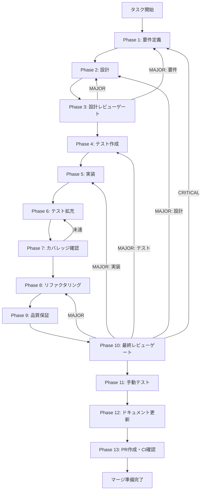

# claude-code-cli-integration - タスク実行仕様書

## ユーザーからの元の指示

```
Claude Code CLI統合による.claude/skillsスキル実行機能を実装する。
Electronデスクトップアプリから、ローカルのClaude Code CLIを呼び出し、
.claude/skills/配下の特定のスキルを実行し、その結果を取得できる統合基盤を構築する。
```

## メタ情報

| 項目         | 内容                                      |
| ------------ | ----------------------------------------- |
| タスクID     | task-20260116-claude-code-cli-integration |
| タスク名     | claude-code-cli-integration               |
| 分類         | 要件（新機能）                            |
| 対象機能     | Claude Code CLI統合基盤                   |
| 優先度       | 中                                        |
| 見積もり規模 | 大規模                                    |
| ステータス   | 未実施                                    |
| 作成日       | 2026-01-16                                |

---

## タスク概要

### 目的

Electronデスクトップアプリから、ローカルにインストールされたClaude Code CLIを呼び出し、`.claude/skills/`配下の特定のスキルを実行し、その結果を取得できる統合基盤を構築する。

現在のAgent SDK統合（`@anthropic-ai/claude-agent-sdk`）ではClaude Code CLI固有の機能（`.claude/skills/`の実行、hooks、commands）に対応していないため、本機能により既存のスキル資産（200個以上）を活用可能にする。

### 背景

- Agent SDK統合（PR #199）完了後、ユーザーからローカルClaude Code CLIを使用したスキル実行の要望があった
- 既存の`.claude/skills/`配下には200個以上の高度なスキル（task-specification-creator、presentation-slide-generator等）が存在
- これらのスキルはClaude Code CLI環境で動作するように設計されており、Agent SDK経由では実行できない
- 二重実装（SDK版とCLI版）を避けるため、CLIプロセス統合が必要

### 最終ゴール

1. **CLIプロセス管理**: Claude Code CLIプロセスを起動・停止・監視できる
2. **スキル実行**: `.claude/skills/`配下の任意のスキルを指定して実行できる
3. **スキル選択・フィルタリング**: 200個以上のスキルから特定のスキルのみを選択して実行できる
4. **出力キャプチャ**: CLIの標準出力/エラー出力をリアルタイムで受信できる
5. **IPC統合**: Rendererプロセスから透過的にCLIスキルを呼び出せる
6. **セッション管理**: 複数のCLIセッションを並列管理できる

### 成果物一覧

| 種別         | 成果物                  | 配置先                                     |
| ------------ | ----------------------- | ------------------------------------------ |
| 共有型定義   | CLI統合モジュール       | `packages/shared/src/claude-cli/`          |
| Main Process | Electron CLI管理        | `apps/desktop/src/main/claude-cli/`        |
| Preload API  | IPC通信用スクリプト     | `apps/desktop/src/preload/claudeCliApi.ts` |
| テスト       | ユニット/統合/E2Eテスト | `packages/*/src/**/*.test.ts`              |
| ドキュメント | APIリファレンス、使用例 | `outputs/phase-*/`                         |
| PR           | GitHub Pull Request     | GitHub UI                                  |

---

## 参照ファイル

本仕様書の作成は以下を参照：

### 元タスク指示書

- `docs/30-workflows/unassigned-task/requirements-claude-code-cli-integration.md` - 元の要件タスク指示書

### システム仕様（aiworkflow-requirements）

> 実装前に必ず以下のシステム仕様を確認し、既存設計との整合性を確保してください。

| 参照資料                  | パス                                                                         | 内容                           |
| ------------------------- | ---------------------------------------------------------------------------- | ------------------------------ |
| Agent SDKインターフェース | `.claude/skills/aiworkflow-requirements/references/interfaces-agent-sdk.md`  | 既存Agent API設計（参考）      |
| APIエンドポイント         | `.claude/skills/aiworkflow-requirements/references/api-endpoints.md`         | IPC API設計パターン            |
| Electronセキュリティ      | `.claude/skills/aiworkflow-requirements/references/security-api-electron.md` | IPC通信セキュリティ要件        |
| アーキテクチャパターン    | `.claude/skills/aiworkflow-requirements/references/architecture-patterns.md` | Zustand Slice/サービスパターン |
| Claude Code仕様           | `.claude/skills/aiworkflow-requirements/references/claude-code-overview.md`  | Claude Code 3層アーキテクチャ  |

---

## タスク分解サマリー

| ID     | フェーズ | サブタスク名         | 責務                    | 依存   |
| ------ | -------- | -------------------- | ----------------------- | ------ |
| T-01-1 | Phase 1  | 要件抽出             | 機能/非機能要件の抽出   | -      |
| T-01-2 | Phase 1  | 受け入れ基準作成     | AC定義                  | T-01-1 |
| T-01-3 | Phase 1  | CLI仕様調査          | Claude Code CLI仕様調査 | -      |
| T-02-1 | Phase 2  | アーキテクチャ設計   | システム構造の設計      | T-01   |
| T-02-2 | Phase 2  | IPC API設計          | IPC通信プロトコル設計   | T-02-1 |
| T-02-3 | Phase 2  | 型定義設計           | TypeScript型定義        | T-02-2 |
| T-03-1 | Phase 3  | 設計レビュー         | 要件・設計の妥当性検証  | T-02   |
| T-04-1 | Phase 4  | CLI管理テスト作成    | CLIプロセス管理のテスト | T-03   |
| T-04-2 | Phase 4  | IPC通信テスト作成    | IPC APIのテスト         | T-03   |
| T-04-3 | Phase 4  | スキル実行テスト作成 | スキル実行のテスト      | T-03   |
| T-05-1 | Phase 5  | CLI管理実装          | CLIプロセス管理の実装   | T-04   |
| T-05-2 | Phase 5  | IPC API実装          | IPC通信の実装           | T-05-1 |
| T-05-3 | Phase 5  | スキル実行実装       | スキル実行機能の実装    | T-05-2 |
| T-06-1 | Phase 6  | テスト拡充           | カバレッジ向上          | T-05   |
| T-07-1 | Phase 7  | カバレッジ確認       | テスト網羅性検証        | T-06   |
| T-08-1 | Phase 8  | リファクタリング     | コード品質改善          | T-07   |
| T-09-1 | Phase 9  | 品質保証             | 品質ゲートクリア        | T-08   |
| T-10-1 | Phase 10 | 最終レビュー         | 全体品質・整合性検証    | T-09   |
| T-11-1 | Phase 11 | 手動テスト検証       | UX・実環境動作確認      | T-10   |
| T-12-1 | Phase 12 | ドキュメント更新     | 仕様・ドキュメント更新  | T-11   |
| T-13-1 | Phase 13 | PR作成               | コミット・PR・CI確認    | T-12   |

**総サブタスク数**: 19個

---

## 実行フロー図



---

## Phase一覧

| Phase | 名称               | 仕様書                                                 | ステータス |
| ----- | ------------------ | ------------------------------------------------------ | ---------- |
| 1     | 要件定義           | [phase-1-requirements.md](phase-1-requirements.md)     | 未実施     |
| 2     | 設計               | [phase-2-design.md](phase-2-design.md)                 | 未実施     |
| 3     | 設計レビューゲート | [phase-3-design-review.md](phase-3-design-review.md)   | 未実施     |
| 4     | テスト作成         | [phase-4-test-creation.md](phase-4-test-creation.md)   | 未実施     |
| 5     | 実装               | [phase-5-implementation.md](phase-5-implementation.md) | 未実施     |
| 6     | テスト拡充         | [phase-6-test-expansion.md](phase-6-test-expansion.md) | 未実施     |
| 7     | カバレッジ確認     | [phase-7-coverage-check.md](phase-7-coverage-check.md) | 未実施     |
| 8     | リファクタリング   | [phase-8-refactoring.md](phase-8-refactoring.md)       | 未実施     |
| 9     | 品質保証           | [phase-9-quality.md](phase-9-quality.md)               | 未実施     |
| 10    | 最終レビューゲート | [phase-10-final-review.md](phase-10-final-review.md)   | 未実施     |
| 11    | 手動テスト         | [phase-11-manual-test.md](phase-11-manual-test.md)     | 未実施     |
| 12    | ドキュメント更新   | [phase-12-documentation.md](phase-12-documentation.md) | 未実施     |
| 13    | PR作成             | [phase-13-pr-creation.md](phase-13-pr-creation.md)     | 未実施     |

---

## テストカバレッジ目標

### ユニットテスト

| 指標              | 最低基準 | 推奨基準 |
| ----------------- | -------- | -------- |
| Line Coverage     | 80%      | 90%      |
| Branch Coverage   | 60%      | 70%      |
| Function Coverage | 80%      | 90%      |

### 結合テスト

| 指標                         | 目標 |
| ---------------------------- | ---- |
| APIエンドポイント（IPC）     | 100% |
| モジュール間インターフェース | 100% |
| 正常系シナリオ               | 100% |
| 異常系シナリオ               | 80%+ |
| 外部連携ポイント（CLI）      | 100% |

---

## 統合テスト連携（Phase 1〜11で必須）

各Phaseで以下の統合テスト連携アクションを実施すること:

| Phase | 統合テスト連携アクション                           |
| ----- | -------------------------------------------------- |
| 1     | 接続要件（CLI/IPC/プロセス管理）を要件に明記       |
| 2     | 統合ポイント/契約（IPC API・スキーマ）を設計に反映 |
| 3     | 統合テスト観点のレビューゲートを実施               |
| 4     | 統合テストシナリオを全カテゴリで作成               |
| 5     | Main/Renderer間接続の実装とテスト支援コード整備    |
| 6     | 統合テストの拡充（全カテゴリのカバレッジ向上）     |
| 7     | 統合テストの再実行とゲート判定                     |
| 8     | リファクタ後の統合テスト継続成功を確認             |
| 9     | 品質保証で統合テスト結果を確認                     |
| 10    | 最終レビューで統合テスト結果を確認                 |
| 11    | 手動統合テスト（CLI実行/IPC通信）を確認            |

---

## Phase完了時の必須アクション

**各Phase完了時に以下を必ず実行すること:**

1. **タスク100%実行**: Phase内で指定された全タスクを完全に実行
2. **成果物確認**: 全ての必須成果物が生成されていることを検証
3. **実行記録**: 実行タスクの結果を記録
4. **artifacts.json更新**: Phase完了ステータスを更新
5. **Phase末端の実行確認**: 各タスクを100%実行し、各タスクを完遂した旨を必ず明記

```bash
# Phase完了時の検証コマンド
node .claude/skills/task-specification-creator/scripts/validate-phase-output.mjs docs/30-workflows/claude-code-cli-integration --phase {{PHASE_NUMBER}}

# Phase完了・成果物登録
node .claude/skills/task-specification-creator/scripts/complete-phase.mjs \
  --workflow docs/30-workflows/claude-code-cli-integration --phase {{PHASE_NUMBER}} --artifacts "..."
```

---

## 技術スタック参照

| 技術         | 用途                    | 参照ドキュメント                  |
| ------------ | ----------------------- | --------------------------------- |
| Node.js      | child_processモジュール | CLIプロセス管理                   |
| Electron IPC | Main-Renderer通信       | `security-api-electron.md`        |
| TypeScript   | 型安全なAPI設計         | `interfaces-agent-sdk.md`（参考） |
| Vitest       | ユニットテスト          | `quality-requirements.md`         |
| Playwright   | E2Eテスト               | `quality-requirements.md`         |

---

## リスクと対策

| リスク                            | 影響度 | 発生確率 | 対策                                                       |
| --------------------------------- | ------ | -------- | ---------------------------------------------------------- |
| Claude Code CLI仕様の変更         | 高     | 中       | CLIバージョンを固定し、互換性レイヤーを設ける              |
| プロセス管理の複雑性              | 中     | 高       | 段階的実装、十分なテスト、既存ライブラリ活用               |
| 標準出力パースの失敗              | 中     | 中       | ロバストなパーサー実装、エラーハンドリング                 |
| セキュリティリスク（CLI実行権限） | 高     | 低       | 実行可能スキルのホワイトリスト、入力検証、サンドボックス化 |

---

## 関連ドキュメント

| ドキュメント                  | パス                                                                            | 説明                |
| ----------------------------- | ------------------------------------------------------------------------------- | ------------------- |
| 元タスク指示書                | `docs/30-workflows/unassigned-task/requirements-claude-code-cli-integration.md` | 元の要件定義        |
| Agent SDK統合タスク           | `docs/30-workflows/unassigned-task/task-agent-sdk-integration.md`               | 既存Agent SDK実装   |
| Agent SDKインターフェース仕様 | `.claude/skills/aiworkflow-requirements/references/interfaces-agent-sdk.md`     | 既存API設計（参考） |
| claude-code-guideスキル       | `.claude/skills/claude-code-guide/SKILL.md`                                     | Claude Code CLI仕様 |
