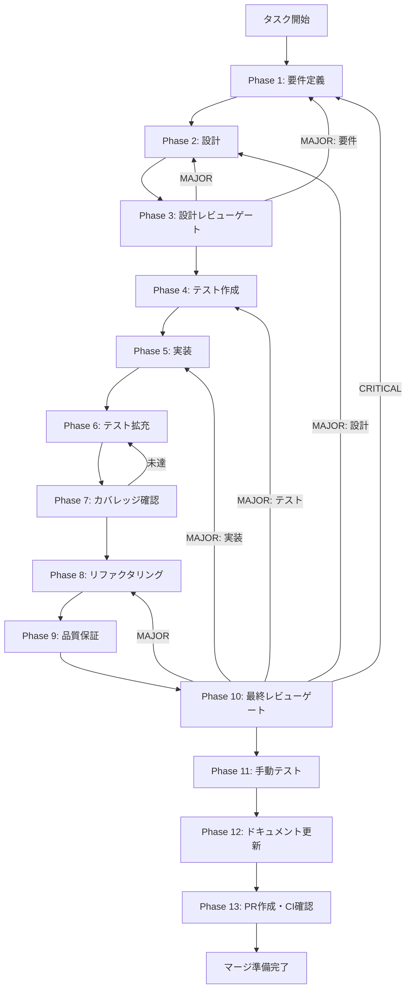

# clean-architecture-refactoring - タスク実行仕様書

## ユーザーからの元の指示

```
チャット履歴機能のClean Architecture準拠リファクタリング

Phase 7の最終レビュー（.claude/agents/arch-police.md）で、チャット履歴機能のアーキテクチャが
Clean Architectureの基本原則に重大な違反をしていることが発見された。

アーキテクチャ準拠率: 45% (9/20項目)

検出された重大違反:
- Critical: 3件（ドメイン層のインフラ依存、型定義3重複、リポジトリ配置誤り）
- High: 5件（God Object、貧血モデル、エラーハンドリング不統一、UI直接依存、スキーマ密結合）
```

## メタ情報

| 項目         | 内容                                                     |
| ------------ | -------------------------------------------------------- |
| タスクID     | ARCH-001                                                 |
| タスク名     | チャット履歴機能のClean Architecture準拠リファクタリング |
| 分類         | アーキテクチャ改善                                       |
| 対象機能     | chat-history（全体）                                     |
| 優先度       | 高                                                       |
| 見積もり規模 | 大規模（3-4週間）                                        |
| ステータス   | 未実施                                                   |
| 作成日       | 2026-01-18                                               |

---

## タスク概要

### 目的

チャット履歴機能を**Clean Architecture**と**Domain-Driven Design**の原則に完全準拠させ、アーキテクチャ準拠率を**45% → 100%**に引き上げる。

### 背景

Phase 7の最終レビュー（.claude/agents/arch-police.md）で、チャット履歴機能のアーキテクチャがClean Architectureの基本原則に重大な違反をしていることが発見された。

**検出された問題:**

#### Critical違反（3件）

| ID   | 問題                     | 説明                                       |
| ---- | ------------------------ | ------------------------------------------ |
| C-01 | ドメイン層のインフラ依存 | ChatSessionがDrizzle ORM型をimportしている |
| C-02 | 型定義の3重複            | types/, domain/, db/schemaで同じ概念が重複 |
| C-03 | リポジトリ配置の誤り     | 具象リポジトリがドメイン層に配置されている |

#### High違反（5件）

| ID   | 問題                     | 説明                                         |
| ---- | ------------------------ | -------------------------------------------- |
| H-01 | God Object               | ChatHistoryServiceに複数責務が集中           |
| H-02 | 貧血ドメインモデル       | ドメインエンティティにビジネスロジックがない |
| H-03 | エラーハンドリング不統一 | Result型が未導入                             |
| H-04 | UI直接依存               | コンポーネントがサービスを直接import         |
| H-05 | スキーマ・ドメイン密結合 | Drizzleスキーマとドメイン型が密結合          |

### 最終ゴール

- ✅ ドメイン層がインフラから完全に独立している
- ✅ 型定義が3層（Domain/DTO/Persistence）に明確に分離されている
- ✅ リポジトリ実装が `infrastructure/` に配置されている
- ✅ Use Caseパターンが導入され、単一責務が守られている
- ✅ Rich Domain Modelでビジネスロジックがドメイン層に集約されている
- ✅ Result型によるRailway-Oriented Programmingが実装されている
- ✅ React ContextによるDIパターンが実装されている
- ✅ すべてのテストが成功している（リグレッションなし）
- ✅ アーキテクチャ準拠率100%達成

### 成果物一覧

| 種別               | 成果物              | 配置先                                                             |
| ------------------ | ------------------- | ------------------------------------------------------------------ |
| ドメイン層         | 純粋なエンティティ  | `packages/shared/src/features/chat-history/domain/`                |
| ドメイン層         | 値オブジェクト      | `packages/shared/src/features/chat-history/domain/value-objects/`  |
| アプリケーション層 | Use Caseクラス      | `packages/shared/src/features/chat-history/application/use-cases/` |
| アプリケーション層 | DTO                 | `packages/shared/src/features/chat-history/application/dto/`       |
| インフラ層         | リポジトリ実装      | `packages/shared/src/infrastructure/persistence/drizzle/`          |
| インフラ層         | マッパー            | `packages/shared/src/infrastructure/persistence/mappers/`          |
| 共通               | Result型            | `packages/shared/src/core/Result.ts`                               |
| UI層               | Context & Hooks     | `apps/desktop/src/contexts/ChatHistoryContext.tsx`                 |
| ドキュメント       | ADR                 | `docs/30-workflows/clean-architecture-refactoring/outputs/`        |
| ドキュメント       | アーキテクチャ図    | `docs/30-workflows/clean-architecture-refactoring/outputs/`        |
| PR                 | GitHub Pull Request | GitHub UI                                                          |

---

## 参照ファイル

本仕様書のコマンド選定は以下を参照：

- `docs/00-requirements/master_system_design.md` - システム要件
- `.claude/skills/aiworkflow-requirements/references/` - システム仕様
- `.claude/skills/aiworkflow-requirements/references/interfaces-chat-history.md` - チャット履歴インターフェース仕様
- `.claude/skills/aiworkflow-requirements/references/architecture-patterns.md` - アーキテクチャパターン

---

## タスク分解サマリー

| ID     | フェーズ | サブタスク名                           | 責務                                   | 依存   |
| ------ | -------- | -------------------------------------- | -------------------------------------- | ------ |
| T-01-1 | Phase 1  | アーキテクチャリファクタリング要件定義 | Clean Architecture要件・移行戦略定義   | -      |
| T-02-1 | Phase 2  | 新アーキテクチャ設計                   | 新ディレクトリ構造・クラス設計         | T-01   |
| T-03-1 | Phase 3  | アーキテクチャ設計レビュー             | Clean Architecture/DDD/実装可能性検証  | T-02   |
| T-04-1 | Phase 4  | 新アーキテクチャ用テスト作成           | ドメイン/UseCase/マッパーテスト        | T-03   |
| T-05-1 | Phase 5  | ドメイン層純粋化実装                   | エンティティ・値オブジェクト・Result型 | T-04   |
| T-05-2 | Phase 5  | Use Caseパターン導入実装               | ChatHistoryServiceの分割               | T-05-1 |
| T-05-3 | Phase 5  | リポジトリ再配置とマッパー実装         | infrastructure/への移動・マッパー実装  | T-05-2 |
| T-05-4 | Phase 5  | React Context DIパターン実装           | DIパターン・カスタムフック             | T-05-3 |
| T-05-5 | Phase 5  | 型定義3層分離実装                      | types/削除・Domain/DTO/Persistence分離 | T-05-4 |
| T-06-1 | Phase 6  | テスト拡充                             | カバレッジ向上・統合テスト追加         | T-05   |
| T-07-1 | Phase 7  | テストカバレッジ確認                   | カバレッジ目標達成確認                 | T-06   |
| T-08-1 | Phase 8  | コード品質リファクタリング             | コード品質改善                         | T-07   |
| T-09-1 | Phase 9  | 品質保証                               | 静的解析・セキュリティ・性能確認       | T-08   |
| T-10-1 | Phase 10 | 最終レビューゲート                     | 全体品質・整合性検証                   | T-09   |
| T-11-1 | Phase 11 | 手動テスト検証                         | UX・実環境動作確認                     | T-10   |
| T-12-1 | Phase 12 | ドキュメント更新                       | ADR・実装ガイド・仕様書更新            | T-11   |
| T-13-1 | Phase 13 | PR作成                                 | コミット・PR・CI確認                   | T-12   |

**総サブタスク数**: 17個

---

## 実行フロー図



---

## Phase一覧

| Phase | 名称               | 仕様書                                                 | ステータス |
| ----- | ------------------ | ------------------------------------------------------ | ---------- |
| 1     | 要件定義           | [phase-1-requirements.md](phase-1-requirements.md)     | 未実施     |
| 2     | 設計               | [phase-2-design.md](phase-2-design.md)                 | 未実施     |
| 3     | 設計レビューゲート | [phase-3-design-review.md](phase-3-design-review.md)   | 未実施     |
| 4     | テスト作成         | [phase-4-test-creation.md](phase-4-test-creation.md)   | 未実施     |
| 5     | 実装               | [phase-5-implementation.md](phase-5-implementation.md) | 未実施     |
| 6     | テスト拡充         | [phase-6-test-expansion.md](phase-6-test-expansion.md) | 未実施     |
| 7     | カバレッジ確認     | [phase-7-coverage-check.md](phase-7-coverage-check.md) | 未実施     |
| 8     | リファクタリング   | [phase-8-refactoring.md](phase-8-refactoring.md)       | 未実施     |
| 9     | 品質保証           | [phase-9-quality.md](phase-9-quality.md)               | 未実施     |
| 10    | 最終レビューゲート | [phase-10-final-review.md](phase-10-final-review.md)   | 未実施     |
| 11    | 手動テスト         | [phase-11-manual-test.md](phase-11-manual-test.md)     | 未実施     |
| 12    | ドキュメント更新   | [phase-12-documentation.md](phase-12-documentation.md) | 未実施     |
| 13    | PR作成             | [phase-13-pr-creation.md](phase-13-pr-creation.md)     | 未実施     |

---

## テストカバレッジ目標

### ユニットテスト

| 指標              | 最低基準 | 推奨基準 |
| ----------------- | -------- | -------- |
| Line Coverage     | 80%      | 90%      |
| Branch Coverage   | 60%      | 70%      |
| Function Coverage | 80%      | 90%      |

### 結合テスト

| 指標                         | 目標 |
| ---------------------------- | ---- |
| APIエンドポイント            | 100% |
| モジュール間インターフェース | 100% |
| 正常系シナリオ               | 100% |
| 異常系シナリオ               | 80%+ |
| 外部連携ポイント             | 100% |

---

## 統合テスト連携（Phase 1〜11で必須）

各Phaseで以下の統合テスト連携アクションを実施すること:

| Phase | 統合テスト連携アクション                                   |
| ----- | ---------------------------------------------------------- |
| 1     | Clean Architecture準拠要件・レイヤー間接続要件を要件に明記 |
| 2     | 依存関係ルール・インターフェース設計を設計に反映           |
| 3     | アーキテクチャ準拠観点のレビューゲートを実施               |
| 4     | レイヤー分離テスト・依存関係テストを作成                   |
| 5     | 各レイヤー間の接続実装とテスト支援コード整備               |
| 6     | アーキテクチャ準拠テストの拡充                             |
| 7     | 依存関係ルール違反がないことを検証                         |
| 8     | リファクタ後のアーキテクチャ準拠を確認                     |
| 9     | 品質保証でアーキテクチャ準拠率100%を確認                   |
| 10    | 最終レビューでClean Architecture準拠を確認                 |
| 11    | 手動テストでUI層からのDI経由アクセスを確認                 |

---

## Phase完了時の必須アクション

**各Phase完了時に以下を必ず実行すること:**

1. **タスク100%実行**: Phase内で指定された全タスクを完全に実行
2. **成果物確認**: 全ての必須成果物が生成されていることを検証
3. **実行記録**: 実行タスクの結果を記録
4. **artifacts.json更新**: Phase完了ステータスを更新
5. **Phase末端の実行確認**: 各タスクを100%実行し、各タスクを完遂した旨を必ず明記

```bash
# Phase完了時の検証コマンド
node .claude/skills/task-specification-creator/scripts/validate-phase-output.js docs/30-workflows/clean-architecture-refactoring --phase {{PHASE_NUMBER}}

# Phase完了・成果物登録
node .claude/skills/task-specification-creator/scripts/complete-phase.js \
  --workflow docs/30-workflows/clean-architecture-refactoring --phase {{PHASE_NUMBER}} --artifacts "..."
```

---

## リスクと対策

| リスク                               | 影響度 | 発生確率 | 対策                                 |
| ------------------------------------ | ------ | -------- | ------------------------------------ |
| 大規模リファクタリングによるバグ混入 | 高     | 中       | TDDサイクル厳守、各Phase後テスト実行 |
| 既存機能の破壊                       | 高     | 中       | Strangler Fig Pattern、段階的移行    |
| 開発期間の長期化                     | 中     | 高       | Phase分割、優先度付け                |
| チーム学習コスト                     | 中     | 中       | ペアプログラミング、ドキュメント整備 |

---

## 参考資料

- [Clean Architecture](https://blog.cleancoder.com/uncle-bob/2012/08/13/the-clean-architecture.html) - Robert C. Martin
- [Domain-Driven Design](https://www.domainlanguage.com/ddd/) - Eric Evans
- [Railway-Oriented Programming](https://fsharpforfunandprofit.com/rop/) - Scott Wlaschin
- [Strangler Fig Pattern](https://martinfowler.com/bliki/StranglerFigApplication.html) - Martin Fowler
