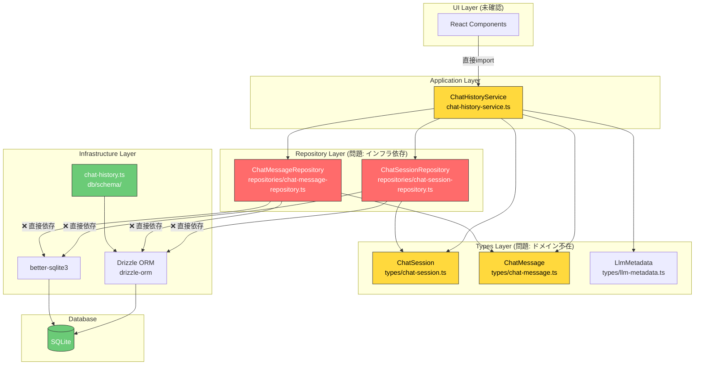
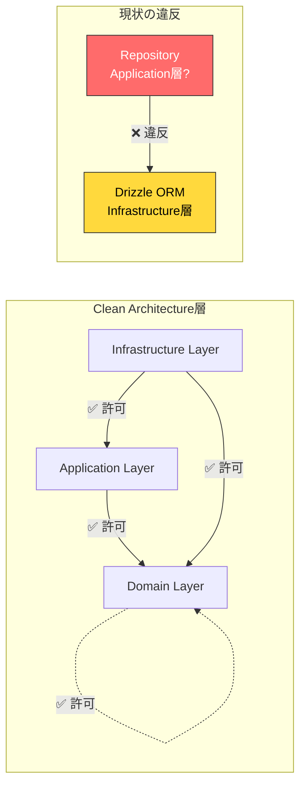
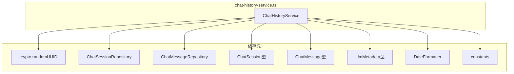
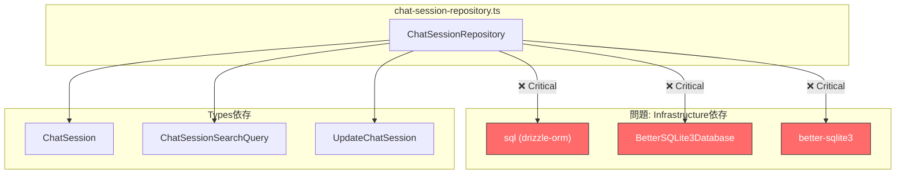
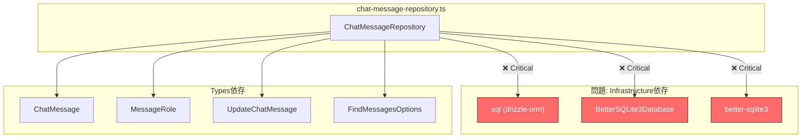
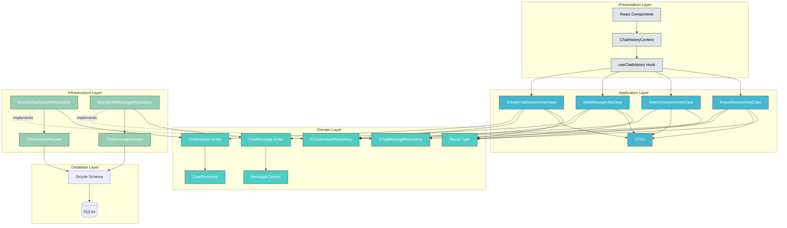
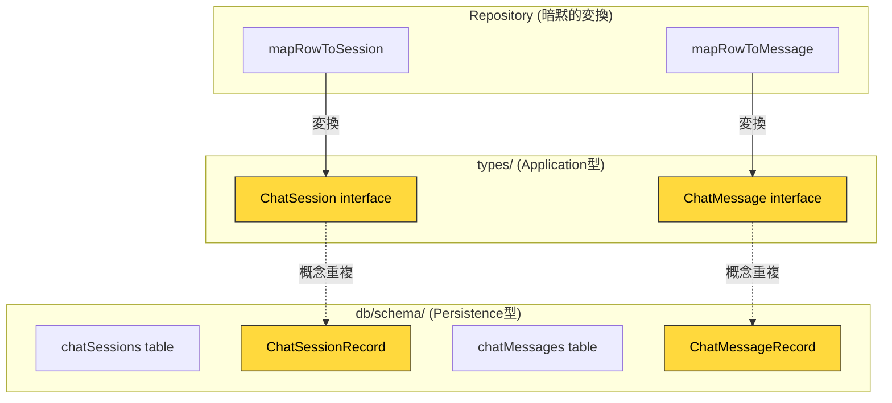
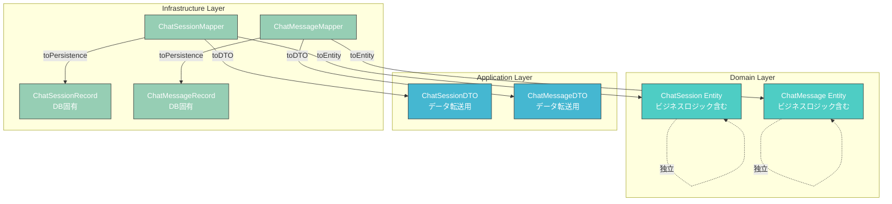

# 依存関係図

## 1. 現状の依存関係

### 全体依存関係図

### 違反している依存方向

---

## 2. ファイル間依存関係

### ChatHistoryService の依存

### ChatSessionRepository の依存

### ChatMessageRepository の依存

---

## 3. Clean Architecture準拠後の依存関係（目標）

---

## 4. 依存ルール

### Clean Architecture 依存ルール

| From Layer     | To Domain | To Application | To Infrastructure | To Presentation |
| -------------- | --------- | -------------- | ----------------- | --------------- |
| Domain         | ✅        | ❌             | ❌                | ❌              |
| Application    | ✅        | ✅             | ❌                | ❌              |
| Infrastructure | ✅        | ✅             | ✅                | ❌              |
| Presentation   | ❌        | ✅             | ❌                | ✅              |

### 現状の違反箇所

| From                  | To          | 違反ルール                  |
| --------------------- | ----------- | --------------------------- |
| ChatSessionRepository | drizzle-orm | Repository → Infrastructure |
| ChatMessageRepository | drizzle-orm | Repository → Infrastructure |

---

## 5. 型の依存関係

### 現状の型依存（3重複問題）

### 目標の型依存（3層分離）

---

## 6. まとめ

### 現状の問題点

1. **Repository → Infrastructure 直接依存** (Critical)
2. **Domain層の不在** - 型定義のみで貧血モデル
3. **型定義の重複** - types/, schema/ で同じ概念が重複
4. **UI → Service 直接依存** - DIパターン未導入

### 修正後の改善点

1. **依存性逆転** - Repository InterfaceをDomain層に配置
2. **Rich Domain Model** - エンティティにビジネスロジックを集約
3. **型の3層分離** - Domain/DTO/Persistence型を明確に分離
4. **DIパターン** - React ContextでUI層の結合度を下げる
