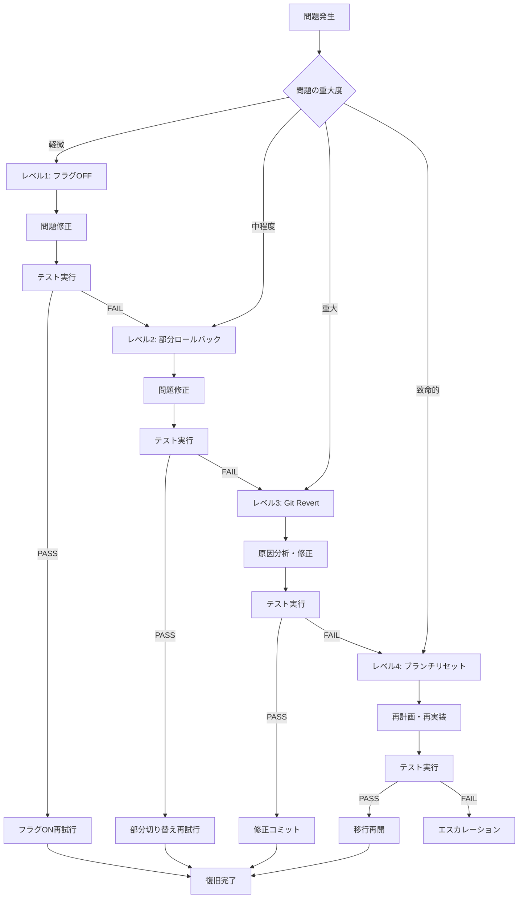

# ロールバック計画

## 概要

本文書は、Clean Architecture移行中に問題が発生した場合のロールバック手順を定義する。

**作成日**: 2026-01-18
**対象**: チャット履歴機能のClean Architecture移行

---

## 1. ロールバックレベル

### レベル1: フィーチャーフラグによる即時ロールバック

**適用条件**: フェーズB（段階的切り替え）中の問題発生
**所要時間**: 即時（コード変更1行）
**影響範囲**: 最小

**手順**:

1. フィーチャーフラグを`false`に変更

   ```typescript
   // packages/shared/src/config/feature-flags.ts
   export const FEATURE_FLAGS = {
     USE_NEW_CHAT_HISTORY_ARCH: false, // true → false
   };
   ```

2. アプリケーションを再起動

3. 動作確認
   - セッション作成が正常に動作すること
   - メッセージ追加が正常に動作すること
   - 検索機能が正常に動作すること

---

### レベル2: 部分的ロールバック

**適用条件**: 特定のUse Caseのみに問題がある場合
**所要時間**: 数分
**影響範囲**: 問題のある機能のみ

**手順**:

1. 問題のある機能のみ旧実装に切り替え

   ```typescript
   // ChatHistoryFacade.ts
   async createSession(userId: string, options?: CreateSessionOptions) {
     // 問題のある機能は旧実装を使用
     // if (FEATURE_FLAGS.USE_NEW_CHAT_HISTORY_ARCH) {
     //   return this.newUseCases.createSession.execute({ userId, ...options });
     // }
     return this.oldService.createSession(userId, options);
   }
   ```

2. 問題のある機能を特定し、修正

3. 修正後、テストを実行して再度切り替え

---

### レベル3: Git Revertによるロールバック

**適用条件**: 重大な問題が発生し、フィーチャーフラグでは対応できない場合
**所要時間**: 数分〜数十分
**影響範囲**: 該当コミット以降の変更全て

**手順**:

1. 問題のあるコミットを特定

   ```bash
   git log --oneline -20
   ```

2. Revertコミットを作成

   ```bash
   # 単一コミットをrevert
   git revert <commit-hash>

   # 複数コミットをrevert（範囲指定）
   git revert <oldest-commit>^..<newest-commit>
   ```

3. テストを実行

   ```bash
   pnpm --filter @repo/shared test
   pnpm --filter @repo/desktop test
   ```

4. 動作確認

---

### レベル4: ブランチリセットによる完全ロールバック

**適用条件**: 移行作業全体を最初からやり直す必要がある場合
**所要時間**: 数時間（再実装が必要）
**影響範囲**: 移行作業全体

**手順**:

1. 移行開始前のコミットを確認

   ```bash
   git log --oneline --all | grep -i "before clean arch" || git log --oneline -50
   ```

2. 新しいブランチを作成し、リセット

   ```bash
   git checkout -b feature/ARCH-001-clean-architecture-refactoring-v2
   git reset --hard <migration-start-commit>
   ```

3. 失敗原因を分析し、改善計画を策定

4. 移行作業を再開

---

## 2. 問題レベル別対応フロー



---

## 3. 問題分類と対応

### 3.1 テスト失敗

| 症状               | 原因候補             | 対応           |
| ------------------ | -------------------- | -------------- |
| ユニットテスト失敗 | 実装バグ             | レベル1 + 修正 |
| 統合テスト失敗     | レイヤー間連携の問題 | レベル2 + 修正 |
| 型エラー           | DTO/Entity変換の問題 | レベル1 + 修正 |

### 3.2 ランタイムエラー

| 症状                                | 原因候補               | 対応           |
| ----------------------------------- | ---------------------- | -------------- |
| `TypeError: Cannot read property`   | null/undefinedアクセス | レベル1 + 修正 |
| `Error: セッションが見つかりません` | マッピングエラー       | レベル1 + 修正 |
| DBエラー                            | スキーマ不整合         | レベル3 + 調査 |

### 3.3 パフォーマンス問題

| 症状           | 原因候補         | 対応             |
| -------------- | ---------------- | ---------------- |
| レスポンス遅延 | N+1クエリ        | レベル2 + 最適化 |
| メモリリーク   | オブジェクト保持 | レベル2 + 調査   |

### 3.4 データ整合性問題

| 症状       | 原因候補       | 対応               |
| ---------- | -------------- | ------------------ |
| データ消失 | マッピング漏れ | レベル3 + 緊急対応 |
| データ破損 | 型変換エラー   | レベル3 + 緊急対応 |

---

## 4. ロールバック判断基準

### 即時ロールバック（レベル1）を実行する条件

- [ ] ユニットテストが3件以上失敗
- [ ] TypeScript型エラーが発生
- [ ] アプリケーション起動失敗
- [ ] 主要機能（セッション作成/メッセージ追加）が動作しない

### Git Revert（レベル3）を実行する条件

- [ ] データ整合性に問題がある
- [ ] フィーチャーフラグOFFでも問題が解消しない
- [ ] 複数のコミットにまたがる問題

### ブランチリセット（レベル4）を実行する条件

- [ ] 設計上の根本的な問題が発見された
- [ ] 移行戦略自体を見直す必要がある
- [ ] 修正コストが再実装コストを上回る

---

## 5. 連絡フロー

### 問題発生時の報告

```
1. 問題の概要（何が起きたか）
2. 影響範囲（どの機能が影響を受けるか）
3. 再現手順（どうすれば再現できるか）
4. 暫定対応（フラグOFF等の対応状況）
5. 原因分析（わかっている範囲で）
6. 修正計画（どう修正するか）
```

---

## 6. 復旧確認チェックリスト

### レベル1ロールバック後

- [ ] アプリケーションが正常に起動する
- [ ] 既存のセッション一覧が表示される
- [ ] 新しいセッションを作成できる
- [ ] メッセージを追加できる
- [ ] 検索機能が動作する

### レベル3ロールバック後

- [ ] git statusがcleanである
- [ ] 全テストがパスする
- [ ] TypeScript型チェックがパスする
- [ ] ESLintエラーがない
- [ ] アプリケーションが正常に動作する

---

## 7. 予防措置

### 7.1 移行前のバックアップ

```bash
# 移行開始前にタグを作成
git tag -a pre-clean-arch-migration -m "Before Clean Architecture migration"
```

### 7.2 段階的なコミット

- 各Phase完了時に必ずコミット
- コミットメッセージに Phase 番号を含める
- 小さな単位でコミットし、revertしやすくする

```bash
# 良いコミットメッセージの例
git commit -m "feat(chat-history): Phase 5-1 Domain層エンティティ実装"
git commit -m "feat(chat-history): Phase 5-2 Use Case実装"
git commit -m "feat(chat-history): Phase 5-3 リポジトリ実装"
```

### 7.3 テスト駆動開発

- 実装前にテストを書く
- 旧実装のテストは維持
- 新旧両方のテストがパスすることを確認

---

## 8. 参考コマンド

```bash
# 現在のブランチ状態確認
git status
git log --oneline -10

# 特定コミットの差分確認
git show <commit-hash>

# 特定ファイルの変更履歴
git log --oneline -p packages/shared/src/features/chat-history/

# Revert（単一コミット）
git revert <commit-hash>

# Revert（複数コミット、新しい方から順に）
git revert --no-commit HEAD~3..HEAD
git commit -m "Revert: Clean Architecture migration Phase 5-7"

# 強制リセット（注意: 変更が失われる）
git reset --hard <commit-hash>

# Stash（一時退避）
git stash push -m "WIP: Clean Architecture migration"
git stash pop
```
