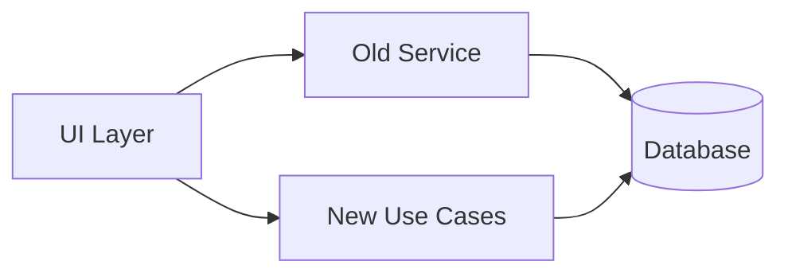
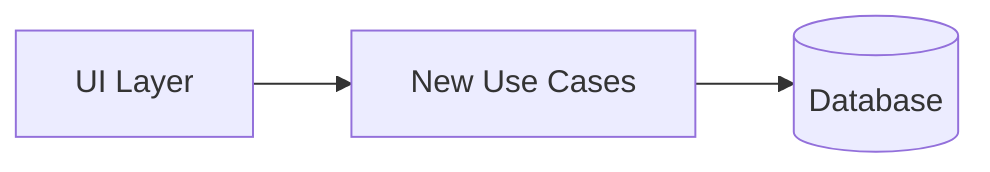

# ADR-001: Clean Architecture採用

## ステータス

提案（Proposed）

## コンテキスト

AIWorkflowOrchestratorプロジェクトのチャット履歴機能は、現在以下の問題を抱えている：

### 現状の問題点

1. **God Object問題**: `ChatHistoryService`が複数の責務を持つ
   - セッション管理
   - メッセージ管理
   - 検索機能
   - エクスポート機能

2. **依存性の方向違反**: Domain層がInfrastructure層に直接依存
   - `ChatSession`型がDrizzleスキーマ型を参照
   - Repositoryがインターフェースなしで直接Drizzle ORMを使用

3. **Anemic Domain Model**: ビジネスロジックがない型定義
   - `types/chat-session.ts`は単なるデータ構造
   - バリデーションロジックが散在

4. **テスト困難性**: 密結合によりユニットテストが困難
   - モック化できないデータベース依存
   - 統合テストでしかテストできない

5. **アーキテクチャ準拠度**: 45%（目標: 100%）

### 検討した選択肢

1. **現状維持**: 変更なし
2. **MVC/MVVMへの移行**: 従来のアーキテクチャパターン
3. **Clean Architecture採用**: ドメイン中心の設計

## 決定

**Clean Architectureを採用する**

### 採用理由

1. **依存性逆転の原則（DIP）**: Domain層を中心に据え、他の層からの依存を受けることで、ビジネスロジックの独立性を確保

2. **テスト容易性**: Repository Interfaceを通じた依存性注入により、Use Caseのユニットテストが可能に

3. **変更容易性**: 各層の責務が明確なため、技術的変更（例: ORM変更）がビジネスロジックに影響しない

4. **スケーラビリティ**: 新機能追加時にUse Case単位で拡張可能

### 採用するパターン

| パターン           | 適用箇所            | 目的                         |
| ------------------ | ------------------- | ---------------------------- |
| Rich Domain Model  | Entity/Value Object | ビジネスロジックのカプセル化 |
| Repository Pattern | 永続化抽象化        | インフラ依存の分離           |
| Use Case Pattern   | アプリケーション層  | 単一責任原則の徹底           |
| Result Type        | エラーハンドリング  | 型安全なエラー処理           |
| DTO Pattern        | 層間通信            | 内部構造の隠蔽               |

### 層構造

```
┌─────────────────────────────────────────────────────────────┐
│                    Presentation Layer                        │
│  (React Components, Hooks, Context)                          │
├─────────────────────────────────────────────────────────────┤
│                    Application Layer                         │
│  (Use Cases, DTOs, Input/Output Types)                       │
├─────────────────────────────────────────────────────────────┤
│                      Domain Layer                            │
│  (Entities, Value Objects, Repository Interfaces)            │
├─────────────────────────────────────────────────────────────┤
│                   Infrastructure Layer                       │
│  (Repository Implementations, Mappers, Database)             │
└─────────────────────────────────────────────────────────────┘
```

## 結果

### ポジティブな結果

1. **コード品質向上**
   - 単一責任原則の徹底
   - 依存性逆転の実現
   - 型安全性の向上

2. **テスト改善**
   - Use Caseの完全なユニットテストが可能
   - InMemoryRepositoryによる高速テスト
   - テストカバレッジ向上

3. **保守性向上**
   - 層ごとの責務が明確
   - 変更影響範囲の局所化
   - 技術的負債の解消

4. **拡張性向上**
   - 新機能はUse Case追加で対応
   - ORM変更時はInfrastructure層のみ修正
   - UI変更時はPresentation層のみ修正

### ネガティブな結果

1. **初期学習コスト**
   - Clean Architectureの理解が必要
   - Value Object/Entityの使い分け
   - Result型の使用方法

2. **コード量増加**
   - DTO変換コード
   - Mapperコード
   - インターフェース定義

3. **実行時オーバーヘッド**
   - 層間のデータ変換
   - オブジェクト生成コスト

### 軽減策

| ネガティブ影響 | 軽減策                               |
| -------------- | ------------------------------------ |
| 学習コスト     | 設計ドキュメント・サンプルコード整備 |
| コード量       | コードジェネレーター検討             |
| オーバーヘッド | プロファイリング・最適化             |

## 移行戦略

**Strangler Fig Pattern**を採用し、段階的に移行する。

### Phase A: 並行稼働



### Phase B: 切り替え



### Phase C: 削除

旧コードを削除し、Clean Architecture準拠コードのみに統一。

## 参照

- [Clean Architecture (Robert C. Martin)](https://blog.cleancoder.com/uncle-bob/2012/08/13/the-clean-architecture.html)
- [Domain-Driven Design (Eric Evans)](https://www.domainlanguage.com/ddd/)
- [Strangler Fig Pattern (Martin Fowler)](https://martinfowler.com/bliki/StranglerFigApplication.html)

## 関連ADR

- (予定) ADR-002: Result型エラーハンドリング採用
- (予定) ADR-003: React Context依存性注入パターン採用

---

## 更新履歴

| 日付       | バージョン | 変更内容 |
| ---------- | ---------- | -------- |
| 2026-01-18 | 1.0        | 初版作成 |
