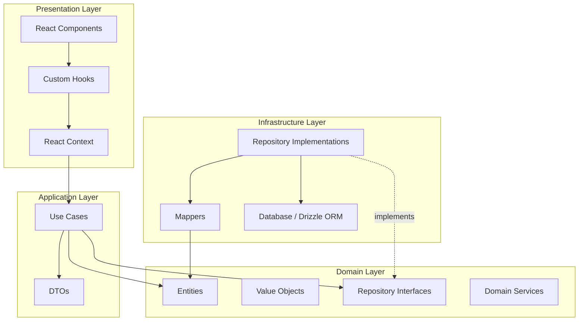
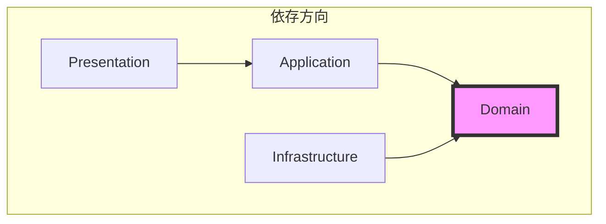
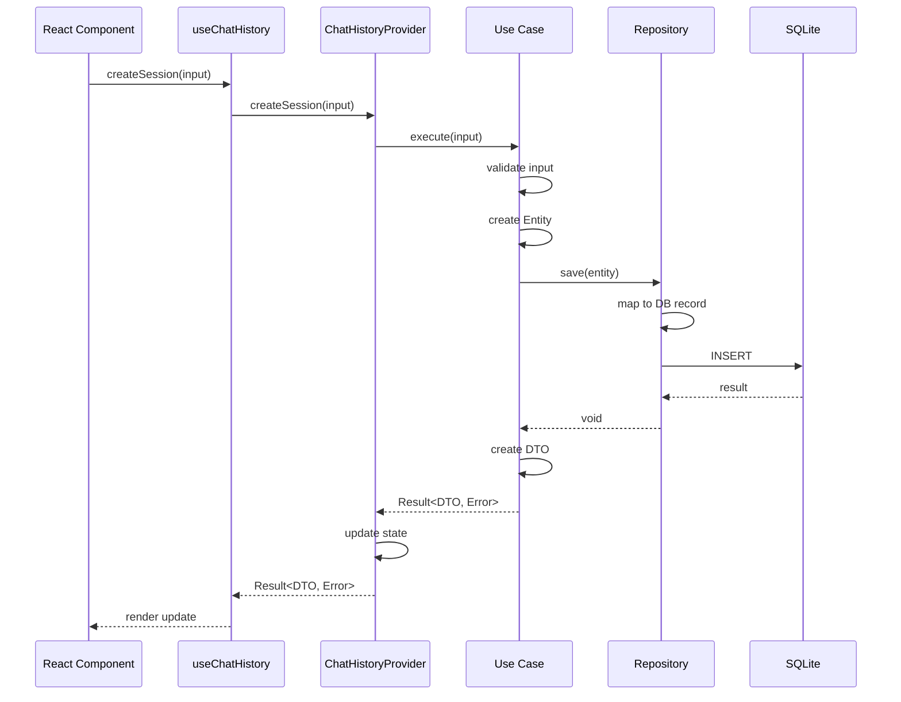
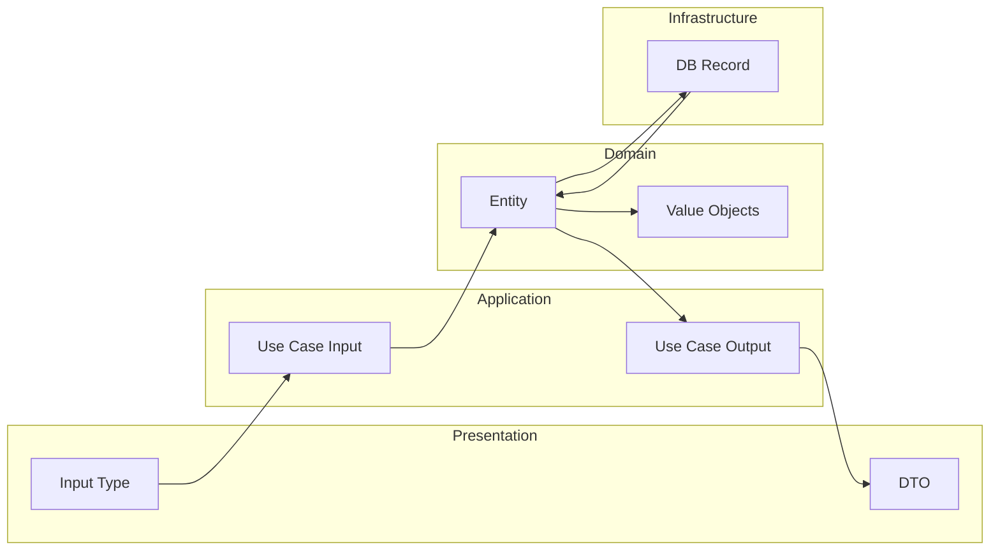
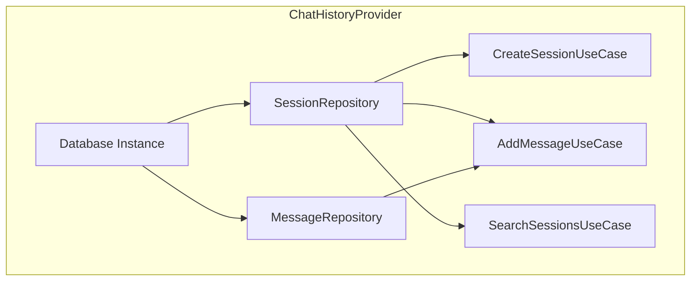
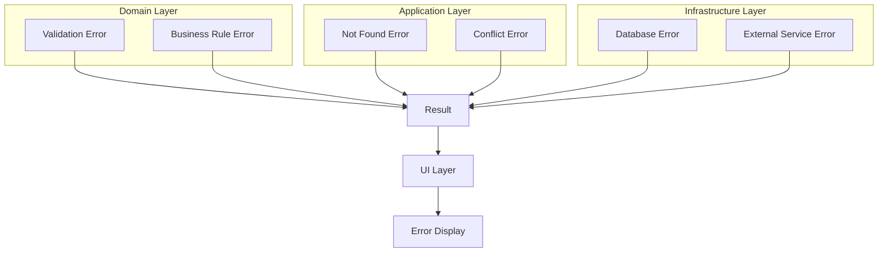
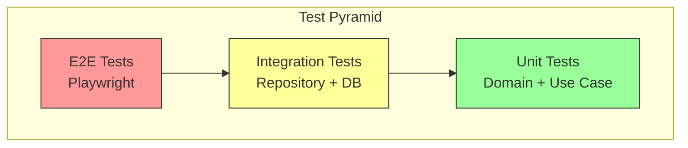
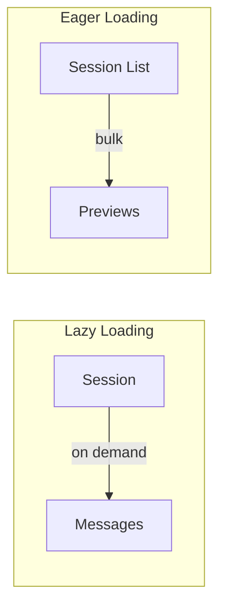

# アーキテクチャ設計書

## 概要

本文書は、チャット履歴機能のClean Architectureベースの全体設計を定義する。

**作成日**: 2026-01-18
**対象機能**: チャット履歴（Chat History）

---

## 1. アーキテクチャ概要

### 1.1 Clean Architecture 4層構造



### 1.2 依存性の方向



**重要**: Domain層は他のどの層にも依存しない（依存性逆転の原則）

---

## 2. ディレクトリ構造

### 2.1 packages/shared（Clean Architecture準拠）

```
packages/shared/src/
├── core/                              # コア基盤
│   ├── Result.ts                      # Result型
│   └── errors/                        # エラー型階層
│       ├── AppError.ts
│       ├── DomainError.ts
│       ├── UseCaseError.ts
│       └── InfrastructureError.ts
│
└── features/
    └── chat-history/
        ├── domain/                    # Domain層
        │   ├── entities/
        │   │   ├── ChatSession.ts
        │   │   └── ChatMessage.ts
        │   ├── value-objects/
        │   │   ├── ChatSessionId.ts
        │   │   ├── ChatMessageId.ts
        │   │   ├── UserId.ts
        │   │   ├── ChatSessionTitle.ts
        │   │   ├── MessageContent.ts
        │   │   ├── MessageRole.ts
        │   │   └── LLMMetadata.ts
        │   ├── repositories/          # インターフェース
        │   │   ├── IChatSessionRepository.ts
        │   │   └── IChatMessageRepository.ts
        │   └── errors/
        │       └── ChatHistoryErrors.ts
        │
        ├── application/               # Application層
        │   ├── use-cases/
        │   │   ├── CreateChatSessionUseCase.ts
        │   │   ├── AddUserMessageUseCase.ts
        │   │   ├── AddAssistantMessageUseCase.ts
        │   │   ├── SearchSessionsUseCase.ts
        │   │   ├── TogglePinnedUseCase.ts
        │   │   ├── ExportToMarkdownUseCase.ts
        │   │   └── types.ts           # 入出力型定義
        │   └── dto/
        │       ├── ChatSessionDTO.ts
        │       └── ChatMessageDTO.ts
        │
        └── infrastructure/            # Infrastructure層
            └── persistence/
                └── drizzle/
                    ├── DrizzleChatSessionRepository.ts
                    ├── DrizzleChatMessageRepository.ts
                    └── mappers/
                        ├── ChatSessionMapper.ts
                        └── ChatMessageMapper.ts
```

### 2.2 apps/desktop（Presentation層）

```
apps/desktop/src/
├── contexts/
│   ├── ChatHistoryContext.tsx
│   └── ChatHistoryProvider.tsx
├── hooks/
│   └── useChatHistory.ts
└── components/
    └── chat-history/
        ├── ChatSessionList.tsx
        ├── ChatSessionItem.tsx
        ├── ChatView.tsx
        ├── ChatMessageList.tsx
        └── ChatMessageItem.tsx
```

---

## 3. 層間通信

### 3.1 データフロー



### 3.2 型の変換



---

## 4. 各層の責務

### 4.1 Domain層

| 要素                 | 責務                                   |
| -------------------- | -------------------------------------- |
| Entity               | ビジネスロジック、状態変更、整合性保証 |
| Value Object         | 値の不変性、バリデーション、等価性     |
| Repository Interface | 永続化の抽象化（依存性逆転）           |
| Domain Error         | ドメイン固有のエラー表現               |

### 4.2 Application層

| 要素     | 責務                                     |
| -------- | ---------------------------------------- |
| Use Case | ユースケースの調整、トランザクション境界 |
| DTO      | 外部との契約、データ変換                 |
| Input型  | ユースケース入力の検証・型付け           |
| Output型 | ユースケース出力の型付け                 |

### 4.3 Infrastructure層

| 要素       | 責務                        |
| ---------- | --------------------------- |
| Repository | 永続化の実装（Drizzle ORM） |
| Mapper     | Entity ↔ DBレコードの変換   |
| Database   | データベース接続・スキーマ  |

### 4.4 Presentation層

| 要素          | 責務                             |
| ------------- | -------------------------------- |
| React Context | 依存性注入、状態管理             |
| Custom Hook   | Context利用のラッパー            |
| Component     | UI表示、ユーザーインタラクション |

---

## 5. 依存性注入（DI）

### 5.1 DIコンテナ構造



### 5.2 初期化フロー

```typescript
// ChatHistoryProvider内での初期化
const { useCases } = useMemo(() => {
  const db = getDatabase();

  // Repositoryの作成（Infrastructure層）
  const sessionRepository = new DrizzleChatSessionRepository(db);
  const messageRepository = new DrizzleChatMessageRepository(db);

  // Use Caseの作成（Application層）
  return {
    useCases: {
      createSession: new CreateChatSessionUseCase(sessionRepository),
      addUserMessage: new AddUserMessageUseCase(
        sessionRepository,
        messageRepository,
      ),
      addAssistantMessage: new AddAssistantMessageUseCase(
        sessionRepository,
        messageRepository,
      ),
      searchSessions: new SearchSessionsUseCase(sessionRepository),
      // ...
    },
  };
}, []);
```

---

## 6. エラーハンドリング戦略

### 6.1 Result型によるエラー伝播



### 6.2 エラーマッピング

| 層             | エラー型             | HTTP相当 |
| -------------- | -------------------- | -------- |
| Domain         | ValidationError      | 400      |
| Domain         | BusinessRuleError    | 400      |
| Application    | NotFoundError        | 404      |
| Application    | UnauthorizedError    | 401      |
| Application    | ConflictError        | 409      |
| Infrastructure | DatabaseError        | 500      |
| Infrastructure | ExternalServiceError | 502      |

---

## 7. テスト戦略

### 7.1 テストピラミッド



### 7.2 各層のテスト方針

| 層             | テスト種別  | モック対象           |
| -------------- | ----------- | -------------------- |
| Domain         | Unit        | なし（純粋関数）     |
| Application    | Unit        | Repository Interface |
| Infrastructure | Integration | なし（実DB使用）     |
| Presentation   | Integration | Use Case / Provider  |

---

## 8. Clean Architecture原則チェックリスト

### 8.1 依存性ルール

- [ ] Domain層は他の層に依存しない
- [ ] Application層はDomain層のみに依存
- [ ] Infrastructure層はDomain層のみに依存（インターフェース実装）
- [ ] Presentation層はApplication層に依存

### 8.2 インターフェース分離

- [ ] Repository InterfaceはDomain層に配置
- [ ] DTO/Input/OutputはApplication層に配置
- [ ] DB SchemaはInfrastructure層に配置

### 8.3 単一責任

- [ ] 各Use Caseは1つのユースケースのみ担当
- [ ] 各Entityは1つの集約ルートのみ担当
- [ ] 各Value Objectは1つの値概念のみ担当

---

## 9. パフォーマンス考慮事項

### 9.1 データ取得最適化



### 9.2 キャッシング戦略

| データ          | キャッシュ  | TTL     |
| --------------- | ----------- | ------- |
| Session List    | React State | Session |
| Current Session | React State | Session |
| Messages        | React State | Session |
| Search Results  | なし        | -       |

---

## 10. 今後の拡張ポイント

### 10.1 追加予定機能

1. **セッション共有**: 他ユーザーとの共有機能
2. **バックアップ**: クラウドバックアップ
3. **検索拡張**: 全文検索（FTS5）
4. **AI連携**: 自動タイトル生成

### 10.2 拡張時の設計指針

- 新機能はUse Case単位で追加
- 共通処理はDomain Serviceとして抽出
- 外部連携はInfrastructure層のAdapterパターンで実装
