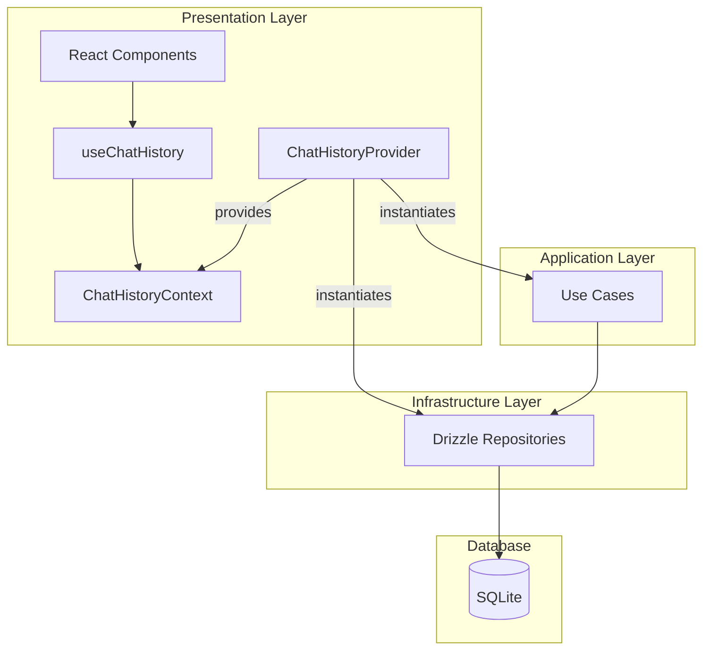

# DI・Context設計書

## 概要

本文書は、チャット履歴機能のReact Context/Hookを使用した依存性注入（DI）パターン設計を定義する。

**作成日**: 2026-01-18
**配置場所**:

- `apps/desktop/src/contexts/ChatHistoryContext.tsx`
- `apps/desktop/src/hooks/useChatHistory.ts`

---

## 1. 設計目標

1. **依存性逆転**: UI層がApplication層のみに依存
2. **テスト容易性**: Use Caseをモック化可能
3. **単一の注入ポイント**: Contextでリポジトリ→Use Case→UIの依存を管理
4. **型安全**: TypeScriptの型推論を活用

---

## 2. ChatHistoryContext

### 2.1 Context値の型定義

```typescript
// apps/desktop/src/contexts/ChatHistoryContext.tsx

import {
  createContext,
  useContext,
  useMemo,
  useState,
  useCallback,
} from "react";
import type { ReactNode } from "react";
import type { Result } from "@repo/shared/core/Result";
import type { ChatSessionDTO } from "@repo/shared/features/chat-history/application/dto/ChatSessionDTO";
import type { ChatMessageDTO } from "@repo/shared/features/chat-history/application/dto/ChatMessageDTO";
import type { UseCaseError } from "@repo/shared/core/errors/UseCaseError";

// Use Case入力型
import type {
  CreateChatSessionInput,
  AddUserMessageInput,
  AddAssistantMessageInput,
  SearchSessionsInput,
} from "@repo/shared/features/chat-history/application/use-cases/types";

/**
 * ChatHistoryContextの値の型
 */
export interface ChatHistoryContextValue {
  // ========================================
  // Use Case メソッド
  // ========================================

  /** セッションを作成する */
  createSession: (
    input: CreateChatSessionInput,
  ) => Promise<Result<ChatSessionDTO, UseCaseError>>;

  /** セッションを取得する */
  getSession: (
    sessionId: string,
  ) => Promise<Result<ChatSessionDTO | null, UseCaseError>>;

  /** セッション一覧を取得する */
  listSessions: (
    userId: string,
  ) => Promise<Result<ChatSessionDTO[], UseCaseError>>;

  /** ユーザーメッセージを追加する */
  addUserMessage: (
    input: AddUserMessageInput,
  ) => Promise<Result<ChatMessageDTO, UseCaseError>>;

  /** アシスタントメッセージを追加する */
  addAssistantMessage: (
    input: AddAssistantMessageInput,
  ) => Promise<Result<ChatMessageDTO, UseCaseError>>;

  /** メッセージ一覧を取得する */
  getMessages: (
    sessionId: string,
  ) => Promise<Result<ChatMessageDTO[], UseCaseError>>;

  /** セッションを検索する */
  searchSessions: (
    input: SearchSessionsInput,
  ) => Promise<Result<ChatSessionDTO[], UseCaseError>>;

  /** セッションを削除する */
  deleteSession: (sessionId: string) => Promise<Result<void, UseCaseError>>;

  /** お気に入りを切り替える */
  toggleFavorite: (
    sessionId: string,
  ) => Promise<Result<ChatSessionDTO, UseCaseError>>;

  /** ピン留めを切り替える */
  togglePinned: (
    sessionId: string,
  ) => Promise<Result<ChatSessionDTO, UseCaseError>>;

  /** Markdownでエクスポートする */
  exportToMarkdown: (
    sessionId: string,
    options?: { includeMetadata?: boolean },
  ) => Promise<Result<string, UseCaseError>>;

  /** JSONでエクスポートする */
  exportToJson: (sessionId: string) => Promise<Result<string, UseCaseError>>;

  // ========================================
  // 状態
  // ========================================

  /** 現在のセッション */
  currentSession: ChatSessionDTO | null;

  /** セッション一覧 */
  sessions: ChatSessionDTO[];

  /** 現在のセッションのメッセージ */
  messages: ChatMessageDTO[];

  /** ローディング状態 */
  isLoading: boolean;

  /** エラー */
  error: UseCaseError | null;

  // ========================================
  // 状態更新
  // ========================================

  /** 現在のセッションを設定する */
  setCurrentSession: (session: ChatSessionDTO | null) => void;

  /** エラーをクリアする */
  clearError: () => void;
}

/**
 * ChatHistoryContext
 */
export const ChatHistoryContext = createContext<ChatHistoryContextValue | null>(
  null,
);
```

### 2.2 ChatHistoryProvider

```typescript
// apps/desktop/src/contexts/ChatHistoryProvider.tsx

import { useState, useMemo, useCallback } from "react";
import type { ReactNode } from "react";
import { ChatHistoryContext, type ChatHistoryContextValue } from "./ChatHistoryContext";
import type { ChatSessionDTO } from "@repo/shared/features/chat-history/application/dto/ChatSessionDTO";
import type { ChatMessageDTO } from "@repo/shared/features/chat-history/application/dto/ChatMessageDTO";
import type { UseCaseError } from "@repo/shared/core/errors/UseCaseError";
import { ok, err, type Result } from "@repo/shared/core/Result";

// Use Cases
import { CreateChatSessionUseCase } from "@repo/shared/features/chat-history/application/use-cases/CreateChatSessionUseCase";
import { AddUserMessageUseCase } from "@repo/shared/features/chat-history/application/use-cases/AddUserMessageUseCase";
import { AddAssistantMessageUseCase } from "@repo/shared/features/chat-history/application/use-cases/AddAssistantMessageUseCase";
import { SearchSessionsUseCase } from "@repo/shared/features/chat-history/application/use-cases/SearchSessionsUseCase";
// ... 他のUse Case

// Repositories
import { DrizzleChatSessionRepository } from "@repo/shared/infrastructure/persistence/drizzle/DrizzleChatSessionRepository";
import { DrizzleChatMessageRepository } from "@repo/shared/infrastructure/persistence/drizzle/DrizzleChatMessageRepository";

// Database
import { getDatabase } from "../lib/database";

interface ChatHistoryProviderProps {
  children: ReactNode;
}

/**
 * ChatHistoryProvider
 *
 * Use CaseとRepositoryのインスタンスを作成し、Contextに提供する。
 */
export function ChatHistoryProvider({ children }: ChatHistoryProviderProps) {
  // ========================================
  // 状態
  // ========================================
  const [currentSession, setCurrentSession] = useState<ChatSessionDTO | null>(null);
  const [sessions, setSessions] = useState<ChatSessionDTO[]>([]);
  const [messages, setMessages] = useState<ChatMessageDTO[]>([]);
  const [isLoading, setIsLoading] = useState(false);
  const [error, setError] = useState<UseCaseError | null>(null);

  // ========================================
  // 依存性の初期化
  // ========================================
  const { useCases } = useMemo(() => {
    const db = getDatabase();

    // Repositoryの作成
    const sessionRepository = new DrizzleChatSessionRepository(db);
    const messageRepository = new DrizzleChatMessageRepository(db);

    // Use Caseの作成
    return {
      useCases: {
        createSession: new CreateChatSessionUseCase(sessionRepository),
        addUserMessage: new AddUserMessageUseCase(sessionRepository, messageRepository),
        addAssistantMessage: new AddAssistantMessageUseCase(sessionRepository, messageRepository),
        searchSessions: new SearchSessionsUseCase(sessionRepository),
        // ... 他のUse Case
      },
    };
  }, []);

  // ========================================
  // Use Caseラッパー
  // ========================================
  const createSession = useCallback(
    async (input: CreateChatSessionInput): Promise<Result<ChatSessionDTO, UseCaseError>> => {
      setIsLoading(true);
      setError(null);

      try {
        const result = await useCases.createSession.execute(input);
        if (result.ok) {
          setSessions((prev) => [result.value.session, ...prev]);
        } else {
          setError(result.error);
        }
        return result.ok
          ? ok(result.value.session)
          : err(result.error);
      } finally {
        setIsLoading(false);
      }
    },
    [useCases]
  );

  const addUserMessage = useCallback(
    async (input: AddUserMessageInput): Promise<Result<ChatMessageDTO, UseCaseError>> => {
      setIsLoading(true);
      setError(null);

      try {
        const result = await useCases.addUserMessage.execute(input);
        if (result.ok) {
          setMessages((prev) => [...prev, result.value.message]);
          // セッション一覧も更新
          setSessions((prev) =>
            prev.map((s) =>
              s.id === result.value.updatedSession.id
                ? result.value.updatedSession
                : s
            )
          );
        } else {
          setError(result.error);
        }
        return result.ok
          ? ok(result.value.message)
          : err(result.error);
      } finally {
        setIsLoading(false);
      }
    },
    [useCases]
  );

  // ... 他のUse Caseラッパー

  const clearError = useCallback(() => {
    setError(null);
  }, []);

  // ========================================
  // Context値
  // ========================================
  const value: ChatHistoryContextValue = useMemo(
    () => ({
      // Use Case メソッド
      createSession,
      getSession: async () => ok(null), // TODO: 実装
      listSessions: async () => ok([]), // TODO: 実装
      addUserMessage,
      addAssistantMessage: async () => err(new UseCaseError("NOT_IMPLEMENTED", "")), // TODO
      getMessages: async () => ok([]), // TODO: 実装
      searchSessions: async () => ok([]), // TODO: 実装
      deleteSession: async () => ok(undefined), // TODO: 実装
      toggleFavorite: async () => err(new UseCaseError("NOT_IMPLEMENTED", "")), // TODO
      togglePinned: async () => err(new UseCaseError("NOT_IMPLEMENTED", "")), // TODO
      exportToMarkdown: async () => ok(""), // TODO: 実装
      exportToJson: async () => ok(""), // TODO: 実装

      // 状態
      currentSession,
      sessions,
      messages,
      isLoading,
      error,

      // 状態更新
      setCurrentSession,
      clearError,
    }),
    [
      createSession,
      addUserMessage,
      currentSession,
      sessions,
      messages,
      isLoading,
      error,
    ]
  );

  return (
    <ChatHistoryContext.Provider value={value}>
      {children}
    </ChatHistoryContext.Provider>
  );
}
```

---

## 3. useChatHistoryフック

### 3.1 設計

```typescript
// apps/desktop/src/hooks/useChatHistory.ts

import { useContext } from "react";
import {
  ChatHistoryContext,
  type ChatHistoryContextValue,
} from "../contexts/ChatHistoryContext";

/**
 * ChatHistoryContextを使用するカスタムフック
 *
 * @returns ChatHistoryContextValue
 * @throws Providerの外で使用された場合
 */
export function useChatHistory(): ChatHistoryContextValue {
  const context = useContext(ChatHistoryContext);

  if (!context) {
    throw new Error("useChatHistory must be used within a ChatHistoryProvider");
  }

  return context;
}
```

---

## 4. 使用例

### 4.1 コンポーネントでの使用

```typescript
// apps/desktop/src/components/ChatSessionList.tsx

import { useEffect } from "react";
import { useChatHistory } from "../hooks/useChatHistory";

export function ChatSessionList() {
  const {
    sessions,
    isLoading,
    error,
    listSessions,
    setCurrentSession,
  } = useChatHistory();

  useEffect(() => {
    listSessions("current-user-id");
  }, [listSessions]);

  if (isLoading) {
    return <div>Loading...</div>;
  }

  if (error) {
    return <div>Error: {error.message}</div>;
  }

  return (
    <ul>
      {sessions.map((session) => (
        <li
          key={session.id}
          onClick={() => setCurrentSession(session)}
        >
          {session.title}
        </li>
      ))}
    </ul>
  );
}
```

### 4.2 アプリケーションルート

```typescript
// apps/desktop/src/App.tsx

import { ChatHistoryProvider } from "./contexts/ChatHistoryProvider";
import { ChatSessionList } from "./components/ChatSessionList";
import { ChatView } from "./components/ChatView";

export function App() {
  return (
    <ChatHistoryProvider>
      <div className="app">
        <ChatSessionList />
        <ChatView />
      </div>
    </ChatHistoryProvider>
  );
}
```

---

## 5. テスト用モック

### 5.1 MockChatHistoryProvider

```typescript
// apps/desktop/src/__tests__/mocks/MockChatHistoryProvider.tsx

import type { ReactNode } from "react";
import { ChatHistoryContext, type ChatHistoryContextValue } from "../../contexts/ChatHistoryContext";
import { ok, err } from "@repo/shared/core/Result";
import { UseCaseError } from "@repo/shared/core/errors/UseCaseError";

interface MockChatHistoryProviderProps {
  children: ReactNode;
  overrides?: Partial<ChatHistoryContextValue>;
}

/**
 * テスト用のモックProvider
 */
export function MockChatHistoryProvider({
  children,
  overrides = {},
}: MockChatHistoryProviderProps) {
  const defaultValue: ChatHistoryContextValue = {
    createSession: async () => err(new UseCaseError("MOCK", "Not implemented")),
    getSession: async () => ok(null),
    listSessions: async () => ok([]),
    addUserMessage: async () => err(new UseCaseError("MOCK", "Not implemented")),
    addAssistantMessage: async () => err(new UseCaseError("MOCK", "Not implemented")),
    getMessages: async () => ok([]),
    searchSessions: async () => ok([]),
    deleteSession: async () => ok(undefined),
    toggleFavorite: async () => err(new UseCaseError("MOCK", "Not implemented")),
    togglePinned: async () => err(new UseCaseError("MOCK", "Not implemented")),
    exportToMarkdown: async () => ok(""),
    exportToJson: async () => ok(""),
    currentSession: null,
    sessions: [],
    messages: [],
    isLoading: false,
    error: null,
    setCurrentSession: () => {},
    clearError: () => {},
    ...overrides,
  };

  return (
    <ChatHistoryContext.Provider value={defaultValue}>
      {children}
    </ChatHistoryContext.Provider>
  );
}
```

### 5.2 テスト例

```typescript
// apps/desktop/src/__tests__/components/ChatSessionList.test.tsx

import { render, screen } from "@testing-library/react";
import { ChatSessionList } from "../../components/ChatSessionList";
import { MockChatHistoryProvider } from "../mocks/MockChatHistoryProvider";
import { ok } from "@repo/shared/core/Result";

describe("ChatSessionList", () => {
  it("should render sessions", async () => {
    const mockSessions = [
      { id: "1", title: "Session 1", /* ... */ },
      { id: "2", title: "Session 2", /* ... */ },
    ];

    render(
      <MockChatHistoryProvider
        overrides={{
          sessions: mockSessions,
          listSessions: async () => ok(mockSessions),
        }}
      >
        <ChatSessionList />
      </MockChatHistoryProvider>
    );

    expect(await screen.findByText("Session 1")).toBeInTheDocument();
    expect(await screen.findByText("Session 2")).toBeInTheDocument();
  });
});
```

---

## 6. 依存関係図


