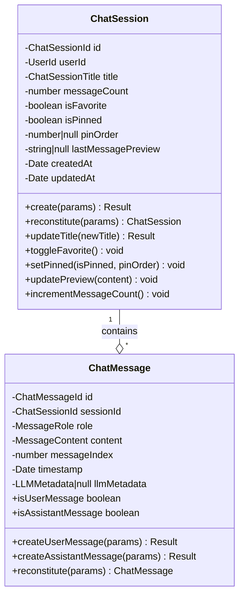

# ドメインエンティティ設計書

## 概要

本文書は、チャット履歴機能のドメインエンティティ設計を定義する。Rich Domain Modelに基づき、ビジネスロジックをエンティティに集約する。

**作成日**: 2026-01-18
**配置場所**: `packages/shared/src/features/chat-history/domain/entities/`

---

## 1. ChatSession エンティティ

### 1.1 責務

- セッションのライフサイクル管理
- お気に入り/ピン留めの状態管理
- タイトル更新とプレビュー管理
- ビジネスルールの強制（ピン留め上限等）

### 1.2 クラス設計

```typescript
// packages/shared/src/features/chat-history/domain/entities/ChatSession.ts

import { ChatSessionId } from "../value-objects/ChatSessionId.js";
import { ChatSessionTitle } from "../value-objects/ChatSessionTitle.js";
import { UserId } from "../value-objects/UserId.js";
import { Result, ok, err } from "../../../../core/Result.js";
import {
  ChatSessionError,
  InvalidTitleError,
} from "../errors/ChatSessionErrors.js";

/**
 * セッション作成パラメータ
 */
export interface CreateChatSessionParams {
  userId: string;
  title?: string;
}

/**
 * セッション再構築パラメータ（DBからの復元用）
 */
export interface ReconstituteChatSessionParams {
  id: string;
  userId: string;
  title: string;
  messageCount: number;
  isFavorite: boolean;
  isPinned: boolean;
  pinOrder: number | null;
  lastMessagePreview: string | null;
  createdAt: Date;
  updatedAt: Date;
}

/**
 * チャットセッション エンティティ
 *
 * ユーザーとAIアシスタント間の会話セッションを表すドメインエンティティ。
 * ビジネスルールをカプセル化し、不変条件を保証する。
 */
export class ChatSession {
  private constructor(
    private readonly _id: ChatSessionId,
    private readonly _userId: UserId,
    private _title: ChatSessionTitle,
    private _messageCount: number,
    private _isFavorite: boolean,
    private _isPinned: boolean,
    private _pinOrder: number | null,
    private _lastMessagePreview: string | null,
    private readonly _createdAt: Date,
    private _updatedAt: Date,
  ) {}

  // ========================================
  // Factory Methods
  // ========================================

  /**
   * 新しいセッションを作成する
   *
   * @param params 作成パラメータ
   * @returns 成功時: ChatSession, 失敗時: ChatSessionError
   */
  static create(
    params: CreateChatSessionParams,
  ): Result<ChatSession, ChatSessionError> {
    // UserIdの検証
    const userIdResult = UserId.create(params.userId);
    if (!userIdResult.ok) {
      return err(
        new ChatSessionError("INVALID_USER_ID", userIdResult.error.message),
      );
    }

    // タイトルの作成（省略時はデフォルト）
    const titleResult = params.title
      ? ChatSessionTitle.create(params.title)
      : ok(ChatSessionTitle.createDefault());

    if (!titleResult.ok) {
      return err(
        new ChatSessionError("INVALID_TITLE", titleResult.error.message),
      );
    }

    const now = new Date();

    return ok(
      new ChatSession(
        ChatSessionId.generate(),
        userIdResult.value,
        titleResult.value,
        0, // messageCount
        false, // isFavorite
        false, // isPinned
        null, // pinOrder
        null, // lastMessagePreview
        now, // createdAt
        now, // updatedAt
      ),
    );
  }

  /**
   * 永続化されたデータからセッションを再構築する
   *
   * @param params 再構築パラメータ
   * @returns ChatSession
   */
  static reconstitute(params: ReconstituteChatSessionParams): ChatSession {
    return new ChatSession(
      ChatSessionId.fromString(params.id),
      UserId.fromString(params.userId),
      ChatSessionTitle.fromString(params.title),
      params.messageCount,
      params.isFavorite,
      params.isPinned,
      params.pinOrder,
      params.lastMessagePreview,
      params.createdAt,
      params.updatedAt,
    );
  }

  // ========================================
  // Business Logic
  // ========================================

  /**
   * タイトルを更新する
   *
   * @param newTitle 新しいタイトル
   * @returns 成功時: void, 失敗時: InvalidTitleError
   */
  updateTitle(newTitle: string): Result<void, InvalidTitleError> {
    const titleResult = ChatSessionTitle.create(newTitle);
    if (!titleResult.ok) {
      return err(titleResult.error);
    }

    this._title = titleResult.value;
    this._updatedAt = new Date();
    return ok(undefined);
  }

  /**
   * お気に入り状態を切り替える
   */
  toggleFavorite(): void {
    this._isFavorite = !this._isFavorite;
    this._updatedAt = new Date();
  }

  /**
   * ピン留め状態を設定する
   *
   * @param isPinned ピン留め状態
   * @param pinOrder ピン留め順序（isPinned=trueの場合必須）
   */
  setPinned(isPinned: boolean, pinOrder: number | null): void {
    this._isPinned = isPinned;
    this._pinOrder = isPinned ? pinOrder : null;
    this._updatedAt = new Date();
  }

  /**
   * ピン留めを解除する
   */
  unpin(): void {
    this._isPinned = false;
    this._pinOrder = null;
    this._updatedAt = new Date();
  }

  /**
   * メッセージプレビューを更新する
   *
   * @param content メッセージ内容
   */
  updatePreview(content: string): void {
    const PREVIEW_MAX_LENGTH = 50;
    const PREVIEW_ELLIPSIS = "...";

    if (content.length <= PREVIEW_MAX_LENGTH) {
      this._lastMessagePreview = content;
    } else {
      this._lastMessagePreview =
        content.slice(0, PREVIEW_MAX_LENGTH - PREVIEW_ELLIPSIS.length) +
        PREVIEW_ELLIPSIS;
    }
    this._updatedAt = new Date();
  }

  /**
   * メッセージカウントをインクリメントする
   */
  incrementMessageCount(): void {
    this._messageCount++;
    this._updatedAt = new Date();
  }

  // ========================================
  // Getters
  // ========================================

  get id(): ChatSessionId {
    return this._id;
  }

  get userId(): UserId {
    return this._userId;
  }

  get title(): ChatSessionTitle {
    return this._title;
  }

  get messageCount(): number {
    return this._messageCount;
  }

  get isFavorite(): boolean {
    return this._isFavorite;
  }

  get isPinned(): boolean {
    return this._isPinned;
  }

  get pinOrder(): number | null {
    return this._pinOrder;
  }

  get lastMessagePreview(): string | null {
    return this._lastMessagePreview;
  }

  get createdAt(): Date {
    return this._createdAt;
  }

  get updatedAt(): Date {
    return this._updatedAt;
  }
}
```

### 1.3 ビジネスルール

| ルールID       | ルール                                 | 実装箇所                         |
| -------------- | -------------------------------------- | -------------------------------- |
| BR-SESSION-001 | タイトルは3〜100文字                   | ChatSessionTitle値オブジェクト   |
| BR-SESSION-002 | ピン留めは最大10件まで                 | Use Case層でチェック             |
| BR-SESSION-003 | プレビューは最大50文字（超過時は省略） | updatePreview()                  |
| BR-SESSION-004 | 空タイトルの場合はデフォルト値を設定   | ChatSessionTitle.createDefault() |

---

## 2. ChatMessage エンティティ

### 2.1 責務

- メッセージのライフサイクル管理
- ユーザー/アシスタントメッセージの区別
- LLMメタデータの管理

### 2.2 クラス設計

```typescript
// packages/shared/src/features/chat-history/domain/entities/ChatMessage.ts

import { ChatMessageId } from "../value-objects/ChatMessageId.js";
import { ChatSessionId } from "../value-objects/ChatSessionId.js";
import { MessageContent } from "../value-objects/MessageContent.js";
import { MessageRole } from "../value-objects/MessageRole.js";
import { LLMMetadata } from "../value-objects/LLMMetadata.js";
import { Result, ok, err } from "../../../../core/Result.js";
import {
  ChatMessageError,
  MissingLLMMetadataError,
} from "../errors/ChatMessageErrors.js";

/**
 * ユーザーメッセージ作成パラメータ
 */
export interface CreateUserMessageParams {
  sessionId: string;
  content: string;
  messageIndex: number;
}

/**
 * アシスタントメッセージ作成パラメータ
 */
export interface CreateAssistantMessageParams {
  sessionId: string;
  content: string;
  messageIndex: number;
  llmProvider: string;
  llmModel: string;
  llmMetadata: {
    tokenUsage?: {
      inputTokens: number;
      outputTokens: number;
      totalTokens: number;
    };
    responseTime?: number;
    temperature?: number;
    maxTokens?: number;
  };
}

/**
 * メッセージ再構築パラメータ
 */
export interface ReconstituteMessageParams {
  id: string;
  sessionId: string;
  role: "user" | "assistant";
  content: string;
  messageIndex: number;
  timestamp: Date;
  llmProvider: string | null;
  llmModel: string | null;
  llmMetadata: object | null;
}

/**
 * チャットメッセージ エンティティ
 *
 * セッション内の個別メッセージを表すドメインエンティティ。
 * ユーザーメッセージとアシスタントメッセージを区別する。
 */
export class ChatMessage {
  private constructor(
    private readonly _id: ChatMessageId,
    private readonly _sessionId: ChatSessionId,
    private readonly _role: MessageRole,
    private readonly _content: MessageContent,
    private readonly _messageIndex: number,
    private readonly _timestamp: Date,
    private readonly _llmMetadata: LLMMetadata | null,
  ) {}

  // ========================================
  // Factory Methods
  // ========================================

  /**
   * ユーザーメッセージを作成する
   *
   * @param params 作成パラメータ
   * @returns 成功時: ChatMessage, 失敗時: ChatMessageError
   */
  static createUserMessage(
    params: CreateUserMessageParams,
  ): Result<ChatMessage, ChatMessageError> {
    const sessionIdResult = ChatSessionId.create(params.sessionId);
    if (!sessionIdResult.ok) {
      return err(
        new ChatMessageError(
          "INVALID_SESSION_ID",
          sessionIdResult.error.message,
        ),
      );
    }

    const contentResult = MessageContent.create(params.content);
    if (!contentResult.ok) {
      return err(
        new ChatMessageError("INVALID_CONTENT", contentResult.error.message),
      );
    }

    return ok(
      new ChatMessage(
        ChatMessageId.generate(),
        sessionIdResult.value,
        MessageRole.User,
        contentResult.value,
        params.messageIndex,
        new Date(),
        null, // ユーザーメッセージにはLLMメタデータなし
      ),
    );
  }

  /**
   * アシスタントメッセージを作成する
   *
   * @param params 作成パラメータ
   * @returns 成功時: ChatMessage, 失敗時: ChatMessageError
   */
  static createAssistantMessage(
    params: CreateAssistantMessageParams,
  ): Result<ChatMessage, ChatMessageError> {
    const sessionIdResult = ChatSessionId.create(params.sessionId);
    if (!sessionIdResult.ok) {
      return err(
        new ChatMessageError(
          "INVALID_SESSION_ID",
          sessionIdResult.error.message,
        ),
      );
    }

    const contentResult = MessageContent.create(params.content);
    if (!contentResult.ok) {
      return err(
        new ChatMessageError("INVALID_CONTENT", contentResult.error.message),
      );
    }

    // アシスタントメッセージにはLLMメタデータ必須
    const llmMetadataResult = LLMMetadata.create({
      provider: params.llmProvider,
      model: params.llmModel,
      tokenUsage: params.llmMetadata.tokenUsage,
      responseTime: params.llmMetadata.responseTime,
      temperature: params.llmMetadata.temperature,
      maxTokens: params.llmMetadata.maxTokens,
    });

    if (!llmMetadataResult.ok) {
      return err(
        new ChatMessageError(
          "INVALID_LLM_METADATA",
          llmMetadataResult.error.message,
        ),
      );
    }

    return ok(
      new ChatMessage(
        ChatMessageId.generate(),
        sessionIdResult.value,
        MessageRole.Assistant,
        contentResult.value,
        params.messageIndex,
        new Date(),
        llmMetadataResult.value,
      ),
    );
  }

  /**
   * 永続化されたデータからメッセージを再構築する
   *
   * @param params 再構築パラメータ
   * @returns ChatMessage
   */
  static reconstitute(params: ReconstituteMessageParams): ChatMessage {
    return new ChatMessage(
      ChatMessageId.fromString(params.id),
      ChatSessionId.fromString(params.sessionId),
      params.role === "user" ? MessageRole.User : MessageRole.Assistant,
      MessageContent.fromString(params.content),
      params.messageIndex,
      params.timestamp,
      params.llmMetadata
        ? LLMMetadata.reconstitute(
            params.llmProvider!,
            params.llmModel!,
            params.llmMetadata,
          )
        : null,
    );
  }

  // ========================================
  // Getters
  // ========================================

  get id(): ChatMessageId {
    return this._id;
  }

  get sessionId(): ChatSessionId {
    return this._sessionId;
  }

  get role(): MessageRole {
    return this._role;
  }

  get content(): MessageContent {
    return this._content;
  }

  get messageIndex(): number {
    return this._messageIndex;
  }

  get timestamp(): Date {
    return this._timestamp;
  }

  get llmMetadata(): LLMMetadata | null {
    return this._llmMetadata;
  }

  /**
   * ユーザーメッセージかどうか
   */
  get isUserMessage(): boolean {
    return this._role.isUser;
  }

  /**
   * アシスタントメッセージかどうか
   */
  get isAssistantMessage(): boolean {
    return this._role.isAssistant;
  }
}
```

### 2.3 ビジネスルール

| ルールID       | ルール                                      | 実装箇所                     |
| -------------- | ------------------------------------------- | ---------------------------- |
| BR-MESSAGE-001 | メッセージは1〜100,000文字                  | MessageContent値オブジェクト |
| BR-MESSAGE-002 | アシスタントメッセージにはLLMメタデータ必須 | createAssistantMessage()     |
| BR-MESSAGE-003 | messageIndexはセッション内で連番            | Use Case層で管理             |

---

## 3. エンティティ間の関係



---

## 4. 不変条件

### ChatSession

1. `id` は一度設定されたら変更不可
2. `userId` は一度設定されたら変更不可
3. `createdAt` は一度設定されたら変更不可
4. `title` は常に3〜100文字の有効な値を持つ
5. `isPinned` が `false` の場合、`pinOrder` は `null`

### ChatMessage

1. `id` は一度設定されたら変更不可
2. `sessionId` は一度設定されたら変更不可
3. `role` は一度設定されたら変更不可
4. `content` は一度設定されたら変更不可
5. `messageIndex` は一度設定されたら変更不可
6. `timestamp` は一度設定されたら変更不可
7. `role` が `assistant` の場合、`llmMetadata` は非null

---

## 5. テスト容易性

### ファクトリーメソッドによるテスト

```typescript
// テスト例
describe("ChatSession", () => {
  describe("create", () => {
    it("should create a session with default title", () => {
      const result = ChatSession.create({ userId: "user-123" });

      expect(result.ok).toBe(true);
      expect(result.value.title.value).toMatch(/^新しいチャット/);
    });

    it("should fail with invalid userId", () => {
      const result = ChatSession.create({ userId: "" });

      expect(result.ok).toBe(false);
      expect(result.error.code).toBe("INVALID_USER_ID");
    });
  });
});
```

### モック不要の純粋なドメインテスト

エンティティは外部依存を持たないため、モックなしでテスト可能。
