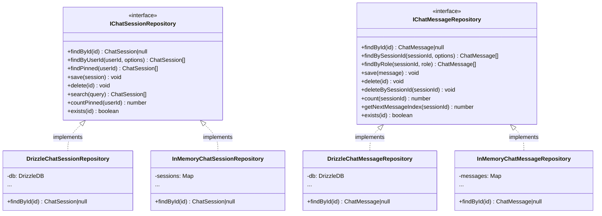

# リポジトリインターフェース設計書

## 概要

本文書は、チャット履歴機能のリポジトリインターフェース設計を定義する。リポジトリインターフェースはDomain層に配置し、依存性逆転の原則（DIP）を実現する。

**作成日**: 2026-01-18
**配置場所**: `packages/shared/src/features/chat-history/domain/repositories/`

---

## 1. IChatSessionRepository

### 1.1 責務

- チャットセッションの永続化
- セッションの検索・取得
- ピン留め数のカウント

### 1.2 インターフェース設計

```typescript
// packages/shared/src/features/chat-history/domain/repositories/IChatSessionRepository.ts

import type { ChatSession } from "../entities/ChatSession.js";
import type { ChatSessionId } from "../value-objects/ChatSessionId.js";
import type { UserId } from "../value-objects/UserId.js";

/**
 * セッション検索オプション
 */
export interface FindSessionsOptions {
  /** 取得件数制限 */
  limit?: number;
  /** オフセット（ページネーション） */
  offset?: number;
  /** ソート順序 */
  orderBy?: "createdAt" | "updatedAt";
  /** ソート方向 */
  orderDirection?: "asc" | "desc";
}

/**
 * セッション検索クエリ
 */
export interface SessionSearchQuery {
  /** ユーザーID */
  userId: UserId;
  /** キーワード検索（タイトル・プレビュー対象） */
  keyword?: string;
  /** お気に入りフィルター */
  isFavorite?: boolean;
  /** ピン留めフィルター */
  isPinned?: boolean;
  /** 取得件数制限 */
  limit?: number;
  /** オフセット */
  offset?: number;
}

/**
 * チャットセッションリポジトリ インターフェース
 *
 * チャットセッションの永続化を抽象化する。
 * Domain層に配置し、実装はInfrastructure層で行う。
 */
export interface IChatSessionRepository {
  /**
   * IDでセッションを取得する
   *
   * @param id セッションID
   * @returns セッション（存在しない場合はnull）
   */
  findById(id: ChatSessionId): Promise<ChatSession | null>;

  /**
   * ユーザーIDで全セッションを取得する
   *
   * @param userId ユーザーID
   * @param options 取得オプション
   * @returns セッション一覧
   */
  findByUserId(
    userId: UserId,
    options?: FindSessionsOptions,
  ): Promise<ChatSession[]>;

  /**
   * ピン留めセッションを取得する
   *
   * @param userId ユーザーID
   * @returns ピン留めセッション一覧（pinOrderの昇順）
   */
  findPinned(userId: UserId): Promise<ChatSession[]>;

  /**
   * セッションを保存する（新規作成または更新）
   *
   * @param session 保存するセッション
   */
  save(session: ChatSession): Promise<void>;

  /**
   * セッションを論理削除する
   *
   * @param id セッションID
   */
  delete(id: ChatSessionId): Promise<void>;

  /**
   * セッションを検索する
   *
   * @param query 検索クエリ
   * @returns 検索結果
   */
  search(query: SessionSearchQuery): Promise<ChatSession[]>;

  /**
   * ユーザーのピン留めセッション数をカウントする
   *
   * @param userId ユーザーID
   * @returns ピン留め数
   */
  countPinned(userId: UserId): Promise<number>;

  /**
   * セッションが存在するか確認する
   *
   * @param id セッションID
   * @returns 存在する場合true
   */
  exists(id: ChatSessionId): Promise<boolean>;
}
```

---

## 2. IChatMessageRepository

### 2.1 責務

- チャットメッセージの永続化
- メッセージの検索・取得
- メッセージインデックスの管理

### 2.2 インターフェース設計

```typescript
// packages/shared/src/features/chat-history/domain/repositories/IChatMessageRepository.ts

import type { ChatMessage } from "../entities/ChatMessage.js";
import type { ChatMessageId } from "../value-objects/ChatMessageId.js";
import type { ChatSessionId } from "../value-objects/ChatSessionId.js";
import type { MessageRole } from "../value-objects/MessageRole.js";

/**
 * メッセージ取得オプション
 */
export interface FindMessagesOptions {
  /** 取得件数制限 */
  limit?: number;
  /** オフセット（ページネーション） */
  offset?: number;
  /** ロールフィルター */
  role?: MessageRole;
}

/**
 * チャットメッセージリポジトリ インターフェース
 *
 * チャットメッセージの永続化を抽象化する。
 * Domain層に配置し、実装はInfrastructure層で行う。
 */
export interface IChatMessageRepository {
  /**
   * IDでメッセージを取得する
   *
   * @param id メッセージID
   * @returns メッセージ（存在しない場合はnull）
   */
  findById(id: ChatMessageId): Promise<ChatMessage | null>;

  /**
   * セッションIDで全メッセージを取得する
   *
   * @param sessionId セッションID
   * @param options 取得オプション
   * @returns メッセージ一覧（messageIndexの昇順）
   */
  findBySessionId(
    sessionId: ChatSessionId,
    options?: FindMessagesOptions,
  ): Promise<ChatMessage[]>;

  /**
   * ロール別にメッセージを取得する
   *
   * @param sessionId セッションID
   * @param role メッセージロール
   * @returns メッセージ一覧
   */
  findByRole(
    sessionId: ChatSessionId,
    role: MessageRole,
  ): Promise<ChatMessage[]>;

  /**
   * メッセージを保存する
   *
   * @param message 保存するメッセージ
   */
  save(message: ChatMessage): Promise<void>;

  /**
   * メッセージを削除する
   *
   * @param id メッセージID
   */
  delete(id: ChatMessageId): Promise<void>;

  /**
   * セッション内の全メッセージを削除する
   *
   * @param sessionId セッションID
   */
  deleteBySessionId(sessionId: ChatSessionId): Promise<void>;

  /**
   * セッション内のメッセージ数をカウントする
   *
   * @param sessionId セッションID
   * @returns メッセージ数
   */
  count(sessionId: ChatSessionId): Promise<number>;

  /**
   * 次のメッセージインデックスを取得する
   *
   * @param sessionId セッションID
   * @returns 次のメッセージインデックス（0始まり）
   */
  getNextMessageIndex(sessionId: ChatSessionId): Promise<number>;

  /**
   * メッセージが存在するか確認する
   *
   * @param id メッセージID
   * @returns 存在する場合true
   */
  exists(id: ChatMessageId): Promise<boolean>;
}
```

---

## 3. 設計原則

### 3.1 依存性逆転の原則（DIP）

```
┌─────────────────────────────────────────────┐
│             Domain Layer                     │
│  ┌─────────────────────────────────────┐    │
│  │    IChatSessionRepository           │    │
│  │    IChatMessageRepository           │    │
│  └─────────────────────────────────────┘    │
│                     ▲                        │
│                     │ implements             │
└─────────────────────┼───────────────────────┘
                      │
┌─────────────────────┼───────────────────────┐
│             Infrastructure Layer             │
│  ┌─────────────────┴───────────────────┐    │
│  │  DrizzleChatSessionRepository       │    │
│  │  DrizzleChatMessageRepository       │    │
│  └─────────────────────────────────────┘    │
└─────────────────────────────────────────────┘
```

### 3.2 リポジトリインターフェースの特徴

| 特徴               | 説明                                       |
| ------------------ | ------------------------------------------ |
| ドメイン型のみ使用 | 値オブジェクト、エンティティのみを扱う     |
| インフラ非依存     | Drizzle、SQLiteへの依存なし                |
| Promise戻り値      | 非同期操作を前提                           |
| null許容           | 存在しない場合はnullを返す（例外ではない） |

### 3.3 命名規則

| メソッドプレフィックス | 用途               |
| ---------------------- | ------------------ |
| `findById`             | ID指定の単一取得   |
| `findByXxx`            | 条件指定の複数取得 |
| `save`                 | 新規作成または更新 |
| `delete`               | 削除               |
| `count`                | カウント           |
| `exists`               | 存在確認           |

---

## 4. テスト用のInMemory実装

```typescript
// packages/shared/src/features/chat-history/infrastructure/persistence/InMemoryChatSessionRepository.ts

import type { IChatSessionRepository } from "../../domain/repositories/IChatSessionRepository.js";
import type { ChatSession } from "../../domain/entities/ChatSession.js";
// ...

/**
 * テスト用のインメモリリポジトリ実装
 */
export class InMemoryChatSessionRepository implements IChatSessionRepository {
  private sessions: Map<string, ChatSession> = new Map();

  async findById(id: ChatSessionId): Promise<ChatSession | null> {
    return this.sessions.get(id.value) ?? null;
  }

  async findByUserId(userId: UserId): Promise<ChatSession[]> {
    return Array.from(this.sessions.values())
      .filter((s) => s.userId.equals(userId))
      .sort((a, b) => b.createdAt.getTime() - a.createdAt.getTime());
  }

  async save(session: ChatSession): Promise<void> {
    this.sessions.set(session.id.value, session);
  }

  async delete(id: ChatSessionId): Promise<void> {
    this.sessions.delete(id.value);
  }

  // ... 他のメソッド

  // テスト用ヘルパー
  clear(): void {
    this.sessions.clear();
  }
}
```

---

## 5. 依存関係図


