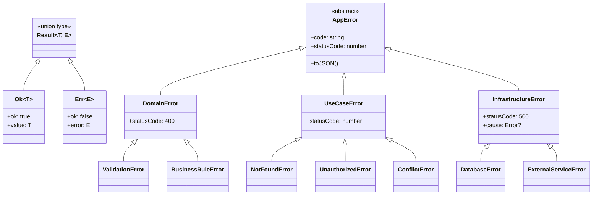

# Result型設計書

## 概要

本文書は、Railway-Oriented Programming（ROP）パターンに基づくResult型の設計を定義する。
Result型は例外ベースのエラーハンドリングを置き換え、型安全なエラー処理を実現する。

**作成日**: 2026-01-18
**配置場所**: `packages/shared/src/core/Result.ts`

---

## 1. 設計目標

1. **型安全性**: エラーハンドリングを型レベルで強制
2. **明示的エラー**: 例外を使わず、戻り値でエラーを表現
3. **合成可能性**: Result同士を連鎖・合成可能
4. **パフォーマンス**: 例外スローのオーバーヘッド回避

---

## 2. Result型定義

### 2.1 基本型

```typescript
// packages/shared/src/core/Result.ts

/**
 * 成功結果
 */
export interface Ok<T> {
  readonly ok: true;
  readonly value: T;
}

/**
 * 失敗結果
 */
export interface Err<E> {
  readonly ok: false;
  readonly error: E;
}

/**
 * Result型（成功または失敗）
 */
export type Result<T, E> = Ok<T> | Err<E>;

/**
 * 成功結果を作成する
 */
export function ok<T>(value: T): Ok<T> {
  return { ok: true, value };
}

/**
 * 失敗結果を作成する
 */
export function err<E>(error: E): Err<E> {
  return { ok: false, error };
}
```

### 2.2 型ガード

```typescript
/**
 * 成功かどうかを判定する型ガード
 */
export function isOk<T, E>(result: Result<T, E>): result is Ok<T> {
  return result.ok;
}

/**
 * 失敗かどうかを判定する型ガード
 */
export function isErr<T, E>(result: Result<T, E>): result is Err<E> {
  return !result.ok;
}
```

---

## 3. ユーティリティ関数

### 3.1 map系関数

```typescript
/**
 * 成功値を変換する
 */
export function map<T, U, E>(
  result: Result<T, E>,
  fn: (value: T) => U,
): Result<U, E> {
  if (result.ok) {
    return ok(fn(result.value));
  }
  return result;
}

/**
 * 失敗値を変換する
 */
export function mapErr<T, E, F>(
  result: Result<T, E>,
  fn: (error: E) => F,
): Result<T, F> {
  if (!result.ok) {
    return err(fn(result.error));
  }
  return result;
}
```

### 3.2 flatMap（bind/chain）

```typescript
/**
 * 成功値に対して別のResult返却関数を適用する
 * Railway-Oriented Programmingの中核
 */
export function flatMap<T, U, E>(
  result: Result<T, E>,
  fn: (value: T) => Result<U, E>,
): Result<U, E> {
  if (result.ok) {
    return fn(result.value);
  }
  return result;
}

/**
 * flatMapのエイリアス（チェーン用）
 */
export const andThen = flatMap;
```

### 3.3 unwrap系関数

```typescript
/**
 * 成功値を取り出す（失敗時はデフォルト値）
 */
export function unwrapOr<T, E>(result: Result<T, E>, defaultValue: T): T {
  if (result.ok) {
    return result.value;
  }
  return defaultValue;
}

/**
 * 成功値を取り出す（失敗時は関数実行）
 */
export function unwrapOrElse<T, E>(
  result: Result<T, E>,
  fn: (error: E) => T,
): T {
  if (result.ok) {
    return result.value;
  }
  return fn(result.error);
}

/**
 * 成功値を取り出す（失敗時は例外スロー）
 * 注意: 最終手段としてのみ使用
 */
export function unwrap<T, E>(result: Result<T, E>): T {
  if (result.ok) {
    return result.value;
  }
  throw new Error(`Called unwrap on an Err value: ${String(result.error)}`);
}
```

### 3.4 combine（複数Result合成）

```typescript
/**
 * 複数のResultを合成する（全成功または最初の失敗）
 */
export function combine<T, E>(results: Result<T, E>[]): Result<T[], E> {
  const values: T[] = [];

  for (const result of results) {
    if (!result.ok) {
      return result;
    }
    values.push(result.value);
  }

  return ok(values);
}

/**
 * オブジェクト形式のResult合成
 */
export function combineObject<T extends Record<string, unknown>, E>(results: {
  [K in keyof T]: Result<T[K], E>;
}): Result<T, E> {
  const obj = {} as T;

  for (const key in results) {
    const result = results[key];
    if (!result.ok) {
      return result;
    }
    obj[key] = result.value;
  }

  return ok(obj);
}
```

---

## 4. 非同期対応

### 4.1 AsyncResult型

```typescript
/**
 * 非同期Result
 */
export type AsyncResult<T, E> = Promise<Result<T, E>>;

/**
 * 非同期mapユーティリティ
 */
export async function mapAsync<T, U, E>(
  result: AsyncResult<T, E>,
  fn: (value: T) => U | Promise<U>,
): AsyncResult<U, E> {
  const awaited = await result;
  if (awaited.ok) {
    return ok(await fn(awaited.value));
  }
  return awaited;
}

/**
 * 非同期flatMapユーティリティ
 */
export async function flatMapAsync<T, U, E>(
  result: AsyncResult<T, E>,
  fn: (value: T) => AsyncResult<U, E>,
): AsyncResult<U, E> {
  const awaited = await result;
  if (awaited.ok) {
    return fn(awaited.value);
  }
  return awaited;
}
```

### 4.2 fromPromise（例外をResultに変換）

```typescript
/**
 * Promiseの例外をResultに変換する
 */
export async function fromPromise<T, E>(
  promise: Promise<T>,
  errorMapper: (error: unknown) => E,
): AsyncResult<T, E> {
  try {
    const value = await promise;
    return ok(value);
  } catch (error) {
    return err(errorMapper(error));
  }
}

/**
 * try-catchをResultに変換する（同期版）
 */
export function fromTry<T, E>(
  fn: () => T,
  errorMapper: (error: unknown) => E,
): Result<T, E> {
  try {
    return ok(fn());
  } catch (error) {
    return err(errorMapper(error));
  }
}
```

---

## 5. エラー型階層

### 5.1 基底エラー型

```typescript
// packages/shared/src/core/errors/AppError.ts

/**
 * アプリケーションエラーの基底型
 */
export abstract class AppError extends Error {
  abstract readonly code: string;
  abstract readonly statusCode: number;

  constructor(message: string) {
    super(message);
    this.name = this.constructor.name;
  }

  /**
   * JSONシリアライズ用
   */
  toJSON(): Record<string, unknown> {
    return {
      name: this.name,
      code: this.code,
      message: this.message,
      statusCode: this.statusCode,
    };
  }
}
```

### 5.2 ドメインエラー

```typescript
// packages/shared/src/core/errors/DomainError.ts

import { AppError } from "./AppError.js";

/**
 * ドメイン層のエラー基底クラス
 */
export abstract class DomainError extends AppError {
  readonly statusCode = 400; // Bad Request

  constructor(
    readonly code: string,
    message: string,
  ) {
    super(message);
  }
}

/**
 * バリデーションエラー
 */
export class ValidationError extends DomainError {
  constructor(
    readonly field: string,
    message: string,
  ) {
    super("VALIDATION_ERROR", `${field}: ${message}`);
  }
}

/**
 * ビジネスルール違反エラー
 */
export class BusinessRuleError extends DomainError {
  constructor(code: string, message: string) {
    super(code, message);
  }
}
```

### 5.3 Use Caseエラー

```typescript
// packages/shared/src/core/errors/UseCaseError.ts

import { AppError } from "./AppError.js";

/**
 * Use Case層のエラー基底クラス
 */
export class UseCaseError extends AppError {
  readonly statusCode: number;

  constructor(
    readonly code: string,
    message: string,
    statusCode = 400,
  ) {
    super(message);
    this.statusCode = statusCode;
  }
}

/**
 * リソース未発見エラー
 */
export class NotFoundError extends UseCaseError {
  constructor(resourceType: string, id: string) {
    super("NOT_FOUND", `${resourceType} not found: ${id}`, 404);
  }
}

/**
 * 権限エラー
 */
export class UnauthorizedError extends UseCaseError {
  constructor(message = "Unauthorized") {
    super("UNAUTHORIZED", message, 401);
  }
}

/**
 * 競合エラー
 */
export class ConflictError extends UseCaseError {
  constructor(message: string) {
    super("CONFLICT", message, 409);
  }
}
```

### 5.4 インフラエラー

```typescript
// packages/shared/src/core/errors/InfrastructureError.ts

import { AppError } from "./AppError.js";

/**
 * インフラ層のエラー基底クラス
 */
export class InfrastructureError extends AppError {
  readonly statusCode = 500;

  constructor(
    readonly code: string,
    message: string,
    readonly cause?: Error,
  ) {
    super(message);
    if (cause) {
      this.stack = `${this.stack}\nCaused by: ${cause.stack}`;
    }
  }
}

/**
 * データベースエラー
 */
export class DatabaseError extends InfrastructureError {
  constructor(message: string, cause?: Error) {
    super("DATABASE_ERROR", message, cause);
  }
}

/**
 * 外部サービスエラー
 */
export class ExternalServiceError extends InfrastructureError {
  constructor(serviceName: string, message: string, cause?: Error) {
    super("EXTERNAL_SERVICE_ERROR", `${serviceName}: ${message}`, cause);
  }
}
```

---

## 6. チャット履歴機能用エラー

```typescript
// packages/shared/src/features/chat-history/domain/errors/ChatHistoryErrors.ts

import {
  DomainError,
  BusinessRuleError,
} from "../../../../core/errors/DomainError.js";

/**
 * セッションタイトル検証エラー
 */
export class InvalidSessionTitleError extends DomainError {
  constructor(title: string, reason: string) {
    super(
      "INVALID_SESSION_TITLE",
      `Invalid session title "${title}": ${reason}`,
    );
  }
}

/**
 * メッセージコンテンツ検証エラー
 */
export class InvalidMessageContentError extends DomainError {
  constructor(reason: string) {
    super("INVALID_MESSAGE_CONTENT", `Invalid message content: ${reason}`);
  }
}

/**
 * ピン留め上限エラー
 */
export class MaxPinnedSessionsError extends BusinessRuleError {
  constructor(maxCount: number) {
    super(
      "MAX_PINNED_SESSIONS",
      `Maximum pinned sessions (${maxCount}) reached`,
    );
  }
}

/**
 * セッションアーカイブ済みエラー
 */
export class SessionArchivedError extends BusinessRuleError {
  constructor(sessionId: string) {
    super(
      "SESSION_ARCHIVED",
      `Session ${sessionId} is archived and cannot be modified`,
    );
  }
}
```

---

## 7. 使用例

### 7.1 Use Caseでの使用

```typescript
import { ok, err, type Result } from "@repo/shared/core/Result";
import { NotFoundError } from "@repo/shared/core/errors/UseCaseError";
import type { ChatSessionDTO } from "../dto/ChatSessionDTO";

async function getSession(
  sessionId: string,
): Promise<Result<ChatSessionDTO, NotFoundError>> {
  const session = await repository.findById(sessionId);

  if (!session) {
    return err(new NotFoundError("ChatSession", sessionId));
  }

  return ok(ChatSessionDTO.fromDomain(session));
}
```

### 7.2 チェーン（Railway-Oriented Programming）

```typescript
import { flatMapAsync } from "@repo/shared/core/Result";

async function createSessionWithMessage(
  input: CreateSessionWithMessageInput,
): Promise<Result<ChatSessionDTO, UseCaseError>> {
  // セッション作成 → メッセージ追加 → DTO変換
  return flatMapAsync(createSession(input.sessionInput), async (session) =>
    flatMapAsync(
      addMessage({ sessionId: session.id, ...input.messageInput }),
      async () => ok(session),
    ),
  );
}
```

### 7.3 UIでの使用

```typescript
const result = await createSession(input);

if (result.ok) {
  // 成功時の処理
  setCurrentSession(result.value);
} else {
  // エラー時の処理
  showError(result.error.message);
}
```

---

## 8. 依存関係図



---

## 9. 例外からResultへの移行ガイド

### 9.1 移行前（例外ベース）

```typescript
// Before: 例外ベース
async function getSession(id: string): Promise<ChatSession> {
  const session = await repository.findById(id);
  if (!session) {
    throw new Error("Session not found"); // 例外スロー
  }
  return session;
}
```

### 9.2 移行後（Resultベース）

```typescript
// After: Resultベース
async function getSession(
  id: string,
): Promise<Result<ChatSession, NotFoundError>> {
  const session = await repository.findById(id);
  if (!session) {
    return err(new NotFoundError("ChatSession", id)); // Resultで返却
  }
  return ok(session);
}
```

### 9.3 移行ルール

| 移行前                 | 移行後                                   |
| ---------------------- | ---------------------------------------- |
| `throw new Error(...)` | `return err(new XxxError(...))`          |
| `try { } catch { }`    | `if (!result.ok) { }`                    |
| `Promise<T>`           | `Promise<Result<T, E>>`                  |
| 複数catch              | エラー型のunion (`E1 \| E2`)             |
| 例外の再スロー         | `return result;`（エラーをそのまま返す） |
