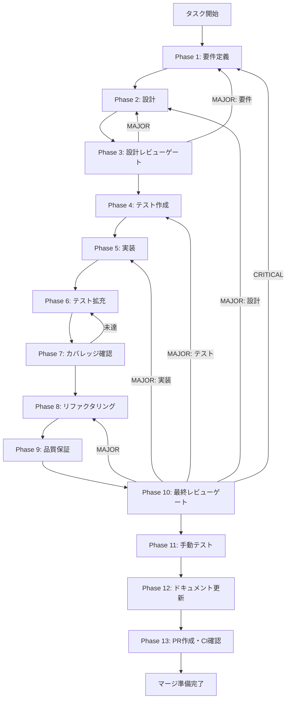

# community-summarization - タスク実行仕様書

## ユーザーからの元の指示

```
コミュニティ要約生成 - タスク指示書
task-08-03-community-summarization.md
```

## メタ情報

| 項目         | 内容                          |
| ------------ | ----------------------------- |
| タスクID     | CONV-08-03                    |
| タスク名     | community-summarization       |
| 親タスク     | CONV-08 (Knowledge Graph構築) |
| 依存タスク   | CONV-08-02 (コミュニティ検出) |
| 分類         | 新機能                        |
| 対象機能     | コミュニティ要約生成          |
| 優先度       | 高                            |
| 見積もり規模 | 中規模                        |
| ステータス   | 未実施                        |
| 作成日       | 2026-01-10                    |

---

## タスク概要

### 目的

検出されたコミュニティごとにLLMで要約を生成し、グローバルクエリへの回答に使用できる形式で保存する。要約の埋め込みも生成してセマンティック検索を可能にする。

### 背景

#### GraphRAGにおけるコミュニティ要約の役割

- **グローバルクエリ対応**: 「全体のテーマは？」等の包括的な質問に回答
- **VectorRAG単体では不可能なクエリタイプに対応**: 個別チャンクでは回答できない横断的な質問
- **階層的な要約で詳細度を調整可能**: Level 0（詳細）→ Level N（抽象）
- **ベンチマーク結果**: VectorRAG単体比+24%の精度向上（81.67% vs 57.50%）

### 最終ゴール

1. `CommunitySummarizer` サービスが実装されている
2. 単一コミュニティの要約生成が動作する
3. 全コミュニティの一括要約生成が動作する（階層順）
4. 要約の埋め込み生成が動作する
5. 要約のセマンティック検索が動作する
6. 全テストがパスし、カバレッジ目標を達成

### 成果物一覧

| 種別             | 成果物                                          | 配置先                                                       |
| ---------------- | ----------------------------------------------- | ------------------------------------------------------------ |
| インターフェース | ICommunitySummarizer                            | `packages/shared/src/services/graph/interfaces/`             |
| サービス         | CommunitySummarizer                             | `packages/shared/src/services/graph/community-summarizer.ts` |
| プロンプト       | buildCommunitySummaryPrompt                     | `packages/shared/src/services/graph/prompts/`                |
| 型定義           | CommunitySummary, CommunitySummarizationOptions | `packages/shared/src/services/graph/types.ts`                |
| テスト           | community-summarizer.test.ts                    | `packages/shared/src/services/graph/__tests__/`              |
| ドキュメント     | Phase別成果物                                   | `outputs/phase-*/`                                           |
| PR               | GitHub Pull Request                             | GitHub UI                                                    |

---

## 参照ファイル

本仕様書の実装は以下を参照：

### システム仕様（aiworkflow-requirements）

> 実装前に必ず以下のシステム仕様を確認し、既存設計との整合性を確保してください。

| 参照資料                  | パス                                                                                        | 内容                                                |
| ------------------------- | ------------------------------------------------------------------------------------------- | --------------------------------------------------- |
| コミュニティ検出仕様      | `.claude/skills/aiworkflow-requirements/references/interfaces-rag-community-detection.md`   | ICommunityDetector, Community型, CommunityStructure |
| Knowledge Graphストア仕様 | `.claude/skills/aiworkflow-requirements/references/interfaces-rag-knowledge-graph-store.md` | IKnowledgeGraphStore, StoredEntity, StoredRelation  |
| RAGアーキテクチャ         | `.claude/skills/aiworkflow-requirements/references/architecture-rag.md`                     | GraphRAG全体設計、CommunityEntity型                 |
| データベーススキーマ      | `.claude/skills/aiworkflow-requirements/references/database-schema.md`                      | communitiesテーブル、community_summariesテーブル    |

### タスク指示書

| 参照資料     | パス                                                                      | 内容             |
| ------------ | ------------------------------------------------------------------------- | ---------------- |
| タスク指示書 | `docs/30-workflows/unassigned-task/task-08-03-community-summarization.md` | 元のタスク指示書 |

**仕様検索**: `node .claude/skills/aiworkflow-requirements/scripts/search-spec.mjs "community"`

---

## タスク分解サマリー

| ID     | フェーズ | サブタスク名         | 責務                                 | 依存 |
| ------ | -------- | -------------------- | ------------------------------------ | ---- |
| T-01-1 | Phase 1  | 要件定義             | 目的・スコープ・受け入れ基準定義     | -    |
| T-02-1 | Phase 2  | 設計                 | アーキテクチャ・詳細設計             | T-01 |
| T-03-1 | Phase 3  | 設計レビューゲート   | 要件・設計の妥当性検証               | T-02 |
| T-04-1 | Phase 4  | テスト作成           | TDD: Red（失敗するテスト作成）       | T-03 |
| T-05-1 | Phase 5  | 実装                 | TDD: Green（テストを通す実装）       | T-04 |
| T-06-1 | Phase 6  | テスト拡充           | カバレッジ目標達成に向けた追加テスト | T-05 |
| T-07-1 | Phase 7  | テストカバレッジ確認 | カバレッジ目標検証・統合テスト実行   | T-06 |
| T-08-1 | Phase 8  | リファクタリング     | TDD: Refactor（品質改善）            | T-07 |
| T-09-1 | Phase 9  | 品質保証             | 静的解析・セキュリティ・性能         | T-08 |
| T-10-1 | Phase 10 | 最終レビューゲート   | 全体品質・整合性検証                 | T-09 |
| T-11-1 | Phase 11 | 手動テスト検証       | UX・実環境動作確認                   | T-10 |
| T-12-1 | Phase 12 | ドキュメント更新     | ドキュメント更新・仕様反映           | T-11 |
| T-13-1 | Phase 13 | PR作成               | `/ai:diff-to-pr` でコミット・PR      | T-12 |

**総サブタスク数**: 13個

---

## 実行フロー図



---

## Phase一覧

| Phase | 名称               | 仕様書                                                 | ステータス |
| ----- | ------------------ | ------------------------------------------------------ | ---------- |
| 1     | 要件定義           | [phase-1-requirements.md](phase-1-requirements.md)     | 未実施     |
| 2     | 設計               | [phase-2-design.md](phase-2-design.md)                 | 未実施     |
| 3     | 設計レビューゲート | [phase-3-design-review.md](phase-3-design-review.md)   | 未実施     |
| 4     | テスト作成         | [phase-4-test-creation.md](phase-4-test-creation.md)   | 未実施     |
| 5     | 実装               | [phase-5-implementation.md](phase-5-implementation.md) | 未実施     |
| 6     | テスト拡充         | [phase-6-test-expansion.md](phase-6-test-expansion.md) | 未実施     |
| 7     | カバレッジ確認     | [phase-7-coverage-check.md](phase-7-coverage-check.md) | 未実施     |
| 8     | リファクタリング   | [phase-8-refactoring.md](phase-8-refactoring.md)       | 未実施     |
| 9     | 品質保証           | [phase-9-quality.md](phase-9-quality.md)               | 未実施     |
| 10    | 最終レビューゲート | [phase-10-final-review.md](phase-10-final-review.md)   | 未実施     |
| 11    | 手動テスト         | [phase-11-manual-test.md](phase-11-manual-test.md)     | 未実施     |
| 12    | ドキュメント更新   | [phase-12-documentation.md](phase-12-documentation.md) | 未実施     |
| 13    | PR作成             | [phase-13-pr-creation.md](phase-13-pr-creation.md)     | 未実施     |

---

## テストカバレッジ目標

### ユニットテスト

| 指標              | 最低基準 | 推奨基準 |
| ----------------- | -------- | -------- |
| Line Coverage     | 80%      | 90%      |
| Branch Coverage   | 60%      | 70%      |
| Function Coverage | 80%      | 90%      |

### 結合テスト

| 指標                         | 目標 |
| ---------------------------- | ---- |
| APIエンドポイント            | 100% |
| モジュール間インターフェース | 100% |
| 正常系シナリオ               | 100% |
| 異常系シナリオ               | 80%+ |
| 外部連携ポイント             | 100% |

---

## 統合テスト連携（Phase 1〜11で必須）

各Phaseで以下の統合テスト連携アクションを実施すること:

| Phase | 統合テスト連携アクション                                                                |
| ----- | --------------------------------------------------------------------------------------- |
| 1     | 接続要件（LLM/Embedding/DB）を要件に明記                                                |
| 2     | 統合ポイント/契約（ILLMProvider・IEmbeddingProvider・ICommunityRepository）を設計に反映 |
| 3     | 統合テスト観点のレビューゲートを実施                                                    |
| 4     | 統合テストシナリオを全カテゴリで作成                                                    |
| 5     | LLMProvider/EmbeddingProvider接続の実装とテスト支援コード整備                           |
| 6     | 統合テストの拡充（全カテゴリのカバレッジ向上）                                          |
| 7     | 統合テストの再実行とゲート判定                                                          |
| 8     | リファクタ後の統合テスト継続成功を確認                                                  |
| 9     | 品質保証で統合テスト結果を確認                                                          |
| 10    | 最終レビューで統合テスト結果を確認                                                      |
| 11    | 手動統合テスト（LLM呼び出し・DB保存）を確認                                             |

---

## Phase完了時の必須アクション

**各Phase完了時に以下を必ず実行すること:**

1. **タスク100%実行**: Phase内で指定された全タスクを完全に実行
2. **成果物確認**: 全ての必須成果物が生成されていることを検証
3. **実行記録**: 実行タスクの結果を記録
4. **artifacts.json更新**: Phase完了ステータスを更新
5. **Phase末端の実行確認**: 各タスクを100%実行し、各タスクを完遂した旨を必ず明記

```bash
# Phase完了時の検証コマンド
node .claude/skills/task-specification-creator/scripts/validate-phase-output.mjs docs/30-workflows/community-summarization --phase {{PHASE_NUMBER}}

# Phase完了・成果物登録
node .claude/skills/task-specification-creator/scripts/complete-phase.mjs \
  --workflow docs/30-workflows/community-summarization --phase {{PHASE_NUMBER}} --artifacts "..."
```
