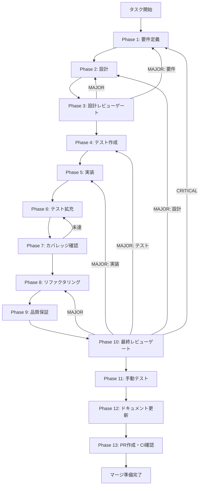

# community-visualization-ui - タスク実行仕様書

## ユーザーからの元の指示

```
コミュニティ構造可視化UIを実装する。コミュニティ検出（CONV-08-02）とコミュニティ要約生成（CONV-08-03）で作成されたデータをユーザーが視覚的に確認・探索できるUIコンポーネントを作成する。
```

## メタ情報

| 項目         | 内容                       |
| ------------ | -------------------------- |
| タスクID     | CONV-08-05                 |
| タスク名     | community-visualization-ui |
| 分類         | 改善                       |
| 対象機能     | UI・グラフ可視化           |
| 優先度       | 中                         |
| 見積もり規模 | 中規模                     |
| ステータス   | 未実施                     |
| 作成日       | 2026-01-13                 |

---

## タスク概要

### 目的

Knowledge Graphで検出されたコミュニティの階層構造をユーザーが直感的に理解・探索できるUIを実装する。グラフ/ツリー形式の可視化と詳細パネルによって、コミュニティ要約・メンバーエンティティへのアクセスを提供する。

### 背景

CONV-08-02（Leidenコミュニティ検出）とCONV-08-03（コミュニティ要約生成）により、Knowledge Graph上でコミュニティの検出・要約が可能になった。しかし、これらのコミュニティ構造をユーザーが視覚的に確認・探索する手段がないため、機能の価値が十分に伝わっていない。

### 最終ゴール

1. コミュニティ構造がグラフまたはツリー形式で表示される
2. コミュニティをクリックすると要約・メンバーエンティティが表示される
3. 階層レベルごとにフィルタリング・ズームができる
4. コミュニティの検索が可能

### 成果物一覧

| 種別         | 成果物                        | 配置先                                            |
| ------------ | ----------------------------- | ------------------------------------------------- |
| 機能         | CommunityGraph コンポーネント | `apps/desktop/src/renderer/components/community/` |
| 機能         | CommunityDetail パネル        | `apps/desktop/src/renderer/components/community/` |
| 機能         | CommunityFilter コントロール  | `apps/desktop/src/renderer/components/community/` |
| 機能         | useCommunities Hook           | `apps/desktop/src/renderer/hooks/`                |
| テスト       | ユニットテスト                | 各コンポーネント配下 `__tests__/`                 |
| テスト       | 統合テスト                    | `apps/desktop/src/renderer/__tests__/`            |
| ドキュメント | 実装ガイド                    | `outputs/phase-12/`                               |
| PR           | GitHub Pull Request           | GitHub UI                                         |

---

## 参照ファイル

本仕様書のコマンド選定は以下を参照：

- `.claude/skills/aiworkflow-requirements/references/interfaces-rag-community-detection.md` - コミュニティ検出インターフェース仕様
- `.claude/skills/aiworkflow-requirements/references/interfaces-rag-community-summarization.md` - コミュニティ要約インターフェース仕様
- `.claude/skills/aiworkflow-requirements/references/ui-ux-design-system.md` - デザインシステムガイドライン
- `.claude/skills/aiworkflow-requirements/references/ui-ux-components.md` - コンポーネント設計原則
- `docs/30-workflows/unassigned-task/task-08-05-community-visualization-ui.md` - 元の未タスク指示書

---

## タスク分解サマリー

| ID     | フェーズ | サブタスク名           | 責務                                 | 依存 |
| ------ | -------- | ---------------------- | ------------------------------------ | ---- |
| T-01-1 | Phase 1  | 要件定義               | 機能要件・非機能要件の確定           | -    |
| T-02-1 | Phase 2  | UI設計・ライブラリ選定 | コンポーネント設計・ワイヤーフレーム | T-01 |
| T-03-1 | Phase 3  | 設計レビュー           | 要件・設計の妥当性検証               | T-02 |
| T-04-1 | Phase 4  | テスト作成             | TDD Red: 失敗するテスト作成          | T-03 |
| T-05-1 | Phase 5  | 実装                   | TDD Green: 機能実装                  | T-04 |
| T-06-1 | Phase 6  | テスト拡充             | カバレッジ向上・統合テスト追加       | T-05 |
| T-07-1 | Phase 7  | カバレッジ確認         | カバレッジ基準達成確認               | T-06 |
| T-08-1 | Phase 8  | リファクタリング       | TDD Refactor: コード品質改善         | T-07 |
| T-09-1 | Phase 9  | 品質保証               | 静的解析・セキュリティ・性能         | T-08 |
| T-10-1 | Phase 10 | 最終レビュー           | 全体品質・整合性検証                 | T-09 |
| T-11-1 | Phase 11 | 手動テスト             | UX・実環境動作確認                   | T-10 |
| T-12-1 | Phase 12 | ドキュメント更新       | 実装ガイド・仕様書更新               | T-11 |
| T-13-1 | Phase 13 | PR作成                 | コミット・PR・CI確認                 | T-12 |

**総サブタスク数**: 13個

---

## 実行フロー図



---

## Phase一覧

| Phase | 名称               | 仕様書                                                 | ステータス |
| ----- | ------------------ | ------------------------------------------------------ | ---------- |
| 1     | 要件定義           | [phase-1-requirements.md](phase-1-requirements.md)     | 未実施     |
| 2     | 設計               | [phase-2-design.md](phase-2-design.md)                 | 未実施     |
| 3     | 設計レビューゲート | [phase-3-design-review.md](phase-3-design-review.md)   | 未実施     |
| 4     | テスト作成         | [phase-4-test-creation.md](phase-4-test-creation.md)   | 未実施     |
| 5     | 実装               | [phase-5-implementation.md](phase-5-implementation.md) | 未実施     |
| 6     | テスト拡充         | [phase-6-test-expansion.md](phase-6-test-expansion.md) | 未実施     |
| 7     | カバレッジ確認     | [phase-7-coverage-check.md](phase-7-coverage-check.md) | 未実施     |
| 8     | リファクタリング   | [phase-8-refactoring.md](phase-8-refactoring.md)       | 未実施     |
| 9     | 品質保証           | [phase-9-quality.md](phase-9-quality.md)               | 未実施     |
| 10    | 最終レビューゲート | [phase-10-final-review.md](phase-10-final-review.md)   | 未実施     |
| 11    | 手動テスト         | [phase-11-manual-test.md](phase-11-manual-test.md)     | 未実施     |
| 12    | ドキュメント更新   | [phase-12-documentation.md](phase-12-documentation.md) | 未実施     |
| 13    | PR作成             | [phase-13-pr-creation.md](phase-13-pr-creation.md)     | 未実施     |

---

## テストカバレッジ目標

### ユニットテスト

| 指標              | 最低基準 | 推奨基準 |
| ----------------- | -------- | -------- |
| Line Coverage     | 80%      | 90%      |
| Branch Coverage   | 60%      | 70%      |
| Function Coverage | 80%      | 90%      |

### 結合テスト

| 指標                         | 目標 |
| ---------------------------- | ---- |
| APIエンドポイント            | 100% |
| モジュール間インターフェース | 100% |
| 正常系シナリオ               | 100% |
| 異常系シナリオ               | 80%+ |
| 外部連携ポイント             | 100% |

---

## 統合テスト連携（Phase 1〜11で必須）

各Phaseで以下の統合テスト連携アクションを実施すること:

| Phase | 統合テスト連携アクション                              |
| ----- | ----------------------------------------------------- |
| 1     | 接続要件（API/IPC/データフロー）を要件に明記          |
| 2     | 統合ポイント/契約（IPC・データ型）を設計に反映        |
| 3     | 統合テスト観点のレビューゲートを実施                  |
| 4     | 統合テストシナリオを全カテゴリで作成                  |
| 5     | Renderer/Main Process接続の実装とテスト支援コード整備 |
| 6     | 統合テストの拡充（全カテゴリのカバレッジ向上）        |
| 7     | 統合テストの再実行とゲート判定                        |
| 8     | リファクタ後の統合テスト継続成功を確認                |
| 9     | 品質保証で統合テスト結果を確認                        |
| 10    | 最終レビューで統合テスト結果を確認                    |
| 11    | 手動統合テスト（UI/IPC接続）を確認                    |

---

## Phase完了時の必須アクション

**各Phase完了時に以下を必ず実行すること:**

1. **タスク100%実行**: Phase内で指定された全タスクを完全に実行
2. **成果物確認**: 全ての必須成果物が生成されていることを検証
3. **実行記録**: 実行タスクの結果を記録
4. **artifacts.json更新**: Phase完了ステータスを更新
5. **Phase末端の実行確認**: 各タスクを100%実行し、各タスクを完遂した旨を必ず明記

```bash
# Phase完了時の検証コマンド
node .claude/skills/task-specification-creator/scripts/validate-phase-output.mjs docs/30-workflows/community-visualization-ui --phase {{PHASE_NUMBER}}

# Phase完了・成果物登録
node .claude/skills/task-specification-creator/scripts/complete-phase.mjs \
  --workflow docs/30-workflows/community-visualization-ui --phase {{PHASE_NUMBER}} --artifacts "..."
```
