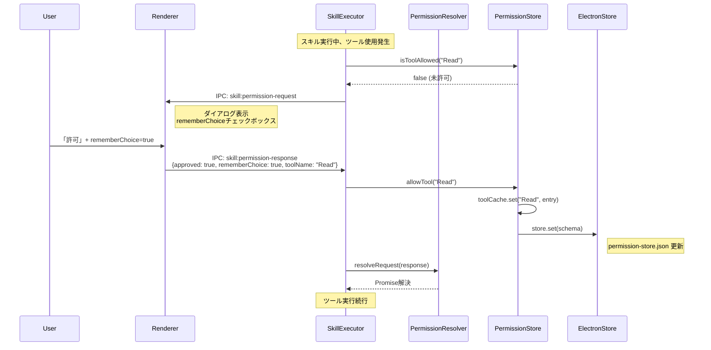
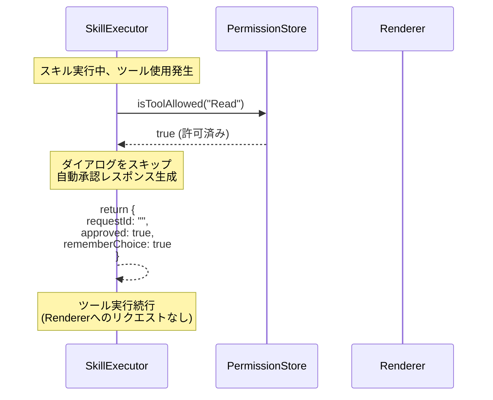
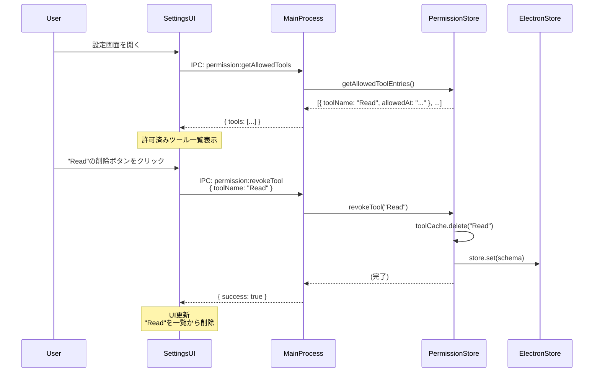
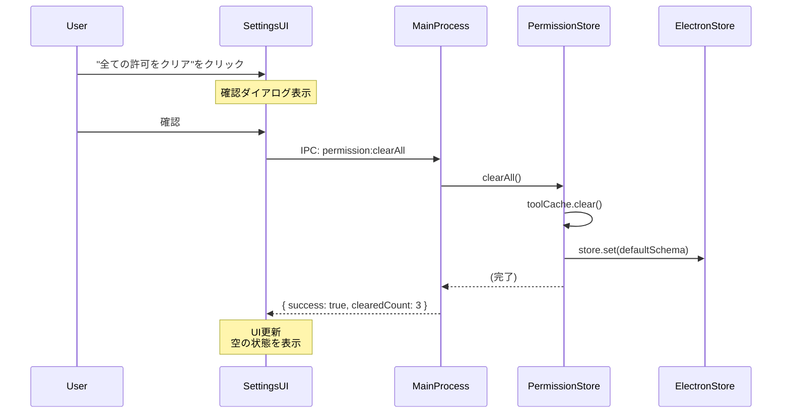
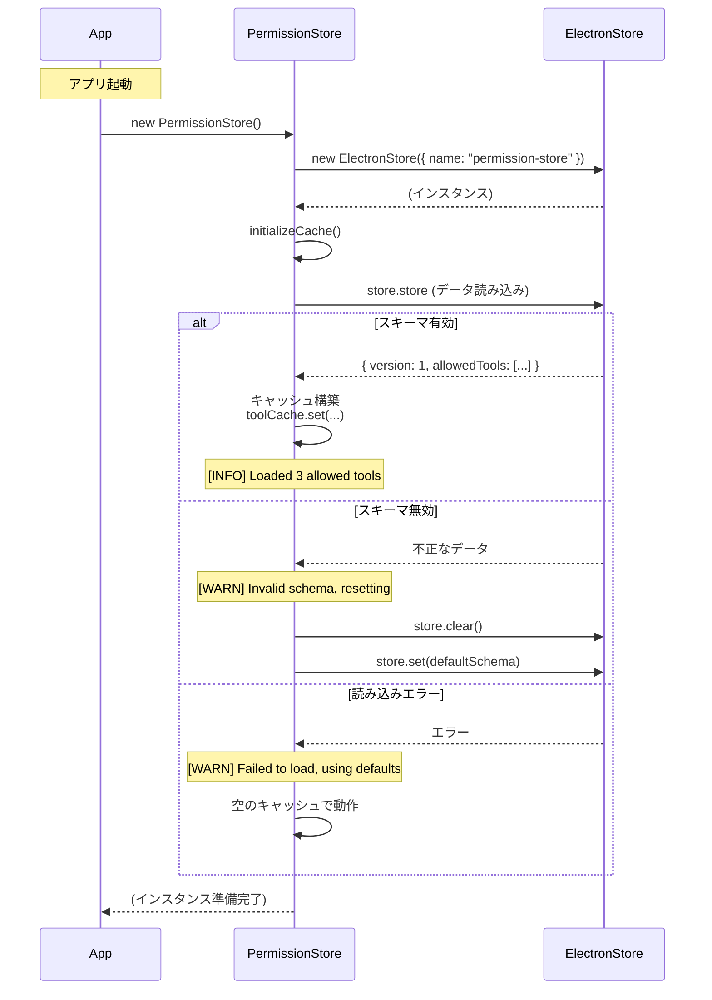

# シーケンス図 - rememberChoice機能永続化

## メタ情報

| 項目     | 内容                                   |
| -------- | -------------------------------------- |
| タスクID | TASK-3-1-E                             |
| Phase    | 2                                      |
| 作成日   | 2026-01-25                             |
| 機能名   | task-3-1-e-remember-choice-persistence |

---

## ユースケース一覧

| No  | ユースケース                   | 説明                                |
| --- | ------------------------------ | ----------------------------------- |
| 1   | ツール許可→永続化              | rememberChoice=trueで許可し、永続化 |
| 2   | 自動許可（ダイアログスキップ） | 許可済みツールの自動承認            |
| 3   | 設定画面からの削除             | 許可済みツールの個別削除            |
| 4   | 全許可設定クリア               | 設定画面から全クリア                |

---

## 1. ツール許可→永続化フロー



---

## 2. 自動許可（ダイアログスキップ）フロー



---

## 3. 設定画面からの個別削除フロー



---

## 4. 全許可設定クリアフロー



---

## 5. アプリ起動時のキャッシュ読み込みフロー



---

## コンポーネント間の関係

```
┌─────────────────────────────────────────────────────────────────────┐
│                           Renderer Process                          │
│  ┌──────────────────┐   ┌──────────────────┐                       │
│  │ PermissionDialog │   │  SettingsUI      │                       │
│  │ (権限確認)       │   │  (設定画面)      │                       │
│  └────────┬─────────┘   └────────┬─────────┘                       │
│           │                      │                                  │
│           │ IPC                  │ IPC                              │
└───────────┼──────────────────────┼──────────────────────────────────┘
            │                      │
            │  skill:permission-   │  permission:getAllowedTools
            │  response            │  permission:revokeTool
            │                      │  permission:clearAll
            │                      │
┌───────────┼──────────────────────┼──────────────────────────────────┐
│           ▼                      ▼                                  │
│  ┌──────────────────┐   ┌──────────────────┐                       │
│  │  SkillExecutor   │──>│ PermissionStore  │                       │
│  │                  │   │                  │                       │
│  │ sendPermission   │   │ isToolAllowed()  │                       │
│  │ Request()        │   │ allowTool()      │                       │
│  │                  │   │ revokeTool()     │                       │
│  │ handlePermission │   │ getAllowed...()  │                       │
│  │ Response()       │   │ clearAll()       │                       │
│  └──────────────────┘   └────────┬─────────┘                       │
│                                  │                                  │
│                                  ▼                                  │
│                         ┌──────────────────┐                       │
│                         │  ElectronStore   │                       │
│                         │  (永続化)        │                       │
│                         └────────┬─────────┘                       │
│                                  │                                  │
│                           Main Process                              │
└──────────────────────────────────┼──────────────────────────────────┘
                                   │
                                   ▼
                          ┌──────────────────┐
                          │ permission-      │
                          │ store.json       │
                          └──────────────────┘
```

---

## 関連ドキュメント

- [PermissionStore設計](./permission-store-design.md)
- [SkillExecutor連携設計](./skillexecutor-integration-design.md)
- [IPCチャネル設計](./ipc-channel-design.md)
- [設定UI設計](./permission-settings-ui-design.md)

---

## 変更履歴

| バージョン | 日付       | 変更内容 |
| ---------- | ---------- | -------- |
| 1.0.0      | 2026-01-25 | 初版作成 |
