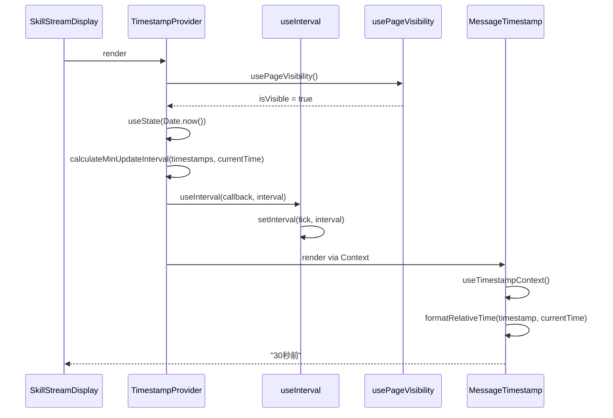
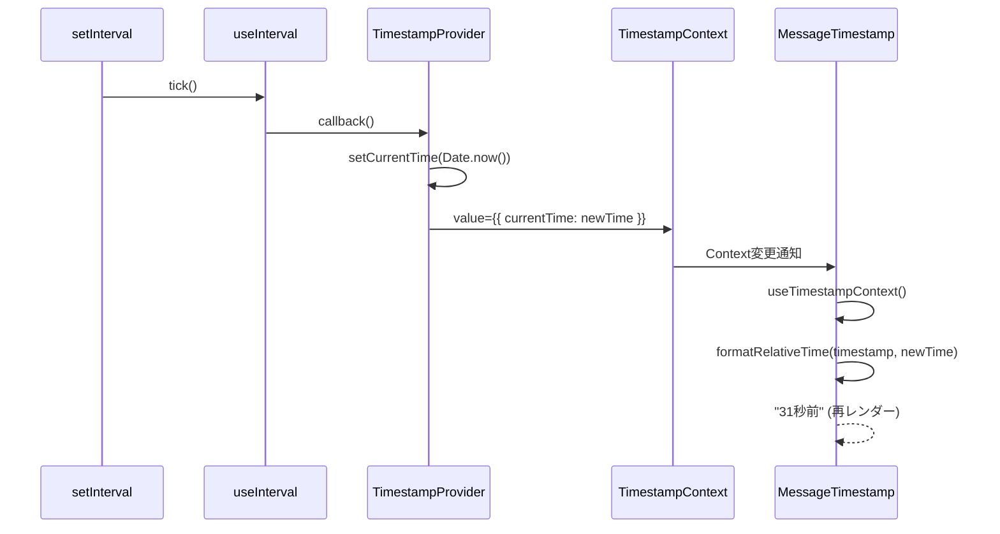
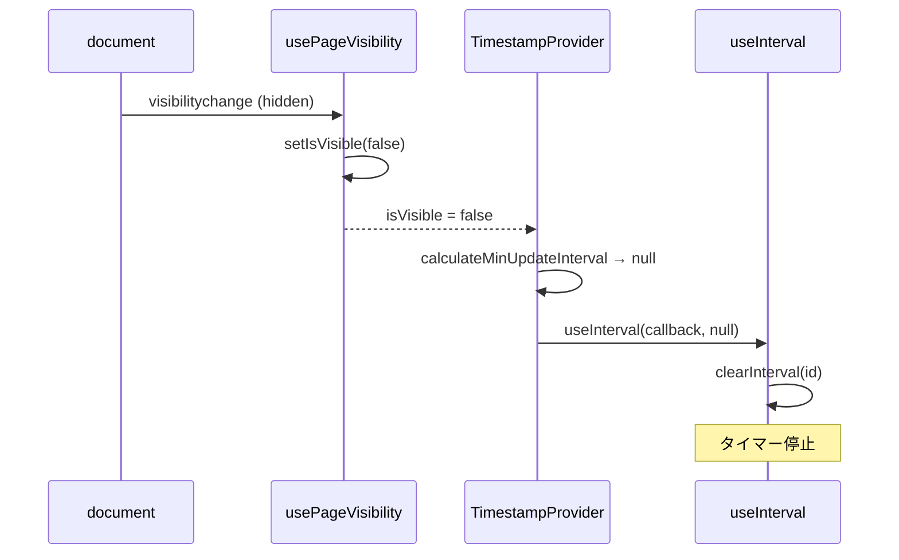
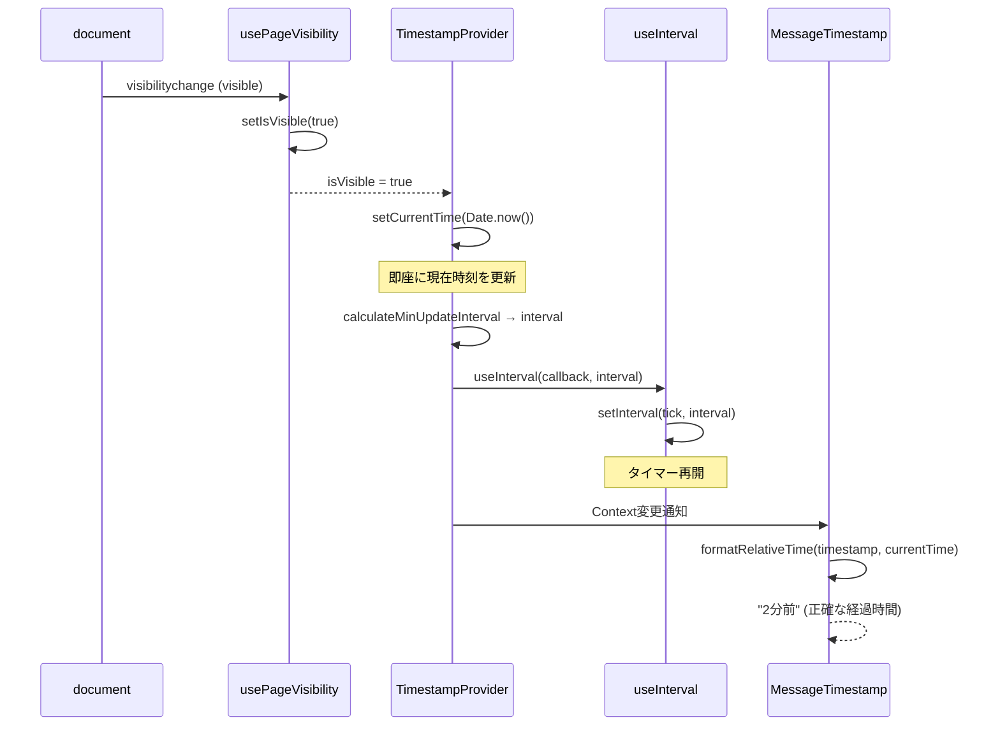
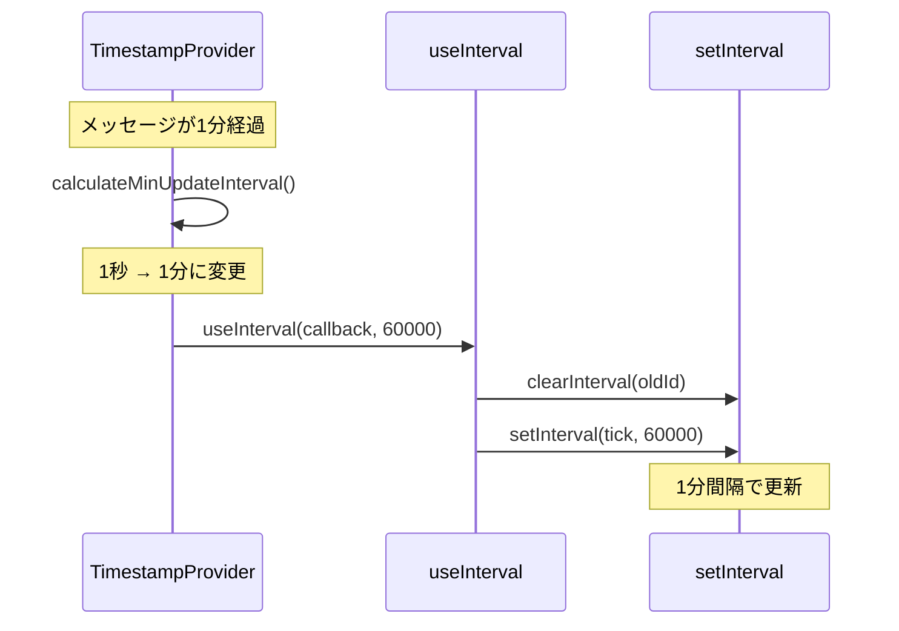
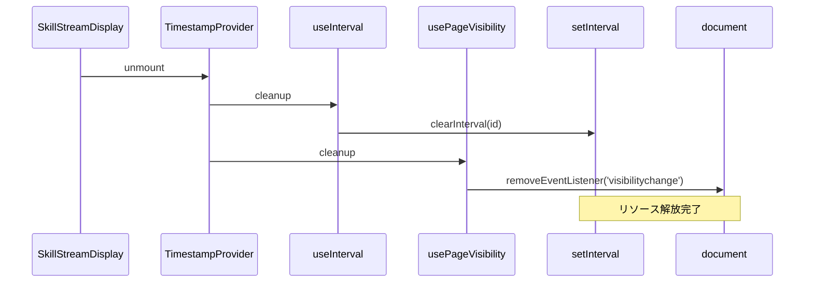

# シーケンス図: TASK-3-2-C タイムスタンプ自動更新

## メタ情報

| 項目   | 値                              |
| ------ | ------------------------------- |
| タスク | TASK-3-2-C-timestamp-autoupdate |
| Phase  | 2                               |
| 作成日 | 2026-01-28                      |

---

## 1. 初期化シーケンス



---

## 2. 自動更新シーケンス



---

## 3. タブ非表示シーケンス



---

## 4. タブ再表示シーケンス



---

## 5. 更新間隔動的変更シーケンス



---

## 6. アンマウントシーケンス



---

## 7. 状態遷移図

### 7.1 TimestampProviderの状態

```
                    ┌─────────────────┐
                    │    初期化       │
                    │ currentTime設定 │
                    └────────┬────────┘
                             │
                             ▼
           ┌─────────────────────────────────┐
           │                                 │
           ▼                                 │
    ┌──────────────┐                  ┌──────────────┐
    │   更新中     │◄────────────────►│    停止中    │
    │ (タブ表示)   │ visibilitychange │  (タブ非表示) │
    │ interval >0  │                  │ interval=null│
    └──────────────┘                  └──────────────┘
           │                                 │
           │                                 │
           └─────────────┬───────────────────┘
                         │ unmount
                         ▼
                  ┌──────────────┐
                  │   破棄       │
                  │ リソース解放 │
                  └──────────────┘
```

### 7.2 更新間隔の状態遷移

```
    ┌─────────────┐
    │ 1秒間隔     │
    │ (1分未満)   │
    └──────┬──────┘
           │ 1分経過
           ▼
    ┌─────────────┐
    │ 1分間隔     │
    │ (1分〜1時間)│
    └──────┬──────┘
           │ 1時間経過
           ▼
    ┌─────────────┐
    │ 1時間間隔   │
    │ (1時間以上) │
    └─────────────┘
```

---

## 8. データフロー図

```
┌───────────────────────────────────────────────────────────────┐
│                    SkillStreamDisplay                         │
│  ┌─────────────────────────────────────────────────────────┐  │
│  │                  TimestampProvider                       │  │
│  │                                                          │  │
│  │  [State]                    [Hooks]                      │  │
│  │  currentTime ◄──────────── useInterval                   │  │
│  │       │                        ▲                         │  │
│  │       │                        │                         │  │
│  │       │                   isVisible                      │  │
│  │       │                        ▲                         │  │
│  │       │                        │                         │  │
│  │       │                   usePageVisibility              │  │
│  │       │                        ▲                         │  │
│  │       │                        │                         │  │
│  │       │                   document.hidden                │  │
│  │       │                                                  │  │
│  │       ▼                                                  │  │
│  │  TimestampContext.Provider                               │  │
│  │       │                                                  │  │
│  └───────┼──────────────────────────────────────────────────┘  │
│          │                                                     │
│          ▼                                                     │
│  ┌─────────────────────────────────────────────────────────┐  │
│  │                     MessageList                          │  │
│  │  ┌──────────────────────────────────────────────────┐   │  │
│  │  │                  MessageItem                      │   │  │
│  │  │  ┌────────────────────────────────────────────┐  │   │  │
│  │  │  │            MessageTimestamp                 │  │   │  │
│  │  │  │                                             │  │   │  │
│  │  │  │  currentTime ◄── useTimestampContext()     │  │   │  │
│  │  │  │       │                                     │  │   │  │
│  │  │  │       ▼                                     │  │   │  │
│  │  │  │  formatRelativeTime(timestamp, currentTime)│  │   │  │
│  │  │  │       │                                     │  │   │  │
│  │  │  │       ▼                                     │  │   │  │
│  │  │  │  "30秒前"                                   │  │   │  │
│  │  │  └────────────────────────────────────────────┘  │   │  │
│  │  └──────────────────────────────────────────────────┘   │  │
│  └─────────────────────────────────────────────────────────┘  │
└───────────────────────────────────────────────────────────────┘
```

---

## 変更履歴

| 日付       | 変更内容 | 担当 |
| ---------- | -------- | ---- |
| 2026-01-28 | 初版作成 | AI   |
