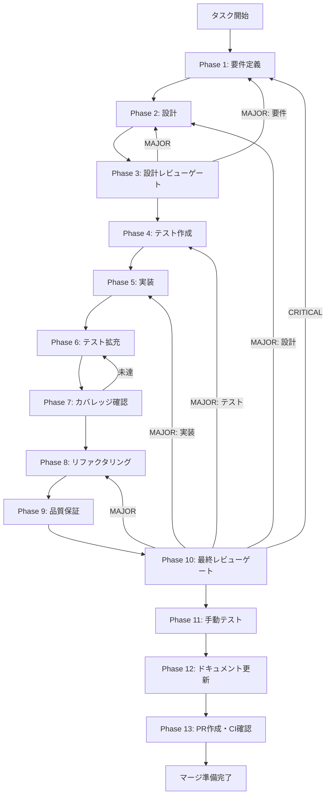

# TASK-4-1: IPCチャネル定義 - メインタスク仕様書

## メタ情報

| 項目           | 内容                  |
| -------------- | --------------------- |
| タスクID       | TASK-4-1              |
| タスク名       | IPCチャネル定義       |
| Tier           | 1                     |
| Phase          | 4                     |
| 依存タスク     | TASK-1-1              |
| ブロックタスク | TASK-4-2, TASK-5-1    |
| 優先度         | high                  |
| 複雑度         | small                 |
| タグ           | backend, preload, ipc |
| ステータス     | pending               |
| 作成日         | 2026-01-25            |

---

## 概要

スキルインポート機能で使用する全てのIPCチャネル名を定義する。
既存の`apps/desktop/src/preload/channels.ts`に新しいチャネル定数グループを追加し、
ホワイトリストに登録する。

---

## 背景

- スキルインポート機能では、Renderer ProcessとMain Process間でIPCを使用して通信を行う
- 既存のIPCチャネル定義パターン（`IPC_CHANNELS`オブジェクト）に従い、新しいチャネルを追加する必要がある
- セキュリティのため、チャネルはホワイトリスト方式で管理される

---

## スコープ

### 対象

- `apps/desktop/src/preload/channels.ts` の修正
- `SKILL_CHANNELS` 定数オブジェクトの追加
- `SkillChannel` 型のエクスポート
- `ALLOWED_INVOKE_CHANNELS` への追加
- `ALLOWED_ON_CHANNELS` への追加

### 対象外

- IPCハンドラーの実装（TASK-4-2で実施）
- Preload APIの実装（TASK-5-1で実施）
- 実際の通信ロジック

---

## 入力

| 参照資料                                                                     | 内容                  |
| ---------------------------------------------------------------------------- | --------------------- |
| `apps/desktop/src/preload/channels.ts`                                       | 既存のIPCチャネル定義 |
| `docs/30-workflows/skill-import-agent-system/specification.md` (5.3)         | IPCチャネル仕様       |
| `.claude/skills/aiworkflow-requirements/references/security-api-electron.md` | IPC通信セキュリティ   |

---

## 出力

| 成果物                            | 説明                    |
| --------------------------------- | ----------------------- |
| `SKILL_CHANNELS` オブジェクト定義 | 13チャネルの定数定義    |
| `SkillChannel` 型                 | チャネル名のユニオン型  |
| ホワイトリスト更新                | invoke/onチャネルの登録 |

---

## チャネル定義仕様

### SKILL_CHANNELS オブジェクト

```typescript
export const SKILL_CHANNELS = {
  // スキルディスカバリー
  SKILL_LIST: "skill:list", // 全スキル一覧取得（キャッシュあり）
  SKILL_SCAN: "skill:scan", // スキル再スキャン（キャッシュ無効化）

  // インポート管理
  SKILL_IMPORT: "skill:import", // スキルをインポート
  SKILL_REMOVE: "skill:remove", // スキルを削除（アンインポート）
  SKILL_GET_IMPORTED: "skill:getImported", // インポート済みスキル一覧取得
  SKILL_UPDATE: "skill:update", // スキル情報更新

  // 実行
  SKILL_EXECUTE: "skill:execute", // スキル実行開始
  SKILL_ABORT: "skill:abort", // 実行中止

  // ストリーミングイベント（Main → Renderer）
  SKILL_STREAM: "skill:stream", // ストリーミングメッセージ
  SKILL_COMPLETE: "skill:complete", // 実行完了
  SKILL_ERROR: "skill:error", // エラー発生

  // 権限確認
  SKILL_PERMISSION_REQUEST: "skill:permission:request", // 権限確認リクエスト
  SKILL_PERMISSION_RESPONSE: "skill:permission:response", // 権限確認応答
} as const;

export type SkillChannel = (typeof SKILL_CHANNELS)[keyof typeof SKILL_CHANNELS];
```

### チャネル用途一覧

| チャネル                    | 方向 | 用途               | ペイロード                                        |
| --------------------------- | ---- | ------------------ | ------------------------------------------------- |
| `skill:list`                | R→M  | スキル一覧取得     | なし                                              |
| `skill:scan`                | R→M  | 再スキャン         | なし                                              |
| `skill:import`              | R→M  | インポート         | `skillName: string`                               |
| `skill:remove`              | R→M  | 削除               | `skillName: string`                               |
| `skill:getImported`         | R→M  | インポート済み取得 | なし                                              |
| `skill:update`              | R→M  | 更新               | `skillName: string, data: Partial<ImportedSkill>` |
| `skill:execute`             | R→M  | 実行開始           | `SkillExecutionRequest`                           |
| `skill:abort`               | R→M  | 実行中止           | `executionId: string`                             |
| `skill:stream`              | M→R  | ストリーミング     | `SkillStreamMessage`                              |
| `skill:complete`            | M→R  | 完了通知           | `{ executionId: string }`                         |
| `skill:error`               | M→R  | エラー通知         | `{ executionId: string, error: string }`          |
| `skill:permission:request`  | M→R  | 権限確認要求       | `PermissionRequest`                               |
| `skill:permission:response` | R→M  | 権限確認応答       | `PermissionResponse`                              |

※ R→M: Renderer → Main, M→R: Main → Renderer

---

## 既存チャネルとの関係

### 重複確認必須チャネル

既存のスキル関連チャネル（Skill management operations）との命名衝突を確認:

| 既存チャネル           | 新規チャネル         | 対応                     |
| ---------------------- | -------------------- | ------------------------ |
| `SKILL_LIST_AVAILABLE` | `SKILL_LIST`         | 新規（用途が異なる）     |
| `SKILL_LIST_IMPORTED`  | `SKILL_GET_IMPORTED` | 新規（命名を区別）       |
| `SKILL_IMPORT`         | `SKILL_IMPORT`       | 既存チャネル値を再利用可 |
| `SKILL_REMOVE`         | `SKILL_REMOVE`       | 既存チャネル値を再利用可 |
| `SKILL_EXECUTE`        | `SKILL_EXECUTE`      | 既存チャネル値を再利用可 |
| `SKILL_STREAM`         | `SKILL_STREAM`       | 既存チャネル値を再利用可 |
| `SKILL_ABORT`          | `SKILL_ABORT`        | 既存チャネル値を再利用可 |

**結論**: 既存の`IPC_CHANNELS`内に既にスキル関連チャネルが定義されているため、
新規追加が必要なチャネルのみを追加する方針とする。

---

## 実行フロー図



---

## Phase構成

| Phase | 名称                 | ファイル                     | ステータス |
| ----- | -------------------- | ---------------------------- | ---------- |
| 1     | 要件定義             | phase-1-requirements.md      | 未実施     |
| 2     | 設計                 | phase-2-design.md            | 未実施     |
| 3     | 設計レビューゲート   | phase-3-design-review.md     | 未実施     |
| 4     | テスト作成           | phase-4-test-creation.md     | 未実施     |
| 5     | 実装                 | phase-5-implementation.md    | 未実施     |
| 6     | テスト拡充           | phase-6-test-expansion.md    | 未実施     |
| 7     | テストカバレッジ確認 | phase-7-coverage-check.md    | 未実施     |
| 8     | リファクタリング     | phase-8-refactoring.md       | 未実施     |
| 9     | 品質保証             | phase-9-quality-assurance.md | 未実施     |
| 10    | 最終レビューゲート   | phase-10-final-review.md     | 未実施     |
| 11    | 手動テスト検証       | phase-11-manual-testing.md   | 未実施     |
| 12    | ドキュメント更新     | phase-12-documentation.md    | 未実施     |
| 13    | PR作成               | phase-13-pr-creation.md      | 未実施     |

---

## テストカバレッジ目標

### ユニットテスト

| 指標              | 最低基準 | 推奨基準 |
| ----------------- | -------- | -------- |
| Line Coverage     | 80%      | 90%      |
| Branch Coverage   | 60%      | 70%      |
| Function Coverage | 80%      | 90%      |

### 結合テスト

| 指標                         | 目標 |
| ---------------------------- | ---- |
| APIエンドポイント            | 100% |
| モジュール間インターフェース | 100% |
| 正常系シナリオ               | 100% |
| 異常系シナリオ               | 80%+ |
| 外部連携ポイント             | 100% |

> **注**: 本タスクは定数定義のみのため、結合テストは不要。
> ユニットテストと静的解析で十分な検証が可能。

---

## 統合テスト連携（Phase 1〜11で必須）

各Phaseで以下の統合テスト連携アクションを実施すること:

| Phase | 統合テスト連携アクション                        |
| ----- | ----------------------------------------------- |
| 1     | 接続要件（API/認証/データフロー）を要件に明記   |
| 2     | 統合ポイント/契約（API・スキーマ）を設計に反映  |
| 3     | 統合テスト観点のレビューゲートを実施            |
| 4     | 統合テストシナリオを全カテゴリで作成            |
| 5     | フロント/バック接続の実装とテスト支援コード整備 |
| 6     | 統合テストの拡充（全カテゴリのカバレッジ向上）  |
| 7     | 統合テストの再実行とゲート判定                  |
| 8     | リファクタ後の統合テスト継続成功を確認          |
| 9     | 品質保証で統合テスト結果を確認                  |
| 10    | 最終レビューで統合テスト結果を確認              |
| 11    | 手動統合テスト（UI/API接続）を確認              |

> **注**: 本タスクは定数定義のみのため、統合テストは不要。
> 各Phaseでの連携アクションは「型チェック・静的解析」に読み替える。

---

## Phase完了時の必須アクション

**各Phase完了時に以下を必ず実行すること:**

1. **タスク100%実行**: Phase内で指定された全タスクを完全に実行
2. **成果物確認**: 全ての必須成果物が生成されていることを検証
3. **実行記録**: 実行タスクの結果を記録
4. **artifacts.json更新**: Phase完了ステータスを更新
5. **Phase末端の実行確認**: 各タスクを100%実行し、各タスクを完遂した旨を必ず明記

```bash
# Phase完了時の検証コマンド
node .claude/skills/task-specification-creator/scripts/validate-phase-output.js \
  docs/30-workflows/skill-import-agent-system/tasks/TASK-4-1-ipc-channels \
  --phase {{PHASE_NUMBER}}

# Phase完了・成果物登録
node .claude/skills/task-specification-creator/scripts/complete-phase.js \
  --workflow docs/30-workflows/skill-import-agent-system/tasks/TASK-4-1-ipc-channels \
  --phase {{PHASE_NUMBER}} \
  --artifacts "outputs/phase-{{PHASE_NUMBER}}/{{FILE}}.md:{{DESCRIPTION}}"
```

---

## 完了条件

- [ ] `SKILL_CHANNELS` オブジェクトが定義されている
- [ ] 全13チャネルが定義されている（または既存チャネル活用で代替）
- [ ] `SkillChannel` 型がエクスポートされている
- [ ] 既存のチャネル定義と重複がない
- [ ] `ALLOWED_INVOKE_CHANNELS` に必要なチャネルが追加されている
- [ ] `ALLOWED_ON_CHANNELS` に必要なチャネルが追加されている
- [ ] TypeScript コンパイルエラーがない
- [ ] Lintエラーがない

---

## テスト要件

- 静的解析のみ（ランタイムテスト不要）
- TypeScript型チェック
- ESLint検証

---

## 参考資料

- [specification.md - 5.3 IPCチャネル定義](../specification.md)
- [security-api-electron.md](/.claude/skills/aiworkflow-requirements/references/security-api-electron.md)
- 既存パターン: `apps/desktop/src/preload/channels.ts`

---

## 変更履歴

| バージョン | 日付       | 変更内容 |
| ---------- | ---------- | -------- |
| 1.0.0      | 2026-01-25 | 初版作成 |
