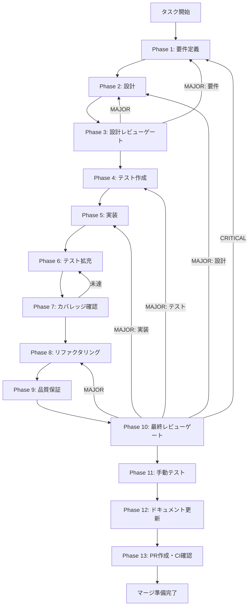

# TASK-4-2-permission-resolver-ipc-handlers - タスク実行仕様書

## ユーザーからの元の指示

```
PermissionResolverからの権限確認リクエストをRenderer Processで受信し、ユーザーに確認ダイアログを表示、判断結果をMain Processに返却できるようにする。
```

## メタ情報

```yaml
issue_number: 505
```

| 項目         | 内容                                            |
| ------------ | ----------------------------------------------- |
| タスクID     | TASK-4-2                                        |
| タスク名     | PermissionResolver IPC Handlers                 |
| 分類         | 機能追加                                        |
| 対象機能     | PermissionResolver → IPC → Renderer Process連携 |
| 優先度       | 高                                              |
| 見積もり規模 | 中規模                                          |
| ステータス   | 未実施                                          |
| 作成日       | 2026-01-25                                      |
| 発見元       | TASK-3-2（PermissionResolver実装）完了時        |

---

## タスク概要

### 目的

TASK-3-2で実装したPermissionResolverクラスをRenderer Processと連携させ、スキル実行時のツール使用許可をユーザーに確認できるようにする。IPC経由で権限確認リクエストを送受信し、ユーザーフレンドリーなダイアログで権限判断を求める機能を実装する。

### 背景

TASK-3-2でPermissionResolverクラス（権限確認管理）が完了した。PermissionResolverは以下の機能を提供する：

- `waitForResponse()`: 権限確認リクエストの送信・レスポンス待機
- `resolveRequest()`: ユーザーの権限判断結果の解決
- `cancelRequest()`: 個別リクエストのキャンセル
- `cancelAll()`: 全リクエストのキャンセル

しかし、Renderer Process側でユーザーに権限確認ダイアログを表示し、ユーザーの判断結果をMain Processに返すIPC連携が未実装である。

**現在の状態:**

- Main Process: PermissionResolver実装済み（権限確認待機可能）
- Preload API: `skill:permission-request`/`skill:permission-response` 未実装
- Renderer Process: 権限確認ダイアログUI未実装

この状態ではスキル実行時のツール使用許可がユーザーに確認されない。

### 最終ゴール

- `skill:permission-request` IPC経由でRenderer Processに権限確認リクエストが届く
- Renderer Processで権限確認ダイアログが表示される
- ユーザーの判断（allow/deny/always_allow/always_deny）が`skill:permission-response`経由で返却される
- PermissionResolver.waitForResponse()が正しく解決される

### 成果物一覧

| 種別             | 成果物                 | 配置先                                                   |
| ---------------- | ---------------------- | -------------------------------------------------------- |
| IPC Handler      | permission-handlers.ts | `apps/desktop/src/main/ipc/permission-handlers.ts`       |
| Preload API      | skill-api.ts（更新）   | `apps/desktop/src/preload/skill-api.ts`                  |
| UIコンポーネント | PermissionDialog.tsx   | `apps/desktop/src/renderer/components/Permission/`       |
| React Hook       | usePermissionDialog.ts | `apps/desktop/src/renderer/hooks/usePermissionDialog.ts` |
| テスト           | 単体・統合テスト       | `apps/desktop/src/**/__tests__/`                         |
| ドキュメント     | Phase別ドキュメント    | `outputs/phase-*/`                                       |
| PR               | GitHub Pull Request    | GitHub UI                                                |

---

## 参照ファイル

本仕様書のコマンド選定は以下を参照：

### システム仕様（aiworkflow-requirements）

> 実装前に必ず以下のシステム仕様を確認し、既存設計との整合性を確保してください。

| 参照資料       | パス                                                                         | 内容                              |
| -------------- | ---------------------------------------------------------------------------- | --------------------------------- |
| Agent SDK仕様  | `.claude/skills/aiworkflow-requirements/references/interfaces-agent-sdk.md`  | PermissionResolver型定義・API仕様 |
| アーキテクチャ | `.claude/skills/aiworkflow-requirements/references/architecture-patterns.md` | IPCパターン・セキュリティ要件     |

### 関連実装

| 参照資料                 | パス                                                                        | 内容                |
| ------------------------ | --------------------------------------------------------------------------- | ------------------- |
| PermissionResolver       | `apps/desktop/src/main/services/skill/PermissionResolver.ts`                | 権限確認待機・解決  |
| PermissionResolverテスト | `apps/desktop/src/main/services/skill/__tests__/PermissionResolver.test.ts` | テストケース参照    |
| 既存IPC Handlers         | `apps/desktop/src/main/ipc/skillHandlers.ts`                                | IPC登録パターン参照 |
| 既存Preload API          | `apps/desktop/src/preload/index.ts`                                         | Preload APIパターン |

---

## タスク分解サマリー

| ID   | フェーズ | サブタスク名                      | 責務                               | 依存 |
| ---- | -------- | --------------------------------- | ---------------------------------- | ---- |
| T-01 | Phase 1  | 要件定義                          | IPC仕様・UI要件の定義              | -    |
| T-02 | Phase 2  | 設計                              | IPC Handler・Preload API・UI設計   | T-01 |
| T-03 | Phase 3  | 設計レビューゲート                | 要件・設計の妥当性検証             | T-02 |
| T-04 | Phase 4  | テスト作成（TDD: Red）            | IPC Handler・Hook・UIテスト作成    | T-03 |
| T-05 | Phase 5  | 実装（TDD: Green）                | IPC Handler・Preload API・UI実装   | T-04 |
| T-06 | Phase 6  | テスト拡充                        | カバレッジ目標達成                 | T-05 |
| T-07 | Phase 7  | カバレッジ確認                    | カバレッジ基準検証                 | T-06 |
| T-08 | Phase 8  | リファクタリング（TDD: Refactor） | コード品質改善                     | T-07 |
| T-09 | Phase 9  | 品質保証                          | 静的解析・セキュリティチェック     | T-08 |
| T-10 | Phase 10 | 最終レビューゲート                | 全体品質・整合性検証               | T-09 |
| T-11 | Phase 11 | 手動テスト検証                    | UX・実環境動作確認                 | T-10 |
| T-12 | Phase 12 | ドキュメント更新                  | 実装ガイド・仕様更新・未タスク検出 | T-11 |
| T-13 | Phase 13 | PR作成                            | コミット・PR・CI確認               | T-12 |

**総サブタスク数**: 13個

---

## 実行フロー図



---

## Phase一覧

| Phase | 名称               | 仕様書                                                 | ステータス |
| ----- | ------------------ | ------------------------------------------------------ | ---------- |
| 1     | 要件定義           | [phase-1-requirements.md](phase-1-requirements.md)     | 未実施     |
| 2     | 設計               | [phase-2-design.md](phase-2-design.md)                 | 未実施     |
| 3     | 設計レビューゲート | [phase-3-design-review.md](phase-3-design-review.md)   | 未実施     |
| 4     | テスト作成         | [phase-4-test-creation.md](phase-4-test-creation.md)   | 未実施     |
| 5     | 実装               | [phase-5-implementation.md](phase-5-implementation.md) | 未実施     |
| 6     | テスト拡充         | [phase-6-test-expansion.md](phase-6-test-expansion.md) | 未実施     |
| 7     | カバレッジ確認     | [phase-7-coverage-check.md](phase-7-coverage-check.md) | 未実施     |
| 8     | リファクタリング   | [phase-8-refactoring.md](phase-8-refactoring.md)       | 未実施     |
| 9     | 品質保証           | [phase-9-quality.md](phase-9-quality.md)               | 未実施     |
| 10    | 最終レビューゲート | [phase-10-final-review.md](phase-10-final-review.md)   | 未実施     |
| 11    | 手動テスト         | [phase-11-manual-test.md](phase-11-manual-test.md)     | 未実施     |
| 12    | ドキュメント更新   | [phase-12-documentation.md](phase-12-documentation.md) | 未実施     |
| 13    | PR作成             | [phase-13-pr-creation.md](phase-13-pr-creation.md)     | 未実施     |

---

## テストカバレッジ目標

### ユニットテスト

| 指標              | 最低基準 | 推奨基準 |
| ----------------- | -------- | -------- |
| Line Coverage     | 80%      | 90%      |
| Branch Coverage   | 60%      | 70%      |
| Function Coverage | 80%      | 90%      |

### 結合テスト

| 指標                         | 目標 |
| ---------------------------- | ---- |
| IPCチャンネル                | 100% |
| モジュール間インターフェース | 100% |
| 正常系シナリオ               | 100% |
| 異常系シナリオ               | 80%+ |
| 外部連携ポイント             | 100% |

---

## 統合テスト連携（Phase 1〜11で必須）

各Phaseで以下の統合テスト連携アクションを実施すること:

| Phase | 統合テスト連携アクション                          |
| ----- | ------------------------------------------------- |
| 1     | IPC通信要件（チャンネル・データ形式）を要件に明記 |
| 2     | IPC契約（Main↔Renderer）を設計に反映              |
| 3     | IPC設計・UIフロー設計のレビューゲートを実施       |
| 4     | IPC統合テストシナリオを全カテゴリで作成           |
| 5     | IPC Handler・Preload API・UIの実装と統合          |
| 6     | IPC統合テストの拡充（全カテゴリのカバレッジ向上） |
| 7     | IPC統合テストの再実行とゲート判定                 |
| 8     | リファクタ後のIPC統合テスト継続成功を確認         |
| 9     | 品質保証でIPC統合テスト結果を確認                 |
| 10    | 最終レビューでIPC統合テスト結果を確認             |
| 11    | 手動IPC統合テスト（ダイアログ表示・応答）を確認   |

---

## Phase完了時の必須アクション

**各Phase完了時に以下を必ず実行すること:**

1. **タスク100%実行**: Phase内で指定された全タスクを完全に実行
2. **成果物確認**: 全ての必須成果物が生成されていることを検証
3. **実行記録**: 実行タスクの結果を記録
4. **artifacts.json更新**: Phase完了ステータスを更新
5. **Phase末端の実行確認**: 各タスクを100%実行し、各タスクを完遂した旨を必ず明記

```bash
# Phase完了時の検証コマンド
node .claude/skills/task-specification-creator/scripts/validate-phase-output.js docs/30-workflows/TASK-4-2-permission-resolver-ipc-handlers --phase {{PHASE_NUMBER}}

# Phase完了・成果物登録
node .claude/skills/task-specification-creator/scripts/complete-phase.js \
  --workflow docs/30-workflows/TASK-4-2-permission-resolver-ipc-handlers --phase {{PHASE_NUMBER}} --artifacts "..."
```

---

## 検証方法

### テストケース

| TC-ID     | テスト内容               | 期待結果                           |
| --------- | ------------------------ | ---------------------------------- |
| TC-42-001 | 権限確認リクエスト送信   | RendererにIPCメッセージが届く      |
| TC-42-002 | ダイアログ表示           | 正しいツール名・理由が表示される   |
| TC-42-003 | allow判断                | waitForResponse()がallowで解決     |
| TC-42-004 | deny判断                 | waitForResponse()がdenyで解決      |
| TC-42-005 | タイムアウト             | 適切なエラーが発生する             |
| TC-42-006 | 複数リクエストの同時処理 | キュー順序が保持される             |
| TC-42-007 | AbortSignalキャンセル    | リクエストが正しくキャンセルされる |
| TC-42-008 | ダイアログ閉じる         | キャンセル扱いになる               |

### 検証手順

1. 自動テストを実行（`pnpm --filter @repo/desktop test`）
2. 手動でスキル実行を確認（権限確認ダイアログ表示）
3. 各判断ボタンの動作確認

---

## リスクと対策

| リスク                     | 影響度 | 発生確率 | 対策                                 |
| -------------------------- | ------ | -------- | ------------------------------------ |
| ダイアログ表示のタイミング | 中     | 中       | 適切なz-index、モーダル管理          |
| 複数ダイアログの競合       | 高     | 中       | キューイング実装、1つずつ表示        |
| IPC通信エラー              | 中     | 低       | エラーハンドリング、タイムアウト処理 |
| メモリリーク               | 中     | 低       | 購読解除パターンの徹底               |

---

## 関連タスク

| タスクID   | 関係性                         |
| ---------- | ------------------------------ |
| TASK-3-2   | 依存（PermissionResolver）     |
| TASK-3-1-A | 関連（SkillExecutor）          |
| TASK-3-1-B | 関連（IPC統合）                |
| TASK-3-1-C | 関連（PermissionRequest Hook） |

---

## 補足事項

- TASK-3-2のPermissionResolverは`waitForResponse()`で権限判断を待機可能
- 本タスクはRenderer側のUI実装とIPC連携が主な作業
- タイムアウト（デフォルト5分）はPermissionResolver側で管理済み
- `always_allow`/`always_deny`の永続化は本タスクのスコープ外
