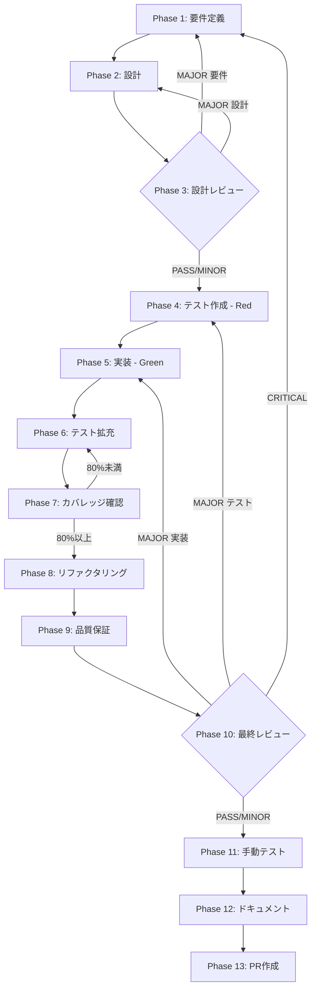

# TASK-8A: 単体テスト

## メタ情報

| 項目       | 内容                                                                                                                                      |
| ---------- | ----------------------------------------------------------------------------------------------------------------------------------------- |
| タスクID   | TASK-8A                                                                                                                                   |
| タスク名   | 単体テスト                                                                                                                                |
| スコープ   | サービス層・状態管理層の単体テスト実装                                                                                                    |
| 優先度     | high                                                                                                                                      |
| 規模見積   | medium                                                                                                                                    |
| ステータス | pending                                                                                                                                   |
| 作成日     | 2026-02-01                                                                                                                                |
| Tier       | 1                                                                                                                                         |
| 依存タスク | TASK-2A（SkillScanner）, TASK-2B（SkillImportManager）, TASK-3-1（SkillExecutor）, TASK-3-2（PermissionResolver）, TASK-6-1（SkillSlice） |
| 並列タスク | TASK-8B, TASK-8C                                                                                                                          |
| ブロック   | なし                                                                                                                                      |

## タスク概要

### 目的

skill-import-agent-systemのサービス層（Main Process）および状態管理層（Renderer Process）の単体テストを実装し、各モジュールの正常系・異常系・境界値を検証する。

### 背景

skill-import-agent-systemの中核モジュール（SkillScanner, SkillImportManager, SkillExecutor, PermissionResolver, skillSlice）はすべて実装済みであり、テストファイルも一部存在する。本タスクでは、タスク仕様書で定義された44テストケースすべてが網羅されていることを確認し、不足分を補完して80%以上のカバレッジを達成する。

### 最終成果物

| 成果物                    | パス                                                                        | 説明            |
| ------------------------- | --------------------------------------------------------------------------- | --------------- |
| SkillScanner テスト       | `apps/desktop/src/main/services/skill/__tests__/SkillScanner.test.ts`       | 10テストケース  |
| SkillImportManager テスト | `apps/desktop/src/main/services/skill/__tests__/SkillImportManager.test.ts` | 8テストケース   |
| SkillExecutor テスト      | `apps/desktop/src/main/services/skill/__tests__/SkillExecutor.test.ts`      | 8テストケース   |
| PermissionResolver テスト | `apps/desktop/src/main/services/skill/__tests__/PermissionResolver.test.ts` | 6テストケース   |
| skillSlice テスト         | `apps/desktop/src/renderer/store/slices/__tests__/skillSlice.test.ts`       | 12テストケース  |
| カバレッジレポート        | `outputs/phase-7/coverage-report.md`                                        | 80%以上達成確認 |

## 参照ファイル

### 実装ソースコード

| ファイル           | パス                                                         |
| ------------------ | ------------------------------------------------------------ |
| SkillScanner       | `apps/desktop/src/main/services/skill/SkillScanner.ts`       |
| SkillImportManager | `apps/desktop/src/main/services/skill/SkillImportManager.ts` |
| SkillExecutor      | `apps/desktop/src/main/services/skill/SkillExecutor.ts`      |
| PermissionResolver | `apps/desktop/src/main/services/skill/PermissionResolver.ts` |
| PermissionStore    | `apps/desktop/src/main/services/skill/PermissionStore.ts`    |
| SkillParser        | `apps/desktop/src/main/services/skill/SkillParser.ts`        |
| SkillService       | `apps/desktop/src/main/services/skill/SkillService.ts`       |
| skillSlice         | `apps/desktop/src/renderer/store/slices/skillSlice.ts`       |

### 既存テストファイル

| ファイル                  | パス                                                                                   |
| ------------------------- | -------------------------------------------------------------------------------------- |
| SkillScanner テスト       | `apps/desktop/src/main/services/skill/__tests__/SkillScanner.test.ts`                  |
| SkillImportManager テスト | `apps/desktop/src/main/services/skill/__tests__/SkillImportManager.test.ts`            |
| SkillExecutor テスト      | `apps/desktop/src/main/services/skill/__tests__/SkillExecutor.test.ts`                 |
| PermissionResolver テスト | `apps/desktop/src/main/services/skill/__tests__/PermissionResolver.test.ts`            |
| PermissionStore テスト    | `apps/desktop/src/main/services/skill/__tests__/PermissionStore.test.ts`               |
| skillSlice テスト         | `apps/desktop/src/renderer/store/slices/__tests__/skillSlice.test.ts`                  |
| skillSlice エッジケース   | `apps/desktop/src/renderer/store/slices/__tests__/skillSlice.edge-cases.test.ts`       |
| skillSlice 状態遷移       | `apps/desktop/src/renderer/store/slices/__tests__/skillSlice.state-transition.test.ts` |

### テスト基盤

| ファイル           | パス                                                           |
| ------------------ | -------------------------------------------------------------- |
| Vitest設定         | `apps/desktop/vitest.config.ts`                                |
| テストセットアップ | `apps/desktop/src/test/setup.ts`                               |
| テストフィクスチャ | `apps/desktop/src/main/services/skill/__tests__/__fixtures__/` |

### システム仕様書

| 仕様書                     | 参照先                                                     |
| -------------------------- | ---------------------------------------------------------- |
| テスト戦略                 | `quality-e2e-testing.md`（aiworkflow-requirements）        |
| 品質要件                   | `quality-requirements.md`（aiworkflow-requirements）       |
| スキル管理インターフェース | `interfaces-agent-sdk-skill.md`（aiworkflow-requirements） |
| スキル層仕様               | `docs/00-requirements/18-skills.md`                        |
| アーキテクチャ             | `docs/00-requirements/05-architecture.md`                  |

## タスク分解サマリー

| Phase | Phase名              | サブタスク                                     | 責務                        | 依存Phase |
| ----- | -------------------- | ---------------------------------------------- | --------------------------- | --------- |
| 1     | 要件定義             | 既存テスト監査・ギャップ分析・受け入れ基準定義 | テスト要件の明確化          | -         |
| 2     | 設計                 | テスト設計書・モック戦略・フィクスチャ設計     | テストアーキテクチャ設計    | 1         |
| 3     | 設計レビューゲート   | テスト設計の品質検証                           | 設計品質の確認              | 1, 2      |
| 4     | テスト作成           | 不足テストケースのスタブ作成（TDD Red）        | 失敗テストの作成            | 1, 2, 3   |
| 5     | 実装                 | テストロジック実装（TDD Green）                | テストを通過させる          | 4         |
| 6     | テスト拡充           | 境界値・エッジケース・統合テスト追加           | テスト網羅性向上            | 5         |
| 7     | テストカバレッジ確認 | カバレッジ計測・ギャップ分析                   | 80%以上のカバレッジ達成確認 | 5, 6      |
| 8     | リファクタリング     | テストコード品質改善・ヘルパー抽出             | テスト保守性向上            | 5, 6, 7   |
| 9     | 品質保証             | Lint・型チェック・テスト品質検証               | コード品質確認              | 5         |
| 10    | 最終レビューゲート   | 全テスト・全品質基準の総合検証                 | リリース品質確認            | 1-9       |
| 11    | 手動テスト検証       | テスト実行の手動確認・エッジケース検証         | 実行結果の目視確認          | 1-10      |
| 12    | ドキュメント更新     | 実装ガイド・仕様書更新・未タスク検出           | ドキュメント整備            | 1-11      |
| 13    | PR作成               | ローカル検証・PR作成・CI確認                   | マージ準備完了              | 1-12      |

## 実行フロー図



## Phase一覧

| Phase | Phase名              | ファイル                                                     | ステータス |
| ----- | -------------------- | ------------------------------------------------------------ | ---------- |
| 1     | 要件定義             | [phase-1-requirements.md](phase-1-requirements.md)           | 未実施     |
| 2     | 設計                 | [phase-2-design.md](phase-2-design.md)                       | 未実施     |
| 3     | 設計レビューゲート   | [phase-3-design-review.md](phase-3-design-review.md)         | 未実施     |
| 4     | テスト作成           | [phase-4-test-creation.md](phase-4-test-creation.md)         | 未実施     |
| 5     | 実装                 | [phase-5-implementation.md](phase-5-implementation.md)       | 未実施     |
| 6     | テスト拡充           | [phase-6-test-expansion.md](phase-6-test-expansion.md)       | 未実施     |
| 7     | テストカバレッジ確認 | [phase-7-coverage-check.md](phase-7-coverage-check.md)       | 未実施     |
| 8     | リファクタリング     | [phase-8-refactoring.md](phase-8-refactoring.md)             | 未実施     |
| 9     | 品質保証             | [phase-9-quality-assurance.md](phase-9-quality-assurance.md) | 未実施     |
| 10    | 最終レビューゲート   | [phase-10-final-review.md](phase-10-final-review.md)         | 未実施     |
| 11    | 手動テスト検証       | [phase-11-manual-testing.md](phase-11-manual-testing.md)     | 未実施     |
| 12    | ドキュメント更新     | [phase-12-documentation.md](phase-12-documentation.md)       | 未実施     |
| 13    | PR作成               | [phase-13-pr-creation.md](phase-13-pr-creation.md)           | 未実施     |

## テストカバレッジ目標

| メトリクス        | 最低基準 | 推奨目標 |
| ----------------- | -------- | -------- |
| Line Coverage     | 80%      | 90%      |
| Branch Coverage   | 60%      | 70%      |
| Function Coverage | 80%      | 90%      |

## テストケース一覧（44件）

### SkillScanner（10件）

| ID    | テストケース                          | カテゴリ |
| ----- | ------------------------------------- | -------- |
| SS-01 | scanAll - 空ディレクトリ              | 正常系   |
| SS-02 | scanAll - 複数スキルスキャン          | 正常系   |
| SS-03 | scanAll - SKILL.mdなしスキップ        | 異常系   |
| SS-04 | parseSkill - Frontmatterパース        | 正常系   |
| SS-05 | parseSkill - サブディレクトリスキャン | 正常系   |
| SS-06 | parseSkill - エラーハンドリング       | 異常系   |
| SS-07 | parseFrontmatter - 正常パース         | 正常系   |
| SS-08 | parseFrontmatter - Frontmatterなし    | 境界値   |
| SS-09 | extractDescription - 説明抽出         | 正常系   |
| SS-10 | scanSubDirectory - ファイル一覧       | 正常系   |

### SkillImportManager（8件）

| ID     | テストケース               | カテゴリ |
| ------ | -------------------------- | -------- |
| SIM-01 | get - 全スキル取得         | 正常系   |
| SIM-02 | get - 空配列               | 境界値   |
| SIM-03 | add - 新規スキル追加       | 正常系   |
| SIM-04 | add - 重複防止             | 異常系   |
| SIM-05 | remove - スキル削除        | 正常系   |
| SIM-06 | exists - 存在確認（true）  | 正常系   |
| SIM-07 | exists - 存在確認（false） | 正常系   |
| SIM-08 | update - スキル更新        | 正常系   |

### SkillExecutor（8件）

| ID    | テストケース                        | カテゴリ |
| ----- | ----------------------------------- | -------- |
| SE-01 | execute - 実行ID返却                | 正常系   |
| SE-02 | execute - スキル未発見エラー        | 異常系   |
| SE-03 | abort - 実行中止                    | 正常系   |
| SE-04 | abort - 存在しない実行              | 異常系   |
| SE-05 | buildPrompt - プロンプト構築        | 正常系   |
| SE-06 | buildContextInfo - コンテキスト構築 | 正常系   |
| SE-07 | createHooks - Hooks作成             | 正常系   |
| SE-08 | handlePermissionResponse - 権限応答 | 正常系   |

### PermissionResolver（6件）

| ID    | テストケース                          | カテゴリ |
| ----- | ------------------------------------- | -------- |
| PR-01 | waitForResponse - 応答受信            | 正常系   |
| PR-02 | waitForResponse - アボート            | 異常系   |
| PR-03 | waitForResponse - 記憶選択            | 正常系   |
| PR-04 | resolveRequest - リクエスト解決       | 正常系   |
| PR-05 | resolveRequest - 存在しないリクエスト | 異常系   |
| PR-06 | hasPending - 保留中確認               | 正常系   |

### skillSlice（12件）

| ID     | テストケース                               | カテゴリ |
| ------ | ------------------------------------------ | -------- |
| SKS-01 | initial state                              | 正常系   |
| SKS-02 | fetchSkills - 成功                         | 正常系   |
| SKS-03 | fetchSkills - エラー                       | 異常系   |
| SKS-04 | importSkill - 成功                         | 正常系   |
| SKS-05 | importSkill - エラー                       | 異常系   |
| SKS-06 | removeSkill - 成功                         | 正常系   |
| SKS-07 | selectSkill - スキル選択                   | 正常系   |
| SKS-08 | selectSkill - null選択                     | 境界値   |
| SKS-09 | executeSkill - スキル未選択時              | 異常系   |
| SKS-10 | \_handleStreamMessage - メッセージ追加     | 正常系   |
| SKS-11 | \_handleComplete - 完了処理                | 正常系   |
| SKS-12 | \_handlePermissionRequest - 権限リクエスト | 正常系   |

## 統合テスト連携

| Phase | 連携ポイント                                       |
| ----- | -------------------------------------------------- |
| 1     | 統合テスト観点の洗い出し（IPC通信、Store連携）     |
| 2     | モック境界の設計（統合テストとの責務分離）         |
| 4     | 統合テスト用ヘルパーの共有可能性検討               |
| 5     | 単体テストと統合テストの実行順序確認               |
| 6     | 統合テストとの重複排除・補完関係確認               |
| 7     | 単体テスト単独カバレッジと統合含むカバレッジの比較 |
| 11    | 全テスト（単体＋統合＋E2E）の一括実行確認          |

## Phase完了時の必須アクション

各Phase完了時に以下を実行すること：

1. Phase内で指定された全タスクを完全に実行
2. 全ての必須成果物が生成されていることを検証
3. `complete-phase.js`でPhase完了ステータスを更新：
   ```bash
   node .claude/skills/task-specification-creator/scripts/complete-phase.js \
     --workflow "docs/30-workflows/skill-import-agent-system/TASK-8A" \
     --phase {{N}} \
     --artifacts "{{成果物パス:説明}}"
   ```
4. 完了条件チェックリストの全項目を確認

## 実装要件サマリー

### テスト対象モジュール

| モジュール         | 層               | テスト数 | モック対象                     |
| ------------------ | ---------------- | -------- | ------------------------------ |
| SkillScanner       | Main Process     | 10       | fs/promises                    |
| SkillImportManager | Main Process     | 8        | electron-store                 |
| SkillExecutor      | Main Process     | 8        | @anthropic-ai/claude-agent-sdk |
| PermissionResolver | Main Process     | 6        | なし（純粋ロジック）           |
| skillSlice         | Renderer Process | 12       | window.electronAPI.skill       |

### Vitest設定要件

| 項目             | 値                   |
| ---------------- | -------------------- |
| テスト環境       | happy-dom            |
| カバレッジツール | v8                   |
| タイムアウト     | 10000ms              |
| プール           | forks（maxForks: 2） |
| セットアップ     | `src/test/setup.ts`  |

### 注意事項

- 元タスク仕様書では `SkillImportStore` と記載されているが、実装では `SkillImportManager` として存在する。テストファイル名は `SkillImportManager.test.ts` を使用すること
- 既存テストファイルが存在するため、Phase 1のギャップ分析で不足テストケースを特定し、既存テストを壊さずに追加する方針を採る
