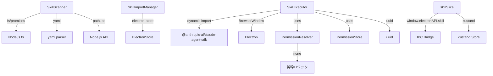

# Phase 1: モジュール分析

## 分析日: 2026-02-02

## モジュール依存関係図

## モジュール詳細

### 1. SkillScanner

| 項目     | 内容                                                   |
| -------- | ------------------------------------------------------ |
| ファイル | `apps/desktop/src/main/services/skill/SkillScanner.ts` |
| クラス名 | `SkillScanner`                                         |
| 層       | Main Process                                           |

**公開メソッド**:

| メソッド        | 引数                                                | 戻り値                            | 説明                             |
| --------------- | --------------------------------------------------- | --------------------------------- | -------------------------------- |
| `constructor`   | `optionsOrBasePath?: SkillScannerOptions \| string` | -                                 | 初期化                           |
| `scanAll`       | なし                                                | `Promise<ScannedSkillMetadata[]>` | 全ディレクトリスキャン           |
| `scanDirectory` | なし                                                | `Promise<string[]>`               | SKILL.mdファイル一覧（レガシー） |
| `setBasePath`   | `basePath: string`                                  | `void`                            | ベースパス設定                   |
| `getBasePath`   | なし                                                | `string`                          | ベースパス取得                   |

**外部依存**:

- `fs/promises` (readdir, readFile, access, stat, mkdir, lstat, readlink)
- `path` (join, resolve, relative, dirname)
- `os` (homedir)
- `yaml` (parse)
- `@repo/shared` (types)

**内部状態**:

- `private aiworkflowSkillsDir: string`
- `private claudeSkillsDir: string`

### 2. SkillImportManager

| 項目     | 内容                                                         |
| -------- | ------------------------------------------------------------ |
| ファイル | `apps/desktop/src/main/services/skill/SkillImportManager.ts` |
| クラス名 | `SkillImportManager`                                         |
| 層       | Main Process                                                 |

**公開メソッド**:

| メソッド              | 引数                 | 戻り値                  | 説明                 |
| --------------------- | -------------------- | ----------------------- | -------------------- |
| `constructor`         | `store: SkillStore`  | -                       | 初期化               |
| `importSkills`        | `skillIds: string[]` | `Promise<ImportResult>` | スキルインポート     |
| `removeSkill`         | `skillId: string`    | `Promise<RemoveResult>` | スキル削除           |
| `getImportedSkillIds` | なし                 | `string[]`              | インポート済みID一覧 |
| `isImported`          | `skillId: string`    | `boolean`               | インポート確認       |

**外部依存**:

- `@repo/shared` (ImportResult, RemoveResult types)
- `SkillStore` interface (electron-store互換)

**内部状態**:

- `private store: SkillStore`
- `private importedSet: Set<string>`

### 3. SkillExecutor

| 項目     | 内容                                                    |
| -------- | ------------------------------------------------------- |
| ファイル | `apps/desktop/src/main/services/skill/SkillExecutor.ts` |
| クラス名 | `SkillExecutor`                                         |
| 層       | Main Process                                            |

**公開メソッド**:

| メソッド                   | 引数                                                             | 戻り値                             | 説明               |
| -------------------------- | ---------------------------------------------------------------- | ---------------------------------- | ------------------ |
| `constructor`              | `mainWindow: BrowserWindow, permissionStore?: IPermissionStore`  | -                                  | 初期化             |
| `execute`                  | `request: SkillExecutionRequest, skill: SkillMetadata`           | `Promise<SkillExecutionResponse>`  | スキル実行         |
| `abort`                    | `executionId: string`                                            | `boolean`                          | 実行中止           |
| `getActiveExecutions`      | なし                                                             | `ExecutionInfo[]`                  | アクティブ実行一覧 |
| `getExecutionStatus`       | `executionId: string`                                            | `ExecutionInfo \| undefined`       | 実行状態取得       |
| `createHooks`              | `executionId: string`                                            | hooks object                       | Hooks作成          |
| `sanitizeArgs`             | `args: Record, depth?: number`                                   | `Record<string, unknown>`          | 引数サニタイズ     |
| `getPermissionReason`      | `toolName: string, args: Record`                                 | `string`                           | 権限理由生成       |
| `handlePermissionResponse` | `requestId, approved, rememberChoice?, rejectReason?, toolName?` | `void`                             | 権限応答処理       |
| `sendPermissionRequest`    | `executionId, toolName, args, signal?`                           | `Promise<SkillPermissionResponse>` | 権限リクエスト送信 |
| `categorizeError`          | `error: unknown`                                                 | `ErrorCategory`                    | エラー分類         |
| `isRetryable`              | `error: unknown`                                                 | `boolean`                          | リトライ可否判定   |

**外部依存**:

- `@anthropic-ai/claude-agent-sdk` (dynamic import: query)
- `electron` (BrowserWindow)
- `uuid` (v4)
- `@repo/shared` (types, constants)
- `PermissionResolver`, `PermissionStore`

**内部状態**:

- `private mainWindow: BrowserWindow`
- `private permissionResolver: PermissionResolver`
- `private permissionStore: IPermissionStore`
- `private activeExecutions: Map<string, ExecutionState>`

### 4. PermissionResolver

| 項目     | 内容                                                         |
| -------- | ------------------------------------------------------------ |
| ファイル | `apps/desktop/src/main/services/skill/PermissionResolver.ts` |
| クラス名 | `PermissionResolver`                                         |
| 層       | Main Process                                                 |

**公開メソッド**:

| メソッド                | 引数                                      | 戻り値                             | 説明                    |
| ----------------------- | ----------------------------------------- | ---------------------------------- | ----------------------- |
| `constructor`           | `defaultTimeout?: number`                 | -                                  | 初期化（デフォルト5分） |
| `waitForResponse`       | `requestId: string, signal?: AbortSignal` | `Promise<SkillPermissionResponse>` | 応答待機                |
| `resolveRequest`        | `response: SkillPermissionResponse`       | `void`                             | リクエスト解決          |
| `cancelRequest`         | `requestId: string, reason?: string`      | `void`                             | リクエストキャンセル    |
| `cancelAll`             | なし                                      | `void`                             | 全リクエストキャンセル  |
| `pendingCount` (getter) | なし                                      | `number`                           | 保留中リクエスト数      |

**外部依存**:

- `@repo/shared` (SkillPermissionResponse type)

**内部状態**:

- `private pendingRequests: Map<string, PendingRequest>`
- `private defaultTimeout: number`

### 5. skillSlice

| 項目         | 内容                                                   |
| ------------ | ------------------------------------------------------ |
| ファイル     | `apps/desktop/src/renderer/store/slices/skillSlice.ts` |
| エクスポート | `createSkillSlice` (関数)                              |
| 層           | Renderer Process                                       |

**状態プロパティ**:

- `availableSkillsMetadata: SkillMetadata[]`
- `importedSkills: ImportedSkill[]`
- `selectedSkillName: string | null`
- `isExecuting: boolean`
- `executionId: string | null`
- `skillExecutionStatus: SkillExecutionStatus | null`
- `streamingMessages: SkillStreamMessage[]`
- `pendingPermission: SkillPermissionRequest | null`
- `skillError: string | null`
- `isLoadingSkills: boolean`
- `isScanning: boolean`
- `isImporting: boolean`
- `importingSkillName: string | null`

**公開アクション**:

| アクション                 | 引数                                    | 戻り値          | 説明               |
| -------------------------- | --------------------------------------- | --------------- | ------------------ |
| `fetchSkills`              | なし                                    | `Promise<void>` | スキル一覧取得     |
| `rescanSkills`             | なし                                    | `Promise<void>` | 再スキャン         |
| `importSkill`              | `skillName: string`                     | `Promise<void>` | インポート         |
| `removeSkill`              | `skillName: string`                     | `Promise<void>` | 削除               |
| `selectSkillByName`        | `skillName: string \| null`             | `void`          | 選択               |
| `executeSkill`             | `prompt: string`                        | `Promise<void>` | 実行               |
| `abortExecution`           | なし                                    | `void`          | 実行中止           |
| `respondToSkillPermission` | `approved: boolean, remember?: boolean` | `void`          | 権限応答           |
| `clearError`               | なし                                    | `void`          | エラークリア       |
| `clearStreamingMessages`   | なし                                    | `void`          | ストリームクリア   |
| `_handleStreamMessage`     | `msg: SkillStreamMessage`               | `void`          | メッセージ処理     |
| `_handleComplete`          | `executionId: string`                   | `void`          | 完了処理           |
| `_handleError`             | `executionId: string, error: string`    | `void`          | エラー処理         |
| `_handlePermissionRequest` | `req: SkillPermissionRequest`           | `void`          | 権限リクエスト処理 |

**外部依存**:

- `zustand` (StateCreator)
- `@repo/shared` (types)
- `window.electronAPI.skill` (IPC bridge)

## テスト境界

| 境界                 | 単体テスト側                             | 統合テスト側（TASK-8B/8C） |
| -------------------- | ---------------------------------------- | -------------------------- |
| IPC境界              | `window.electronAPI.skill`をスタブ化     | 実IPC通信をテスト          |
| SDK境界              | `@anthropic-ai/claude-agent-sdk`をモック | 実SDK呼び出し              |
| ファイルシステム境界 | `fs/promises`をモック（一部実FS）        | 実ファイル操作             |
| ストア境界           | `electron-store`をモック                 | 実ストア永続化             |
