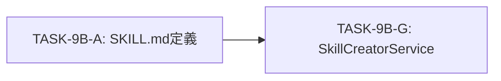

# TASK-9B-G スコープ定義

## メタ情報

| 項目     | 値                    |
| -------- | --------------------- |
| タスクID | TASK-9B-G             |
| 機能名   | skill-creator-service |
| Phase    | 1                     |
| 作成日   | 2026-02-03            |

---

## 1. スコープ内（In Scope）

### 1.1 実装対象ファイル

| ファイル                  | パス                                                                         | 説明             |
| ------------------------- | ---------------------------------------------------------------------------- | ---------------- |
| 型定義                    | `packages/shared/src/types/skillCreator.ts`                                  | 共有型定義       |
| ScriptExecutor            | `apps/desktop/src/main/services/skill/ScriptExecutor.ts`                     | Script First基盤 |
| ResourceLoader            | `apps/desktop/src/main/services/skill/ResourceLoader.ts`                     | 遅延読み込み基盤 |
| SkillCreatorService       | `apps/desktop/src/main/services/skill/SkillCreatorService.ts`                | メインサービス   |
| ScriptExecutorテスト      | `apps/desktop/src/main/services/skill/__tests__/ScriptExecutor.test.ts`      | テストコード     |
| ResourceLoaderテスト      | `apps/desktop/src/main/services/skill/__tests__/ResourceLoader.test.ts`      | テストコード     |
| SkillCreatorServiceテスト | `apps/desktop/src/main/services/skill/__tests__/SkillCreatorService.test.ts` | テストコード     |

### 1.2 実装対象機能

| 機能カテゴリ     | 詳細                                                                             |
| ---------------- | -------------------------------------------------------------------------------- |
| モード判定       | detectMode() - 5モード（collaborative/orchestrate/create/update/improve-prompt） |
| スキル作成       | createSkill() - モード別ワークフロー実行                                         |
| タスク実行       | executeTasks() - 依存関係解決、並列/逐次実行、ドライラン                         |
| スキル検証       | validateSkill(), validateWithSchema() - スクリプト委譲検証                       |
| スクリプト実行   | ScriptExecutor - Script First原則による決定論的処理                              |
| リソース読み込み | ResourceLoader - Progressive Disclosure原則による遅延読み込み                    |

### 1.3 対応する設計原則

| 原則                   | 適用範囲                               |
| ---------------------- | -------------------------------------- |
| Script First           | 決定論的処理をScriptExecutorに集約     |
| Progressive Disclosure | リソースをResourceLoaderで遅延読み込み |
| Facadeパターン         | SkillCreatorServiceが複雑な処理を統合  |
| Result型パターン       | 全メソッドで成功/失敗を明示的に返却    |

### 1.4 利用する既存リソース

| カテゴリ    | 数  | パス                                             |
| ----------- | --- | ------------------------------------------------ |
| scripts/    | 28+ | `~/.aiworkflow/skills/skill-creator/scripts/`    |
| agents/     | 36+ | `~/.aiworkflow/skills/skill-creator/agents/`     |
| references/ | 40+ | `~/.aiworkflow/skills/skill-creator/references/` |
| assets/     | 38+ | `~/.aiworkflow/skills/skill-creator/assets/`     |
| schemas/    | 38+ | `~/.aiworkflow/skills/skill-creator/schemas/`    |

---

## 2. スコープ外（Out of Scope）

### 2.1 本タスクで実装しないもの

| 項目                     | 理由                              | 対応タスク   |
| ------------------------ | --------------------------------- | ------------ |
| UI実装                   | フロントエンド層は別タスク        | TASK-10A以降 |
| IPC通信設定              | Electron IPC層は別タスク          | 未定         |
| スキル実行時の権限管理   | 既存PermissionServiceを利用       | -            |
| Claude Agent SDK本格統合 | 現時点では直接Anthropic SDKで代替 | 将来タスク   |
| 新規スクリプト作成       | 既存scripts/を活用                | -            |

### 2.2 制約事項

| 制約                  | 内容                                                 |
| --------------------- | ---------------------------------------------------- |
| 依存タスク            | TASK-9B-A（SKILL.md定義）が完了していること          |
| skill-creatorリソース | `~/.aiworkflow/skills/skill-creator/` が存在すること |
| Node.js環境           | スクリプト実行にNode.jsが必要                        |

---

## 3. 成果物一覧

### 3.1 必須成果物

| Phase | 成果物                   | パス                                                          |
| ----- | ------------------------ | ------------------------------------------------------------- |
| 1     | 要件定義書               | `outputs/phase-1/requirements-definition.md`                  |
| 1     | 受け入れ基準             | `outputs/phase-1/acceptance-criteria.md`                      |
| 1     | スコープ定義             | `outputs/phase-1/scope-definition.md`                         |
| 2     | アーキテクチャ設計書     | `outputs/phase-2/architecture-design.md`                      |
| 2     | 型定義設計書             | `outputs/phase-2/type-definitions.md`                         |
| 2     | クラス設計書             | `outputs/phase-2/class-design.md`                             |
| 3     | 設計レビュー結果         | `outputs/phase-3/design-review-result.md`                     |
| 4     | テスト仕様書             | `outputs/phase-4/test-specification.md`                       |
| 4     | テストケース             | `outputs/phase-4/test-cases.md`                               |
| 5     | 型定義                   | `packages/shared/src/types/skillCreator.ts`                   |
| 5     | ScriptExecutor           | `apps/desktop/src/main/services/skill/ScriptExecutor.ts`      |
| 5     | ResourceLoader           | `apps/desktop/src/main/services/skill/ResourceLoader.ts`      |
| 5     | SkillCreatorService      | `apps/desktop/src/main/services/skill/SkillCreatorService.ts` |
| 6     | カバレッジレポート       | `outputs/phase-6/coverage-report.md`                          |
| 7     | カバレッジレポート       | `outputs/phase-7/coverage-report.md`                          |
| 8     | リファクタリングレポート | `outputs/phase-8/refactoring-report.md`                       |
| 9     | 品質レポート             | `outputs/phase-9/quality-report.md`                           |
| 10    | 最終レビュー結果         | `outputs/phase-10/final-review-result.md`                     |
| 11    | 手動テスト結果           | `outputs/phase-11/manual-test-result.md`                      |
| 12    | 実装ガイド               | `outputs/phase-12/implementation-guide.md`                    |
| 12    | ドキュメント更新履歴     | `outputs/phase-12/documentation-changelog.md`                 |
| 12    | 未タスク検出レポート     | `outputs/phase-12/unassigned-task-detection.md`               |

### 3.2 テストファイル

| ファイル                  | パス                                                                         |
| ------------------------- | ---------------------------------------------------------------------------- |
| ScriptExecutorテスト      | `apps/desktop/src/main/services/skill/__tests__/ScriptExecutor.test.ts`      |
| ResourceLoaderテスト      | `apps/desktop/src/main/services/skill/__tests__/ResourceLoader.test.ts`      |
| SkillCreatorServiceテスト | `apps/desktop/src/main/services/skill/__tests__/SkillCreatorService.test.ts` |

---

## 4. 依存関係

### 4.1 前提タスク

### 4.2 後続タスク

### 4.3 外部依存

| 依存先                | 用途                                  | 備考                                |
| --------------------- | ------------------------------------- | ----------------------------------- |
| Node.js               | スクリプト実行                        | child_process.spawn                 |
| skill-creatorリソース | Script First / Progressive Disclosure | ~/.aiworkflow/skills/skill-creator/ |
| TypeScript            | 型定義                                | packages/shared/src/types/          |

---

## 5. 品質基準

| 基準              | 目標値 | 測定方法        |
| ----------------- | ------ | --------------- |
| Line Coverage     | 80%+   | Vitest coverage |
| Branch Coverage   | 60%+   | Vitest coverage |
| Function Coverage | 80%+   | Vitest coverage |
| TypeScriptエラー  | 0      | tsc --noEmit    |
| ESLintエラー      | 0      | eslint          |

---

## 変更履歴

| バージョン | 日付       | 変更内容 |
| ---------- | ---------- | -------- |
| 1.0.0      | 2026-02-03 | 初版作成 |
