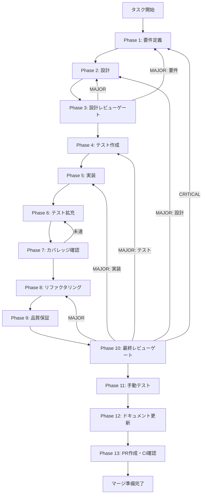

# TASK-9E-skill-fork - タスク実行仕様書

## ユーザーからの元の指示

```
スキルフォーク・派生機能を実装する。既存スキルをベースに新しいスキルを作成する機能。元スキルの設定や構造を引き継ぎながらカスタマイズできる。
```

## メタ情報

| 項目         | 内容                         |
| ------------ | ---------------------------- |
| タスクID     | TASK-9E                      |
| タスク名     | skill-fork-implementation    |
| 分類         | 要件                         |
| 対象機能     | スキルフォーク・派生機能     |
| 優先度       | 低                           |
| 見積もり規模 | 中規模                       |
| ステータス   | Phase 12まで完了（PR未作成） |
| 作成日       | 2026-02-28                   |

---

## タスク概要

### 目的

既存スキルをベースに新しいスキルを作成（フォーク）する機能を実装する。ユーザーは元スキルの設定・構造を引き継ぎつつ、名前・説明・サブディレクトリ（agents, references, scripts, assets）のコピー対象を選択してカスタマイズした派生スキルを作成できる。

### 背景

AIWorkflowOrchestrator のスキルシステムでは、ユーザーが独自のスキルを作成・管理できる。既存のスキルを改良・カスタマイズしたい場合、現状ではゼロから新規作成するか手動でファイルをコピーする必要がある。フォーク機能により、既存スキルの構造を活用した効率的なスキル作成が可能になる。TASK-9B（skill-creator スキル）の完了を前提とし、スキル管理の拡張機能として位置づけられる。

### 最終ゴール

- `skill:fork` IPCチャネル経由でフォーク操作を実行できる
- SKILL.md の名前・説明が新スキル用に更新される
- 選択したサブディレクトリ（agents, references, scripts, assets）のみがコピーされる
- フォークメタデータ（`forkedFrom`, `forkedAt`, `originalDescription`）が新スキルの SKILL.md に記録される
- 同名スキルへのフォークがバリデーションエラーとして拒否される
- `allowedTools` のカスタマイズが反映される

### エレガント解決方針（再設計）

| 方針                                 | 解決する課題                                    | 実行方法                                                                                    |
| ------------------------------------ | ----------------------------------------------- | ------------------------------------------------------------------------------------------- |
| 責務分離（SoC）                      | `skill-creator:fork` と `skill:fork` の責務混在 | SkillCreator 系と Skill API 系でチャンネルを分離して定義する                                |
| 正本一元化（Single Source of Truth） | 仕様抽出漏れによる実装ドリフト                  | `aiworkflow-requirements` の必読仕様セットを固定し、Phase 1/2 で抽出マトリクス化する        |
| ゲート自動化（Deterministic Gate）   | 手動レビュー依存による漏れ                      | `validate-phase-output` / `verify-all-specs` / `verify-unassigned-links` を完了ゲート化する |

### 成果物一覧

| 種別         | 成果物                    | 配置先                                                               |
| ------------ | ------------------------- | -------------------------------------------------------------------- |
| 新規作成     | SkillForker サービス      | `apps/desktop/src/main/services/skill/SkillForker.ts`                |
| 新規作成     | スキルフォーク型定義      | `packages/shared/src/types/skill-fork.ts`                            |
| 変更         | 共有型 index エクスポート | `packages/shared/src/types/index.ts`                                 |
| 変更         | IPC ハンドラー            | `apps/desktop/src/main/ipc/skillHandlers.ts`                         |
| 変更         | IPC チャネル定義          | `apps/desktop/src/preload/channels.ts`                               |
| 変更         | Preload Skill API         | `apps/desktop/src/preload/skill-api.ts`                              |
| テスト       | SkillForker テスト        | `apps/desktop/src/main/services/skill/__tests__/SkillForker.test.ts` |
| テスト       | IPC ハンドラーテスト      | `apps/desktop/src/main/ipc/__tests__/skillHandlers.fork.test.ts`     |
| ドキュメント | Phase 1-13 成果物         | `outputs/phase-*/`                                                   |
| PR           | GitHub Pull Request       | GitHub UI                                                            |

---

## 参照ファイル

本仕様書のコマンド選定は以下を参照：

- `docs/00-requirements/master_system_design.md` - システム要件
- `.claude/skills/aiworkflow-requirements/references/` - システム仕様
- `.claude/rules/04-electron-security.md` - IPC セキュリティ原則
- `.claude/rules/06-known-pitfalls.md` - P42（.trim()バリデーション）, P44/P45（IPCインターフェース不整合防止）

### aiworkflow-requirements 必読抽出セット（TASK-9E）

| 仕様書                          | 抽出目的                                                 |
| ------------------------------- | -------------------------------------------------------- |
| `api-ipc-agent.md`              | `skill:fork` の IPC 契約と `IpcResult<T>` 形式を合わせる |
| `interfaces-agent-sdk-skill.md` | 既存 `skill-creator:fork` との責務境界を固定する         |
| `security-electron-ipc.md`      | sender 検証・入力検証・サニタイズ要件を固定する          |
| `security-api-electron.md`      | Preload 公開経路を `safeInvoke` ベースで固定する         |
| `error-handling.md`             | バリデーション/FS/予期せぬ例外の分類を統一する           |
| `ipc-contract-checklist.md`     | P44/P45 の契約整合チェックを実施する                     |

---

## 型定義

### SkillForkOptions（フォーク実行時の入力パラメータ）

```typescript
export interface SkillForkOptions {
  /** フォーク元スキル名 */
  sourceSkill: string;
  /** 新スキル名 */
  newName: string;
  /** 新スキルの説明文（省略時はフォーク元の説明を引き継ぐ） */
  description?: string;
  /** agents/ ディレクトリをコピーするか */
  copyAgents: boolean;
  /** references/ ディレクトリをコピーするか */
  copyReferences: boolean;
  /** scripts/ ディレクトリをコピーするか */
  copyScripts: boolean;
  /** assets/ ディレクトリをコピーするか */
  copyAssets: boolean;
  /** allowedTools を上書きする場合のツール名配列 */
  modifyAllowedTools?: string[];
}
```

### SkillForkResult（フォーク実行結果）

```typescript
export interface SkillForkResult {
  /** フォーク成功フラグ */
  success: boolean;
  /** 新スキルのファイルシステムパス */
  newSkillPath: string;
  /** コピーされたファイルの相対パス一覧 */
  copiedFiles: string[];
  /** 非致命的な警告メッセージ一覧 */
  warnings?: string[];
}
```

### SkillForkMetadata（SKILL.md に埋め込むメタデータ）

```typescript
export interface SkillForkMetadata {
  /** フォーク元スキル名 */
  forkedFrom: string;
  /** フォーク実行日時（ISO 8601 形式） */
  forkedAt: string;
  /** フォーク元スキルの説明文 */
  originalDescription?: string;
}
```

---

## IPC チャネル

| チャネル名   | 方向            | 引数               | 戻り値            | バリデーション                                              |
| ------------ | --------------- | ------------------ | ----------------- | ----------------------------------------------------------- |
| `skill:fork` | Renderer → Main | `SkillForkOptions` | `SkillForkResult` | P42準拠3段バリデーション（型チェック → 空文字列 → .trim()） |

---

## タスク分解サマリー

| ID     | フェーズ | サブタスク名           | 責務                                                  | 依存 |
| ------ | -------- | ---------------------- | ----------------------------------------------------- | ---- |
| T-01-1 | Phase 1  | 要件定義               | フォーク機能の要件・受入基準・スコープ定義            | -    |
| T-02-1 | Phase 2  | 設計                   | SkillForker アーキテクチャ・IPC契約・セキュリティ設計 | T-01 |
| T-03-1 | Phase 3  | 設計レビューゲート     | 要件・設計の妥当性検証                                | T-02 |
| T-04-1 | Phase 4  | テスト作成（TDD: Red） | SkillForker・IPC・型定義のテストコード作成            | T-03 |
| T-05-1 | Phase 5  | 実装（TDD: Green）     | SkillForker・型定義・IPC・Preload の実装              | T-04 |
| T-06-1 | Phase 6  | テスト拡充             | 境界値・異常系・統合テスト追加                        | T-05 |
| T-07-1 | Phase 7  | カバレッジ確認         | Line 80%+、Branch 60%+、Function 80%+ 達成確認        | T-06 |
| T-08-1 | Phase 8  | リファクタリング       | コード品質改善・重複排除・命名統一                    | T-07 |
| T-09-1 | Phase 9  | 品質保証               | Lint・型チェック・全テスト実行                        | T-08 |
| T-10-1 | Phase 10 | 最終レビューゲート     | セキュリティ・IPC契約・要件充足の多角的検証           | T-09 |
| T-11-1 | Phase 11 | 手動テスト             | フォーク操作のE2Eシナリオ実行                         | T-10 |
| T-12-1 | Phase 12 | ドキュメント更新       | 実装ガイド・仕様書更新・未タスク検出                  | T-11 |
| T-13-1 | Phase 13 | PR作成・CI確認         | ブランチ作成・PR作成・CI通過確認                      | T-12 |

**総サブタスク数**: 13個

---

## 実行フロー図



---

## Phase一覧

| Phase | 名称               | 仕様書                                                       | ステータス |
| ----- | ------------------ | ------------------------------------------------------------ | ---------- |
| 1     | 要件定義           | [phase-1-requirements.md](phase-1-requirements.md)           | 完了       |
| 2     | 設計               | [phase-2-design.md](phase-2-design.md)                       | 完了       |
| 3     | 設計レビューゲート | [phase-3-design-review.md](phase-3-design-review.md)         | 完了       |
| 4     | テスト作成         | [phase-4-test-creation.md](phase-4-test-creation.md)         | 完了       |
| 5     | 実装               | [phase-5-implementation.md](phase-5-implementation.md)       | 完了       |
| 6     | テスト拡充         | [phase-6-test-expansion.md](phase-6-test-expansion.md)       | 完了       |
| 7     | カバレッジ確認     | [phase-7-coverage-check.md](phase-7-coverage-check.md)       | 完了       |
| 8     | リファクタリング   | [phase-8-refactoring.md](phase-8-refactoring.md)             | 完了       |
| 9     | 品質保証           | [phase-9-quality-assurance.md](phase-9-quality-assurance.md) | 完了       |
| 10    | 最終レビューゲート | [phase-10-final-review.md](phase-10-final-review.md)         | 完了       |
| 11    | 手動テスト         | [phase-11-manual-test.md](phase-11-manual-test.md)           | 完了       |
| 12    | ドキュメント更新   | [phase-12-documentation.md](phase-12-documentation.md)       | 完了       |
| 13    | PR作成             | [phase-13-pr-creation.md](phase-13-pr-creation.md)           | 未実施     |

---

## テストカバレッジ目標

### ユニットテスト

| 指標              | 最低基準 | 推奨基準 |
| ----------------- | -------- | -------- |
| Line Coverage     | 80%      | 90%      |
| Branch Coverage   | 60%      | 70%      |
| Function Coverage | 80%      | 90%      |

### 結合テスト

| 指標                         | 目標 |
| ---------------------------- | ---- |
| IPC エンドポイント           | 100% |
| モジュール間インターフェース | 100% |
| 正常系シナリオ               | 100% |
| 異常系シナリオ               | 80%+ |
| 外部連携ポイント             | 100% |

---

## 統合テスト連携（Phase 1〜11で必須）

各Phaseで以下の統合テスト連携アクションを実施すること:

| Phase | 統合テスト連携アクション                                               |
| ----- | ---------------------------------------------------------------------- |
| 1     | フォーク元スキル検索・ファイルシステムアクセスの要件を明記             |
| 2     | SkillForker ↔ SkillService ↔ IPC の契約・インターフェースを設計に反映  |
| 3     | IPC契約整合性・パストラバーサル防止の設計レビューゲートを実施          |
| 4     | SkillForker + IPC + Preload の統合テストシナリオを作成                 |
| 5     | SkillForker サービスと IPC ハンドラの接続実装                          |
| 6     | フォーク元不在・同名衝突・ディスク容量不足の統合テスト拡充             |
| 7     | 統合テストのカバレッジを含めたゲート判定                               |
| 8     | リファクタ後の統合テスト継続成功を確認                                 |
| 9     | 品質保証で統合テスト結果を確認                                         |
| 10    | 最終レビューで統合テスト結果・IPC契約整合性を確認                      |
| 11    | 手動でフォーク操作を実行し、生成されたスキルが正常に動作することを確認 |

---

## Phase完了時の必須アクション

**各Phase完了時に以下を必ず実行すること:**

1. **タスク100%実行**: Phase内で指定された全タスクを完全に実行
2. **成果物確認**: 全ての必須成果物が生成されていることを検証
3. **実行記録**: 実行タスクの結果を記録
4. **artifacts.json更新**: Phase完了ステータスを更新
5. **Phase末端の実行確認**: 各タスクを100%実行し、各タスクを完遂した旨を必ず明記

```bash
# Phase完了時の検証コマンド
node .claude/skills/task-specification-creator/scripts/validate-phase-output.js docs/30-workflows/completed-tasks/TASK-9E-skill-fork --phase {{PHASE_NUMBER}}

# Phase完了・成果物登録
node .claude/skills/task-specification-creator/scripts/complete-phase.js \
  --workflow docs/30-workflows/completed-tasks/TASK-9E-skill-fork --phase {{PHASE_NUMBER}} --artifacts "..."
```
