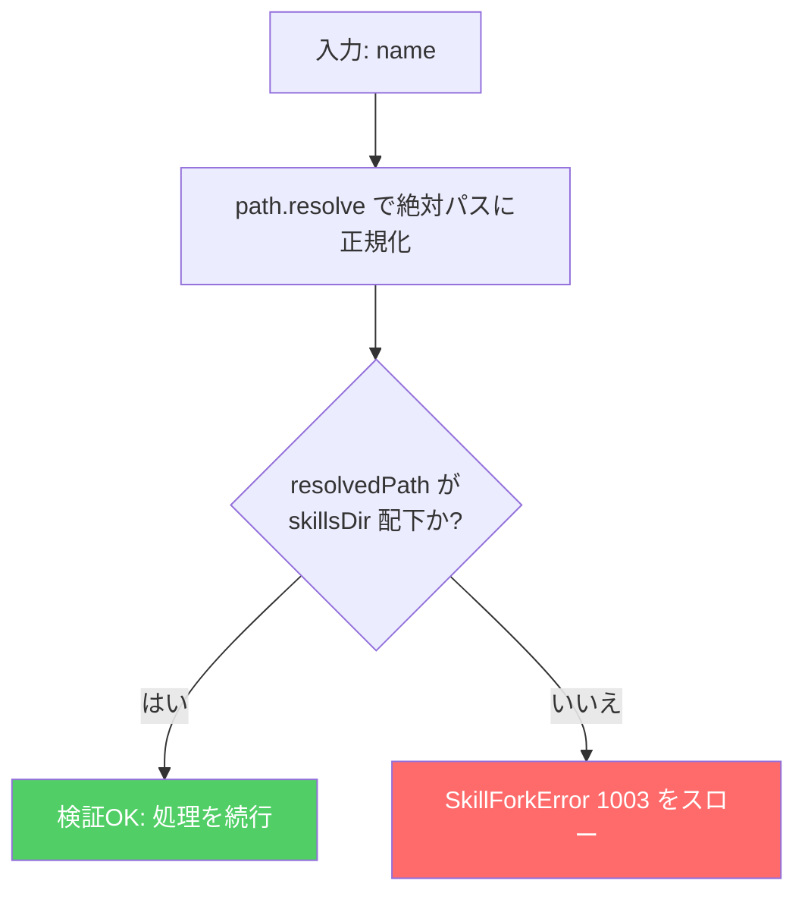
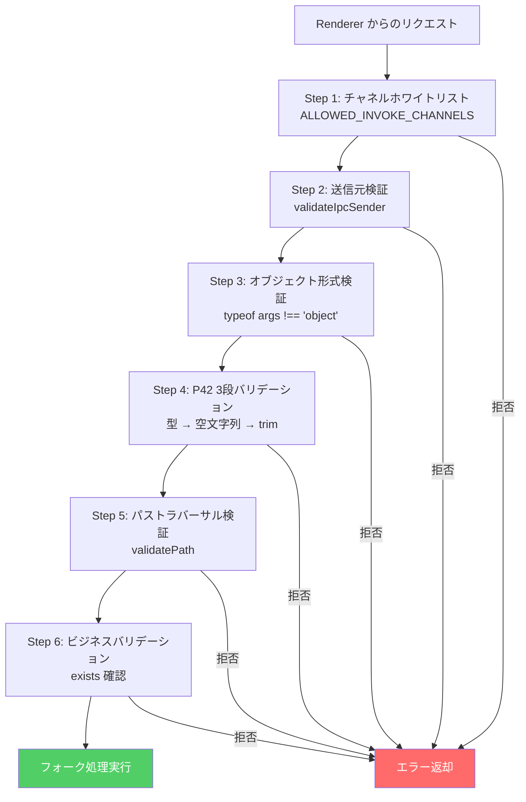

# Phase 2 成果物: セキュリティ設計書

## メタ情報

| 項目     | 値                 |
| -------- | ------------------ |
| Phase    | 2                  |
| 機能名   | TASK-9E-skill-fork |
| タスクID | TASK-9E            |
| 作成日   | 2026-02-28         |

## 1. セキュリティ設計原則の適用

### 1.1 Electron 3プロセスモデルにおける配置

| プロセス | skill:fork での役割                                | セキュリティ制約                     |
| -------- | -------------------------------------------------- | ------------------------------------ |
| Main     | SkillForker の実行、FS操作、バリデーション         | Node.js フルアクセス（FS操作を担当） |
| Preload  | safeInvoke 経由で skill:fork を呼び出し            | contextBridge のみ                   |
| Renderer | ForkSkillDialog で UI 操作、forkSkill() を呼び出し | DOM のみ（FS直接アクセス不可）       |

### 1.2 適用するセキュリティ原則

| 原則             | skill:fork での適用                                             |
| ---------------- | --------------------------------------------------------------- |
| 最小権限         | Renderer は IPC 経由のみ、FS操作は Main に限定                  |
| 多層防御         | チャネルホワイトリスト → 送信元検証 → バリデーション → パス検証 |
| フェイルセキュア | エラー時はロールバック、サニタイズ済みメッセージを返却          |
| 完全仲介         | 全リクエストで validateIpcSender + バリデーションを実行         |

## 2. パストラバーサル防止

### 2.1 validatePath の設計

```typescript
/**
 * パストラバーサル検証
 *
 * 攻撃パターン:
 *   - "../malicious" → skillsDir の親ディレクトリを参照
 *   - "..\\malicious" → Windows パス区切りでの攻撃
 *   - "skill/../../../etc/passwd" → 深いトラバーサル
 *   - シンボリックリンク経由の迂回
 *
 * 防御戦略:
 *   1. path.resolve() で絶対パスに正規化
 *   2. startsWith(skillsDir) で skillsDir 配下であることを検証
 *   3. skillsDir 外を参照している場合は即座にエラー
 */
private validatePath(name: string): void {
  const resolvedPath = path.resolve(this.skillsDir, name);

  // skillsDir 配下でない場合はパストラバーサル攻撃と判定
  if (!resolvedPath.startsWith(this.skillsDir + path.sep) &&
      resolvedPath !== this.skillsDir) {
    throw new SkillForkError(
      "不正なスキル名です",
      1003,
      false,
    );
  }
}
```

### 2.2 パストラバーサル攻撃のテストケース

| 攻撃パターン                 | 入力値                      | 期待結果             |
| ---------------------------- | --------------------------- | -------------------- |
| 単純な上位参照               | `../malicious`              | SkillForkError(1003) |
| Windows パス区切り           | `..\\malicious`             | SkillForkError(1003) |
| 深いトラバーサル             | `skill/../../../etc/passwd` | SkillForkError(1003) |
| エンコードされたトラバーサル | `..%2F..%2Fetc%2Fpasswd`    | SkillForkError(1003) |
| 正常なスキル名               | `my-skill`                  | 正常終了             |
| ハイフン付きスキル名         | `my-custom-skill`           | 正常終了             |
| 数字付きスキル名             | `skill-v2`                  | 正常終了             |

### 2.3 検証フロー図



## 3. 送信元検証

### 3.1 validateIpcSender の適用

```typescript
// skill:fork ハンドラの最初のステップとして実行

const validation = validateIpcSender(event, IPC_CHANNELS.SKILL_FORK, {
  getAllowedWindows: () => [mainWindow],
});
if (!validation.valid) {
  throw toIPCValidationError(validation);
}
```

### 3.2 検証内容

| 検証項目             | 方法                                     | 失敗時の対応                       |
| -------------------- | ---------------------------------------- | ---------------------------------- |
| 送信元ウィンドウ     | `getAllowedWindows` で mainWindow と比較 | `toIPCValidationError` で拒否      |
| チャネル名           | `IPC_CHANNELS.SKILL_FORK` 定数で参照     | ハードコード文字列不使用           |
| リクエスト元の正当性 | `event.sender` の WebContents ID を検証  | 不正なプロセスからの呼び出しを拒否 |

### 3.3 getAllowedWindows コールバックの設計

P41（v8 カバレッジプロバイダのインライン関数カウント）を考慮し、テスト時にコールバックの戻り値を明示的に検証できる設計とする。

```typescript
// テスト時のコールバック検証例
const callArgs = mockValidateIpcSender.mock.calls[0];
const options = callArgs[2];
const allowedWindows = options.getAllowedWindows();
expect(allowedWindows).toEqual([mainWindow]);
```

## 4. エラーサニタイズ

### 4.1 sanitizeErrorMessage の適用ポイント

```
Main Process のエラー発生
  │
  ├── SkillForkError（コード 1000-1999）
  │     → メッセージにパス情報を含めない設計
  │     → sanitizeErrorMessage で安全側に処理
  │
  ├── SkillForkError（コード 4000-4999）
  │     → FS操作エラーにはパス情報が含まれる
  │     → sanitizeErrorMessage でパスを [path] に置換
  │
  └── 予期せぬエラー（Error 型以外）
        → DEFAULT_ERROR_MESSAGE を返却
```

### 4.2 サニタイズのパターン一覧

```typescript
// skillHandlers.ts 内の既存定義を再利用

const STACK_TRACE_PATTERN = /\n\s+at\s+.*/g;
const UNIX_PATH_PATTERN = /\/[\w./\\-]+/g;
const WINDOWS_PATH_PATTERN = /[A-Z]:\\[\w.\\-]+/gi;
const SENSITIVE_DATA_PATTERN = /(token|key|password|secret)=\S+/gi;
const IP_ADDRESS_PATTERN = /\d{1,3}\.\d{1,3}\.\d{1,3}\.\d{1,3}(:\d+)?/g;
const JS_RUNTIME_ERROR_PATTERN =
  /Cannot read properties? of (undefined|null).*$/;
const DEFAULT_ERROR_MESSAGE = "スキル処理でエラーが発生しました";
```

### 4.3 サニタイズ前後の例

```
入力:
  "ENOENT: no such file or directory, open '/Users/dm/.claude/skills/my-skill/SKILL.md'
      at Object.openSync (node:fs:592:3)
      at readFileSync (node:fs:468:35)"

出力:
  "ENOENT: no such file or directory, open '[path]'"
```

```
入力:
  "Cannot read properties of undefined (reading 'frontmatter')"

出力:
  "スキル処理でエラーが発生しました"
```

## 5. 3段バリデーション

### 5.1 バリデーション階層



### 5.2 各バリデーション層の責務

| 層                     | 責務                             | 実装場所         | エラーコード     |
| ---------------------- | -------------------------------- | ---------------- | ---------------- |
| チャネルホワイトリスト | 未登録チャネルの拒否             | channels.ts      | IPC エラー       |
| 送信元検証             | 不正プロセスからの呼び出し拒否   | ipc-validator.ts | IPC エラー       |
| オブジェクト形式検証   | null/非オブジェクトの拒否        | skillHandlers.ts | VALIDATION_ERROR |
| P42 3段バリデーション  | 型/空文字列/トリム空文字列の拒否 | skillHandlers.ts | VALIDATION_ERROR |
| パストラバーサル検証   | skillsDir 外へのアクセス拒否     | SkillForker.ts   | 1003             |
| ビジネスバリデーション | フォーク元不存在/同名存在の拒否  | SkillForker.ts   | 1001, 1002       |

### 5.3 P42 準拠の文字列バリデーション

```typescript
// ❌ 不十分（P42 違反）
if (typeof forkArgs.sourceSkill !== "string" || forkArgs.sourceSkill === "") {
  // trim チェックなし → スペースのみの入力が通過する
}

// ✅ P42 準拠（3段バリデーション）
if (
  typeof forkArgs.sourceSkill !== "string" || // Step 1: 型チェック
  forkArgs.sourceSkill.trim() === "" // Step 2+3: 空文字列 + トリム空文字列
) {
  throw {
    code: "VALIDATION_ERROR",
    message: "sourceSkill must be a non-empty string",
  };
}
```

## 6. チャネルホワイトリスト

### 6.1 追加対象

```typescript
// apps/desktop/src/preload/channels.ts

// IPC_CHANNELS に追加
SKILL_FORK: "skill:fork",

// ALLOWED_INVOKE_CHANNELS に追加
IPC_CHANNELS.SKILL_FORK,
```

### 6.2 ホワイトリスト管理の原則

| 原則                         | skill:fork での適用                                   |
| ---------------------------- | ----------------------------------------------------- |
| チャネル名は定数で参照       | `IPC_CHANNELS.SKILL_FORK` で参照                      |
| ハードコード文字列の禁止     | `"skill:fork"` の直接使用を禁止                       |
| 登録と解除の対称性           | `registerSkillHandlers` / `unregisterSkillHandlers`   |
| ALLOWED_ON_CHANNELS との分離 | skill:fork は invoke 系（双方向）のため INVOKE に追加 |

### 6.3 P27 対策: ハードコード文字列検出

```bash
# 実装後に以下のコマンドで検出
grep -rn "safeInvoke\|safeOn" apps/desktop/src/preload/ | grep -v "IPC_CHANNELS"
# → 結果が 0 件であること
```

## 7. セキュリティテスト設計

### 7.1 テストケース一覧

| テストケース                       | 検証内容                              | 期待結果             |
| ---------------------------------- | ------------------------------------- | -------------------- |
| 送信元検証: 不正ウィンドウ         | mainWindow 以外からの呼び出し         | IPC エラー           |
| パストラバーサル: ../攻撃          | sourceSkill に `../` を含む値         | SkillForkError(1003) |
| パストラバーサル: ..\\攻撃         | sourceSkill に `..\\` を含む値        | SkillForkError(1003) |
| 3段バリデーション: 型不正          | sourceSkill に数値を渡す              | VALIDATION_ERROR     |
| 3段バリデーション: 空文字列        | sourceSkill に `""` を渡す            | VALIDATION_ERROR     |
| 3段バリデーション: スペースのみ    | sourceSkill に `"   "` を渡す         | VALIDATION_ERROR     |
| エラーサニタイズ: パス情報         | FS エラーにパス情報が含まれる         | [path] に置換        |
| エラーサニタイズ: スタックトレース | エラーにスタックトレースが含まれる    | 除去                 |
| エラーサニタイズ: ランタイムエラー | `Cannot read properties of undefined` | 汎用メッセージ       |

### 7.2 getAllowedWindows コールバック検証（P41 対策）

```typescript
// テストコード例
it("should pass mainWindow to getAllowedWindows callback", () => {
  // ハンドラ呼び出し後
  const callArgs = mockValidateIpcSender.mock.calls[0];
  const options = callArgs[2];
  const allowedWindows = options.getAllowedWindows();
  expect(allowedWindows).toEqual([mainWindow]);
});
```

## 8. セキュリティ監査チェックリスト

### 8.1 実装前チェック

- [ ] `SKILL_FORK` が `IPC_CHANNELS` に定義済み
- [ ] `SKILL_FORK` が `ALLOWED_INVOKE_CHANNELS` に追加済み
- [ ] ハンドラで `validateIpcSender` を最初に呼び出し
- [ ] 全文字列引数に P42 準拠 3段バリデーション
- [ ] `validatePath` でパストラバーサル防止
- [ ] `sanitizeErrorMessage` でエラーサニタイズ

### 8.2 実装後チェック

- [ ] `grep -rn "skill:fork" | grep -v IPC_CHANNELS` の結果が 0 件
- [ ] `grep -rn "safeInvoke.*skill:fork" | grep -v IPC_CHANNELS` の結果が 0 件
- [ ] テストで送信元検証の失敗ケースが検証されている
- [ ] テストでパストラバーサル攻撃が検証されている
- [ ] テストで3段バリデーションの全パターンが検証されている
- [ ] テストでエラーサニタイズが検証されている
