# Phase 2 成果物: シーケンス図 -- フォークプロセスフロー（正常系・異常系）

## メタ情報

| 項目     | 値                 |
| -------- | ------------------ |
| Phase    | 2                  |
| 機能名   | TASK-9E-skill-fork |
| タスクID | TASK-9E            |
| 作成日   | 2026-02-28         |

---

## 1. 正常系シーケンス図

### 1.1 全体フロー（Mermaid）

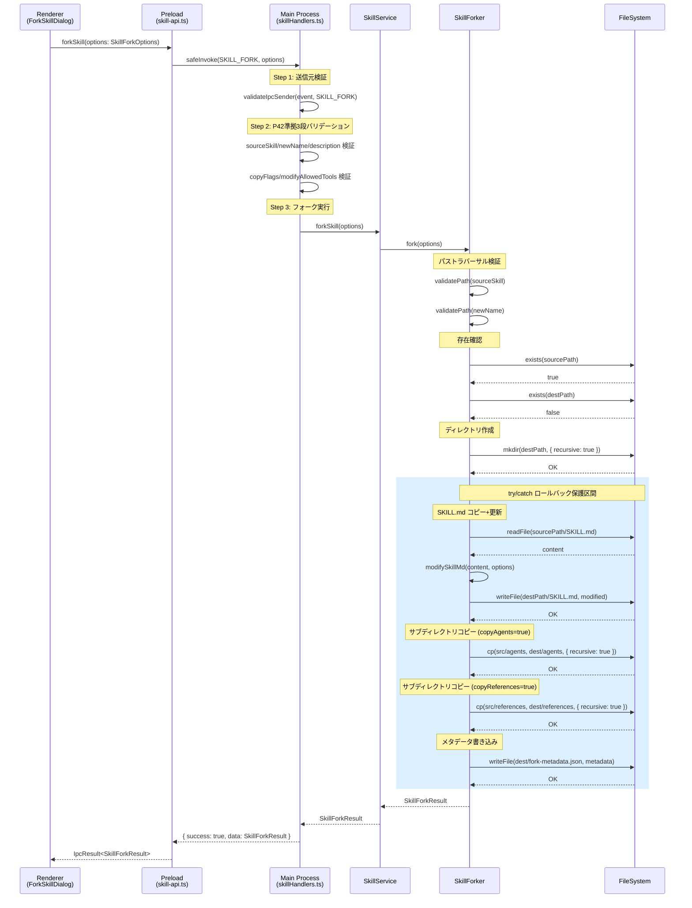

### 1.2 正常系の処理ステップ詳細

| ステップ | 処理                      | 入力                        | 出力                      | 失敗時の対応   |
| -------- | ------------------------- | --------------------------- | ------------------------- | -------------- |
| 1        | 送信元検証                | IpcMainInvokeEvent          | validation.valid          | throw          |
| 2        | P42 3段バリデーション     | args (unknown)              | SkillForkOptions (型安全) | throw          |
| 3        | パストラバーサル検証      | sourceSkill, newName        | void                      | throw(1003)    |
| 4        | フォーク元存在確認        | sourcePath                  | boolean (true)            | throw(1001)    |
| 5        | 同名スキル不存在確認      | destPath                    | boolean (false)           | throw(1002)    |
| 6        | ディレクトリ作成          | destPath                    | void                      | throw(4004)    |
| 7        | SKILL.md 読み取り         | sourcePath/SKILL.md         | content (string)          | rollback(4001) |
| 8        | SKILL.md 更新             | content, SkillForkOptions   | modifiedContent (string)  | rollback       |
| 9        | SKILL.md 書き込み         | destPath/SKILL.md           | void                      | rollback       |
| 10       | agents/ コピー (条件付き) | src/agents, dest/agents     | copiedFiles (string[])    | rollback(4002) |
| 11       | references/ コピー        | src/refs, dest/refs         | copiedFiles (string[])    | rollback(4002) |
| 12       | scripts/ コピー           | src/scripts, dest/scripts   | copiedFiles (string[])    | rollback(4002) |
| 13       | assets/ コピー            | src/assets, dest/assets     | copiedFiles (string[])    | rollback(4002) |
| 14       | メタデータ書き込み        | destPath, SkillForkMetadata | void                      | rollback(4003) |
| 15       | SkillForkResult 返却      | -                           | SkillForkResult           | -              |

---

## 2. 異常系フロー（ロールバック）

### 2.1 ロールバックシーケンス図（Mermaid）

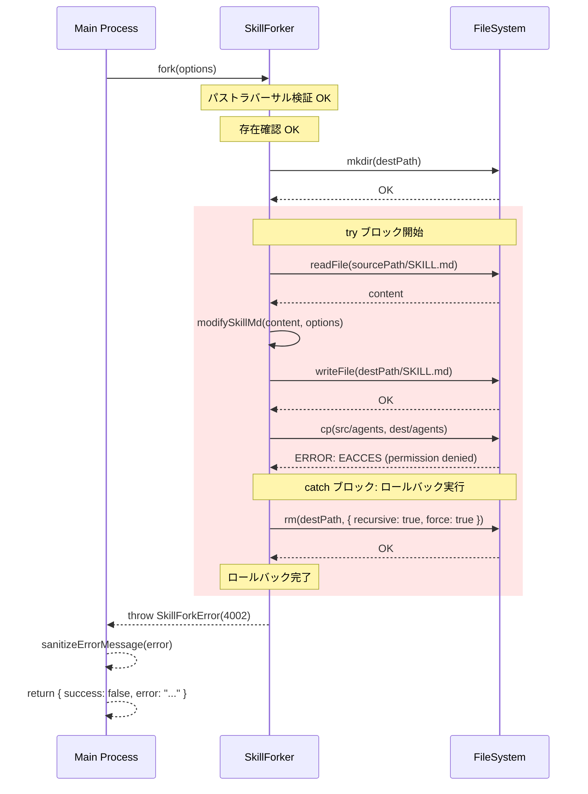

### 2.2 ロールバック処理の擬似コード

```typescript
async fork(options: SkillForkOptions): Promise<SkillForkResult> {
  // 1-4: バリデーション（ロールバック不要）
  this.validatePath(options.sourceSkill);
  this.validatePath(options.newName);

  const sourcePath = path.join(this.skillsDir, options.sourceSkill);
  const destPath = path.join(this.skillsDir, options.newName);

  if (!(await this.exists(sourcePath))) {
    throw new SkillForkError(
      `フォーク元スキル "${options.sourceSkill}" が見つかりません`,
      1001,
    );
  }
  if (await this.exists(destPath)) {
    throw new SkillForkError(
      `スキル "${options.newName}" は既に存在します`,
      1002,
    );
  }

  // 5: ディレクトリ作成
  try {
    await fs.mkdir(destPath, { recursive: true });
  } catch (error) {
    throw new SkillForkError(
      "ディレクトリの作成に失敗しました",
      4004,
      true,
    );
  }

  // 6-14: ロールバック保護区間
  try {
    // SKILL.md のコピー+更新
    const skillMdContent = await fs.readFile(
      path.join(sourcePath, "SKILL.md"),
      "utf-8",
    );
    const modifiedContent = this.modifySkillMd(skillMdContent, options);
    await fs.writeFile(
      path.join(destPath, "SKILL.md"),
      modifiedContent,
      "utf-8",
    );

    // サブディレクトリの選択的コピー
    const copiedFiles: string[] = ["SKILL.md"];
    const warnings: string[] = [];

    const copyTargets = [
      { flag: options.copyAgents, dir: "agents" },
      { flag: options.copyReferences, dir: "references" },
      { flag: options.copyScripts, dir: "scripts" },
      { flag: options.copyAssets, dir: "assets" },
    ];

    for (const { flag, dir } of copyTargets) {
      if (flag) {
        const srcDir = path.join(sourcePath, dir);
        if (await this.exists(srcDir)) {
          const files = await this.copyDirectory(sourcePath, destPath, dir);
          copiedFiles.push(...files);
        }
        // 存在しない場合はスキップ
      }
    }

    // メタデータ書き込み
    const metadata: SkillForkMetadata = {
      forkedFrom: options.sourceSkill,
      forkedAt: new Date().toISOString(),
      originalDescription: undefined, // SKILL.md から取得して設定
    };
    await this.writeForkMetadata(destPath, metadata);
    copiedFiles.push("fork-metadata.json");

    return {
      success: true,
      newSkillPath: destPath,
      copiedFiles,
      warnings: warnings.length > 0 ? warnings : undefined,
    };
  } catch (error) {
    // ロールバック: 作成途中のディレクトリを削除
    await this.rollback(destPath);

    if (error instanceof SkillForkError) {
      throw error;
    }
    throw new SkillForkError(
      "フォーク処理中にエラーが発生しました",
      4002,
      true,
    );
  }
}
```

### 2.3 ロールバック対象と非対象の明確化

| 状態                                   | ロールバック | 理由                                  |
| -------------------------------------- | ------------ | ------------------------------------- |
| バリデーションエラー（1001-1004）      | 不要         | FS操作がまだ開始されていない          |
| mkdir 失敗（4004）                     | 不要         | ディレクトリが作成されていない        |
| SKILL.md 読み取り/書き込み失敗（4001） | 実行         | destPath ディレクトリが作成済み       |
| ディレクトリコピー失敗（4002）         | 実行         | destPath に部分的なファイルが存在する |
| メタデータ書き込み失敗（4003）         | 実行         | destPath に部分的なファイルが存在する |

---

## 3. 異常系パターン別シーケンス

### 3.1 バリデーションエラー（ロールバック不要）

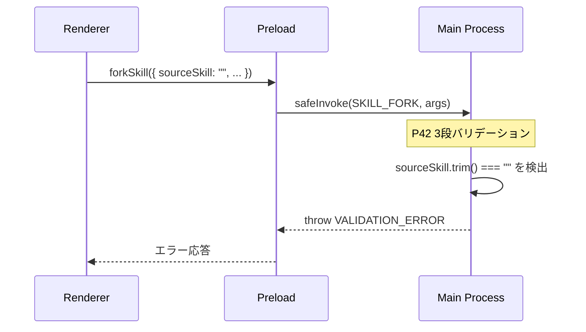

### 3.2 フォーク元不存在エラー（ロールバック不要）

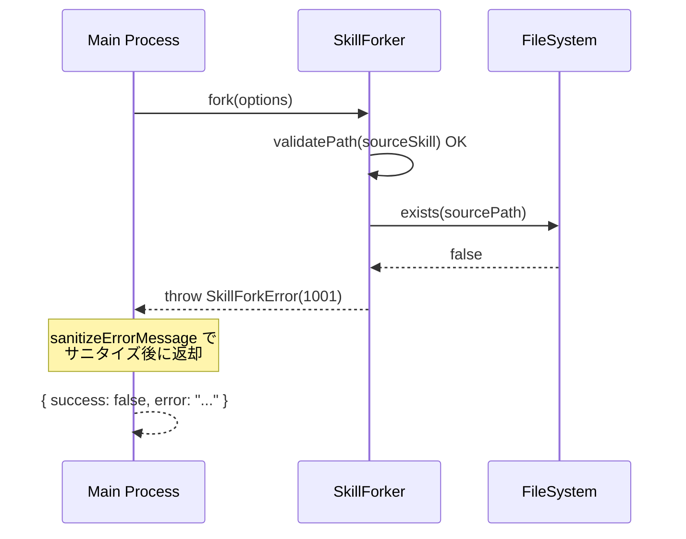

### 3.3 同名スキル存在エラー（ロールバック不要）

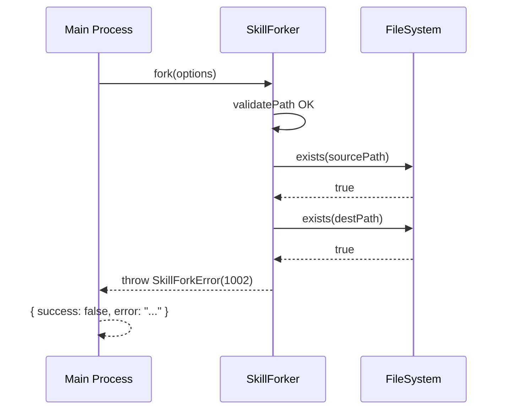

### 3.4 パストラバーサル検出（ロールバック不要）

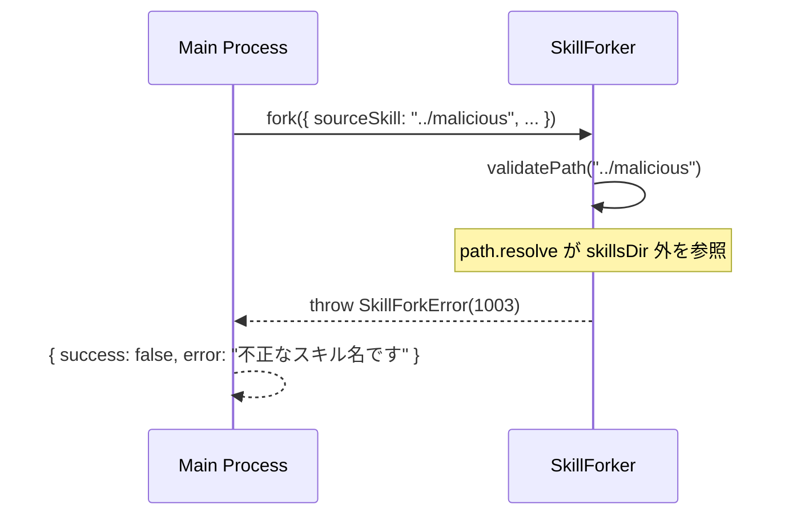

### 3.5 メタデータ書き込み失敗（ロールバック実行）

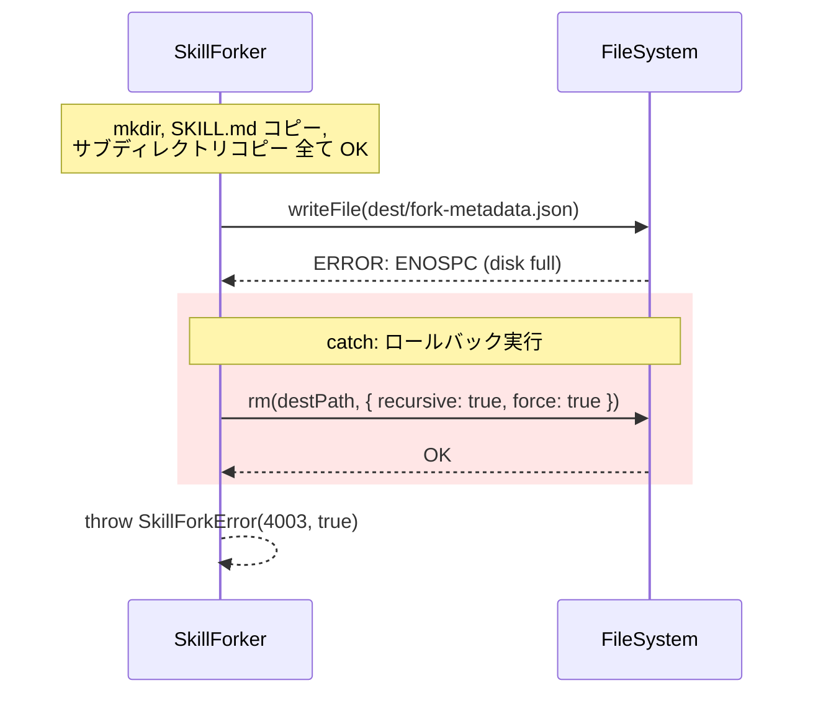

---

## 4. SKILL.md Frontmatter 更新フロー

### 4.1 Frontmatter 更新シーケンス（Mermaid）

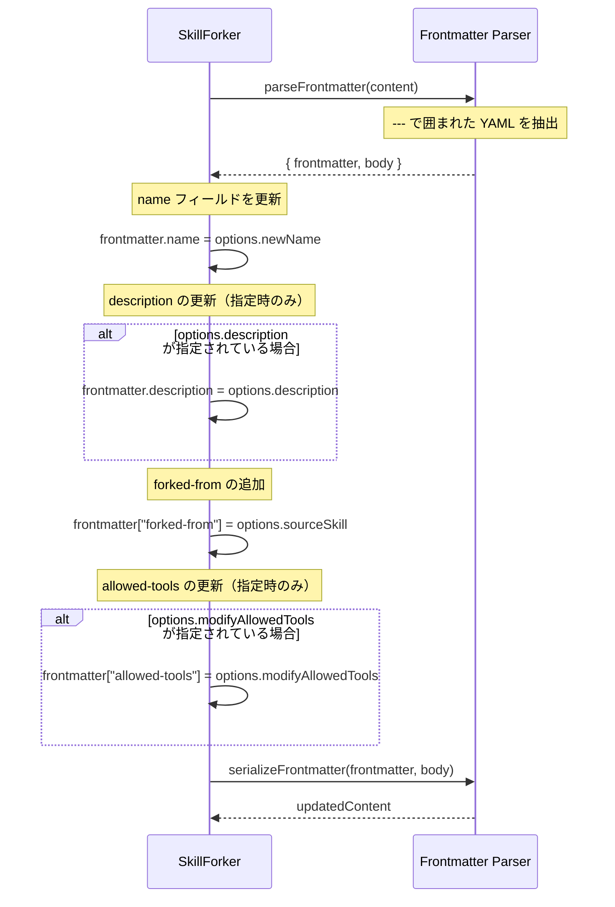

### 4.2 Frontmatter 更新前後の例

**更新前（フォーク元 SKILL.md）:**

```yaml
---
name: aiworkflow-requirements
description: AIワークフローオーケストレーターの要件定義スキル
allowed-tools:
  - Read
  - Glob
  - Grep
---
# AIWorkflow Requirements Skill

このスキルは...
```

**更新後（フォーク先 SKILL.md）:**

```yaml
---
name: my-custom-skill
description: カスタマイズした要件定義スキル
forked-from: aiworkflow-requirements
allowed-tools:
  - Read
  - Glob
  - Grep
  - Write
  - Bash
---
# AIWorkflow Requirements Skill

このスキルは...
```

---

## 5. ファイルシステム操作のフロー図

### 5.1 ディレクトリ構造の変化（Mermaid）

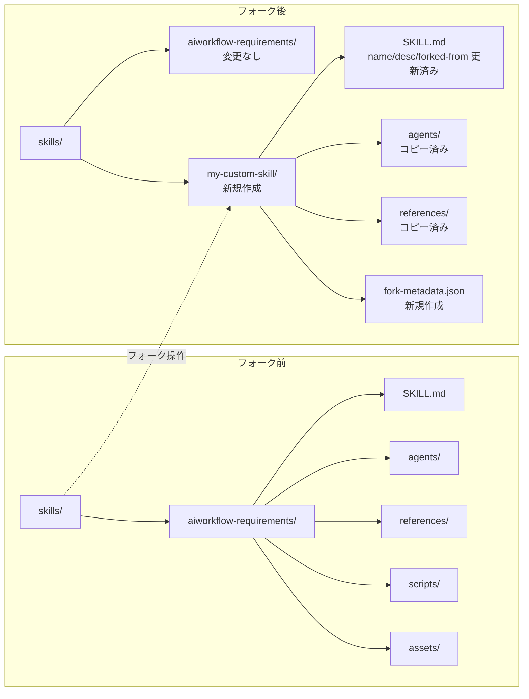

### 5.2 copyDirectory の再帰コピーフロー

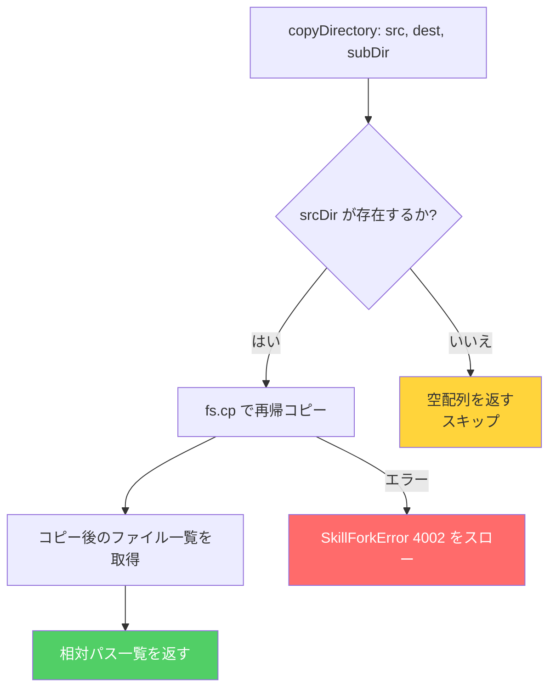

---

## 6. IPC データフロー全体図

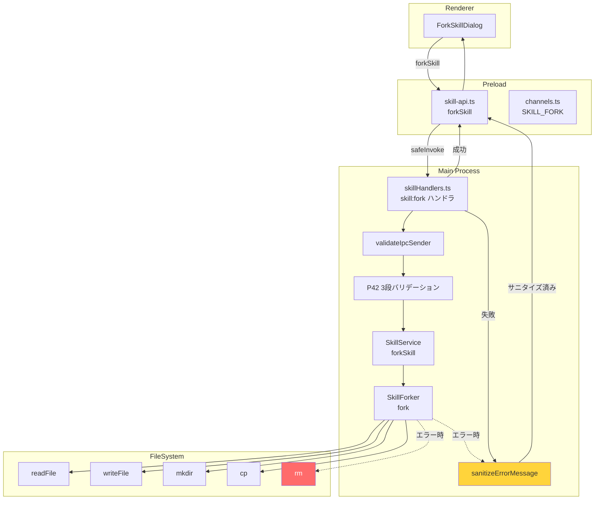

---

## 7. バリデーション階層フロー

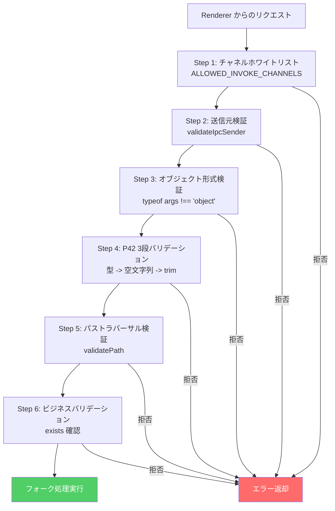

---

## 8. 統合ポイント/契約のまとめ

| 統合ポイント                | 送信側                     | 受信側           | 契約                                                                        |
| --------------------------- | -------------------------- | ---------------- | --------------------------------------------------------------------------- |
| Renderer -> Preload         | ForkSkillDialog            | skill-api.ts     | `forkSkill(options: SkillForkOptions): Promise<IpcResult<SkillForkResult>>` |
| Preload -> Main             | skill-api.ts               | skillHandlers.ts | `safeInvoke(IPC_CHANNELS.SKILL_FORK, options)`                              |
| Main -> SkillService        | skillHandlers.ts           | SkillService     | `forkSkill(options: SkillForkOptions): Promise<SkillForkResult>`            |
| SkillService -> SkillForker | SkillService               | SkillForker      | `fork(options: SkillForkOptions): Promise<SkillForkResult>`                 |
| SkillForker -> FileSystem   | SkillForker                | fs/promises      | mkdir, readFile, writeFile, cp, rm                                          |
| エラーハンドリング          | SkillForker / SkillService | skillHandlers.ts | `sanitizeErrorMessage()` -> `{ success: false, error: string }`             |
