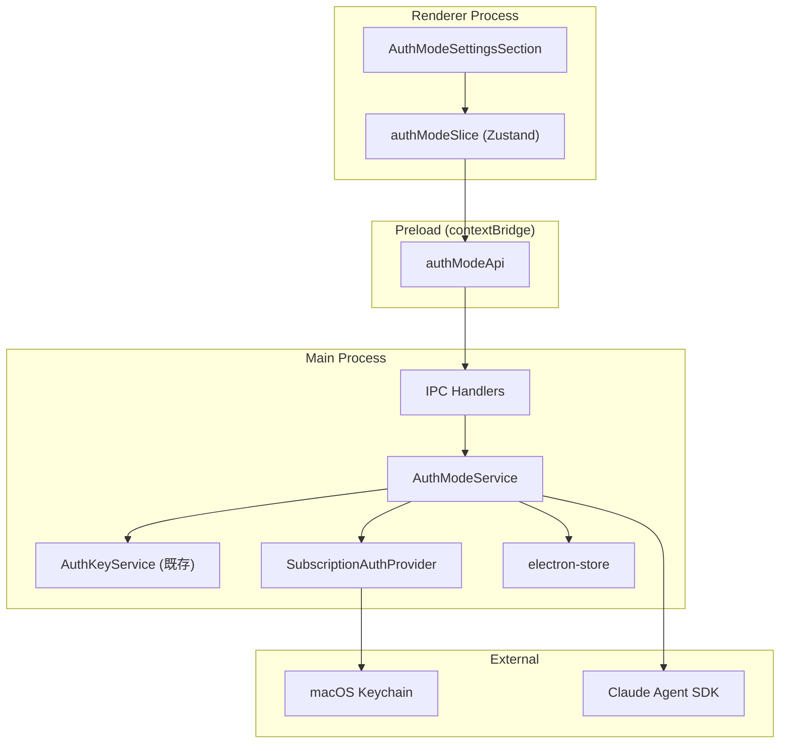
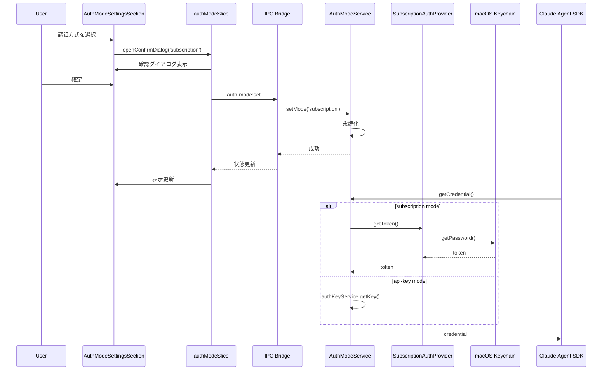

# 認証方式選択機能 アーキテクチャ設計書

## メタ情報

| 項目     | 内容                         |
| -------- | ---------------------------- |
| タスクID | TASK-AUTH-MODE-SELECTION-001 |
| Phase    | 2                            |
| 作成日   | 2026-02-09                   |
| 設計対象 | 認証方式選択機能全体         |

---

## 概要

本機能は、Claude Agent SDK のスキル実行時に使用する認証方式を「サブスクリプション認証」と「APIキー認証」から選択可能にする。ユーザーは Claude Pro/Team サブスクリプションを持っている場合、Claude Code CLI でログイン済みのトークンを再利用でき、従量課金の API キーを別途管理する必要がなくなる。

**主要な機能:**

- 認証方式の切り替え（サブスクリプション / APIキー）
- 認証状態の可視化
- macOS Keychain からの Claude Code CLI トークン取得
- 設定の永続化と変更通知

---

## アーキテクチャ図

### 全体構成図



### コンポーネント間データフロー



---

## レイヤー構成

| レイヤー | コンポーネント           | 責務                                       |
| -------- | ------------------------ | ------------------------------------------ |
| Renderer | AuthModeSettingsSection  | 認証設定UIの表示とユーザーインタラクション |
| Renderer | AuthModeSelector         | セグメントコントロールによる認証方式選択   |
| Renderer | AuthModeStatusIndicator  | 認証状態のインジケーター表示               |
| Renderer | authModeSlice (Zustand)  | 認証方式の状態管理                         |
| Preload  | authModeApi              | contextBridge経由のIPC API公開             |
| Main     | IPC Handlers             | auth-mode:\* チャンネルのハンドリング      |
| Main     | AuthModeService          | 認証方式の管理とルーティング               |
| Main     | SubscriptionAuthProvider | macOS Keychain からのトークン取得          |
| Main     | AuthKeyService (既存)    | APIキーの暗号化保存・取得                  |
| Shared   | Type Definitions         | 認証方式関連の型定義                       |

### レイヤー依存関係

```
Renderer → Preload → Main → External Services
   │          │        │
   │          │        ├── macOS Keychain (keytar)
   │          │        ├── electron-store
   │          │        └── Claude Agent SDK
   │          │
   │          └── contextBridge (IPC)
   │
   └── Zustand Store (authModeSlice)
```

---

## 新規コンポーネント詳細

### 1. AuthModeService

**責務:** 認証方式の統合管理

```typescript
interface IAuthModeService {
  getMode(): Promise<AuthMode>;
  setMode(mode: AuthMode): Promise<void>;
  getStatus(): Promise<AuthStatus>;
  getCredential(): Promise<string | null>;
  onModeChange(listener: AuthModeChangeListener): () => void;
  validateMode(mode: AuthMode): Promise<boolean>;
}
```

**依存関係:**

- IAuthKeyService (既存)
- ISubscriptionAuthProvider (新規)
- electron-store

### 2. SubscriptionAuthProvider

**責務:** Claude Code CLI トークンの取得

```typescript
interface ISubscriptionAuthProvider {
  getToken(): Promise<string | null>;
  hasToken(): Promise<boolean>;
  validateToken(): Promise<boolean>;
  clearCache(): void;
}
```

**特徴:**

- 5分間のメモリキャッシュ（Keychain アクセス最適化）
- 環境変数フォールバック（`CLAUDE_CODE_OAUTH_TOKEN`）
- トークンサニタイズ（ログ出力時）

### 3. authModeSlice (Zustand)

**責務:** Renderer 側の状態管理

```typescript
interface AuthModeSlice {
  mode: AuthMode;
  status: AuthModeStatus | null;
  isLoading: boolean;
  error: string | null;
  isConfirmDialogOpen: boolean;
  pendingMode: AuthMode | null;
  // Actions
  fetchMode(): Promise<void>;
  setMode(mode: AuthMode): Promise<void>;
  fetchStatus(): Promise<void>;
  // ...
}
```

---

## データフロー詳細

### 認証方式選択フロー

```
1. User clicks AuthModeSelector
   ↓
2. authModeSlice.openConfirmDialog(targetMode)
   ↓
3. User confirms in dialog
   ↓
4. authModeSlice.confirmModeChange()
   ↓
5. IPC: auth-mode:set → Main Process
   ↓
6. AuthModeService.setMode(mode)
   ├── Validate mode
   ├── Save to electron-store
   └── Emit change event
   ↓
7. IPC response → authModeSlice
   ↓
8. UI update with new mode
```

### スキル実行時の認証取得フロー

```
1. SkillExecutor needs credential
   ↓
2. AuthModeService.getCredential()
   ↓
3. Check current mode
   ↓
4a. If subscription:
    ├── SubscriptionAuthProvider.getToken()
    ├── Check cache (5min TTL)
    ├── If cache miss: keytar.getPassword()
    └── Parse JSON, return accessToken

4b. If api-key:
    └── AuthKeyService.getKey()
   ↓
5. Return credential to SkillExecutor
```

---

## 依存関係

### 新規依存パッケージ

| パッケージ        | バージョン | 用途                                |
| ----------------- | ---------- | ----------------------------------- |
| keytar            | ^7.9.0     | macOS Keychain アクセス             |
| @electron/rebuild | ^3.6.0     | keytar ネイティブモジュールリビルド |

### 既存依存（再利用）

| パッケージ     | 用途                   |
| -------------- | ---------------------- |
| electron-store | 認証モード設定の永続化 |
| zustand        | Renderer 状態管理      |
| vitest         | テストフレームワーク   |

### ネイティブモジュール考慮事項

```bash
# インストール後の対応
pnpm add keytar
pnpm add -D @electron/rebuild
pnpm run rebuild  # electron-rebuild -f -w keytar
```

---

## 設計原則の適用

### 単一責務原則 (SRP)

| コンポーネント           | 単一責務                     |
| ------------------------ | ---------------------------- |
| AuthModeService          | 認証方式のルーティングと管理 |
| SubscriptionAuthProvider | Keychain トークン取得のみ    |
| AuthKeyService           | APIキー暗号化保存のみ        |
| authModeSlice            | Renderer 側状態管理のみ      |
| AuthModeSelector         | UI選択コントロールのみ       |
| AuthModeStatusIndicator  | 認証状態表示のみ             |

### 依存性逆転原則 (DIP)

```typescript
// 具象ではなくインターフェースに依存
class AuthModeService implements IAuthModeService {
  constructor(
    private authKeyService: IAuthKeyService, // インターフェース
    private subscriptionAuthProvider: ISubscriptionAuthProvider, // インターフェース
    private settingsStore?: ElectronStore<AuthModeStoreSchema>,
  ) {}
}
```

### Electron 3プロセスモデル準拠

| プロセス | 権限                 | 配置コンポーネント                        |
| -------- | -------------------- | ----------------------------------------- |
| Main     | Node.js フルアクセス | AuthModeService, SubscriptionAuthProvider |
| Preload  | contextBridge のみ   | authModeApi                               |
| Renderer | DOM のみ             | authModeSlice, UI Components              |

---

## セキュリティ設計

### トークン保護

| 観点               | 対策                                          |
| ------------------ | --------------------------------------------- |
| メモリ上のトークン | キャッシュ TTL 5分、クリア関数提供            |
| ログ出力           | サニタイズ必須（`sk-ant-oat01-...xxxx` 形式） |
| IPC 通信           | トークンを Renderer に送信しない              |
| エラーメッセージ   | 内部エラー詳細を Renderer に送信しない        |
| プロセス間分離     | トークン操作は Main Process でのみ実行        |

### IPC セキュリティ

```typescript
// 全ハンドラで sender 検証
ipcMain.handle(
  IPC_CHANNELS.AUTH_MODE_SET,
  withValidation(
    IPC_CHANNELS.AUTH_MODE_SET,
    async (_event, request) => {
      /* ... */
    },
    { getAllowedWindows: () => [mainWindow] },
  ),
);

// エラーサニタイズ
function sanitizeErrorMessage(error: unknown): string {
  if (error instanceof Error) {
    return error.message
      .replace(/token=[\w.-]+/gi, "token=***")
      .replace(/key=[\w.-]+/gi, "key=***")
      .replace(/sk-ant-[\w-]+/gi, "sk-***");
  }
  return "An unknown error occurred";
}
```

### Keychain アクセス

```
┌─────────────────────────────────────────────────────────┐
│                    Main Process                          │
│  ┌───────────────────────────────────────────────────┐  │
│  │           SubscriptionAuthProvider                 │  │
│  │  - Keychain アクセス (keytar)                      │  │
│  │  - トークンキャッシュ管理                          │  │
│  │  - トークン形式バリデーション                      │  │
│  └───────────────────────────────────────────────────┘  │
│                           │                              │
│                           ▼ (hasToken/isValid のみ)      │
│  ┌───────────────────────────────────────────────────┐  │
│  │              AuthModeService                       │  │
│  │  - getCredential() で内部的にトークン取得          │  │
│  │  - SkillExecutor に直接渡す                        │  │
│  └───────────────────────────────────────────────────┘  │
└─────────────────────────────────────────────────────────┘
                           │
                           │ IPC (トークンなし、状態のみ)
                           ▼
┌─────────────────────────────────────────────────────────┐
│                    Renderer Process                      │
│  - 認証状態（isAuthenticated）のみ受信                  │
│  - トークン自体は受け取らない                           │
└─────────────────────────────────────────────────────────┘
```

---

## 永続化設計

### electron-store スキーマ

```typescript
interface AuthModeStoreSchema {
  authMode?: AuthMode; // "subscription" | "api-key"
  authModeUpdatedAt?: number; // 最終更新タイムスタンプ
}
```

### ストレージパス

```
macOS: ~/Library/Application Support/AIWorkflowOrchestrator/auth-mode-store.json
```

### デフォルト値

| 設定項目 | デフォルト値   | 備考                         |
| -------- | -------------- | ---------------------------- |
| authMode | "subscription" | サブスクリプション認証を優先 |

---

## エラーハンドリング設計

### エラーコード体系

| カテゴリ       | コード範囲 | 例                                |
| -------------- | ---------- | --------------------------------- |
| バリデーション | 1000番台   | INVALID_MODE                      |
| 認証情報       | 2000番台   | NO_API_KEY, NO_SUBSCRIPTION_TOKEN |
| トークン       | 3000番台   | TOKEN_EXPIRED                     |
| Keychain       | 4000番台   | KEYCHAIN_ACCESS_DENIED            |
| ストレージ     | 5000番台   | STORAGE_FAILED                    |
| 内部エラー     | 9000番台   | UNKNOWN_ERROR                     |

### ユーザー向けエラーガイダンス

各エラーコードに対して、ユーザーが問題を解決できる具体的なガイダンスを提供:

```typescript
AUTH_MODE_ERROR_GUIDANCE = {
  "auth-mode/no-subscription-token":
    "Claude Codeの認証情報が見つかりません。Claude Code CLIで `/login` を実行してログインしてください。",
  "auth-mode/keychain-access-denied":
    "Keychainへのアクセスが拒否されました。システム環境設定 > セキュリティとプライバシー でアクセスを許可してください。",
  // ...
};
```

---

## 関連成果物へのリンク

| 成果物                        | パス                                                   |
| ----------------------------- | ------------------------------------------------------ |
| AuthModeService 設計          | `outputs/phase-2/auth-mode-service-design.md`          |
| SubscriptionAuthProvider 設計 | `outputs/phase-2/subscription-auth-provider-design.md` |
| IPC 仕様書                    | `outputs/phase-2/ipc-specification.md`                 |
| 型定義ファイル                | `outputs/phase-2/type-definitions.ts`                  |
| UI 設計書                     | `outputs/phase-2/ui-wireframe.md`                      |
| 状態管理設計書                | `outputs/phase-2/state-management-design.md`           |
| 要件定義書 (Phase 1)          | `outputs/phase-1/requirements-definition.md`           |
| 受入基準 (Phase 1)            | `outputs/phase-1/acceptance-criteria.md`               |

---

## 設計決定の根拠

### Q1: なぜ認証方式を切り替え可能にするのか？

**A:** Claude Pro/Team サブスクリプションを持つユーザーは、既に Claude Code CLI で認証済みの場合が多い。その認証情報を再利用することで、API キーの別途管理が不要になり、UX が向上する。

### Q2: なぜ macOS 限定なのか？

**A:** Claude Code CLI は macOS Keychain にトークンを保存する。Windows/Linux は別の認証情報ストアを使用するため、初期リリースでは macOS に限定し、将来的に拡張する。

### Q3: なぜトークンをキャッシュするのか？

**A:** Keychain アクセスは I/O 操作であり、スキル実行ごとにアクセスするとパフォーマンスに影響する。5分間のキャッシュにより、通常の使用ではほぼ Keychain アクセスなしで動作する。

### Q4: なぜ Renderer にトークンを送信しないのか？

**A:** Electron セキュリティベストプラクティスに従い、機密情報は Main Process に留める。Renderer には認証状態（boolean）のみを通知し、トークン漏洩リスクを最小化する。
