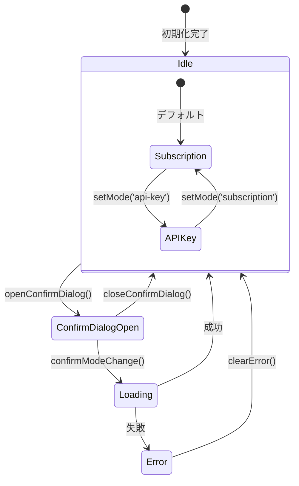
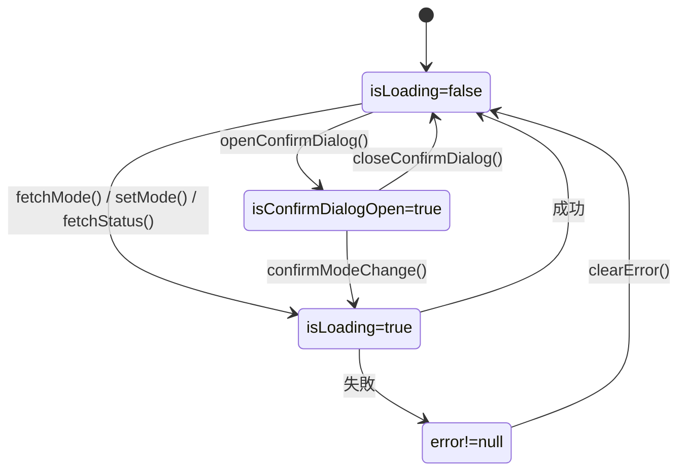
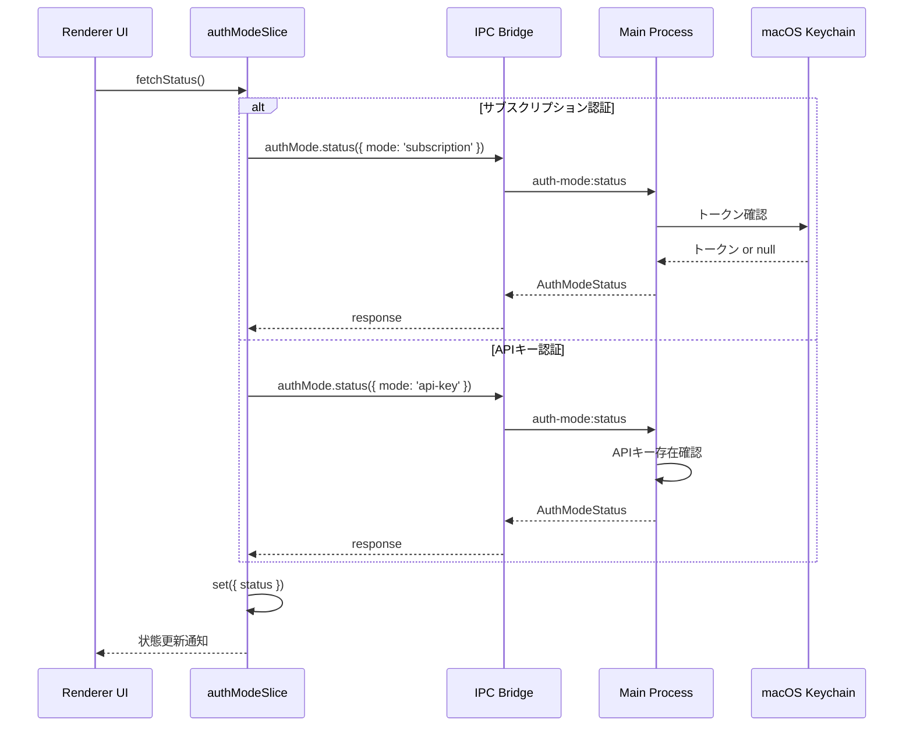

# 状態管理設計書

## メタ情報

| 項目     | 内容                         |
| -------- | ---------------------------- |
| タスクID | TASK-AUTH-MODE-SELECTION-001 |
| Phase    | 2                            |
| 作成日   | 2026-02-09                   |
| 設計対象 | Zustand Slice / 状態管理     |

---

## authModeSlice

### 型定義

```typescript
/**
 * 認証方式
 * @description Claude Agent SDKの認証に使用する方式
 */
export type AuthMode = "subscription" | "api-key";

/**
 * 認証状態
 * @description 現在の認証方式での認証有効性
 */
export interface AuthModeStatus {
  /** 認証方式 */
  mode: AuthMode;
  /** 認証が有効か */
  isValid: boolean;
  /** 詳細メッセージ */
  message: string;
  /** エラーコード（エラー時のみ） */
  errorCode?: AuthModeErrorCode;
  /** 最終確認日時 */
  lastCheckedAt: number;
}

/**
 * 認証方式エラーコード
 */
export type AuthModeErrorCode =
  | "NOT_LOGGED_IN" // サブスクリプション: 未ログイン
  | "TOKEN_EXPIRED" // サブスクリプション: トークン期限切れ
  | "KEYCHAIN_ACCESS_DENIED" // サブスクリプション: Keychainアクセス拒否
  | "API_KEY_NOT_SET" // APIキー: 未設定
  | "API_KEY_INVALID" // APIキー: 無効な形式
  | "NETWORK_ERROR" // ネットワークエラー
  | "UNKNOWN_ERROR"; // 不明なエラー

/**
 * 認証方式エラーメッセージマッピング
 */
export const AUTH_MODE_ERROR_MESSAGES: Record<AuthModeErrorCode, string> = {
  NOT_LOGGED_IN: "Claude Code CLIでログインしてください",
  TOKEN_EXPIRED: "認証の有効期限が切れました。再度ログインしてください",
  KEYCHAIN_ACCESS_DENIED: "Keychainへのアクセスが拒否されました",
  API_KEY_NOT_SET: "APIキーを設定してください",
  API_KEY_INVALID: "APIキーの形式が正しくありません",
  NETWORK_ERROR: "ネットワーク接続を確認してください",
  UNKNOWN_ERROR: "予期しないエラーが発生しました",
};
```

### Slice定義

```typescript
import { StateCreator } from "zustand";

/**
 * 認証方式管理スライス
 *
 * セキュリティ対策:
 * - トークン・APIキーは状態に保存しない
 * - 認証情報はMain Processのみで管理
 * - Rendererには最小限の状態のみを渡す
 *
 * @see docs/30-workflows/TASK-AUTH-MODE-SELECTION-001/outputs/phase-2/ui-wireframe.md
 */
export interface AuthModeSlice {
  // ============================================================
  // State
  // ============================================================

  /** 現在の認証方式 */
  mode: AuthMode;

  /** 認証状態（有効性情報） */
  status: AuthModeStatus | null;

  /** ローディング状態 */
  isLoading: boolean;

  /** エラーメッセージ（日本語） */
  error: string | null;

  /** 確認ダイアログ表示状態 */
  isConfirmDialogOpen: boolean;

  /** 切り替え先の認証方式（確認ダイアログ用） */
  pendingMode: AuthMode | null;

  // ============================================================
  // Actions
  // ============================================================

  /** 現在の認証方式を取得 */
  fetchMode: () => Promise<void>;

  /** 認証方式を設定 */
  setMode: (mode: AuthMode) => Promise<void>;

  /** 認証状態を取得 */
  fetchStatus: () => Promise<void>;

  /** 認証方式のバリデーション */
  validate: (mode: AuthMode) => Promise<boolean>;

  /** 確認ダイアログを表示 */
  openConfirmDialog: (targetMode: AuthMode) => void;

  /** 確認ダイアログを閉じる */
  closeConfirmDialog: () => void;

  /** 切り替えを確定 */
  confirmModeChange: () => Promise<void>;

  /** エラーをクリア */
  clearError: () => void;

  /** 状態をリセット */
  resetAuthMode: () => void;
}
```

### 実装

```typescript
// ============================================================
// リスナー管理（二重登録防止）
// @see 06-known-pitfalls.md#P5
// ============================================================

let authModeListenerRegistered = false;

/**
 * リスナー登録状態をリセット
 */
export function resetAuthModeListenerFlag(): void {
  authModeListenerRegistered = false;
}

// ============================================================
// Slice Creator
// ============================================================

export const createAuthModeSlice: StateCreator<
  AuthModeSlice,
  [],
  [],
  AuthModeSlice
> = (set, get) => ({
  // ============================================================
  // Initial State
  // ============================================================

  mode: "subscription", // デフォルトはサブスクリプション認証
  status: null,
  isLoading: false,
  error: null,
  isConfirmDialogOpen: false,
  pendingMode: null,

  // ============================================================
  // Actions
  // ============================================================

  fetchMode: async () => {
    set({ isLoading: true, error: null });

    try {
      // Guard: Skip IPC if electronAPI is not available
      if (!window.electronAPI?.authMode?.get) {
        console.warn("[AuthModeSlice] authMode.get not available");
        set({ isLoading: false });
        return;
      }

      const response = await window.electronAPI.authMode.get();

      if (response.success && response.data) {
        set({
          mode: response.data.mode,
          isLoading: false,
        });

        // 認証状態も取得
        get().fetchStatus();
      } else {
        set({
          isLoading: false,
          error: response.error?.message ?? "認証方式の取得に失敗しました",
        });
      }
    } catch (error) {
      console.error("[AuthModeSlice] fetchMode error:", error);
      set({
        isLoading: false,
        error: handleAuthModeError(error),
      });
    }
  },

  setMode: async (mode: AuthMode) => {
    set({ isLoading: true, error: null });

    try {
      if (!window.electronAPI?.authMode?.set) {
        console.warn("[AuthModeSlice] authMode.set not available");
        set({ isLoading: false });
        return;
      }

      const response = await window.electronAPI.authMode.set({ mode });

      if (response.success) {
        set({
          mode,
          isLoading: false,
          isConfirmDialogOpen: false,
          pendingMode: null,
        });

        // 新しい認証方式の状態を取得
        get().fetchStatus();
      } else {
        set({
          isLoading: false,
          error: response.error?.message ?? "認証方式の設定に失敗しました",
        });
      }
    } catch (error) {
      console.error("[AuthModeSlice] setMode error:", error);
      set({
        isLoading: false,
        error: handleAuthModeError(error),
      });
    }
  },

  fetchStatus: async () => {
    const { mode } = get();

    try {
      if (!window.electronAPI?.authMode?.status) {
        console.warn("[AuthModeSlice] authMode.status not available");
        return;
      }

      const response = await window.electronAPI.authMode.status({ mode });

      if (response.success && response.data) {
        set({ status: response.data });
      }
    } catch (error) {
      console.error("[AuthModeSlice] fetchStatus error:", error);
    }
  },

  validate: async (mode: AuthMode) => {
    try {
      if (!window.electronAPI?.authMode?.validate) {
        console.warn("[AuthModeSlice] authMode.validate not available");
        return false;
      }

      const response = await window.electronAPI.authMode.validate({ mode });

      return response.success && response.data?.isValid === true;
    } catch (error) {
      console.error("[AuthModeSlice] validate error:", error);
      return false;
    }
  },

  openConfirmDialog: (targetMode: AuthMode) => {
    set({
      isConfirmDialogOpen: true,
      pendingMode: targetMode,
    });
  },

  closeConfirmDialog: () => {
    set({
      isConfirmDialogOpen: false,
      pendingMode: null,
    });
  },

  confirmModeChange: async () => {
    const { pendingMode } = get();

    if (!pendingMode) {
      return;
    }

    await get().setMode(pendingMode);
  },

  clearError: () => {
    set({ error: null });
  },

  resetAuthMode: () => {
    resetAuthModeListenerFlag();

    set({
      mode: "subscription",
      status: null,
      isLoading: false,
      error: null,
      isConfirmDialogOpen: false,
      pendingMode: null,
    });
  },
});

// ============================================================
// エラーハンドリング
// ============================================================

function handleAuthModeError(error: unknown): string {
  if (!(error instanceof Error)) {
    return AUTH_MODE_ERROR_MESSAGES.UNKNOWN_ERROR;
  }

  const message = error.message.toLowerCase();

  if (message.includes("network") || message.includes("fetch")) {
    return AUTH_MODE_ERROR_MESSAGES.NETWORK_ERROR;
  }

  if (message.includes("keychain") || message.includes("access")) {
    return AUTH_MODE_ERROR_MESSAGES.KEYCHAIN_ACCESS_DENIED;
  }

  return AUTH_MODE_ERROR_MESSAGES.UNKNOWN_ERROR;
}
```

---

## 状態遷移図

### 認証方式変更フロー



### 状態詳細



### 認証状態確認フロー



---

## IPCリスナー管理

### 二重登録防止パターン

```typescript
/**
 * 認証方式変更リスナーの設定
 *
 * 二重登録を防止するためのパターン:
 * 1. モジュールスコープのフラグで登録状態を管理
 * 2. 登録前にフラグをチェック
 * 3. resetAuthMode時にフラグをリセット
 *
 * @see 06-known-pitfalls.md#P5
 */
export function setupAuthModeListener(
  set: (state: Partial<AuthModeSlice>) => void,
  get: () => AuthModeSlice,
): void {
  // 二重登録チェック
  if (authModeListenerRegistered) {
    console.log("[AuthModeSlice] Listener already registered, skipping");
    return;
  }

  // Guard: electronAPI存在チェック
  if (!window.electronAPI?.authMode?.onModeChanged) {
    console.warn("[AuthModeSlice] authMode.onModeChanged not available");
    return;
  }

  // リスナー登録
  authModeListenerRegistered = true;
  console.log("[AuthModeSlice] Registering auth mode change listener");

  window.electronAPI.authMode.onModeChanged((event) => {
    console.log("[AuthModeSlice] Auth mode changed:", event);

    set({
      mode: event.mode,
      status: event.status ?? null,
    });
  });
}
```

### リスナー登録タイミング

```typescript
/**
 * アプリ初期化時のリスナー登録
 *
 * 以下のタイミングで呼び出す:
 * 1. App.tsxのuseEffect内
 * 2. AuthGuardコンポーネントのマウント時
 */
export function initializeAuthModeSlice(): void {
  const { fetchMode } = useStore.getState();

  // 現在の認証方式を取得
  fetchMode();

  // リスナーを設定（二重登録防止付き）
  setupAuthModeListener(useStore.setState, useStore.getState);
}
```

---

## セレクタ定義

### 基本セレクタ

```typescript
/**
 * 認証方式セレクタ
 * @description 現在の認証方式のみを取得（再レンダリング最適化）
 */
export const selectAuthMode = (state: StoreState): AuthMode => state.mode;

/**
 * 認証状態セレクタ
 * @description 認証状態オブジェクトを取得
 */
export const selectAuthModeStatus = (
  state: StoreState,
): AuthModeStatus | null => state.status;

/**
 * ローディング状態セレクタ
 */
export const selectAuthModeLoading = (state: StoreState): boolean =>
  state.isLoading;

/**
 * エラー状態セレクタ
 */
export const selectAuthModeError = (state: StoreState): string | null =>
  state.error;

/**
 * 確認ダイアログ状態セレクタ
 */
export const selectConfirmDialogState = (
  state: StoreState,
): { isOpen: boolean; pendingMode: AuthMode | null } => ({
  isOpen: state.isConfirmDialogOpen,
  pendingMode: state.pendingMode,
});
```

### 派生セレクタ

```typescript
/**
 * 認証有効性セレクタ
 * @description 現在の認証方式が有効かどうかを判定
 */
export const selectIsAuthValid = (state: StoreState): boolean => {
  const { status } = state;
  return status?.isValid ?? false;
};

/**
 * 認証状態メッセージセレクタ
 * @description UIに表示する認証状態メッセージを取得
 */
export const selectAuthStatusMessage = (state: StoreState): string => {
  const { mode, status, isLoading } = state;

  if (isLoading) {
    return "認証状態を確認中...";
  }

  if (!status) {
    return "認証状態を確認してください";
  }

  return status.message;
};

/**
 * 認証アクション可能性セレクタ
 * @description 認証方式の切り替えが可能かどうかを判定
 */
export const selectCanChangeAuthMode = (state: StoreState): boolean => {
  return !state.isLoading && !state.isConfirmDialogOpen;
};
```

### 使用例

```tsx
import { useStore } from "@/renderer/store";
import {
  selectAuthMode,
  selectAuthModeStatus,
  selectIsAuthValid,
} from "@/renderer/store/selectors/authMode";

function AuthModeSettingsSection() {
  // 個別セレクタで必要なフィールドだけ取得（再レンダリング最適化）
  const mode = useStore(selectAuthMode);
  const status = useStore(selectAuthModeStatus);
  const isValid = useStore(selectIsAuthValid);

  // アクションは直接取得
  const { setMode, openConfirmDialog } = useStore();

  return (
    <div>
      <AuthModeSelector mode={mode} onModeChange={openConfirmDialog} />
      <AuthModeStatusIndicator mode={mode} status={status} isValid={isValid} />
    </div>
  );
}
```

---

## Store統合

### Store定義への追加

```typescript
// src/renderer/store/index.ts

import { create } from 'zustand';
import { devtools, persist } from 'zustand/middleware';
import { createAuthSlice, AuthSlice } from './slices/authSlice';
import { createAuthModeSlice, AuthModeSlice } from './slices/authModeSlice';
// ... 他のslice imports

// Store型定義
export type StoreState = AuthSlice & AuthModeSlice & /* 他のSlice */;

// Store作成
export const useStore = create<StoreState>()(
  devtools(
    persist(
      (...args) => ({
        ...createAuthSlice(...args),
        ...createAuthModeSlice(...args),
        // ... 他のslice
      }),
      {
        name: 'aiworkflow-store',
        partialize: (state) => ({
          // 永続化する状態のみ
          mode: state.mode,
          // トークン・APIキーは永続化しない（セキュリティ）
        }),
      }
    ),
    { name: 'AIWorkflow' }
  )
);
```

### 初期化フロー

```typescript
// src/renderer/App.tsx

import { useEffect } from 'react';
import { useStore } from './store';
import { initializeAuthModeSlice } from './store/slices/authModeSlice';

function App() {
  const { initializeAuth } = useStore();

  useEffect(() => {
    // 認証初期化
    initializeAuth();

    // 認証方式初期化
    initializeAuthModeSlice();
  }, [initializeAuth]);

  return <AppContent />;
}
```

---

## Preload API定義

### IPC Channel定義

```typescript
// src/preload/types.ts

/**
 * 認証方式IPC API
 */
export interface AuthModeAPI {
  /** 現在の認証方式を取得 */
  get: () => Promise<IPCResponse<{ mode: AuthMode }>>;

  /** 認証方式を設定 */
  set: (params: { mode: AuthMode }) => Promise<IPCResponse<void>>;

  /** 認証状態を取得 */
  status: (params: { mode: AuthMode }) => Promise<IPCResponse<AuthModeStatus>>;

  /** 認証方式のバリデーション */
  validate: (params: {
    mode: AuthMode;
  }) => Promise<IPCResponse<{ isValid: boolean }>>;

  /** 認証方式変更イベントリスナー */
  onModeChanged: (
    callback: (event: { mode: AuthMode; status?: AuthModeStatus }) => void,
  ) => void;
}

// Window拡張
declare global {
  interface Window {
    electronAPI: {
      auth: AuthAPI;
      authMode: AuthModeAPI;
      // ... 他のAPI
    };
  }
}
```

### Preload Script

```typescript
// src/preload/index.ts

import { contextBridge, ipcRenderer } from "electron";

contextBridge.exposeInMainWorld("electronAPI", {
  // ... 既存のAPI

  authMode: {
    get: () => ipcRenderer.invoke("auth-mode:get"),

    set: (params: { mode: AuthMode }) =>
      ipcRenderer.invoke("auth-mode:set", params),

    status: (params: { mode: AuthMode }) =>
      ipcRenderer.invoke("auth-mode:status", params),

    validate: (params: { mode: AuthMode }) =>
      ipcRenderer.invoke("auth-mode:validate", params),

    onModeChanged: (callback: (event: AuthModeChangedEvent) => void) => {
      ipcRenderer.on("auth-mode:changed", (_event, data) => {
        callback(data);
      });
    },
  },
});
```

---

## テスト戦略

### 単体テスト

```typescript
// src/renderer/store/slices/__tests__/authModeSlice.test.ts

import { act, renderHook } from "@testing-library/react";
import { useStore } from "../../index";
import { resetAuthModeListenerFlag } from "../authModeSlice";

describe("authModeSlice", () => {
  beforeEach(() => {
    // 各テスト前に状態をリセット
    resetAuthModeListenerFlag();
    act(() => {
      useStore.getState().resetAuthMode();
    });
  });

  describe("fetchMode", () => {
    it("should fetch and set auth mode from IPC", async () => {
      // Mock IPC
      window.electronAPI = {
        authMode: {
          get: vi.fn().mockResolvedValue({
            success: true,
            data: { mode: "api-key" },
          }),
          status: vi.fn().mockResolvedValue({
            success: true,
            data: { mode: "api-key", isValid: true, message: "キー設定済み" },
          }),
        },
      } as unknown as typeof window.electronAPI;

      const { result } = renderHook(() => useStore());

      await act(async () => {
        await result.current.fetchMode();
      });

      expect(result.current.mode).toBe("api-key");
      expect(result.current.isLoading).toBe(false);
    });

    it("should handle IPC not available gracefully", async () => {
      window.electronAPI = {} as typeof window.electronAPI;

      const { result } = renderHook(() => useStore());

      await act(async () => {
        await result.current.fetchMode();
      });

      // デフォルト値のまま
      expect(result.current.mode).toBe("subscription");
      expect(result.current.isLoading).toBe(false);
    });
  });

  describe("setMode", () => {
    it("should set auth mode via IPC", async () => {
      window.electronAPI = {
        authMode: {
          set: vi.fn().mockResolvedValue({ success: true }),
          status: vi.fn().mockResolvedValue({
            success: true,
            data: { mode: "api-key", isValid: true, message: "キー設定済み" },
          }),
        },
      } as unknown as typeof window.electronAPI;

      const { result } = renderHook(() => useStore());

      await act(async () => {
        await result.current.setMode("api-key");
      });

      expect(result.current.mode).toBe("api-key");
      expect(window.electronAPI.authMode.set).toHaveBeenCalledWith({
        mode: "api-key",
      });
    });

    it("should handle setMode error", async () => {
      window.electronAPI = {
        authMode: {
          set: vi.fn().mockResolvedValue({
            success: false,
            error: { message: "設定に失敗しました" },
          }),
        },
      } as unknown as typeof window.electronAPI;

      const { result } = renderHook(() => useStore());

      await act(async () => {
        await result.current.setMode("api-key");
      });

      expect(result.current.error).toBe("設定に失敗しました");
      expect(result.current.mode).toBe("subscription"); // 変更されない
    });
  });

  describe("confirm dialog", () => {
    it("should open and close confirm dialog", () => {
      const { result } = renderHook(() => useStore());

      act(() => {
        result.current.openConfirmDialog("api-key");
      });

      expect(result.current.isConfirmDialogOpen).toBe(true);
      expect(result.current.pendingMode).toBe("api-key");

      act(() => {
        result.current.closeConfirmDialog();
      });

      expect(result.current.isConfirmDialogOpen).toBe(false);
      expect(result.current.pendingMode).toBeNull();
    });
  });
});
```

### リスナーテスト

```typescript
// src/renderer/store/slices/__tests__/authModeSlice.listener.test.ts

describe("authModeSlice listener", () => {
  it("should prevent duplicate listener registration", () => {
    const mockOnModeChanged = vi.fn();
    window.electronAPI = {
      authMode: {
        onModeChanged: mockOnModeChanged,
        get: vi
          .fn()
          .mockResolvedValue({ success: true, data: { mode: "subscription" } }),
        status: vi.fn().mockResolvedValue({ success: true, data: null }),
      },
    } as unknown as typeof window.electronAPI;

    // 2回初期化
    initializeAuthModeSlice();
    initializeAuthModeSlice();

    // リスナーは1回だけ登録される
    expect(mockOnModeChanged).toHaveBeenCalledTimes(1);
  });

  it("should reset listener flag on resetAuthMode", () => {
    resetAuthModeListenerFlag();

    // フラグリセット後は再登録可能
    const mockOnModeChanged = vi.fn();
    window.electronAPI = {
      authMode: {
        onModeChanged: mockOnModeChanged,
        get: vi
          .fn()
          .mockResolvedValue({ success: true, data: { mode: "subscription" } }),
        status: vi.fn().mockResolvedValue({ success: true, data: null }),
      },
    } as unknown as typeof window.electronAPI;

    initializeAuthModeSlice();

    expect(mockOnModeChanged).toHaveBeenCalledTimes(1);
  });
});
```

---

## 関連ドキュメント

| ドキュメント   | パス                                                  |
| -------------- | ----------------------------------------------------- |
| 要件定義書     | `outputs/phase-1/requirements-definition.md`          |
| 受入基準       | `outputs/phase-1/acceptance-criteria.md`              |
| UI設計書       | `outputs/phase-2/ui-wireframe.md`                     |
| 既存authSlice  | `apps/desktop/src/renderer/store/slices/authSlice.ts` |
| 既知の落とし穴 | `.claude/rules/06-known-pitfalls.md`                  |
| 状態管理ルール | `.claude/rules/03-state-management.md`                |
