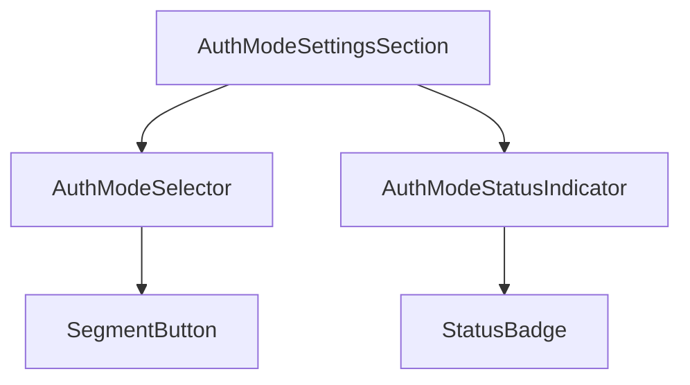
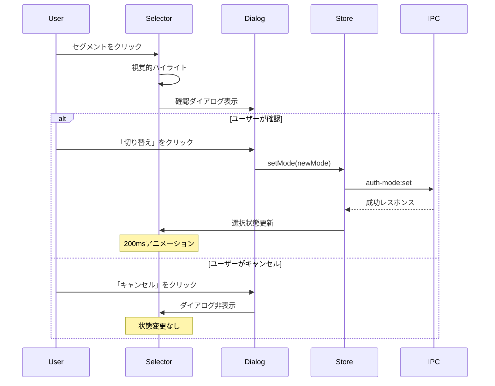

# UI設計書

## メタ情報

| 項目     | 内容                         |
| -------- | ---------------------------- |
| タスクID | TASK-AUTH-MODE-SELECTION-001 |
| Phase    | 2                            |
| 作成日   | 2026-02-09                   |
| 設計対象 | UI/UXコンポーネント          |

---

## コンポーネント構成

### Atomic Design階層

```
organisms/
└── AuthModeSettingsSection/
    ├── AuthModeSettingsSection.tsx
    ├── AuthModeSettingsSection.test.tsx
    └── index.ts

molecules/
├── AuthModeSelector/
│   ├── AuthModeSelector.tsx
│   ├── AuthModeSelector.test.tsx
│   └── index.ts
└── AuthModeStatusIndicator/
    ├── AuthModeStatusIndicator.tsx
    ├── AuthModeStatusIndicator.test.tsx
    └── index.ts

atoms/
├── SegmentButton/
│   ├── SegmentButton.tsx
│   ├── SegmentButton.test.tsx
│   └── index.ts
└── StatusBadge/
    ├── StatusBadge.tsx
    ├── StatusBadge.test.tsx
    └── index.ts
```

### コンポーネント依存関係



---

## ワイヤーフレーム

### AuthModeSettingsSection（設定画面セクション）

```
┌─────────────────────────────────────────────────────────────────────────┐
│ 認証設定                                                                 │
├─────────────────────────────────────────────────────────────────────────┤
│                                                                         │
│  認証方式                                                               │
│  ┌─────────────────────────────────────────────────────────────────┐  │
│  │ ┌─────────────────────────┬─────────────────────────┐           │  │
│  │ │   サブスクリプション    │       APIキー           │           │  │
│  │ │       [選択中]          │                         │           │  │
│  │ └─────────────────────────┴─────────────────────────┘           │  │
│  │                   AuthModeSelector                               │  │
│  └─────────────────────────────────────────────────────────────────┘  │
│                                                                         │
│  認証状態                                                               │
│  ┌─────────────────────────────────────────────────────────────────┐  │
│  │ ● ログイン済み                                                   │  │
│  │   Claude Code CLIで認証されたアカウントを使用します              │  │
│  │                   AuthModeStatusIndicator                        │  │
│  └─────────────────────────────────────────────────────────────────┘  │
│                                                                         │
└─────────────────────────────────────────────────────────────────────────┘
```

### AuthModeSelector（セグメントコントロール）

```
選択状態: サブスクリプション
┌─────────────────────────────────────────────────────────┐
│ ╔═══════════════════════╗┌─────────────────────────┐   │
│ ║  サブスクリプション   ║│       APIキー           │   │
│ ║       認証            ║│        認証             │   │
│ ╚═══════════════════════╝└─────────────────────────┘   │
└─────────────────────────────────────────────────────────┘
   ↑ アクセントカラー背景      ↑ セカンダリ背景

選択状態: APIキー
┌─────────────────────────────────────────────────────────┐
│ ┌─────────────────────────╔═══════════════════════════╗ │
│ │  サブスクリプション     ║       APIキー             ║ │
│ │       認証              ║        認証               ║ │
│ └─────────────────────────╚═══════════════════════════╝ │
└─────────────────────────────────────────────────────────┘
```

### AuthModeStatusIndicator（認証状態インジケーター）

```
サブスクリプション認証 - ログイン済み:
┌───────────────────────────────────────────────────────────────┐
│ ● ログイン済み                                                 │
│   Claude Code CLIで認証されたアカウントを使用します            │
└───────────────────────────────────────────────────────────────┘
  ↑ 緑色の丸（#34C759）

サブスクリプション認証 - 未ログイン:
┌───────────────────────────────────────────────────────────────┐
│ ○ 未ログイン                                                   │
│   Claude Code CLIでログインしてください                        │
│   ┌────────────────────────┐                                   │
│   │  ログイン方法を確認 →  │                                   │
│   └────────────────────────┘                                   │
└───────────────────────────────────────────────────────────────┘
  ↑ 赤色の丸（#FF3B30）

APIキー認証 - 設定済み:
┌───────────────────────────────────────────────────────────────┐
│ ● キー設定済み                                                 │
│   sk-ant-api03-****-****で認証します                           │
└───────────────────────────────────────────────────────────────┘
  ↑ 緑色の丸（#34C759）

APIキー認証 - 未設定:
┌───────────────────────────────────────────────────────────────┐
│ ○ キー未設定                                                   │
│   APIキーを設定してください                                    │
│   ┌────────────────────────┐                                   │
│   │  APIキーを設定 →       │                                   │
│   └────────────────────────┘                                   │
└───────────────────────────────────────────────────────────────┘
  ↑ 警告色の丸（#FF9500）

認証確認中:
┌───────────────────────────────────────────────────────────────┐
│ ◐ 認証状態を確認中...                                          │
│   [スピナーアニメーション]                                     │
└───────────────────────────────────────────────────────────────┘
```

### 確認ダイアログ

```
┌───────────────────────────────────────────────────────────────┐
│                                                               │
│  認証方式を変更しますか？                                      │
│                                                               │
│  サブスクリプション認証 → APIキー認証                         │
│                                                               │
│  切り替え後は、新しい認証方式でスキルが実行されます。         │
│                                                               │
│  ┌─────────────┐ ┌─────────────────────────────────┐        │
│  │ キャンセル   │ │        切り替え                 │        │
│  └─────────────┘ └─────────────────────────────────┘        │
│   ↑ セカンダリ     ↑ アクセントカラー                        │
│                                                               │
└───────────────────────────────────────────────────────────────┘
```

---

## インタラクション仕様

### AuthModeSelector

| 状態     | 見た目                           | トリガー          |
| -------- | -------------------------------- | ----------------- |
| Default  | 非選択セグメント: 白背景         | 初期表示          |
| Hover    | 背景が薄くハイライト             | マウスオーバー    |
| Focus    | 2pxの青いフォーカスリング        | Tab キー          |
| Active   | 背景が少し暗くなる               | クリック/タッチ中 |
| Selected | アクセントカラー背景、白テキスト | 選択確定          |
| Disabled | 全体が50%透明度、操作不可        | isLoading=true時  |

### キーボード操作

| キー        | 動作                               |
| ----------- | ---------------------------------- |
| Tab         | セレクタにフォーカス移動           |
| ←/→         | フォーカスを左右のセグメントに移動 |
| Enter/Space | フォーカス中のセグメントを選択     |
| Escape      | 確認ダイアログをキャンセル         |

### 状態遷移タイミング



---

## アクセシビリティ要件

### ARIA属性

#### AuthModeSelector

```tsx
<div
  role="radiogroup"
  aria-labelledby="auth-mode-selector-label"
  aria-describedby="auth-mode-status-description"
>
  <button
    role="radio"
    aria-checked={mode === "subscription"}
    aria-label="サブスクリプション認証"
    tabIndex={mode === "subscription" ? 0 : -1}
  >
    サブスクリプション認証
  </button>
  <button
    role="radio"
    aria-checked={mode === "api-key"}
    aria-label="APIキー認証"
    tabIndex={mode === "api-key" ? 0 : -1}
  >
    APIキー認証
  </button>
</div>
```

#### AuthModeStatusIndicator

```tsx
<div role="status" aria-live="polite" aria-atomic="true">
  <span role="img" aria-label={isValid ? "有効" : "無効"}>
    {isValid ? "●" : "○"}
  </span>
  <span id="auth-mode-status-description">{statusMessage}</span>
</div>
```

### フォーカス管理

1. **Tab順序**: AuthModeSelector → AuthModeStatusIndicator内のリンク
2. **フォーカストラップ**: 確認ダイアログ表示中は内部要素にフォーカスを限定
3. **フォーカス復帰**: ダイアログ閉じた後はセレクタにフォーカスを戻す

### コントラスト比

| 要素           | 前景色  | 背景色  | コントラスト比 | 基準     |
| -------------- | ------- | ------- | -------------- | -------- |
| 選択中テキスト | #FFFFFF | #007AFF | 4.5:1          | AA       |
| 非選択テキスト | #1D1D1F | #F5F5F7 | 13.1:1         | AAA      |
| エラーテキスト | #FF3B30 | #FFFFFF | 4.5:1          | AA       |
| 警告テキスト   | #FF9500 | #FFFFFF | 3.1:1          | AA Large |

---

## デザイントークン

### カラー

```typescript
const colors = {
  // プライマリ
  accent: "#007AFF", // 選択状態、プライマリボタン
  accentHover: "#0066D9", // ホバー状態

  // 背景
  background: "#FFFFFF", // メイン背景
  backgroundSecondary: "#F5F5F7", // セカンダリ背景（非選択セグメント）

  // テキスト
  textPrimary: "#1D1D1F", // メインテキスト
  textSecondary: "#86868B", // 説明テキスト
  textOnAccent: "#FFFFFF", // アクセント背景上のテキスト

  // ステータス
  success: "#34C759", // 認証有効
  error: "#FF3B30", // 認証エラー
  warning: "#FF9500", // 設定未完了

  // ボーダー
  border: "#D2D2D7", // デフォルトボーダー
  borderFocus: "#007AFF", // フォーカスリング
} as const;
```

### スペーシング

```typescript
const spacing = {
  xs: "4px", // インラインアイコン間隔
  sm: "8px", // セグメント内パディング
  md: "16px", // セクション内パディング
  lg: "24px", // セクション間マージン
  xl: "32px", // コンテナパディング
} as const;
```

### タイポグラフィ

```typescript
const typography = {
  // セクションタイトル
  sectionTitle: {
    fontFamily: "-apple-system, BlinkMacSystemFont, sans-serif",
    fontSize: "17px",
    fontWeight: 600,
    lineHeight: 1.3,
    letterSpacing: "-0.4px",
  },

  // セグメントラベル
  segmentLabel: {
    fontFamily: "-apple-system, BlinkMacSystemFont, sans-serif",
    fontSize: "14px",
    fontWeight: 500,
    lineHeight: 1.4,
    letterSpacing: "-0.1px",
  },

  // ステータステキスト
  statusText: {
    fontFamily: "-apple-system, BlinkMacSystemFont, sans-serif",
    fontSize: "14px",
    fontWeight: 400,
    lineHeight: 1.5,
    letterSpacing: "0px",
  },

  // 説明テキスト
  description: {
    fontFamily: "-apple-system, BlinkMacSystemFont, sans-serif",
    fontSize: "13px",
    fontWeight: 400,
    lineHeight: 1.5,
    letterSpacing: "0px",
    color: "#86868B",
  },
} as const;
```

### コンポーネントスタイル

```typescript
const components = {
  // セグメントコントロール
  segmentControl: {
    borderRadius: "8px",
    border: "1px solid #D2D2D7",
    padding: "2px",
    backgroundColor: "#F5F5F7",
  },

  // セグメントボタン
  segmentButton: {
    borderRadius: "6px",
    padding: "10px 16px",
    transition: "all 200ms ease-out",
  },

  // ステータスカード
  statusCard: {
    borderRadius: "8px",
    padding: "16px",
    backgroundColor: "#F5F5F7",
    boxShadow: "0 1px 3px rgba(0, 0, 0, 0.04)",
  },

  // 確認ダイアログ
  confirmDialog: {
    borderRadius: "12px",
    padding: "24px",
    backgroundColor: "#FFFFFF",
    boxShadow: "0 20px 40px rgba(0, 0, 0, 0.15)",
  },
} as const;
```

### アニメーション

```typescript
const animations = {
  // 状態遷移
  stateChange: {
    duration: "200ms",
    easing: "ease-out",
  },

  // ホバー
  hover: {
    duration: "150ms",
    easing: "ease-in-out",
  },

  // ダイアログ
  dialog: {
    enter: {
      duration: "250ms",
      easing: "cubic-bezier(0.4, 0, 0.2, 1)",
    },
    exit: {
      duration: "200ms",
      easing: "cubic-bezier(0.4, 0, 1, 1)",
    },
  },

  // スピナー
  spinner: {
    duration: "750ms",
    easing: "linear",
    iterationCount: "infinite",
  },
} as const;
```

---

## コンポーネントProps定義

### AuthModeSelector

```typescript
interface AuthModeSelectorProps {
  /** 現在選択中の認証方式 */
  mode: AuthMode;
  /** 認証方式変更時のコールバック */
  onModeChange: (mode: AuthMode) => void;
  /** ローディング状態 */
  isLoading?: boolean;
  /** 無効化状態 */
  disabled?: boolean;
  /** 確認ダイアログを表示するか */
  showConfirmDialog?: boolean;
  /** 追加のCSSクラス */
  className?: string;
}
```

### AuthModeStatusIndicator

```typescript
interface AuthModeStatusIndicatorProps {
  /** 現在の認証方式 */
  mode: AuthMode;
  /** 認証状態 */
  status: AuthModeStatus;
  /** 認証状態の有効性 */
  isValid: boolean;
  /** ローディング状態 */
  isLoading?: boolean;
  /** アクションボタンのコールバック（未認証時の導線） */
  onActionClick?: () => void;
  /** 追加のCSSクラス */
  className?: string;
}
```

### AuthModeSettingsSection

```typescript
interface AuthModeSettingsSectionProps {
  /** セクションのタイトルを非表示にするか */
  hideTitle?: boolean;
  /** 追加のCSSクラス */
  className?: string;
}
```

---

## 関連ドキュメント

| ドキュメント   | パス                                                           |
| -------------- | -------------------------------------------------------------- |
| 要件定義書     | `outputs/phase-1/requirements-definition.md`                   |
| 受入基準       | `outputs/phase-1/acceptance-criteria.md`                       |
| 状態管理設計書 | `outputs/phase-2/state-management-design.md`                   |
| Apple HIG      | https://developer.apple.com/design/human-interface-guidelines/ |
