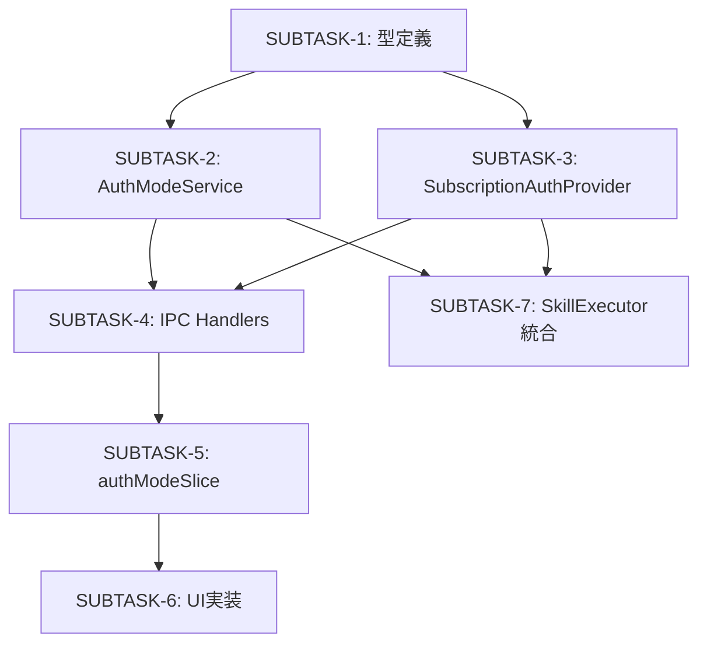

# Phase 5: 実装（TDD: Green）

## メタ情報

| 項目     | 値                                                 |
| -------- | -------------------------------------------------- |
| タスクID | TASK-AUTH-MODE-SELECTION-001                       |
| 機能名   | auth-mode-selection                                |
| Phase    | 5 - 実装                                           |
| Issue    | #750                                               |
| 作成日   | 2026-02-08                                         |
| 前Phase  | [Phase 4: テスト作成](./phase-4-test-creation.md)  |
| 次Phase  | [Phase 6: テスト拡充](./phase-6-test-expansion.md) |

## 目的

Phase 4で作成したテストをすべてパス（Green）させるための実装を行う。
テストファーストの原則に従い、テストが要求する機能のみを実装する。

## 依存関係

- **前提成果物**:
  - `phase-4-test-creation.md` で定義されたテストファイル群
  - `phase-2-design.md` のインターフェース設計
- **参照システム仕様書**:
  - `aiworkflow-requirements/references/interfaces-auth.md`
  - `aiworkflow-requirements/references/architecture-auth-security.md`
  - `aiworkflow-requirements/references/security-api-electron.md`
  - `aiworkflow-requirements/references/api-ipc-auth.md`

## 実装タスク（依存順）

### SUBTASK-1: 型定義・インターフェース実装

**対象ファイル**:

- `packages/shared/src/types/auth-mode.ts`
- `apps/desktop/src/main/services/auth/authModeTypes.ts`

**実装内容**:

```typescript
// packages/shared/src/types/auth-mode.ts
export type AuthMode = "subscription" | "api-key";

export interface AuthModeConfig {
  mode: AuthMode;
  isValid: boolean;
  lastValidated: string | null;
}

export interface AuthModeChangeEvent {
  previousMode: AuthMode;
  newMode: AuthMode;
  timestamp: string;
}
```

**完了条件**:

- [ ] 型定義が TypeScript strict モードでエラーなし
- [ ] 共有パッケージからエクスポートされている

---

### SUBTASK-2: AuthModeService実装

**対象ファイル**:

- `apps/desktop/src/main/services/auth/AuthModeService.ts`

**実装内容**:

- 認証方式の永続化（electron-store使用）
- 現在の認証方式の取得
- 認証方式変更時のイベント発行
- デフォルト値: `subscription`（サブスクリプション）

**主要メソッド**:

```typescript
class AuthModeService {
  getCurrentMode(): AuthMode;
  setMode(mode: AuthMode): Promise<void>;
  getStatus(): AuthModeConfig;
  validateMode(mode: AuthMode): Promise<boolean>;
  onModeChange(callback: (event: AuthModeChangeEvent) => void): () => void;
}
```

**完了条件**:

- [ ] electron-storeで永続化される
- [ ] デフォルト値が `subscription` である
- [ ] 変更イベントが発行される
- [ ] バリデーション機能が動作する

---

### SUBTASK-3: SubscriptionAuthProvider実装

**対象ファイル**:

- `apps/desktop/src/main/services/auth/SubscriptionAuthProvider.ts`

**実装内容**:

- Claude Code CLI認証トークンの取得
- トークンのキャッシュ管理
- トークン有効性の検証

**主要メソッド**:

```typescript
class SubscriptionAuthProvider {
  getToken(): Promise<string | null>;
  validateToken(): Promise<boolean>;
  refreshToken(): Promise<string | null>;
  clearCache(): void;
}
```

**Claude Code CLI統合**:

- `~/.claude/` ディレクトリからの認証情報読み取り
- セッション状態の確認

**完了条件**:

- [ ] CLIトークン取得が動作する
- [ ] トークンキャッシュが機能する
- [ ] 有効性検証が動作する

---

### SUBTASK-4: IPC Handlers実装

**対象ファイル**:

- `apps/desktop/src/main/ipc/authModeHandlers.ts`

**IPCチャンネル定義**:
| チャンネル名 | 方向 | 説明 |
| ---------------------- | --------------- | ------------------------ |
| `auth-mode:get` | Renderer → Main | 現在の認証方式を取得 |
| `auth-mode:set` | Renderer → Main | 認証方式を設定 |
| `auth-mode:get-status` | Renderer → Main | 認証状態詳細を取得 |
| `auth-mode:validate` | Renderer → Main | 認証方式の有効性を検証 |
| `auth-mode:changed` | Main → Renderer | 認証方式変更イベント通知 |

**セキュリティ要件**:

- 送信元ウィンドウの検証
- 入力値のバリデーション
- エラーのサニタイズ

**完了条件**:

- [ ] 全チャンネルが登録されている
- [ ] 引数バリデーションが動作する
- [ ] エラーがサニタイズされる

---

### SUBTASK-5: authModeSlice実装

**対象ファイル**:

- `apps/desktop/src/renderer/store/slices/authModeSlice.ts`

**状態定義**:

```typescript
interface AuthModeState {
  mode: AuthMode;
  isLoading: boolean;
  isValid: boolean;
  error: string | null;
  lastValidated: string | null;
}
```

**アクション**:

- `setAuthMode`: 認証方式を変更
- `validateAuthMode`: 認証方式を検証
- `fetchAuthMode`: 現在の認証方式を取得
- `clearError`: エラーをクリア

**完了条件**:

- [ ] Zustand storeが動作する
- [ ] IPC呼び出しが正しく行われる
- [ ] ローディング/エラー状態が管理される

---

### SUBTASK-6: AuthModeSelector UI実装

**対象ファイル**:

- `apps/desktop/src/renderer/components/settings/AuthModeSelector.tsx`

**UI要件（Apple HIG準拠）**:

- セグメントコントロールスタイル
- 2つの選択肢: サブスクリプション / BYOK
- 現在選択中のモード表示
- 切替時の確認ダイアログ
- ローディング状態の表示
- エラー状態の表示

**デザイン仕様**:

- 角丸: 8px
- セグメント間の区切り: 1px ボーダー
- 選択状態: アクセントカラー（#007AFF）
- 非選択状態: セカンダリ背景（#F5F5F7）
- フォント: システムフォント、14px

**完了条件**:

- [ ] セグメントコントロールが表示される
- [ ] クリックで切替ダイアログが表示される
- [ ] ローディング/エラー状態が表示される
- [ ] アクセシビリティ要件を満たす

---

### SUBTASK-7: SkillExecutor統合

**対象ファイル**:

- `apps/desktop/src/main/services/skill/SkillExecutor.ts`

**実装内容**:

- `getApiKey()` メソッドの拡張
- 認証方式に応じた分岐ロジック

**分岐ロジック**:

```typescript
async getApiKey(): Promise<string> {
  const mode = this.authModeService.getCurrentMode();

  if (mode === 'subscription') {
    return this.subscriptionAuthProvider.getToken();
  } else {
    return this.authKeyService.getKey();
  }
}
```

**完了条件**:

- [ ] subscription モードでCLIトークンを使用
- [ ] api-key モードで既存のAPIキーを使用
- [ ] 認証失敗時のエラーハンドリング

## 統合テスト連携【必須】

フロント/バック接続の実装とテスト支援コード整備:

| 実装項目           | 内容                                                                           |
| ------------------ | ------------------------------------------------------------------------------ |
| IPC接続            | authModeHandlers が正しく登録され、Renderer からの呼び出しが成功すること       |
| 状態同期           | authModeSlice が IPC 経由で Main Process の状態を正しく取得・更新すること      |
| 認証フロー         | subscription モードで CLI トークン、api-key モードで APIキーが正しく使用される |
| エラーハンドリング | 認証失敗時に適切なエラーメッセージが Renderer に伝達されること                 |

### 統合テストシナリオ（Phase 5で確認必須）

| シナリオ                           | 確認項目                                          |
| ---------------------------------- | ------------------------------------------------- |
| 認証方式の切り替え                 | setMode → getMode の往復がIPC経由で正常動作       |
| subscription モードでのAPI呼び出し | SubscriptionAuthProvider のトークンが使用される   |
| api-key モードでのAPI呼び出し      | AuthKeyService の APIキーが使用される             |
| エラー伝達                         | Main のエラーが適切にサニタイズされて Renderer へ |

## 実装順序の依存関係



## 成果物

| ファイルパス                                                         | 説明                   |
| -------------------------------------------------------------------- | ---------------------- |
| `packages/shared/src/types/auth-mode.ts`                             | 共有型定義             |
| `apps/desktop/src/main/services/auth/authModeTypes.ts`               | Main Process型定義     |
| `apps/desktop/src/main/services/auth/AuthModeService.ts`             | 認証方式管理サービス   |
| `apps/desktop/src/main/services/auth/SubscriptionAuthProvider.ts`    | サブスクリプション認証 |
| `apps/desktop/src/main/ipc/authModeHandlers.ts`                      | IPCハンドラ            |
| `apps/desktop/src/renderer/store/slices/authModeSlice.ts`            | Zustand slice          |
| `apps/desktop/src/renderer/components/settings/AuthModeSelector.tsx` | UIコンポーネント       |
| `apps/desktop/src/main/services/skill/SkillExecutor.ts`              | 統合修正               |

## 完了条件

- [ ] すべてのSUBTASKが完了している
- [ ] Phase 4で作成したテストがすべてGreen
- [ ] TypeScript型チェックがエラーなし
- [ ] ESLint警告がゼロ
- [ ] 依存関係の順序が守られている

## 次のPhase

Phase 6: テスト拡充へ進む

- カバレッジ測定
- エッジケーステスト追加
- E2Eテストシナリオ実装
