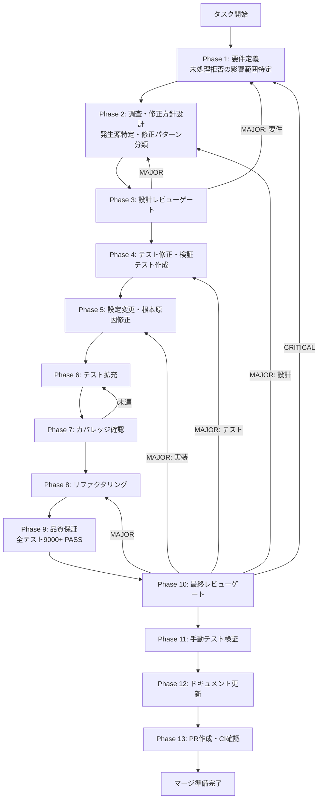

# TASK-FIX-10-1-VITEST-ERROR-HANDLING - タスク実行仕様書

## ユーザーからの元の指示

```
apps/desktop/vitest.config.ts L43 で dangerouslyIgnoreUnhandledErrors: true が設定されている。
未処理のPromise拒否がテストで無視されるため、テスト安定化のための暫定措置として導入された。
この設定を false（デフォルト）に戻し、未処理のPromise拒否を検出可能にして
テスト結果の信頼性を回復する。
```

## メタ情報

| 項目         | 内容                                       |
| ------------ | ------------------------------------------ |
| タスクID     | TASK-FIX-10-1-VITEST-ERROR-HANDLING        |
| タスク名     | dangerouslyIgnoreUnhandledErrors設定の解消 |
| 分類         | テスト品質改善                             |
| 対象機能     | Vitest設定・テストエラーハンドリング       |
| 優先度       | 中                                         |
| 見積もり規模 | 中規模                                     |
| ステータス   | 未実施                                     |
| 作成日       | 2026-02-19                                 |
| 対象ファイル | `apps/desktop/vitest.config.ts` L43        |

---

## タスク概要

### 目的

`apps/desktop/vitest.config.ts` の `dangerouslyIgnoreUnhandledErrors: true` 設定を削除し、Vitestのデフォルト動作（未処理のPromise拒否をテスト失敗として検出）を復元する。これにより、テスト結果の信頼性を回復し、本番環境で顕在化するエラーをテスト段階で検出可能にする。

### 背景

テスト安定化のための暫定措置として `dangerouslyIgnoreUnhandledErrors: true` が導入された。この設定は以下の問題を引き起こす:

- **未処理のPromise拒否がテストで無視される**: テスト結果が「全PASS」であっても、実際にはPromise拒否が発生している可能性がある
- **本番環境でのクラッシュリスク**: テストで検出されなかったPromise拒否が本番環境で `unhandledrejection` イベントとしてクラッシュを引き起こす
- **デバッグ困難**: 非同期エラーの発生箇所が特定しづらくなり、後続のデバッグコストが増大する
- **テスト品質の信頼性低下**: テストスイートが品質ゲートとして機能しなくなる

### 最終ゴール

1. `dangerouslyIgnoreUnhandledErrors: true` が `apps/desktop/vitest.config.ts` から削除されている
2. 全テスト（9000+）が PASS する（未処理のPromise拒否の根本原因を修正済み）
3. テスト結果がPromise拒否を検出可能な信頼性の高い状態に復帰している

### 成果物一覧

| 種別               | 成果物                                     | 配置先                                                  |
| ------------------ | ------------------------------------------ | ------------------------------------------------------- |
| 設定変更           | vitest.config.ts 修正                      | `apps/desktop/vitest.config.ts`                         |
| テスト修正         | 未処理Promise拒否の根本原因修正            | `apps/desktop/src/**/*.test.{ts,tsx}`（該当テストのみ） |
| テスト修正         | 非同期テストのエラーハンドリング追加       | `apps/desktop/src/**/*.test.{ts,tsx}`（該当テストのみ） |
| プロダクション修正 | 非同期処理の未処理拒否修正（該当箇所のみ） | `apps/desktop/src/**/*.{ts,tsx}`（該当ファイルのみ）    |
| ドキュメント       | 実装ガイド                                 | `outputs/phase-12/implementation-guide.md`              |
| ドキュメント       | ドキュメント更新履歴                       | `outputs/phase-12/documentation-changelog.md`           |
| PR                 | GitHub Pull Request                        | GitHub UI                                               |

---

## 参照ファイル

本仕様書の作成は以下を参照:

### システム仕様（aiworkflow-requirements）

> 実装前に以下のシステム仕様を確認し、既存設計との整合性を確保してください。

| 参照資料             | パス                                     | 内容                                   |
| -------------------- | ---------------------------------------- | -------------------------------------- |
| コード品質ルール     | `.claude/rules/02-code-quality.md`       | エラーハンドリング原則・テスト設計規約 |
| 既知の落とし穴       | `.claude/rules/06-known-pitfalls.md`     | P22: Vitest Worker予期しない終了       |
| アーキテクチャルール | `.claude/rules/01-architecture.md`       | レイヤー依存方向                       |
| テスト実行注意事項   | `.claude/rules/06-known-pitfalls.md#P40` | テスト実行ディレクトリ依存（モノレポ） |
| Vitest設定（現行）   | `apps/desktop/vitest.config.ts`          | 現行のVitest設定（修正対象）           |
| テストセットアップ   | `apps/desktop/src/test/setup.ts`         | テスト環境初期化                       |

### 依存タスク

| タスク                            | 説明            | 状態   |
| --------------------------------- | --------------- | ------ |
| TASK-FIX-11-1-SDK-TEST-ENABLEMENT | SDKテスト有効化 | 未実施 |
| TASK-9B-I-SDK-FORMAL-INTEGRATION  | SDK統合安定化   | 完了   |

---

## タスク分解サマリー

| ID     | フェーズ | サブタスク名                           | 責務                                             | 依存 |
| ------ | -------- | -------------------------------------- | ------------------------------------------------ | ---- |
| T-01-1 | Phase 1  | 要件抽出・受け入れ基準定義             | 未処理Promise拒否の影響範囲特定・受入基準定義    | -    |
| T-02-1 | Phase 2  | 調査・修正方針設計                     | 未処理拒否の発生源特定・修正パターン分類         | T-01 |
| T-03-1 | Phase 3  | 設計レビューゲート                     | 修正方針の妥当性検証                             | T-02 |
| T-04-1 | Phase 4  | テスト修正・検証テスト作成（TDD: Red） | 設定変更後に失敗するテストの特定・修正テスト設計 | T-03 |
| T-05-1 | Phase 5  | 設定変更・根本原因修正（TDD: Green）   | config修正・非同期エラーハンドリング実装         | T-04 |
| T-06-1 | Phase 6  | テスト拡充                             | 修正漏れの検出・カバレッジ向上                   | T-05 |
| T-07-1 | Phase 7  | テストカバレッジ確認                   | カバレッジ基準達成検証                           | T-06 |
| T-08-1 | Phase 8  | リファクタリング（TDD: Refactor）      | 修正コードの品質改善                             | T-07 |
| T-09-1 | Phase 9  | 品質保証                               | Lint・型チェック・全テスト（9000+）実行          | T-08 |
| T-10-1 | Phase 10 | 最終レビューゲート                     | 全体品質・整合性検証                             | T-09 |
| T-11-1 | Phase 11 | 手動テスト検証                         | CI環境・ローカル環境の両方でテスト実行確認       | T-10 |
| T-12-1 | Phase 12 | ドキュメント更新                       | 実装ガイド・仕様更新・未タスク検出               | T-11 |
| T-13-1 | Phase 13 | PR作成                                 | コミット・PR・CI確認                             | T-12 |

**総サブタスク数**: 13個

---

## 実行フロー図



---

## Phase一覧

| Phase | 名称               | 仕様書                                                       | ステータス |
| ----- | ------------------ | ------------------------------------------------------------ | ---------- |
| 1     | 要件定義           | [phase-1-requirements.md](phase-1-requirements.md)           | 未実施     |
| 2     | 設計               | [phase-2-design.md](phase-2-design.md)                       | 未実施     |
| 3     | 設計レビューゲート | [phase-3-design-review.md](phase-3-design-review.md)         | 未実施     |
| 4     | テスト作成         | [phase-4-test-creation.md](phase-4-test-creation.md)         | 未実施     |
| 5     | 実装               | [phase-5-implementation.md](phase-5-implementation.md)       | 未実施     |
| 6     | テスト拡充         | [phase-6-test-expansion.md](phase-6-test-expansion.md)       | 未実施     |
| 7     | カバレッジ確認     | [phase-7-coverage-check.md](phase-7-coverage-check.md)       | 未実施     |
| 8     | リファクタリング   | [phase-8-refactoring.md](phase-8-refactoring.md)             | 未実施     |
| 9     | 品質保証           | [phase-9-quality-assurance.md](phase-9-quality-assurance.md) | 未実施     |
| 10    | 最終レビューゲート | [phase-10-final-review.md](phase-10-final-review.md)         | 未実施     |
| 11    | 手動テスト         | [phase-11-manual-test.md](phase-11-manual-test.md)           | 未実施     |
| 12    | ドキュメント更新   | [phase-12-documentation.md](phase-12-documentation.md)       | 未実施     |
| 13    | PR作成             | [phase-13-pr-creation.md](phase-13-pr-creation.md)           | 未実施     |

---

## テストカバレッジ目標

### ユニットテスト

| 指標              | 最低基準 | 推奨基準 |
| ----------------- | -------- | -------- |
| Line Coverage     | 80%      | 90%      |
| Branch Coverage   | 60%      | 70%      |
| Function Coverage | 80%      | 90%      |

### 結合テスト

| 指標                         | 目標 |
| ---------------------------- | ---- |
| 修正対象テストファイル       | 100% |
| 非同期エラーハンドリング検証 | 100% |
| 正常系シナリオ               | 100% |
| 異常系シナリオ               | 80%+ |

---

## 統合テスト連携（Phase 1〜11で必須）

各Phaseで以下の統合テスト連携アクションを実施すること:

| Phase | 統合テスト連携アクション                                                   |
| ----- | -------------------------------------------------------------------------- |
| 1     | 未処理Promise拒否が発生するテストファイルのリストを要件に明記              |
| 2     | 拒否の発生パターン（非同期IPC、タイマー、外部SDK連携）を分類して設計に反映 |
| 3     | 修正方針が既存テストの動作を壊さないことをレビューで検証                   |
| 4     | 修正対象テストの失敗を再現するテストケースを作成                           |
| 5     | vitest.config.ts変更と根本原因修正を実装                                   |
| 6     | 修正漏れがないことを確認するテストを拡充                                   |
| 7     | 全テスト（9000+）のPASSとカバレッジ基準達成を確認                          |
| 8     | リファクタ後に全テストが継続PASSすることを確認                             |
| 9     | Lint・型チェック・全テスト実行で品質を検証                                 |
| 10    | 設定変更の前後でテスト結果に差異がないことを最終確認                       |
| 11    | CI環境（GitHub Actions）とローカル環境の両方でテスト実行確認               |

---

## Phase完了時の必須アクション

**各Phase完了時に以下を必ず実行すること:**

1. **タスク100%実行**: Phase内で指定された全タスクを完全に実行
2. **成果物確認**: 全ての必須成果物が生成されていることを検証
3. **実行記録**: 実行タスクの結果を記録
4. **artifacts.json更新**: Phase完了ステータスを更新
5. **Phase末端の実行確認**: 各タスクを100%実行し、各タスクを完遂した旨を明記

```bash
# Phase完了時の検証コマンド
node .claude/skills/task-specification-creator/scripts/validate-phase-output.mjs docs/30-workflows/TASK-FIX-10-1-VITEST-ERROR-HANDLING --phase {{PHASE_NUMBER}}

# Phase完了・成果物登録
node .claude/skills/task-specification-creator/scripts/complete-phase.mjs \
  --workflow docs/30-workflows/TASK-FIX-10-1-VITEST-ERROR-HANDLING --phase {{PHASE_NUMBER}} --artifacts "..."
```

---

## 変更履歴

| Version | Date       | Changes  |
| ------- | ---------- | -------- |
| 1.0.0   | 2026-02-19 | 初版作成 |
