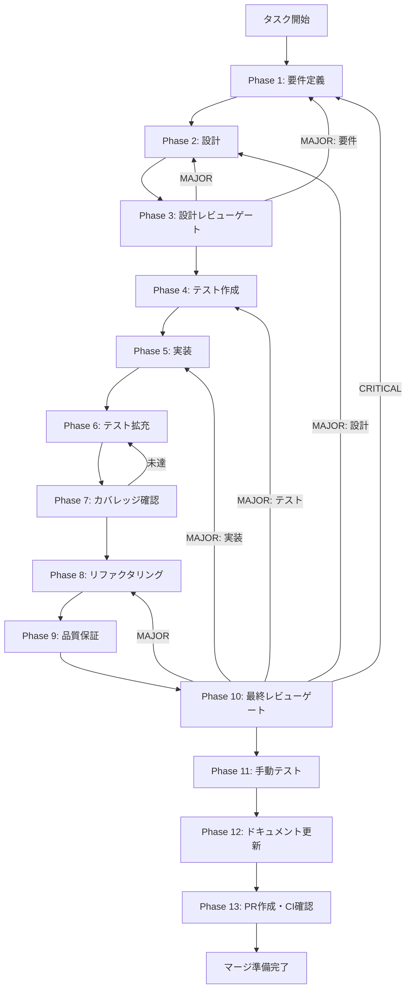

# TASK-FIX-GOOGLE-LOGIN-001 - Googleログイン機能修正タスク実行仕様書

## ユーザーからの元の指示

```
現在ログイン機能が正常に機能していないです。問題点を洗い出して抽出し、それを解決するためのタスク仕様書を作成してほしいです。ログイン機能を完全に機能するようにしてください。今現状、Googleのログイン機能だけでOKです。それ以外のログイン機能は満たす必要はないので、Googleのログイン機能のみ満たせるように改善を行ってください。
```

## メタ情報

| 項目         | 内容                      |
| ------------ | ------------------------- |
| タスクID     | TASK-FIX-GOOGLE-LOGIN-001 |
| タスク名     | google-login-fix          |
| 分類         | バグ修正                  |
| 対象機能     | Google OAuth認証機能      |
| 優先度       | 高                        |
| 見積もり規模 | 中規模                    |
| ステータス   | 未実施                    |
| 作成日       | 2026-02-04                |

---

## タスク概要

### 目的

Googleログイン機能を正常に動作させるため、Auth Callbackのエラーハンドリング、Supabase設定検証、セッション管理、認証状態リスナーの4つの問題点を修正する。

### 背景

現在のGoogleログイン機能には以下の問題が確認されている：

1. **Auth Callbackエラーハンドリング不足**: OAuth認証のコールバックURLで `error=access_denied` などのエラーパラメータが返された場合の処理が実装されていない
2. **Supabase設定検証の不整合**: 環境変数未設定時のフォールバックハンドラーでエラーコードが未定義のキーを使用している
3. **リフレッシュトークン期限管理不備**: リフレッシュトークンの有効期限情報がRenderer側に送信されておらず、期限切れ前の警告機能がない
4. **認証状態リスナーの不安定性**: `onAuthStateChanged`リスナーの二重登録防止が不完全で、固定500ms待機による潜在的な競合状態がある

### 最終ゴール

- Googleログインが正常に完了し、認証状態がアプリケーション全体で正しく反映される
- 認証エラー時にユーザーに適切なエラーメッセージが表示される
- セッションの自動更新とトークンリフレッシュが正常に動作する
- 再ログイン時にリスナーの二重登録が発生しない

### 成果物一覧

| 種別         | 成果物                        | 配置先                                      |
| ------------ | ----------------------------- | ------------------------------------------- |
| 機能         | Auth Callbackエラーハンドラー | `apps/desktop/src/main/index.ts`            |
| 機能         | Supabase設定検証              | `apps/desktop/src/main/infrastructure/`     |
| 機能         | セッション管理改善            | `apps/desktop/src/main/ipc/authHandlers.ts` |
| 機能         | 認証状態リスナー改善          | `apps/desktop/src/renderer/store/slices/`   |
| テスト       | 認証テスト拡充                | `apps/desktop/src/**/*.test.ts`             |
| ドキュメント | 実装ガイド                    | `outputs/phase-12/implementation-guide.md`  |
| PR           | GitHub Pull Request           | GitHub UI                                   |

---

## 参照ファイル

本仕様書のコマンド選定は以下を参照：

- `docs/00-requirements/master_system_design.md` - システム要件
- `.claude/skills/aiworkflow-requirements/references/` - システム仕様

### システム仕様（aiworkflow-requirements）

> 実装前に必ず以下のシステム仕様を確認し、既存設計との整合性を確保してください。

| 参照資料                 | パス                                                                                        | 内容                               |
| ------------------------ | ------------------------------------------------------------------------------------------- | ---------------------------------- |
| 認証インターフェース     | `.claude/skills/aiworkflow-requirements/references/interfaces-auth.md`                      | Auth型、AuthErrorCode定義          |
| 認証アーキテクチャ       | `.claude/skills/aiworkflow-requirements/references/architecture-auth-security.md`           | Supabase + Electron、セキュリティ  |
| 認証IPC API              | `.claude/skills/aiworkflow-requirements/references/api-ipc-auth.md`                         | 認証フロー、セッション管理         |
| エラーハンドリング       | `.claude/skills/aiworkflow-requirements/references/error-handling.md`                       | エラー分類、リトライ戦略           |
| セキュリティ原則         | `.claude/skills/aiworkflow-requirements/references/security-principles.md`                  | 認証・認可、データ保護             |
| Electron IPCセキュリティ | `.claude/skills/aiworkflow-requirements/references/security-electron-ipc.md`                | contextIsolation、CSP              |
| 実装パターン             | `.claude/skills/aiworkflow-requirements/references/architecture-implementation-patterns.md` | 認証フォールバック、実装パターン集 |

---

## 問題分析サマリー

### 問題1: Auth Callbackエラーハンドリング不足（優先度: 高）

| 項目         | 内容                                                                               |
| ------------ | ---------------------------------------------------------------------------------- |
| 該当ファイル | `apps/desktop/src/main/index.ts` (行114-135)                                       |
| 問題詳細     | OAuth認証失敗時のエラーパラメータ（`error=access_denied`等）が処理されていない     |
| 影響範囲     | ユーザーが認証を拒否した場合、アプリが無応答状態になる                             |
| 対応方針     | URL解析時にerror/error_descriptionパラメータを検出し、適切なエラーメッセージを表示 |

### 問題2: Supabase設定検証の不整合（優先度: 高）

| 項目         | 内容                                                                            |
| ------------ | ------------------------------------------------------------------------------- |
| 該当ファイル | `apps/desktop/src/main/infrastructure/supabaseClient.ts` (行10-11)              |
| 問題詳細     | 環境変数未設定時のフォールバックハンドラーで `AUTH_NOT_CONFIGURED` が未定義     |
| 影響範囲     | Supabase未設定環境でエラーレスポンスが不正な形式になる                          |
| 対応方針     | AUTH_ERROR_CODESにAUTH_NOT_CONFIGUREDを追加、フォールバック時のエラー形式を統一 |

### 問題3: セッション管理の不備（優先度: 中）

| 項目         | 内容                                                                     |
| ------------ | ------------------------------------------------------------------------ |
| 該当ファイル | `apps/desktop/src/main/ipc/authHandlers.ts` (行265-338)                  |
| 問題詳細     | リフレッシュトークンの有効期限情報がRenderer側に送信されていない         |
| 影響範囲     | トークン期限切れ前の警告ができず、ユーザーが突然ログアウトされる         |
| 対応方針     | セッション情報にリフレッシュトークン期限を含め、期限切れ前通知機能を追加 |

### 問題4: 認証状態リスナーの不安定性（優先度: 中）

| 項目         | 内容                                                              |
| ------------ | ----------------------------------------------------------------- |
| 該当ファイル | `apps/desktop/src/renderer/store/slices/authSlice.ts` (行287-350) |
| 問題詳細     | 500ms固定待機、リスナー二重登録防止の不完全性                     |
| 影響範囲     | ネットワーク遅延環境での認証失敗、再ログイン時の挙動不安定        |
| 対応方針     | 動的タイムアウト実装、リスナー管理の改善                          |

---

## タスク分解サマリー

| ID     | フェーズ | サブタスク名               | 責務                             | 依存 |
| ------ | -------- | -------------------------- | -------------------------------- | ---- |
| T-01-1 | Phase 1  | 要件抽出・受け入れ基準定義 | 4問題の要件・AC定義              | -    |
| T-02-1 | Phase 2  | アーキテクチャ設計         | 修正箇所の設計、エラーフロー設計 | T-01 |
| T-03-1 | Phase 3  | 設計レビュー               | 設計の妥当性検証                 | T-02 |
| T-04-1 | Phase 4  | テスト作成（Red）          | 修正前に失敗するテスト作成       | T-03 |
| T-05-1 | Phase 5  | 実装                       | 4問題の修正実装                  | T-04 |
| T-06-1 | Phase 6  | テスト拡充                 | エッジケース・統合テスト追加     | T-05 |
| T-07-1 | Phase 7  | カバレッジ確認             | 80%+カバレッジ達成確認           | T-06 |
| T-08-1 | Phase 8  | リファクタリング           | コード品質改善                   | T-07 |
| T-09-1 | Phase 9  | 品質保証                   | 全品質ゲートクリア確認           | T-08 |
| T-10-1 | Phase 10 | 最終レビュー               | 全体品質・整合性検証             | T-09 |
| T-11-1 | Phase 11 | 手動テスト                 | 実環境でのGoogleログイン検証     | T-10 |
| T-12-1 | Phase 12 | ドキュメント更新           | 実装ガイド・仕様書更新           | T-11 |
| T-13-1 | Phase 13 | PR作成                     | PR作成・CI確認                   | T-12 |

**総サブタスク数**: 13個

---

## 実行フロー図



---

## Phase一覧

| Phase | 名称               | 仕様書                                                 | ステータス |
| ----- | ------------------ | ------------------------------------------------------ | ---------- |
| 1     | 要件定義           | [phase-1-requirements.md](phase-1-requirements.md)     | 未実施     |
| 2     | 設計               | [phase-2-design.md](phase-2-design.md)                 | 未実施     |
| 3     | 設計レビューゲート | [phase-3-design-review.md](phase-3-design-review.md)   | 未実施     |
| 4     | テスト作成         | [phase-4-test-creation.md](phase-4-test-creation.md)   | 未実施     |
| 5     | 実装               | [phase-5-implementation.md](phase-5-implementation.md) | 未実施     |
| 6     | テスト拡充         | [phase-6-test-expansion.md](phase-6-test-expansion.md) | 未実施     |
| 7     | カバレッジ確認     | [phase-7-coverage-check.md](phase-7-coverage-check.md) | 未実施     |
| 8     | リファクタリング   | [phase-8-refactoring.md](phase-8-refactoring.md)       | 未実施     |
| 9     | 品質保証           | [phase-9-quality.md](phase-9-quality.md)               | 未実施     |
| 10    | 最終レビューゲート | [phase-10-final-review.md](phase-10-final-review.md)   | 未実施     |
| 11    | 手動テスト         | [phase-11-manual-test.md](phase-11-manual-test.md)     | 未実施     |
| 12    | ドキュメント更新   | [phase-12-documentation.md](phase-12-documentation.md) | 未実施     |
| 13    | PR作成             | [phase-13-pr-creation.md](phase-13-pr-creation.md)     | 未実施     |

---

## テストカバレッジ目標

### ユニットテスト

| 指標              | 最低基準 | 推奨基準 |
| ----------------- | -------- | -------- |
| Line Coverage     | 80%      | 90%      |
| Branch Coverage   | 60%      | 70%      |
| Function Coverage | 80%      | 90%      |

### 結合テスト

| 指標                         | 目標 |
| ---------------------------- | ---- |
| APIエンドポイント            | 100% |
| モジュール間インターフェース | 100% |
| 正常系シナリオ               | 100% |
| 異常系シナリオ               | 80%+ |
| 外部連携ポイント             | 100% |

---

## 統合テスト連携（Phase 1〜11で必須）

各Phaseで以下の統合テスト連携アクションを実施すること:

| Phase | 統合テスト連携アクション                                    |
| ----- | ----------------------------------------------------------- |
| 1     | 接続要件（Supabase OAuth/IPC/認証フロー）を要件に明記       |
| 2     | 統合ポイント/契約（Auth API・エラーレスポンス）を設計に反映 |
| 3     | 統合テスト観点のレビューゲートを実施                        |
| 4     | 統合テストシナリオを全カテゴリで作成                        |
| 5     | Main/Renderer接続の実装とテスト支援コード整備               |
| 6     | 統合テストの拡充（全カテゴリのカバレッジ向上）              |
| 7     | 統合テストの再実行とゲート判定                              |
| 8     | リファクタ後の統合テスト継続成功を確認                      |
| 9     | 品質保証で統合テスト結果を確認                              |
| 10    | 最終レビューで統合テスト結果を確認                          |
| 11    | 手動統合テスト（Googleログインフロー全体）を確認            |

---

## Phase完了時の必須アクション

**各Phase完了時に以下を必ず実行すること:**

1. **タスク100%実行**: Phase内で指定された全タスクを完全に実行
2. **成果物確認**: 全ての必須成果物が生成されていることを検証
3. **実行記録**: 実行タスクの結果を記録
4. **artifacts.json更新**: Phase完了ステータスを更新
5. **Phase末端の実行確認**: 各タスクを100%実行し、各タスクを完遂した旨を必ず明記

```bash
# Phase完了時の検証コマンド
node .claude/skills/task-specification-creator/scripts/validate-phase-output.js docs/30-workflows/TASK-FIX-GOOGLE-LOGIN-001 --phase {{PHASE_NUMBER}}

# Phase完了・成果物登録
node .claude/skills/task-specification-creator/scripts/complete-phase.js \
  --workflow docs/30-workflows/TASK-FIX-GOOGLE-LOGIN-001 --phase {{PHASE_NUMBER}} --artifacts "..."
```

---

## 変更履歴

| 日付       | バージョン | 変更内容 |
| ---------- | ---------- | -------- |
| 2026-02-04 | 1.0.0      | 初版作成 |
