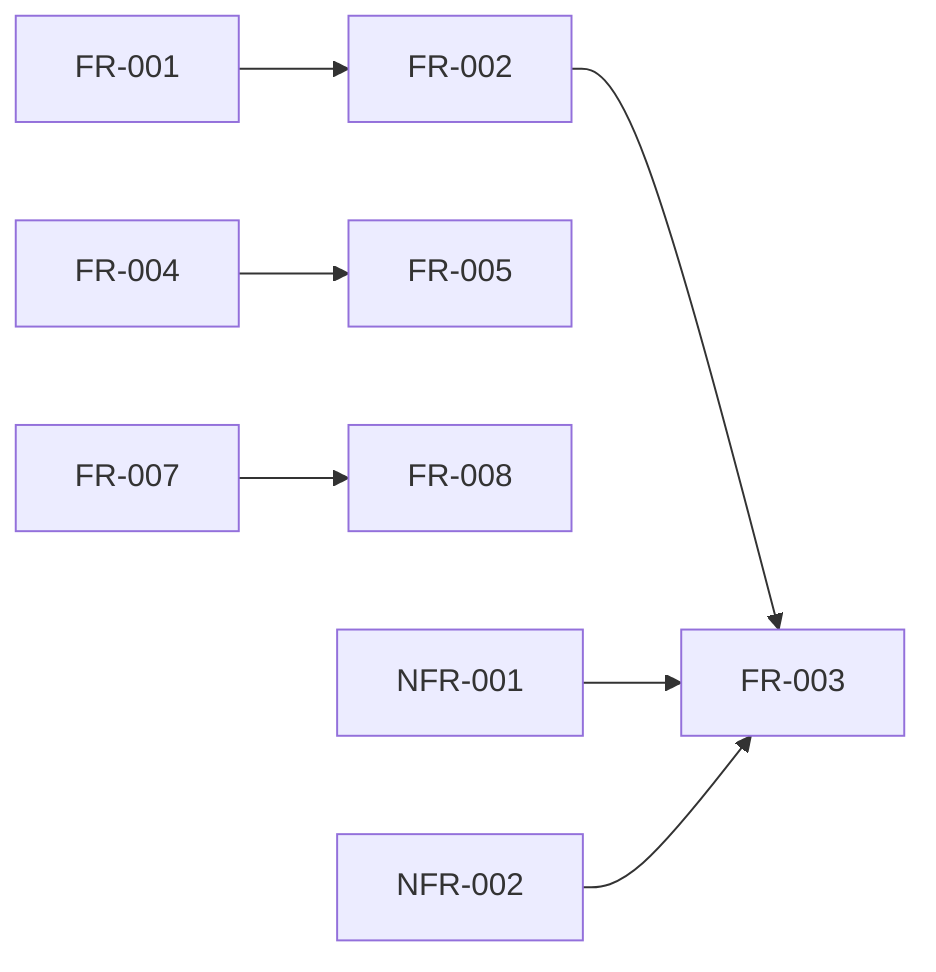

# Phase 1: 要件定義書

## メタ情報

| 項目       | 内容                      |
| ---------- | ------------------------- |
| タスクID   | TASK-FIX-GOOGLE-LOGIN-001 |
| Phase      | 1                         |
| 作成日     | 2026-02-04                |
| ステータス | 完了                      |

---

## 機能要件 (Functional Requirements)

### FR-001: OAuth認証エラーパラメータ検出

| 項目     | 内容                                                                                   |
| -------- | -------------------------------------------------------------------------------------- |
| 要件ID   | FR-001                                                                                 |
| 優先度   | Must                                                                                   |
| 問題番号 | 問題1                                                                                  |
| 説明     | OAuth認証コールバックURLに含まれる`error`および`error_description`パラメータを検出する |
| 該当箇所 | `apps/desktop/src/main/index.ts` - `handleAuthCallback`関数                            |
| 現状     | `access_token`と`refresh_token`のみ抽出、`error`パラメータは未処理                     |

### FR-002: OAuth認証エラーメッセージマッピング

| 項目     | 内容                                                                                          |
| -------- | --------------------------------------------------------------------------------------------- |
| 要件ID   | FR-002                                                                                        |
| 優先度   | Must                                                                                          |
| 問題番号 | 問題1                                                                                         |
| 説明     | OAuth errorコード（`access_denied`, `invalid_request`等）をユーザー向け日本語メッセージに変換 |
| 該当箇所 | `apps/desktop/src/main/index.ts` - 新規追加                                                   |
| 現状     | マッピングテーブルが存在しない                                                                |

### FR-003: OAuth認証エラーのRenderer通知

| 項目     | 内容                                                                                |
| -------- | ----------------------------------------------------------------------------------- |
| 要件ID   | FR-003                                                                              |
| 優先度   | Must                                                                                |
| 問題番号 | 問題1                                                                               |
| 説明     | OAuth認証エラー発生時にAUTH_STATE_CHANGEDイベントでRenderer側にエラー情報を通知する |
| 該当箇所 | `apps/desktop/src/main/index.ts` - `handleAuthCallback`関数                         |
| 現状     | エラー時も`authenticated: false`で通知するが、エラーコードが含まれていない          |

### FR-004: AUTH_NOT_CONFIGUREDエラーコード追加

| 項目     | 内容                                                          |
| -------- | ------------------------------------------------------------- |
| 要件ID   | FR-004                                                        |
| 優先度   | Must                                                          |
| 問題番号 | 問題2                                                         |
| 説明     | AUTH_ERROR_CODESに`AUTH_NOT_CONFIGURED`エラーコードを追加する |
| 該当箇所 | `packages/shared/types/auth.ts` - `AUTH_ERROR_CODES`          |
| 現状     | 環境変数未設定時に使用するエラーコードが未定義                |

### FR-005: Supabase未設定時のフォールバックレスポンス統一

| 項目     | 内容                                                                                           |
| -------- | ---------------------------------------------------------------------------------------------- |
| 要件ID   | FR-005                                                                                         |
| 優先度   | Must                                                                                           |
| 問題番号 | 問題2                                                                                          |
| 説明     | Supabase環境変数未設定時に統一されたIPCResponse形式でエラーを返す                              |
| 該当箇所 | `apps/desktop/src/main/infrastructure/supabaseClient.ts`、`apps/desktop/src/main/ipc/index.ts` |
| 現状     | `null`を返すのみでエラー情報がない                                                             |

### FR-006: リフレッシュトークン期限情報の送信

| 項目     | 内容                                                                          |
| -------- | ----------------------------------------------------------------------------- |
| 要件ID   | FR-006                                                                        |
| 優先度   | Should                                                                        |
| 問題番号 | 問題3                                                                         |
| 説明     | セッション情報にリフレッシュトークンの有効期限を含めてRenderer側に送信する    |
| 該当箇所 | `apps/desktop/src/main/ipc/authHandlers.ts`                                   |
| 現状     | `expiresAt`（アクセストークン期限）のみ送信、リフレッシュトークン期限は未送信 |

### FR-007: 認証状態リスナー二重登録防止

| 項目     | 内容                                                                                 |
| -------- | ------------------------------------------------------------------------------------ |
| 要件ID   | FR-007                                                                               |
| 優先度   | Must                                                                                 |
| 問題番号 | 問題4                                                                                |
| 説明     | `onAuthStateChanged`リスナーの二重登録を防止するフラグ・クリーンアップ機構を実装する |
| 該当箇所 | `apps/desktop/src/renderer/store/slices/authSlice.ts` - `initializeAuth`関数         |
| 現状     | 二重登録防止が不完全                                                                 |

### FR-008: 動的タイムアウト実装

| 項目     | 内容                                                          |
| -------- | ------------------------------------------------------------- |
| 要件ID   | FR-008                                                        |
| 優先度   | Should                                                        |
| 問題番号 | 問題4                                                         |
| 説明     | 固定500ms待機をPromiseベースの動的タイムアウトに置き換える    |
| 該当箇所 | `apps/desktop/src/renderer/store/slices/authSlice.ts` - 行298 |
| 現状     | `setTimeout(resolve, 500)`という固定待機                      |

---

## 非機能要件 (Non-Functional Requirements)

### NFR-001: セキュリティ - トークン機密性

| 項目     | 内容                                                   |
| -------- | ------------------------------------------------------ |
| 要件ID   | NFR-001                                                |
| 優先度   | Must                                                   |
| 説明     | エラーメッセージにトークン情報や内部パス情報を含めない |
| 検証方法 | コードレビュー、自動テスト                             |

### NFR-002: セキュリティ - エラーメッセージサニタイズ

| 項目     | 内容                                                                         |
| -------- | ---------------------------------------------------------------------------- |
| 要件ID   | NFR-002                                                                      |
| 優先度   | Must                                                                         |
| 説明     | 内部エラーメッセージはサニタイズし、機密情報を除去した上でユーザーに表示する |
| 検証方法 | 既存`sanitizeErrorMessage`関数の利用を確認                                   |

### NFR-003: 可用性 - リスナー安定性

| 項目     | 内容                                                                 |
| -------- | -------------------------------------------------------------------- |
| 要件ID   | NFR-003                                                              |
| 優先度   | Must                                                                 |
| 説明     | 認証状態リスナーが再ログイン時に正常に動作し、競合状態を発生させない |
| 検証方法 | 自動テスト（連続ログイン/ログアウト）、手動テスト                    |

### NFR-004: 互換性 - 既存コード整合性

| 項目     | 内容                                                                         |
| -------- | ---------------------------------------------------------------------------- |
| 要件ID   | NFR-004                                                                      |
| 優先度   | Must                                                                         |
| 説明     | 既存のAUTH_ERROR_CODES、IPCResponse型、authSlice構造との後方互換性を維持する |
| 検証方法 | 既存テストの継続成功、型チェック                                             |

---

## 接続要件（統合テスト連携）

### API接続

| 接続先         | プロトコル   | 内容                                                            |
| -------------- | ------------ | --------------------------------------------------------------- |
| Supabase OAuth | HTTPS        | `signInWithOAuth`, `refreshSession`, `getSession`, `setSession` |
| IPC auth:\*    | Electron IPC | `auth:login`, `auth:logout`, `auth:get-session`, `auth:refresh` |

### 認証フロー

```
Google OAuth → Supabase → aiworkflow://auth/callback → Main Process → AUTH_STATE_CHANGED → Renderer
```

### データフロー

```
リフレッシュトークン保存: Main → SafeStorage
セッション復元: SafeStorage → Main → Renderer
エラー通知: Main → IPC(AUTH_STATE_CHANGED) → Renderer → authSlice
```

---

## アーキテクチャ層別要件

| 層                         | 要件                                                                 |
| -------------------------- | -------------------------------------------------------------------- |
| フロントエンド（Renderer） | FR-007, FR-008: リスナー管理改善、エラー表示UI                       |
| バックエンド（Main）       | FR-001〜FR-005: OAuth処理、エラーハンドリング、トークン管理          |
| IPC通信                    | FR-003, FR-006: AUTH_STATE_CHANGEDペイロード拡張                     |
| セキュリティ               | NFR-001, NFR-002: トークン暗号化（既存）、エラーメッセージサニタイズ |

---

## 依存関係マップ



---

## 変更履歴

| 日付       | バージョン | 変更内容 |
| ---------- | ---------- | -------- |
| 2026-02-04 | 1.0.0      | 初版作成 |
