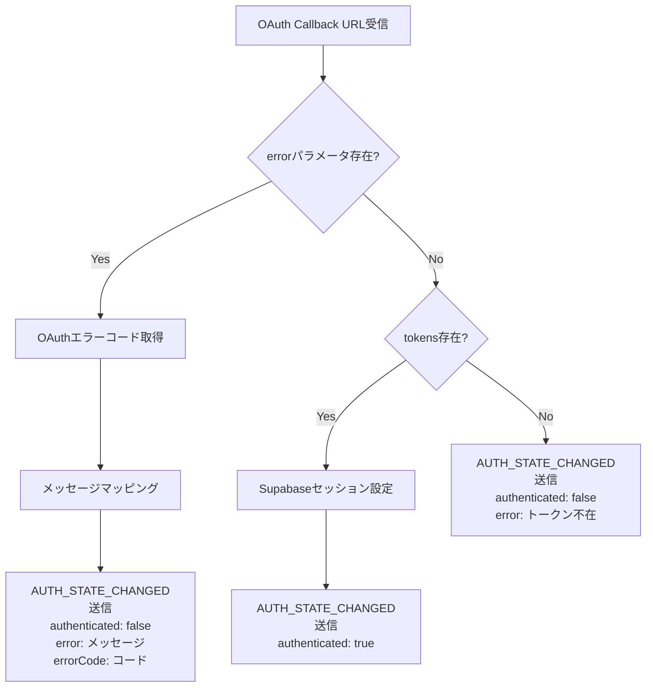
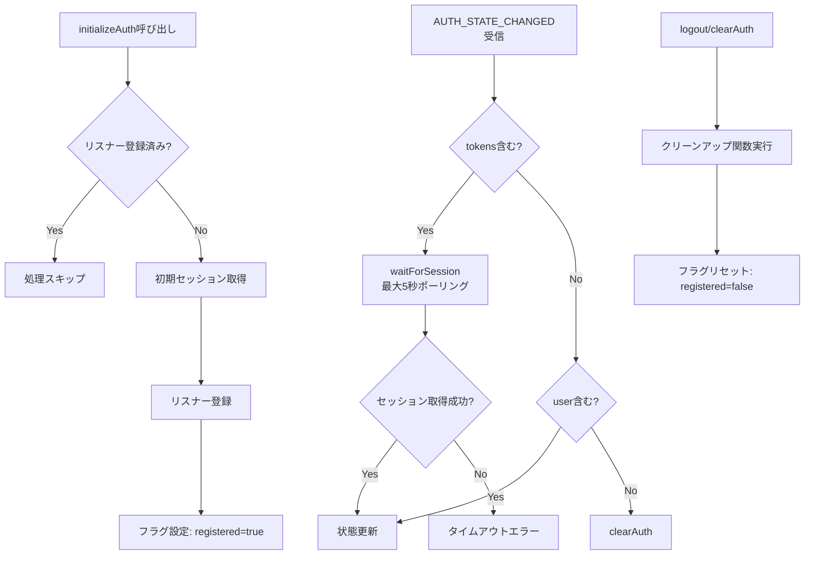

# Phase 2: アーキテクチャ設計書

## メタ情報

| 項目       | 内容                      |
| ---------- | ------------------------- |
| タスクID   | TASK-FIX-GOOGLE-LOGIN-001 |
| Phase      | 2                         |
| 作成日     | 2026-02-04                |
| ステータス | 完了                      |

---

## 設計概要

本設計書では、Phase 1で定義した4つの問題点を解決するためのアーキテクチャ設計を行う。

### 修正対象一覧

| 問題番号 | 問題                            | 修正対象ファイル                                      |
| -------- | ------------------------------- | ----------------------------------------------------- |
| 問題1    | Auth Callbackエラーハンドリング | `apps/desktop/src/main/index.ts`                      |
| 問題2    | Supabase設定検証の不整合        | `packages/shared/types/auth.ts`、`main/ipc/index.ts`  |
| 問題3    | セッション管理の不備            | `apps/desktop/src/main/ipc/authHandlers.ts`           |
| 問題4    | 認証状態リスナーの不安定性      | `apps/desktop/src/renderer/store/slices/authSlice.ts` |

---

## 問題1: Auth Callbackエラーハンドリング設計

### 現状の問題

```typescript
// 現在のhandleAuthCallback関数（抜粋）
const hashParams = new URLSearchParams(url.substring(hashIndex + 1));
const accessToken = hashParams.get("access_token");
const refreshToken = hashParams.get("refresh_token");
// → errorパラメータを検出していない
```

### 修正設計

#### 1.1 エラーパラメータ検出

```
修正箇所: apps/desktop/src/main/index.ts - handleAuthCallback関数

追加処理:
1. URLパラメータから error と error_description を取得
2. error が存在する場合、エラー処理フローへ分岐
3. OAuthエラーコードをユーザー向けメッセージにマッピング
4. AUTH_STATE_CHANGEDイベントでエラー情報を通知
```

#### 1.2 OAuthエラーメッセージマッピング

| OAuthエラーコード         | 日本語メッセージ                     | AUTH_ERROR_CODES対応            |
| ------------------------- | ------------------------------------ | ------------------------------- |
| `access_denied`           | 認証がキャンセルされました           | `OAUTH_ACCESS_DENIED`           |
| `invalid_request`         | 認証リクエストが不正です             | `OAUTH_INVALID_REQUEST`         |
| `unauthorized_client`     | このアプリは認証が許可されていません | `OAUTH_UNAUTHORIZED_CLIENT`     |
| `server_error`            | 認証サーバーでエラーが発生しました   | `OAUTH_SERVER_ERROR`            |
| `temporarily_unavailable` | 認証サービスが一時的に利用できません | `OAUTH_TEMPORARILY_UNAVAILABLE` |
| （その他）                | 認証に失敗しました                   | `OAUTH_UNKNOWN_ERROR`           |

#### 1.3 エラー通知ペイロード設計

```typescript
// AUTH_STATE_CHANGEDイベントの拡張ペイロード
interface AuthStateChangedPayload {
  authenticated: boolean;
  user?: AuthUser;
  tokens?: { accessToken: string; refreshToken: string };
  // 新規追加フィールド
  error?: string; // ユーザー向けエラーメッセージ
  errorCode?: string; // AUTH_ERROR_CODESのキー
}
```

#### 1.4 処理フロー



---

## 問題2: Supabase設定検証設計

### 現状の問題

```typescript
// packages/shared/types/auth.ts
export const AUTH_ERROR_CODES = {
  LOGIN_FAILED: "auth/login-failed",
  // ... AUTH_NOT_CONFIGURED が存在しない
};
```

### 修正設計

#### 2.1 エラーコード追加

```typescript
// packages/shared/types/auth.ts に追加
export const AUTH_ERROR_CODES = {
  // 既存コード
  LOGIN_FAILED: "auth/login-failed",
  LOGOUT_FAILED: "auth/logout-failed",
  SESSION_FAILED: "auth/session-failed",
  REFRESH_FAILED: "auth/refresh-failed",
  INVALID_PROVIDER: "auth/invalid-provider",
  NETWORK_ERROR: "auth/network-error",
  TOKEN_EXPIRED: "auth/token-expired",

  // 新規追加
  AUTH_NOT_CONFIGURED: "auth/not-configured",

  // OAuthエラーコード（新規追加）
  OAUTH_ACCESS_DENIED: "auth/oauth-access-denied",
  OAUTH_INVALID_REQUEST: "auth/oauth-invalid-request",
  OAUTH_UNAUTHORIZED_CLIENT: "auth/oauth-unauthorized-client",
  OAUTH_SERVER_ERROR: "auth/oauth-server-error",
  OAUTH_TEMPORARILY_UNAVAILABLE: "auth/oauth-temporarily-unavailable",
  OAUTH_UNKNOWN_ERROR: "auth/oauth-unknown-error",
} as const;
```

#### 2.2 フォールバックハンドラー設計

```
修正箇所: apps/desktop/src/main/ipc/index.ts

既存: getSupabaseClient()がnullの場合の処理が不統一
修正: 全認証IPCハンドラーで統一されたエラーレスポンスを返す

IPCResponse形式:
{
  success: false,
  error: {
    code: AUTH_ERROR_CODES.AUTH_NOT_CONFIGURED,
    message: "Supabaseが設定されていません。環境変数を確認してください。"
  }
}
```

---

## 問題3: セッション管理改善設計

### 現状の問題

```typescript
// 現在のAuthSession型
interface AuthSession {
  user: AuthUser;
  accessToken: string;
  refreshToken: string;
  expiresAt: number; // アクセストークン期限のみ
  isOffline: boolean;
}
```

### 修正設計

#### 3.1 AuthSession型拡張

```typescript
// packages/shared/types/auth.ts
interface AuthSession {
  user: AuthUser;
  accessToken: string;
  refreshToken: string;
  expiresAt: number;
  isOffline: boolean;

  // 新規追加（オプショナル - Supabase APIから取得できない場合あり）
  refreshTokenExpiresAt?: number; // リフレッシュトークン期限（Unixタイムスタンプ）
}
```

#### 3.2 期限情報取得設計

```
Supabase Session情報:
- session.expires_at: アクセストークン期限（秒単位Unixタイムスタンプ）
- リフレッシュトークン期限: Supabase APIでは直接取得不可

対応策:
1. Supabaseのデフォルト設定（7日）を使用
2. セッション作成時刻 + 7日をrefreshTokenExpiresAtとして設定
3. 設定可能な定数として定義
```

#### 3.3 定数定義

```typescript
// packages/shared/types/auth.ts に追加
export const AUTH_TOKEN_DEFAULTS = {
  /** リフレッシュトークンのデフォルト有効期間（秒） - 7日 */
  REFRESH_TOKEN_LIFETIME_SECONDS: 7 * 24 * 60 * 60,

  /** 期限切れ警告を表示する閾値（秒） - 1日前 */
  EXPIRY_WARNING_THRESHOLD_SECONDS: 24 * 60 * 60,
} as const;
```

---

## 問題4: 認証状態リスナー改善設計

### 現状の問題

```typescript
// 現在のauthSlice（抜粋）
// 問題1: 固定500ms待機
await new Promise((resolve) => setTimeout(resolve, 500));

// 問題2: 二重登録防止が不完全
if (window.electronAPI.auth.onAuthStateChanged) {
  window.electronAPI.auth.onAuthStateChanged(async (state) => {
    // リスナー登録されるが、クリーンアップ機構がない
  });
}
```

### 修正設計

#### 4.1 モジュールスコープ変数によるリスナー管理

```typescript
// apps/desktop/src/renderer/store/slices/authSlice.ts

// モジュールスコープでリスナー登録状態を管理
let authListenerRegistered = false;
let authListenerCleanup: (() => void) | null = null;

export const createAuthSlice: StateCreator<AuthSlice, [], [], AuthSlice> = (
  set,
  get,
) => ({
  // ...
  initializeAuth: async () => {
    // 二重登録防止
    if (authListenerRegistered) {
      console.log("[AuthSlice] Listener already registered, skipping");
      return;
    }

    // リスナー登録処理
    if (window.electronAPI.auth.onAuthStateChanged) {
      authListenerCleanup = window.electronAPI.auth.onAuthStateChanged(
        async (state) => {
          /* ... */
        },
      );
      authListenerRegistered = true;
    }
  },

  clearAuth: () => {
    // クリーンアップ
    if (authListenerCleanup) {
      authListenerCleanup();
      authListenerCleanup = null;
      authListenerRegistered = false;
    }
    // 状態クリア
    set({
      /* ... */
    });
  },
});
```

#### 4.2 動的タイムアウト実装

```typescript
// 固定500ms待機を置き換え
// Before:
await new Promise((resolve) => setTimeout(resolve, 500));

// After: ポーリングベースの動的待機
const MAX_WAIT_MS = 5000; // 最大5秒待機
const POLL_INTERVAL_MS = 100; // 100msごとにチェック

const waitForSession = async (): Promise<AuthSession | null> => {
  const startTime = Date.now();

  while (Date.now() - startTime < MAX_WAIT_MS) {
    const response = await window.electronAPI.auth.getSession();
    if (response.success && response.data) {
      return response.data;
    }
    await new Promise((resolve) => setTimeout(resolve, POLL_INTERVAL_MS));
  }

  return null; // タイムアウト
};
```

#### 4.3 処理フロー（改善後）



---

## 統合ポイント/契約

### Main→Renderer通知

| イベント           | ペイロード                                                          |
| ------------------ | ------------------------------------------------------------------- |
| AUTH_STATE_CHANGED | `{ authenticated, user?, tokens?, error?, errorCode?, isOffline? }` |

### IPC契約（変更なし）

| チャンネル       | 入力                   | 出力                               |
| ---------------- | ---------------------- | ---------------------------------- |
| auth:login       | `{ provider: string }` | `IPCResponse<void>`                |
| auth:logout      | なし                   | `IPCResponse<void>`                |
| auth:get-session | なし                   | `IPCResponse<AuthSession \| null>` |
| auth:refresh     | なし                   | `IPCResponse<AuthSession>`         |

### SafeStorage契約（変更なし）

| 操作              | 説明                       |
| ----------------- | -------------------------- |
| storeRefreshToken | リフレッシュトークンを保存 |
| getRefreshToken   | リフレッシュトークンを取得 |
| clearTokens       | トークンをクリア           |

---

## アーキテクチャ層別設計サマリー

| 層               | 修正内容                                                         | 影響範囲            |
| ---------------- | ---------------------------------------------------------------- | ------------------- |
| Shared Types     | AUTH_ERROR_CODES拡張、AUTH_TOKEN_DEFAULTS追加、AuthSession型拡張 | 型定義のみ          |
| Main Process     | handleAuthCallback修正、IPCハンドラーのフォールバック統一        | OAuth認証フロー全体 |
| Renderer Process | authSliceリスナー管理、動的タイムアウト                          | 認証状態管理        |
| IPC通信          | AUTH_STATE_CHANGEDペイロード拡張                                 | エラー通知          |

---

## 変更履歴

| 日付       | バージョン | 変更内容 |
| ---------- | ---------- | -------- |
| 2026-02-04 | 1.0.0      | 初版作成 |
