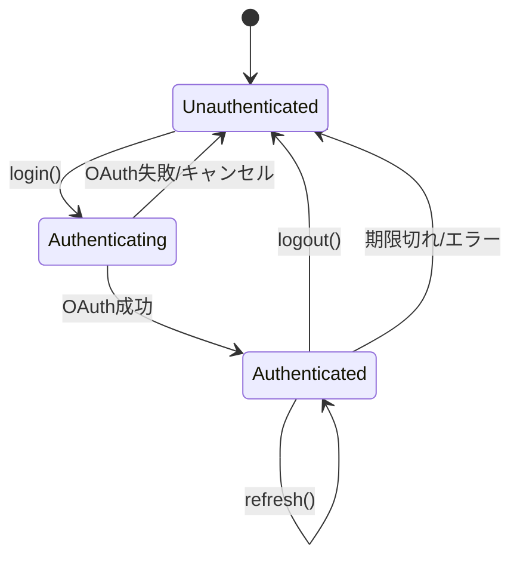
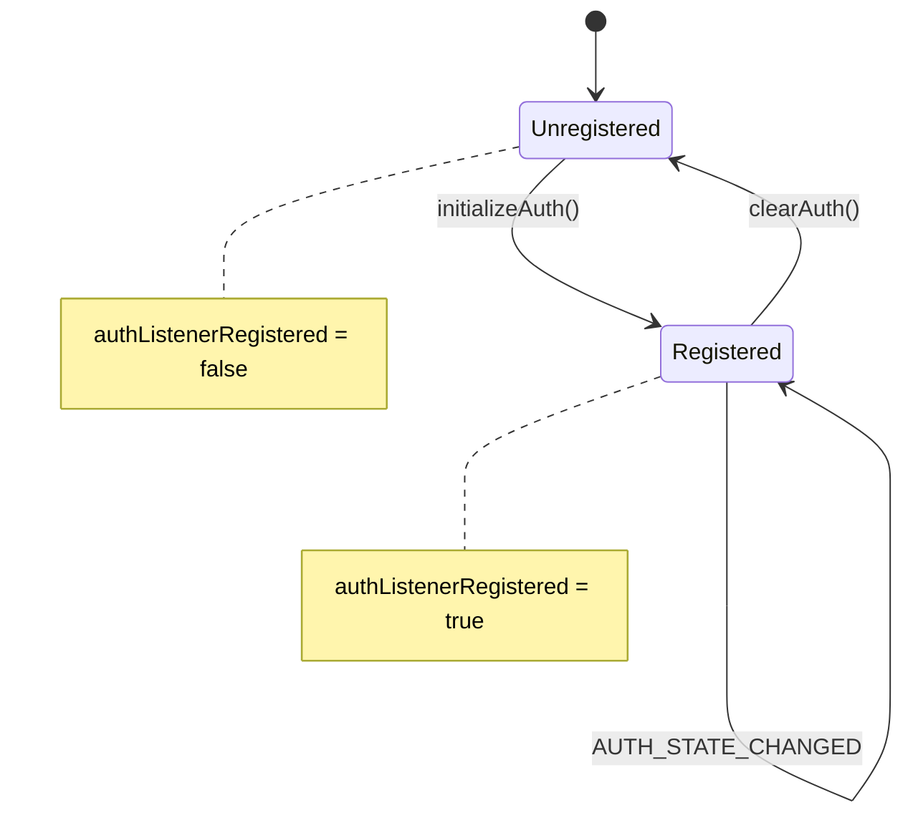
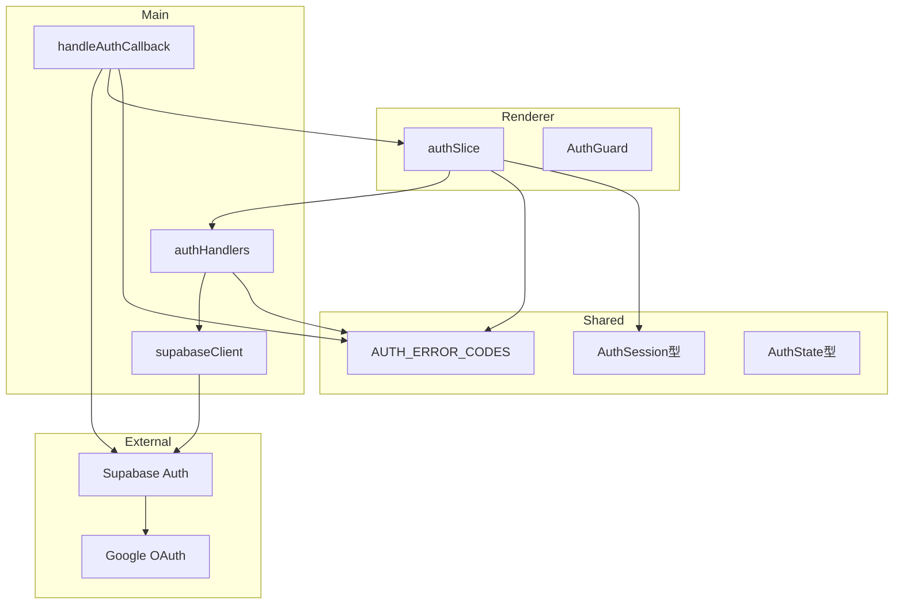

# Phase 2: ドメインモデル設計書

## メタ情報

| 項目       | 内容                      |
| ---------- | ------------------------- |
| タスクID   | TASK-FIX-GOOGLE-LOGIN-001 |
| Phase      | 2                         |
| 作成日     | 2026-02-04                |
| ステータス | 完了                      |

---

## エンティティ定義

### 認証ドメイン

#### AuthUser（既存・変更なし）

認証済みユーザーの基本情報。

| フィールド   | 型             | 説明                    |
| ------------ | -------------- | ----------------------- |
| id           | string         | ユーザーID              |
| email        | string         | メールアドレス          |
| displayName  | string \| null | 表示名                  |
| avatarUrl    | string \| null | アバターURL             |
| provider     | OAuthProvider  | 認証プロバイダー        |
| createdAt    | string         | 作成日時（ISO8601）     |
| lastSignInAt | string         | 最終ログイン（ISO8601） |

#### AuthSession（拡張）

認証セッション情報。

| フィールド            | 型       | 説明                             | 変更     |
| --------------------- | -------- | -------------------------------- | -------- |
| user                  | AuthUser | ユーザー情報                     | 既存     |
| accessToken           | string   | アクセストークン                 | 既存     |
| refreshToken          | string   | リフレッシュトークン             | 既存     |
| expiresAt             | number   | アクセストークン期限（Unix）     | 既存     |
| isOffline             | boolean  | オフライン状態                   | 既存     |
| refreshTokenExpiresAt | number?  | リフレッシュトークン期限（Unix） | **新規** |

#### AuthState（拡張）

認証状態イベントペイロード。

| フィールド    | 型         | 説明                   | 変更     |
| ------------- | ---------- | ---------------------- | -------- |
| authenticated | boolean    | 認証済みフラグ         | 既存     |
| user          | AuthUser?  | ユーザー情報           | 既存     |
| isOffline     | boolean?   | オフライン状態         | 既存     |
| error         | string?    | エラーメッセージ       | **新規** |
| errorCode     | string?    | エラーコード           | **新規** |
| tokens        | TokenPair? | トークンペア（内部用） | 既存     |

#### TokenPair（既存・変更なし）

トークンペア（AUTH_STATE_CHANGED内部用）。

| フィールド   | 型     | 説明                 |
| ------------ | ------ | -------------------- |
| accessToken  | string | アクセストークン     |
| refreshToken | string | リフレッシュトークン |

---

## 値オブジェクト定義

### OAuthProvider（既存・変更なし）

対応するOAuthプロバイダー。

| 値      | 説明          |
| ------- | ------------- |
| google  | Google OAuth  |
| github  | GitHub OAuth  |
| discord | Discord OAuth |

### OAuthErrorCode（新規）

OAuth認証エラーコード。

| 値                      | 説明                           |
| ----------------------- | ------------------------------ |
| access_denied           | ユーザーが認証を拒否           |
| invalid_request         | リクエストパラメータ不正       |
| unauthorized_client     | クライアントが認可されていない |
| server_error            | サーバー側エラー               |
| temporarily_unavailable | サービス一時停止               |

---

## エラーコード定義

### AUTH_ERROR_CODES（拡張）

認証エラーコード一覧。

| キー                          | 値                                 | 説明                    | 変更     |
| ----------------------------- | ---------------------------------- | ----------------------- | -------- |
| LOGIN_FAILED                  | auth/login-failed                  | ログイン失敗            | 既存     |
| LOGOUT_FAILED                 | auth/logout-failed                 | ログアウト失敗          | 既存     |
| SESSION_FAILED                | auth/session-failed                | セッション取得失敗      | 既存     |
| REFRESH_FAILED                | auth/refresh-failed                | トークン更新失敗        | 既存     |
| INVALID_PROVIDER              | auth/invalid-provider              | 無効なプロバイダー      | 既存     |
| NETWORK_ERROR                 | auth/network-error                 | ネットワークエラー      | 既存     |
| TOKEN_EXPIRED                 | auth/token-expired                 | トークン期限切れ        | 既存     |
| AUTH_NOT_CONFIGURED           | auth/not-configured                | Supabase未設定          | **新規** |
| OAUTH_ACCESS_DENIED           | auth/oauth-access-denied           | OAuth拒否               | **新規** |
| OAUTH_INVALID_REQUEST         | auth/oauth-invalid-request         | OAuthリクエスト不正     | **新規** |
| OAUTH_UNAUTHORIZED_CLIENT     | auth/oauth-unauthorized-client     | OAuth未認可クライアント | **新規** |
| OAUTH_SERVER_ERROR            | auth/oauth-server-error            | OAuthサーバーエラー     | **新規** |
| OAUTH_TEMPORARILY_UNAVAILABLE | auth/oauth-temporarily-unavailable | OAuth一時停止           | **新規** |
| OAUTH_UNKNOWN_ERROR           | auth/oauth-unknown-error           | OAuth不明エラー         | **新規** |

---

## 定数定義

### AUTH_TOKEN_DEFAULTS（新規）

トークン関連のデフォルト値。

| 定数名                           | 値           | 説明                         |
| -------------------------------- | ------------ | ---------------------------- |
| REFRESH_TOKEN_LIFETIME_SECONDS   | 604800 (7日) | リフレッシュトークン有効期間 |
| EXPIRY_WARNING_THRESHOLD_SECONDS | 86400 (1日)  | 期限切れ警告閾値             |

### AUTH_LISTENER_CONFIG（新規）

リスナー設定。

| 定数名           | 値   | 説明                       |
| ---------------- | ---- | -------------------------- |
| MAX_WAIT_MS      | 5000 | セッション取得最大待機時間 |
| POLL_INTERVAL_MS | 100  | ポーリング間隔             |

---

## ドメインサービス

### OAuthErrorMapper（新規）

OAuthエラーコードをユーザー向けメッセージに変換。

**責務**:

- OAuthエラーコード（`access_denied`等）を受け取る
- 対応する日本語メッセージを返す
- 未知のエラーコードにはデフォルトメッセージを返す

**実装場所**: `apps/desktop/src/main/services/auth/oauthErrorMapper.ts`（新規）

| 入力            | 出力                                                  |
| --------------- | ----------------------------------------------------- |
| `access_denied` | `{ code: OAUTH_ACCESS_DENIED, message: "認証が..." }` |
| （不明）        | `{ code: OAUTH_UNKNOWN_ERROR, message: "認証に..." }` |

---

## 集約

### AuthAggregate

認証に関連するエンティティとサービスの集約。

```
AuthAggregate
├── AuthUser (Entity)
├── AuthSession (Entity)
├── AuthState (Value Object)
├── OAuthErrorMapper (Domain Service)
└── AUTH_ERROR_CODES (Constants)
```

---

## ドメインイベント

### AUTH_STATE_CHANGED

認証状態が変更されたことを示すイベント。

**発行タイミング**:

1. OAuth認証成功時
2. OAuth認証失敗時（**今回追加**）
3. ログアウト時
4. セッションリフレッシュ時
5. セッション期限切れ時

**ペイロード**:

| 状況       | authenticated | user | error | errorCode | tokens |
| ---------- | ------------- | ---- | ----- | --------- | ------ |
| 認証成功   | true          | ✓    | -     | -         | ✓      |
| 認証失敗   | false         | -    | ✓     | ✓         | -      |
| ログアウト | false         | -    | -     | -         | -      |
| 期限切れ   | false         | -    | ✓     | ✓         | -      |

---

## 状態遷移図

### 認証状態



### リスナー状態（新規）



---

## 依存関係図



---

## インターフェース境界

### Preload API（変更なし）

```typescript
interface ElectronAuthAPI {
  login: (params: { provider: string }) => Promise<IPCResponse<void>>;
  logout: () => Promise<IPCResponse<void>>;
  getSession: () => Promise<IPCResponse<AuthSession | null>>;
  refresh: () => Promise<IPCResponse<AuthSession>>;
  checkOnline: () => Promise<IPCResponse<{ online: boolean }>>;
  onAuthStateChanged: (callback: (state: AuthState) => void) => () => void;
}
```

---

## 変更履歴

| 日付       | バージョン | 変更内容 |
| ---------- | ---------- | -------- |
| 2026-02-04 | 1.0.0      | 初版作成 |
