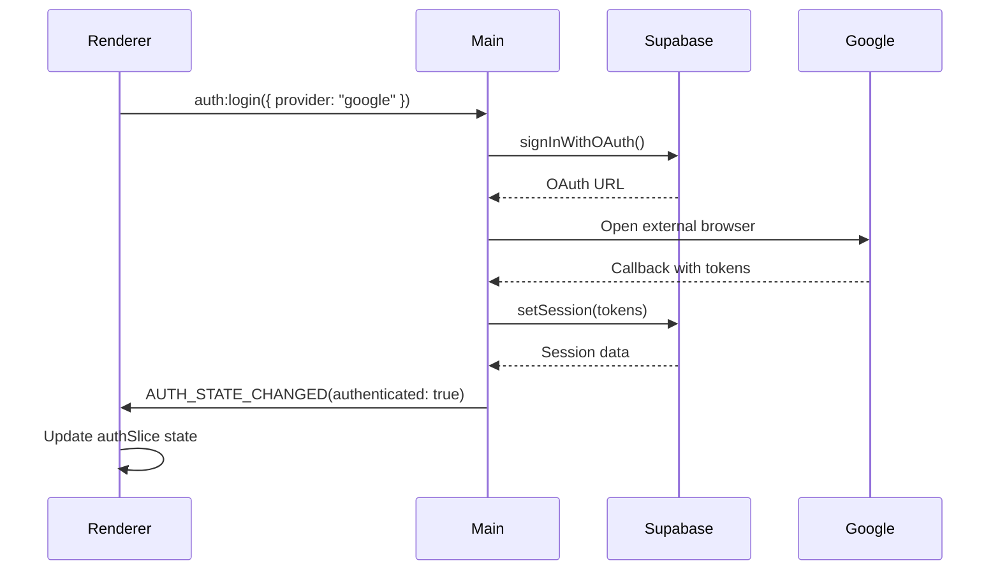
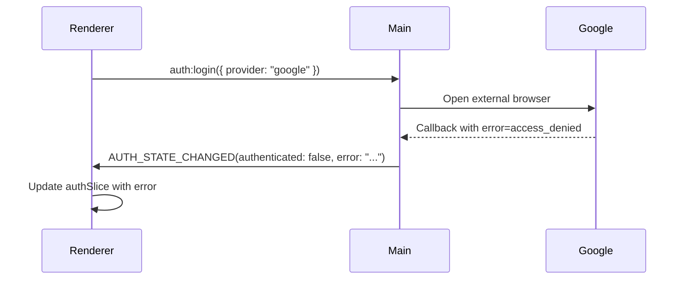
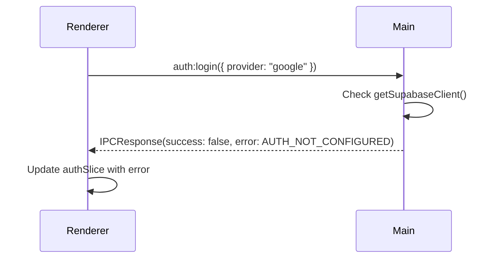

# Phase 4: 統合テスト設計書

## メタ情報

| 項目       | 内容                      |
| ---------- | ------------------------- |
| タスクID   | TASK-FIX-GOOGLE-LOGIN-001 |
| Phase      | 4                         |
| 作成日     | 2026-02-04                |
| ステータス | 完了                      |

---

## 統合テストカテゴリ

### 1. API接続テスト

| シナリオ               | 検証内容                               | テストファイル  |
| ---------------------- | -------------------------------------- | --------------- |
| Supabase OAuth API疎通 | signInWithOAuthが正常にURLを返す       | `*.api.test.ts` |
| セッション取得         | getSessionが正常なセッション情報を返す | `*.api.test.ts` |
| トークンリフレッシュ   | refreshSessionが新しいトークンを返す   | `*.api.test.ts` |

### 2. データフローテスト

| シナリオ           | 検証内容                                | テストファイル   |
| ------------------ | --------------------------------------- | ---------------- |
| OAuth→トークン保存 | コールバック後にSafeStorageに保存される | `*.flow.test.ts` |
| セッション復元     | アプリ再起動後にセッションが復元される  | `*.flow.test.ts` |
| Renderer通知       | AUTH_STATE_CHANGEDが正しく送信される    | `*.flow.test.ts` |

### 3. エラーハンドリングテスト

| シナリオ           | 検証内容                                  | テストファイル    |
| ------------------ | ----------------------------------------- | ----------------- |
| OAuth認証失敗      | access_deniedエラーがRendererに通知される | `*.error.test.ts` |
| ネットワークエラー | オフライン時にエラーが適切に処理される    | `*.error.test.ts` |
| Supabase未設定     | AUTH_NOT_CONFIGUREDが返される             | `*.error.test.ts` |

### 4. 認証連携テスト

| シナリオ             | 検証内容                             | テストファイル   |
| -------------------- | ------------------------------------ | ---------------- |
| トークン取得         | ログイン成功後にトークンが取得される | `*.auth.test.ts` |
| トークンリフレッシュ | 期限切れ前にトークンが更新される     | `*.auth.test.ts` |
| 期限切れ処理         | 期限切れ時にログアウト状態になる     | `*.auth.test.ts` |

### 5. 状態同期テスト

| シナリオ             | 検証内容                             | テストファイル   |
| -------------------- | ------------------------------------ | ---------------- |
| authSlice状態更新    | AUTH_STATE_CHANGEDで状態が更新される | `*.sync.test.ts` |
| リスナー二重登録防止 | 複数回initializeAuthでも1回だけ登録  | `*.sync.test.ts` |
| エラー状態更新       | エラー時にauthErrorが設定される      | `*.sync.test.ts` |

---

## 統合テストシナリオ詳細

### シナリオ1: 正常ログインフロー



**検証ポイント**:

1. signInWithOAuthが呼ばれる
2. setSessionが正しいトークンで呼ばれる
3. AUTH_STATE_CHANGEDが送信される
4. authSliceが更新される

### シナリオ2: 認証キャンセルフロー



**検証ポイント**:

1. errorパラメータが検出される
2. エラーメッセージがマッピングされる
3. AUTH_STATE_CHANGEDにerrorが含まれる
4. authErrorが設定される

### シナリオ3: Supabase未設定フロー



**検証ポイント**:

1. getSupabaseClient()がnullを返す
2. AUTH_NOT_CONFIGUREDエラーが返される
3. authErrorが設定される

---

## モック設計

### Supabase Auth モック

```typescript
const mockSupabase = {
  auth: {
    signInWithOAuth: vi.fn(),
    setSession: vi.fn(),
    getSession: vi.fn(),
    refreshSession: vi.fn(),
    signOut: vi.fn(),
  },
};
```

### BrowserWindow モック

```typescript
const mockWebContents = {
  send: vi.fn(),
};

const mockBrowserWindow = {
  webContents: mockWebContents,
};
```

### electronAPI モック

```typescript
const mockElectronAPI = {
  auth: {
    login: vi.fn(),
    logout: vi.fn(),
    getSession: vi.fn(),
    refresh: vi.fn(),
    checkOnline: vi.fn(),
    onAuthStateChanged: vi.fn(),
  },
};
```

---

## テスト実行

```bash
# 全テスト実行
pnpm --filter @repo/desktop test

# 統合テストのみ
pnpm --filter @repo/desktop test --grep "integration"

# カバレッジ付き
pnpm --filter @repo/desktop test:coverage
```

---

## 変更履歴

| 日付       | バージョン | 変更内容 |
| ---------- | ---------- | -------- |
| 2026-02-04 | 1.0.0      | 初版作成 |
