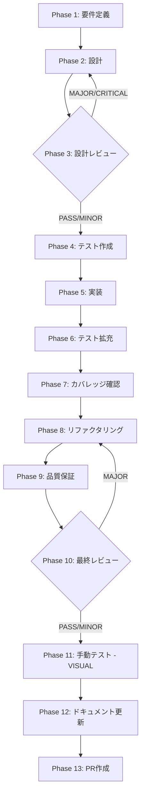

# TASK-LLM-MOD-05-RENDERER-DESC-DISPLAY: InlineModelSelector description tooltip follow-up

## メタ情報

| 項目           | 内容                                                  |
| -------------- | ----------------------------------------------------- |
| タスクID       | TASK-LLM-MOD-05-RENDERER-DESC-DISPLAY                 |
| タスク名       | InlineModelSelector description tooltip follow-up     |
| 分類           | UI改善（VISUAL）                                      |
| 対象機能       | LLM provider/model 選択 UI（renderer）                |
| 優先度         | 低                                                    |
| 見積もり規模   | 小規模                                                |
| ステータス     | completed                                             |
| 作成日         | 2026-04-16                                            |
| 関連Issue      | #2159（CLOSED）                                       |
| 親ワークフロー | `docs/30-workflows/llm-provider-model-modernization/` |

---

## 現在の状態

- Phase 1〜12 は全て completed（実装完了・テスト全 PASS）
- Phase 13 はユーザー承認待ちのため未実行（PR 作成は今回スコープ外）
- `LLMModelSchema.description` は既に存在し、`ModelSelector` は表示済み
- `ProviderSelector` には description フィールドがないため本タスクの対象外
- Issue #2159 は CLOSED で、`InlineModelSelector` の description 表示と Phase 11/12 の証跡は完了済み

## タスク概要

### 目的

LLM provider catalog の `description` フィールドを、コンパクトな renderer UI である `InlineModelSelector` に表示する。`packages/shared/src/types/llm/schemas/provider.ts` の `LLMModelSchema` には `description: z.string().optional()` が既にあり、`ModelSelector` はすでに表示対応済みなので、このタスクでは残る compact UI のみを対象にする。

### 背景

- shared types に `description` があっても、compact UI の `InlineModelSelector` では見えない
- 既存の `ModelSelector` とは別に、チャット画面でも同じ説明情報を確認できるようにする

### 修正対象コンポーネント

| コンポーネント      | ファイル                                                           | 修正内容                         |
| ------------------- | ------------------------------------------------------------------ | -------------------------------- |
| InlineModelSelector | `apps/desktop/src/renderer/components/llm/InlineModelSelector.tsx` | tooltip / helper text で表示追加 |

### 依存タスク

- **参照**: LLM Provider & Model Modernization（親ワークフロー）

### 最終ゴール

1. `InlineModelSelector` で `description` が見える
2. `description` が未設定の場合でも UI レイアウトが崩れない
3. 既存の選択フロー・アクセシビリティが壊れていない
4. 既存テストへ `description` 表示の期待値が追加されている
5. TypeScript 型エラー・ESLint エラーなし

---

## 受入条件

| ID   | 内容                                                                                     |
| ---- | ---------------------------------------------------------------------------------------- |
| AC-1 | `InlineModelSelector` で `description` フィールドが表示される                            |
| AC-2 | `description` が `undefined` または空文字列の場合、UI レイアウトが崩れず安全に処理される |
| AC-3 | 既存の model selection フロー・アクセシビリティが壊れていない（回帰なし）                |
| AC-4 | 既存テストへ `description` 表示の期待値が追加されている                                  |
| AC-5 | TypeScript 型エラー・ESLint エラーなし                                                   |
| AC-6 | docs と UI の文言が一致している                                                          |

---

## 変更対象ファイル

| ファイル                                                                          | 修正内容                        |
| --------------------------------------------------------------------------------- | ------------------------------- |
| `apps/desktop/src/renderer/components/llm/InlineModelSelector.tsx`                | tooltip 形式で description 表示 |
| `apps/desktop/src/renderer/components/llm/__tests__/InlineModelSelector.test.tsx` | T-1〜T-15 テストケース追加      |

---

## 成果物一覧

| Phase | 名称             | 成果物                                                                                                                                                                                                                                                                                                                                       |
| ----- | ---------------- | -------------------------------------------------------------------------------------------------------------------------------------------------------------------------------------------------------------------------------------------------------------------------------------------------------------------------------------------- |
| 1     | 要件定義         | `outputs/phase-1/requirements-definition.md`                                                                                                                                                                                                                                                                                                 |
| 2     | 設計             | `outputs/phase-2/design-document.md`                                                                                                                                                                                                                                                                                                         |
| 3     | 設計レビュー     | `outputs/phase-3/review-result.md`                                                                                                                                                                                                                                                                                                           |
| 4     | テスト作成       | `outputs/phase-4/test-specifications.md`                                                                                                                                                                                                                                                                                                     |
| 5     | 実装             | `outputs/phase-5/implementation-record.md`                                                                                                                                                                                                                                                                                                   |
| 6     | テスト拡充       | `outputs/phase-6/extended-test-record.md`                                                                                                                                                                                                                                                                                                    |
| 7     | カバレッジ確認   | `outputs/phase-7/coverage-report.md`                                                                                                                                                                                                                                                                                                         |
| 8     | リファクタリング | `outputs/phase-8/refactoring-record.md`                                                                                                                                                                                                                                                                                                      |
| 9     | 品質保証         | `outputs/phase-9/quality-report.md`                                                                                                                                                                                                                                                                                                          |
| 10    | 最終レビュー     | `outputs/phase-10/final-review-result.md`                                                                                                                                                                                                                                                                                                    |
| 11    | 手動テスト       | `outputs/phase-11/manual-test-checklist.md` / `outputs/phase-11/manual-test-result.md` / `outputs/phase-11/discovered-issues.md` / `outputs/phase-11/phase11-capture-metadata.json` / `outputs/phase-11/screenshots/inline-model-selector-description-hidden.png` / `outputs/phase-11/screenshots/inline-model-selector-tooltip-visible.png` |
| 12    | ドキュメント更新 | `outputs/phase-12/implementation-guide.md` / `outputs/phase-12/system-spec-update-summary.md` / `outputs/phase-12/documentation-changelog.md` / `outputs/phase-12/unassigned-task-detection.md` / `outputs/phase-12/skill-feedback-report.md` / `outputs/phase-12/phase12-task-spec-compliance-check.md`                                     |
| 13    | PR作成           | `outputs/phase-13/pr-info.md`                                                                                                                                                                                                                                                                                                                |

---

## 参照ファイル

- `packages/shared/src/types/llm/schemas/provider.ts`
- `apps/desktop/src/renderer/components/llm/ModelSelector.tsx`（baseline）
- `apps/desktop/src/renderer/components/llm/ProviderSelector.tsx`（baseline / scope-out）
- `apps/desktop/src/renderer/components/llm/InlineModelSelector.tsx`
- `apps/desktop/src/renderer/components/llm/LLMSelectorPanel.tsx`（integration surface）
- `docs/30-workflows/llm-provider-model-modernization/index.md`
- `docs/30-workflows/unassigned-task/task-llm-mod-05-renderer-desc-display.md`

---

## タスク分解サマリ（Phase 1-13）



| Phase | 名称             | パターン | 依存     | ゲート        | ステータス |
| ----- | ---------------- | -------- | -------- | ------------- | ---------- |
| 1     | 要件定義         | seq      | -        | -             | completed  |
| 2     | 設計             | seq      | Phase 1  | -             | completed  |
| 3     | 設計レビュー     | seq      | Phase 2  | GATE          | completed  |
| 4     | テスト作成       | seq      | Phase 3  | -             | completed  |
| 5     | 実装             | seq      | Phase 4  | -             | completed  |
| 6     | テスト拡充       | seq      | Phase 5  | -             | completed  |
| 7     | カバレッジ確認   | seq      | Phase 6  | -             | completed  |
| 8     | リファクタリング | seq      | Phase 7  | -             | completed  |
| 9     | 品質保証         | seq      | Phase 8  | -             | completed  |
| 10    | 最終レビュー     | seq      | Phase 9  | GATE          | completed  |
| 11    | 手動テスト       | seq      | Phase 10 | VISUAL        | completed  |
| 12    | ドキュメント更新 | par      | Phase 11 | -             | completed  |
| 13    | PR作成           | seq      | Phase 12 | USER_APPROVAL | pending    |

---

## テストカバレッジ目標

| カテゴリ | 対象                                                          | 目標     |
| -------- | ------------------------------------------------------------- | -------- |
| ユニット | InlineModelSelector: description 表示確認（T-1, T-4, T-12）   | 100%     |
| ユニット | InlineModelSelector: description 非表示確認（T-2, T-3, T-10） | 100%     |
| ユニット | InlineModelSelector: tooltip / accessibility（T-5, T-7, T-8） | 100%     |
| 回帰     | 既存モデル選択イベントの正常動作（T-13, T-14, T-15）          | 再発防止 |

---

## Phase 完了時アクション

各 Phase 完了時に以下を実行:

```bash
node .claude/skills/task-specification-creator/scripts/complete-phase.js \
  --workflow TASK-LLM-MOD-05-RENDERER-DESC-DISPLAY \
  --phase <PHASE_NUMBER>
```

---

## 出力ファイル構成

```
docs/30-workflows/TASK-LLM-MOD-05-RENDERER-DESC-DISPLAY/
├── index.md
├── artifacts.json
├── phase-1-requirements.md
├── phase-2-design.md
├── phase-3-design-review.md
├── phase-4-test-creation.md
├── phase-5-implementation.md
├── phase-6-test-expansion.md
├── phase-7-coverage-check.md
├── phase-8-refactoring.md
├── phase-9-quality-assurance.md
├── phase-10-final-review.md
├── phase-11-manual-test.md
├── phase-12-documentation.md
├── phase-13-pr-creation.md
└── outputs/
    ├── phase-1/ ~ phase-13/
    └── phase-11/screenshots/
```
