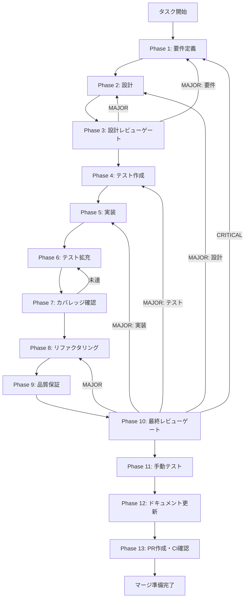

# TASK-P0-06-conversational-interview-ui - タスク実行仕様書

## ユーザーからの元の指示

```
Issue #1889: 会話型インタビュー UI
TASK-SDK-SC-02で基礎実装済みのConversation UIに対し、P0是正ギャップ分析で判明した
5つの未完成課題（全InputKind統合、IPC接続、一時状態管理、進捗表示、APIキーガイダンス）を
解消し、エンドツーエンドで動作する会話型インタビューフローを完成させる。
```

## メタ情報

| 項目         | 内容                                                        |
| ------------ | ----------------------------------------------------------- |
| タスクID     | TASK-P0-06                                                  |
| タスク名     | 会話型インタビュー UI                                       |
| 分類         | 新機能（Feature Gap系）                                     |
| 対象機能     | Skill Creator Agent SDK Lane - 会話型インタビューUX         |
| 優先度       | 高                                                          |
| 見積もり規模 | 大規模                                                      |
| ステータス   | 未実施                                                      |
| 作成日       | 2026-04-04                                                  |
| Issue        | #1889                                                       |
| 依存タスク   | TASK-RT-04（APIキー管理UI）、TASK-RT-05（multi_select追加） |

---

## タスク概要

### 目的

TASK-SDK-SC-02（Conversation UI）の基礎実装を拡張し、全5種類の `UserInputKind`（`single_select` / `multi_select` / `free_text` / `secret` / `confirm`）を統合した会話型インタビューフローをエンドツーエンドで動作させる。Session API経由のIPC接続、一時状態とP0-08永続状態の責務境界明確化、インタビュー進捗表示、APIキー未設定時ガイダンスを完成させる。

### 背景

P0是正ギャップ分析の結果、以下の5つの課題が判明している：

1. **全 UserInputKind 統合の欠如**: 各ウィジェットの骨格は実装済みだが、エンドツーエンドのフロー接続が未完
2. **チャット形式 UX の未完成**: Session API との実際のIPC接続による質問→回答→次の質問サイクルが未完結
3. **一時状態管理の未整備**: P0-06（一時状態）とP0-08（永続状態）の境界が未明確
4. **インタビュー進捗表示の未統合**: InterviewProgressBar と Session API のステップ情報の接続が未確認
5. **APIキー未設定時ガイダンスの欠如**: `secret` 種別でAPIキー未設定時のユーザー誘導フローが不在

### 最終ゴール

- 全5種InputKindで質問→回答→次の質問のサイクルが完結する
- undo操作が全InputKindで正しく機能する（`secret` は空文字復元）
- インタビュー進捗バーがリアルタイムで更新される
- APIキー未設定時にガイダンスバナーが表示される
- P0-06/P0-08の責務境界が実装コードレベルで明確化されている
- TypeScript strict mode / ESLint / ユニットテスト全PASS

### 成果物一覧

| 種別         | 成果物                               | 配置先                                                                                 |
| ------------ | ------------------------------------ | -------------------------------------------------------------------------------------- |
| 機能         | ConversationalInterview拡張          | `apps/desktop/src/renderer/components/skill/ConversationalInterview.tsx`               |
| 機能         | useInterviewState拡張                | `apps/desktop/src/renderer/components/skill/hooks/useInterviewState.ts`                |
| 機能         | SkillCreatorConversationPanel拡張    | `apps/desktop/src/renderer/components/skill-creator/SkillCreatorConversationPanel.tsx` |
| テスト       | ConversationalInterview.test.tsx更新 | `apps/desktop/src/renderer/components/skill/__tests__/`                                |
| テスト       | useInterviewState.test.ts更新        | `apps/desktop/src/renderer/components/skill/__tests__/`                                |
| ドキュメント | Phase 1-13 仕様書・成果物            | `docs/30-workflows/TASK-P0-06-conversational-interview-ui/`                            |
| PR           | GitHub Pull Request                  | GitHub UI                                                                              |

---

## 参照ファイル

本仕様書のコマンド選定は以下を参照：

- `packages/shared/src/types/skillCreator.ts` - InterviewMessage, UserInputKind, InterviewUserAnswer等の型定義
- `packages/shared/src/types/skillCreatorSession.ts` - Session Bridge型（UserInputQuestion/Answer）
- `packages/shared/src/ipc/channels.ts` - SKILL_CREATOR_SESSION_CHANNELS
- `.claude/skills/aiworkflow-requirements/indexes/resource-map.md` - current canonical set の起点
- `.claude/skills/aiworkflow-requirements/indexes/quick-reference.md` - Skill Creator Conversation UI の導線
- `.claude/skills/aiworkflow-requirements/references/api-ipc-system-core.md` - IPC / current contract
- `.claude/skills/aiworkflow-requirements/references/arch-state-management-core.md` - workflowSnapshot / state ownership
- `.claude/skills/aiworkflow-requirements/references/security-electron-ipc-core.md` - IPC security / secret handling
- `.claude/skills/aiworkflow-requirements/references/task-workflow-completed.md` - completed ledger
- `.claude/skills/aiworkflow-requirements/references/lessons-learned-skill-create-multi-select-kind.md` - multi_select canonicalization

---

## タスク分解サマリー

| ID     | フェーズ | サブタスク名                  | 責務                                                    | 依存 |
| ------ | -------- | ----------------------------- | ------------------------------------------------------- | ---- |
| T-01-1 | Phase 1  | P50チェック・要件抽出         | 既実装調査、FR/NFR/AC定義、スコープ確定                 | -    |
| T-02-1 | Phase 2  | アーキテクチャ・Concern別設計 | コンポーネント階層、IPC接続、状態境界、UI拡張設計       | T-01 |
| T-03-1 | Phase 3  | 設計レビューゲート            | 要件カバレッジ、アーキテクチャ整合性、境界レビュー      | T-02 |
| T-04-1 | Phase 4  | テスト作成（Red）             | CT/UT/ITテストシナリオ作成、Red状態確認                 | T-03 |
| T-05-1 | Phase 5  | 実装（Green）                 | useInterviewState/ConversationalInterview/Panel拡張     | T-04 |
| T-06-1 | Phase 6  | テスト拡充                    | エッジケース、エラーハンドリング、A11Yテスト追加        | T-05 |
| T-07-1 | Phase 7  | カバレッジ確認                | Line 80%+/Branch 60%+/Function 80%+確認                 | T-06 |
| T-08-1 | Phase 8  | リファクタリング（Refactor）  | コード品質改善、重複排除、命名一貫性                    | T-07 |
| T-09-1 | Phase 9  | 品質保証                      | 品質ゲート一括判定（機能/品質/カバレッジ/セキュリティ） | T-08 |
| T-10-1 | Phase 10 | 最終レビューゲート            | AC-1〜AC-9達成確認、ブロッカー最終レビュー              | T-09 |
| T-11-1 | Phase 11 | 手動テスト                    | 11シナリオ手動検証、スクリーンショット、視覚レビュー    | T-10 |
| T-12-1 | Phase 12 | ドキュメント更新              | implementation-guide、仕様同期、未タスク検出            | T-11 |
| T-13-1 | Phase 13 | PR作成・CI確認                | ローカルチェック、PR作成（ユーザー承認必須）            | T-12 |

**総サブタスク数**: 13個

---

## 実行フロー図



---

## Phase一覧

| Phase | 名称               | 仕様書                                                       | ステータス |
| ----- | ------------------ | ------------------------------------------------------------ | ---------- |
| 1     | 要件定義           | [phase-1-requirements.md](phase-1-requirements.md)           | 未実施     |
| 2     | 設計               | [phase-2-design.md](phase-2-design.md)                       | 未実施     |
| 3     | 設計レビューゲート | [phase-3-design-review.md](phase-3-design-review.md)         | 未実施     |
| 4     | テスト作成         | [phase-4-test-creation.md](phase-4-test-creation.md)         | 未実施     |
| 5     | 実装               | [phase-5-implementation.md](phase-5-implementation.md)       | 未実施     |
| 6     | テスト拡充         | [phase-6-test-expansion.md](phase-6-test-expansion.md)       | 未実施     |
| 7     | カバレッジ確認     | [phase-7-coverage-check.md](phase-7-coverage-check.md)       | 未実施     |
| 8     | リファクタリング   | [phase-8-refactoring.md](phase-8-refactoring.md)             | 未実施     |
| 9     | 品質保証           | [phase-9-quality-assurance.md](phase-9-quality-assurance.md) | 未実施     |
| 10    | 最終レビューゲート | [phase-10-final-review.md](phase-10-final-review.md)         | 未実施     |
| 11    | 手動テスト         | [phase-11-manual-test.md](phase-11-manual-test.md)           | 未実施     |
| 12    | ドキュメント更新   | [phase-12-documentation.md](phase-12-documentation.md)       | 未実施     |
| 13    | PR作成             | [phase-13-pr-creation.md](phase-13-pr-creation.md)           | 未実施     |

---

## テストカバレッジ目標

### ユニットテスト

| 指標              | 最低基準 | 推奨基準 |
| ----------------- | -------- | -------- |
| Line Coverage     | 80%      | 90%      |
| Branch Coverage   | 60%      | 70%      |
| Function Coverage | 80%      | 90%      |

### 結合テスト

| 指標                         | 目標 |
| ---------------------------- | ---- |
| APIエンドポイント            | 100% |
| モジュール間インターフェース | 100% |
| 正常系シナリオ               | 100% |
| 異常系シナリオ               | 80%+ |
| 外部連携ポイント             | 100% |

---

## 統合テスト連携（Phase 1〜11で必須）

| Phase | 統合テスト連携アクション                                        |
| ----- | --------------------------------------------------------------- |
| 1     | 接続要件（Session API/IPC/データフロー）を要件に明記            |
| 2     | 統合ポイント/契約（型変換・IPCチャンネル）を設計に反映          |
| 3     | 統合テスト観点のレビューゲートを実施                            |
| 4     | 統合テストシナリオを全カテゴリで作成                            |
| 5     | Session API↔ConversationalInterview接続の実装とテスト支援整備   |
| 6     | 統合テストの拡充（全InputKindのエンドツーエンドカバレッジ向上） |
| 7     | 統合テストの再実行とゲート判定                                  |
| 8     | リファクタ後の統合テスト継続成功を確認                          |
| 9     | 品質保証で統合テスト結果を確認                                  |
| 10    | 最終レビューで統合テスト結果を確認                              |
| 11    | 手動統合テスト（UI/IPC接続）を確認                              |

---

## Phase完了時の必須アクション

**各Phase完了時に以下を必ず実行すること:**

1. **タスク100%実行**: Phase内で指定された全タスクを完全に実行
2. **成果物確認**: 全ての必須成果物が生成されていることを検証
3. **実行記録**: 実行タスクの結果を記録
4. **artifacts.json更新**: Phase完了ステータスを更新
5. **Phase末端の実行確認**: 各タスクを100%実行し、各タスクを完遂した旨を必ず明記

```bash
# Phase完了時の検証コマンド
node .claude/skills/task-specification-creator/scripts/validate-phase-output.js docs/30-workflows/TASK-P0-06-conversational-interview-ui --phase {{PHASE_NUMBER}}

# Phase完了・成果物登録
node .claude/skills/task-specification-creator/scripts/complete-phase.js \
  --workflow docs/30-workflows/TASK-P0-06-conversational-interview-ui --phase {{PHASE_NUMBER}} --artifacts "..."
```

---

## 設計上の重要な注意事項

### 1. セッションベースIPC（Issue #1889との差異）

Issue #1889では `workflowSnapshot` ベースのPull型を前提としているが、**実際の実装はセッションベースのPush型IPC**（`SKILL_CREATOR_SESSION_CHANNELS`）を採用している。実装時は既存のセッションベースパターンに従うこと。

### 2. P0-06/P0-08 状態境界

P0-06は**レンダラー内の一時状態（揮発性）のみ**を管理する。永続化ロジック（localStorage/SQLite/IPC経由の保存）は一切追加しないこと。`useInterviewState.ts` にスコープ境界コメントを追加して保護する。

### 3. RT-05 暫定対応

RT-05（multi_select型定義追加）が未完了の場合、`selectedOptionIds ?? selectedValues` フォールバック処理を維持し、TODOコメントで canonical 化の必要性を明記する。

---

## 出力ファイル構成

```
docs/30-workflows/TASK-P0-06-conversational-interview-ui/
├── index.md                      # メインタスク仕様書（本文書）
├── artifacts.json                # 成果物管理JSON
├── phase-1-requirements.md       # Phase 1: 要件定義
├── phase-2-design.md             # Phase 2: 設計
├── phase-3-design-review.md      # Phase 3: 設計レビューゲート
├── phase-4-test-creation.md      # Phase 4: テスト作成
├── phase-5-implementation.md     # Phase 5: 実装
├── phase-6-test-expansion.md     # Phase 6: テスト拡充
├── phase-7-coverage-check.md     # Phase 7: カバレッジ確認
├── phase-8-refactoring.md        # Phase 8: リファクタリング
├── phase-9-quality-assurance.md  # Phase 9: 品質保証
├── phase-10-final-review.md      # Phase 10: 最終レビューゲート
├── phase-11-manual-test.md       # Phase 11: 手動テスト
├── phase-12-documentation.md     # Phase 12: ドキュメント更新
├── phase-13-pr-creation.md       # Phase 13: PR作成
└── outputs/                      # 各Phase出力ディレクトリ
    ├── phase-1/
    ├── phase-2/
    ├── phase-3/
    ├── phase-4/
    ├── phase-5/
    ├── phase-6/
    ├── phase-7/
    ├── phase-8/
    ├── phase-9/
    ├── phase-10/
    ├── phase-11/
    ├── phase-12/
    └── phase-13/
```
