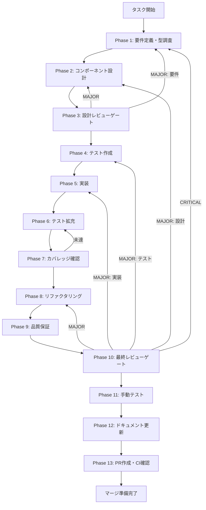

# TASK-RT-03-skill-creation-result-panel - タスク実行仕様書

## ユーザーからの元の指示

```
GitHub Issue #1884: [TASK-RT-03] スキル生成結果の詳細表示パネル追加
スキル作成フロー（plan → execute → verify）の各フェーズの詳細結果をユーザーが
一覧確認できる SkillCreationResultPanel コンポーネントを実装し、SkillLifecyclePanel へ統合する。
```

## メタ情報

| 項目         | 内容                                                 |
| ------------ | ---------------------------------------------------- |
| タスクID     | TASK-RT-03                                           |
| タスク名     | skill-creation-result-panel                          |
| 分類         | 新機能（Runtime系・UI）                              |
| 対象機能     | Skill Creator Agent SDK Lane - スキル生成結果表示    |
| 優先度       | 中                                                   |
| 見積もり規模 | 中規模                                               |
| ステータス   | completed（Phase 1-12 completed / Phase 13 blocked） |
| 作成日       | 2026-04-04                                           |
| GitHub Issue | #1884                                                |
| タスク種別   | **UIタスク**（Renderer コンポーネント新規作成あり）  |

---

## タスク概要

### 目的

スキル作成フロー（plan → execute → verify）が完了または失敗した際に、各フェーズの結果を 1 つの結果面として一覧確認できる `SkillCreationResultPanel` を実装し、`SkillLifecyclePanel` へ統合する。詳細描画は既存の `PlanResultDetailPanel` / `ExecuteResultDetailPanel` / `VerifyResultDetailPanel` を再利用し、`SkillCreationResultPanel` は表示タイミングと全体サマリーの orchestration に責務を絞る。

### 背景

Skill Creator Agent SDK Lane は `plan()` → `execute()` → `verify()` の3段階フローでスキルを生成する。各フローはそれぞれ固有の結果データを返すが、現状の `SkillLifecyclePanel.tsx` は結果表示の責務が分散しており、ユーザーがフロー全体を 1 つの面で追いにくい。

`PlanResultDetailPanel` / `ExecuteResultDetailPanel` / `VerifyResultDetailPanel` と `result-panel-parts.tsx` は既に存在するため、今回の差分は詳細表示の再実装ではなく、既存パネルを統合する wrapper の追加にある。

### 最終ゴール

- plan フェーズ完了時: `PlanResultDetailPanel` を通して `RuntimeSkillCreatorPlanResult` の内容を表示
- execute フェーズ完了時: `ExecuteResultDetailPanel` を通して `RuntimeSkillCreatorExecuteResult` の内容を表示
- verify フェーズ完了時: `VerifyResultDetailPanel` を通して `RuntimeSkillCreatorVerifyDetail` の checks[] と関連メタデータを表示
- 部分成功（例: plan は成功、verify は一部 FAIL チェックあり）の状態を視覚的に区別して表示
- フロー全体の完了/失敗サマリーをワンパネルで確認

### 依存タスク

| タスクID   | 関係 | 何に依存するか                                               |
| ---------- | ---- | ------------------------------------------------------------ |
| TASK-RT-02 | 前提 | execute/plan がスタブ返却しないこと（Phase 3 以降の前提）    |
| TASK-RT-06 | 前提 | `sdkEvents` / `SkillCreatorSdkEvent` の型が安定していること  |
| TASK-RT-04 | 参考 | APIキー状態が `SkillLifecyclePanel` にどう伝わるかの設計参照 |

**補足**: RT-02 と RT-06 が未完了の場合、本タスクは Phase 1（要件定義）と Phase 2（設計）のみ先行可能。Phase 3 以降は RT-02/RT-06 の完了を待つ。

### 成果物一覧

| 種別           | 成果物                                      | 配置先                                        |
| -------------- | ------------------------------------------- | --------------------------------------------- |
| コンポーネント | `SkillCreationResultPanel.tsx`（新規）      | `apps/desktop/src/renderer/components/skill/` |
| テスト         | `SkillCreationResultPanel.test.tsx`（新規） | `apps/desktop/src/renderer/components/skill/` |
| 修正           | `SkillLifecyclePanel.tsx`（変更）           | `apps/desktop/src/renderer/components/skill/` |
| 修正           | `ExecuteResultDetailPanel.tsx`              | `apps/desktop/src/renderer/components/skill/` |
| ドキュメント   | 各Phase出力                                 | `outputs/phase-*/`                            |

---

## 参照ファイル

| ファイル                                                                  | 役割                                                          |
| ------------------------------------------------------------------------- | ------------------------------------------------------------- |
| `apps/desktop/src/renderer/components/skill/SkillLifecyclePanel.tsx`      | 統合先の親コンポーネント（状態管理・Jotai atoms使用）         |
| `apps/desktop/src/renderer/components/skill/PlanResultDetailPanel.tsx`    | plan結果の既存表示コンポーネント（再利用または統合対象）      |
| `apps/desktop/src/renderer/components/skill/ExecuteResultDetailPanel.tsx` | execute結果の既存表示コンポーネント（再利用または統合対象）   |
| `apps/desktop/src/renderer/components/skill/VerifyResultDetailPanel.tsx`  | verify結果の既存表示コンポーネント（再利用または統合対象）    |
| `apps/desktop/src/renderer/components/skill/result-panel-parts.tsx`       | 共通 UI パーツ（Header / Tag / Badge / Footer）               |
| `packages/shared/src/types/skillCreator.ts`                               | 全型定義の参照先（PlanResult / ExecuteResult / VerifyDetail） |
| `apps/desktop/src/renderer/store/`                                        | Jotai atoms フック群                                          |

---

## タスク分解サマリー

| ID     | フェーズ | サブタスク名             | 責務                                     | 依存 |
| ------ | -------- | ------------------------ | ---------------------------------------- | ---- |
| T-01-1 | Phase 1  | 型定義・既存コード調査   | 受入基準・スコープ確定、命名規則調査     | -    |
| T-02-1 | Phase 2  | コンポーネント設計       | UIレイアウト・状態管理・props型設計      | T-01 |
| T-03-1 | Phase 3  | 設計レビューゲート       | Phase 4 進行可否判定                     | T-02 |
| T-04-1 | Phase 4  | テストケース設計         | TDDシナリオ・期待値定義                  | T-03 |
| T-05-1 | Phase 5  | コンポーネント実装       | SkillCreationResultPanel 実装・統合      | T-04 |
| T-06-1 | Phase 6  | テスト拡充               | fail path・regression guard 追加         | T-05 |
| T-07-1 | Phase 7  | カバレッジ確認           | 変更ブロックの line/branch coverage 確認 | T-06 |
| T-08-1 | Phase 8  | リファクタリング         | 重複排除・命名整合・Before/After記録     | T-07 |
| T-09-1 | Phase 9  | 品質保証                 | 型チェック・lint・テスト一括判定         | T-08 |
| T-10-1 | Phase 10 | 最終レビューゲート       | 受入条件・blocker 最終判定               | T-09 |
| T-11-1 | Phase 11 | 手動テスト（UI視覚確認） | 3層評価（Semantic/Visual/AI UX）         | T-10 |
| T-12-1 | Phase 12 | ドキュメント更新         | 実装ガイド・仕様同期・未タスク検出       | T-11 |
| T-13-1 | Phase 13 | PR作成                   | ユーザー明示承認後のみ実施               | T-12 |

**総サブタスク数**: 13個

---

## 実行フロー図



---

## Phase一覧

| Phase | 名称               | 仕様書                                                       | ステータス |
| ----- | ------------------ | ------------------------------------------------------------ | ---------- |
| 1     | 要件定義           | [phase-1-requirements.md](phase-1-requirements.md)           | completed  |
| 2     | 設計               | [phase-2-design.md](phase-2-design.md)                       | completed  |
| 3     | 設計レビューゲート | [phase-3-design-review.md](phase-3-design-review.md)         | completed  |
| 4     | テスト作成         | [phase-4-test-creation.md](phase-4-test-creation.md)         | completed  |
| 5     | 実装               | [phase-5-implementation.md](phase-5-implementation.md)       | completed  |
| 6     | テスト拡充         | [phase-6-test-expansion.md](phase-6-test-expansion.md)       | completed  |
| 7     | カバレッジ確認     | [phase-7-coverage-check.md](phase-7-coverage-check.md)       | completed  |
| 8     | リファクタリング   | [phase-8-refactoring.md](phase-8-refactoring.md)             | completed  |
| 9     | 品質保証           | [phase-9-quality-assurance.md](phase-9-quality-assurance.md) | completed  |
| 10    | 最終レビューゲート | [phase-10-final-review.md](phase-10-final-review.md)         | completed  |
| 11    | 手動テスト         | [phase-11-manual-test.md](phase-11-manual-test.md)           | completed  |
| 12    | ドキュメント更新   | [phase-12-documentation.md](phase-12-documentation.md)       | completed  |
| 13    | PR作成             | [phase-13-pr-creation.md](phase-13-pr-creation.md)           | blocked    |

---

## テストカバレッジ目標

### ユニットテスト

| 指標              | 最低基準 | 推奨基準 |
| ----------------- | -------- | -------- |
| Line Coverage     | 80%      | 90%      |
| Branch Coverage   | 60%      | 70%      |
| Function Coverage | 80%      | 90%      |

### 主要テストケース（Phase 4 で詳細化）

| ケース | 内容                                                                    |
| ------ | ----------------------------------------------------------------------- |
| TC-01  | 全props が null の場合にエラーなく描画される                            |
| TC-02  | planResult のみ渡された場合に plan セクションが表示される               |
| TC-03  | planResult の skillName・agents・scripts が表示される                   |
| TC-04  | executeResult.success=true の場合に成功表示になる                       |
| TC-05  | executeResult.persistResult.skillPath / files が表示される              |
| TC-06  | executeResult.success=false の場合に失敗表示になる                      |
| TC-07  | executeResult.error が表示される                                        |
| TC-08  | verifyDetail.status=pass の場合に全体ステータスが「完了」になる         |
| TC-09  | verifyDetail.status=fail の場合に checks が layer ごとに表示される      |
| TC-10  | severity=error のチェックが適切なバッジで表示される                     |
| TC-11  | executeResult.success=true かつ verifyDetail.status=fail → 「検証失敗」 |

---

## 統合テスト連携（Phase 1〜11で必須）

| Phase | 統合テスト連携アクション                                                          |
| ----- | --------------------------------------------------------------------------------- |
| 1     | 既存コンポーネントの命名規則・props型パターンを調査して記録                       |
| 2     | SkillLifecyclePanel との統合ポイント・Jotai atom 依存関係を設計に反映             |
| 3     | 統合テスト観点（既存パネルとの重複・Jotai atom 競合）のレビューを実施             |
| 4     | `SkillCreationResultPanel.test.tsx` で wrapper / child panel の結合シナリオを設計 |
| 5     | SkillLifecyclePanel への統合実装とテスト支援コード整備                            |
| 6     | fail path（各props null/undefined）、回帰 guard を追加                            |
| 7     | 変更ファイル（`SkillCreationResultPanel.tsx`）と統合先の結合をカバレッジ確認      |
| 8     | リファクタ後に既存テスト（SkillLifecyclePanel.test.tsx 等）が GREEN 維持          |
| 9     | 品質保証で統合テスト結果を確認                                                    |
| 10    | 最終レビューで統合テスト結果を確認                                                |
| 11    | 手動テスト（UI/コンポーネント表示）を確認                                         |

---

## Phase完了時の必須アクション

各Phase完了時に以下を必ず実行すること:

1. **タスク100%実行**: Phase内で指定された全タスクを完全に実行
2. **成果物確認**: 全ての必須成果物が生成されていることを検証
3. **実行記録**: 実行タスクの結果を記録
4. **artifacts.json更新**: Phase完了ステータスを更新
5. **Phase末端の実行確認**: 各タスクを100%実行し、各タスクを完遂した旨を必ず明記

```bash
# Phase完了時の検証コマンド
node .claude/skills/task-specification-creator/scripts/validate-phase-output.js \
  docs/30-workflows/TASK-RT-03-skill-creation-result-panel --phase {{PHASE_NUMBER}}

# Phase完了・成果物登録
node .claude/skills/task-specification-creator/scripts/complete-phase.js \
  --workflow docs/30-workflows/TASK-RT-03-skill-creation-result-panel \
  --phase {{PHASE_NUMBER}} --artifacts "..."
```
